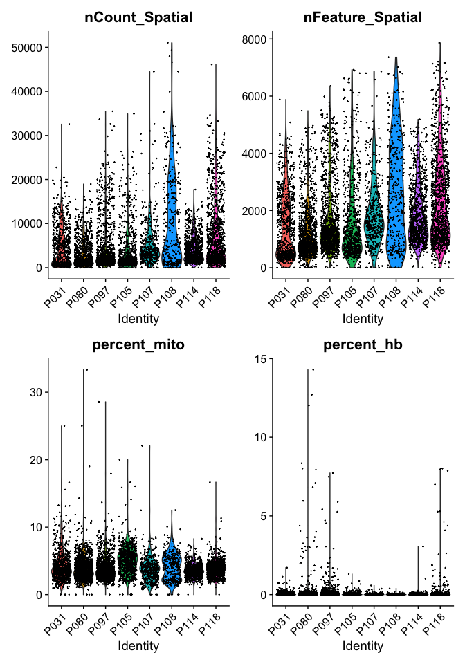
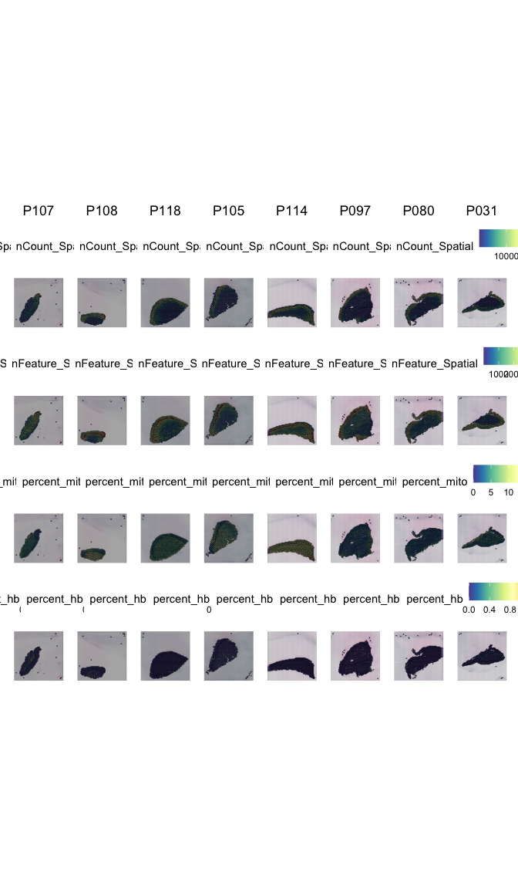
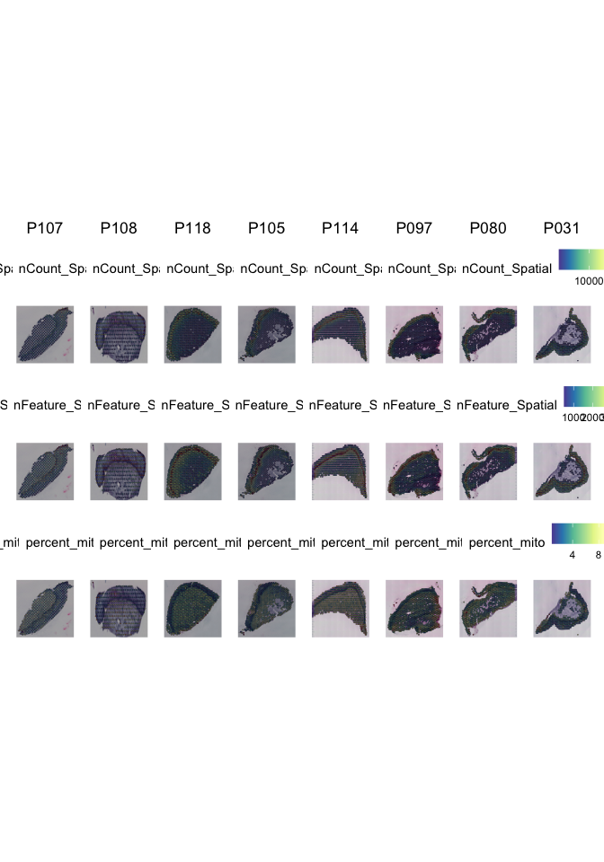

# Spatial transcriptomics

------------------------------------------------------------------------

``` r
knitr::opts_chunk$set(
  fig.path="./Figures/",
  fig.align="center",
  fig.process = function(filename){
    new_filename <- stringr::str_remove(string = filename, 
                                        pattern = "-1")
    fs::file_move(path = filename, new_path = new_filename)
    ifelse(fs::file_exists(new_filename), new_filename, filename)
})

# output: 
#   github_document:
#     toc: yes

# setwd("/Users/vilkal/work/Brolidens_work/Projects/Spatial_DMPA/src/")
#.libPaths("/Users/vilkal/Applications/miniconda3/envs/scRNAseq2022/lib/R/library")
# reticulate::use_python("/Users/vilkal/Applications/miniconda3/envs/scRNAseq2022/bin/python", required = TRUE)
# reticulate::py_config()
```

### Load packages

### Load ST data

``` r
#############
# LODA DATA #
#############
metadata <- read_csv("../data/Clinincal_data_Spatial_DMPA.csv")
```

    ## Rows: 8 Columns: 69
    ## ── Column specification ────────────────────────────────────────────────────────
    ## Delimiter: ","
    ## chr (28): NGI ID, User ID, ID, BV_Diagnosis_v3, Mens_phase_est_prog_v3, Cont...
    ## dbl (37): Mreads, >=Q30(%), PatID, age, Antibiotics_v3, Bacterio_KOH_v3, Bac...
    ## lgl  (4): Antibiotics, Antibiotics_Visit_a, Plasma_Cortisol_ng_mL_v3, Repeat...
    ## 
    ## ℹ Use `spec()` to retrieve the full column specification for this data.
    ## ℹ Specify the column types or set `show_col_types = FALSE` to quiet this message.

``` r
sample_names <- metadata$ID
h5_files <- list.dirs(path = "../data",
                      full.names = T, recursive = T) %>%
            grep("outs_P10.$", ., value = TRUE) %>%
            set_names(., sample_names)

# Read in h5 files and create Seurat Object
seuratObj_list <- h5_files %>%
  map(.,  ~Load10X_Spatial(.x)) 
```

    ## Warning in sparseMatrix(i = indices[] + 1, p = indptr[], x = as.numeric(x =
    ## counts[]), : 'giveCsparse' has been deprecated; setting 'repr = "T"' for you

    ## Warning in sparseMatrix(i = indices[] + 1, p = indptr[], x = as.numeric(x =
    ## counts[]), : 'giveCsparse' has been deprecated; setting 'repr = "T"' for you

    ## Warning in sparseMatrix(i = indices[] + 1, p = indptr[], x = as.numeric(x =
    ## counts[]), : 'giveCsparse' has been deprecated; setting 'repr = "T"' for you

    ## Warning in sparseMatrix(i = indices[] + 1, p = indptr[], x = as.numeric(x =
    ## counts[]), : 'giveCsparse' has been deprecated; setting 'repr = "T"' for you

    ## Warning in sparseMatrix(i = indices[] + 1, p = indptr[], x = as.numeric(x =
    ## counts[]), : 'giveCsparse' has been deprecated; setting 'repr = "T"' for you

    ## Warning in sparseMatrix(i = indices[] + 1, p = indptr[], x = as.numeric(x =
    ## counts[]), : 'giveCsparse' has been deprecated; setting 'repr = "T"' for you

    ## Warning in sparseMatrix(i = indices[] + 1, p = indptr[], x = as.numeric(x =
    ## counts[]), : 'giveCsparse' has been deprecated; setting 'repr = "T"' for you

    ## Warning in sparseMatrix(i = indices[] + 1, p = indptr[], x = as.numeric(x =
    ## counts[]), : 'giveCsparse' has been deprecated; setting 'repr = "T"' for you

``` r
#################
# COLOR PALETTS #
#################
```

``` r
####################################
# RENAME SAMPLES, SPOTS AND IMAGES #
####################################
seuratObj_list <- seuratObj_list %>%
  imap(., ~AddMetaData(object = .x, 
                       metadata = rep(.y, length(Idents(.x))), 
                       col.name = "orig.ident")) %>%
  map(.,  ~SetIdent(., value = .@meta.data$orig.ident)) %>%
  imap(., ~RenameCells(.x, 
                      new.names = paste0(.y,"_", gsub("-.*","",colnames(.x[["Spatial"]])))) ) %>%
  imap(., ~ {.x@images <- set_names(.@images,.y); .x})

##################
# MERGE SAMPLES #
#################
# Merge datasets into one single seurat object
DMPA  <- merge(seuratObj_list[[1]], y = seuratObj_list[2:length(seuratObj_list)])
```

# Create one merged object

We can now load the expression matricies into objects and then merge
them into a single merged object. Each analysis workflow (Seurat,
Scater, Scranpy, etc) has its own way of storing data. We will add
dataset labels as cell.ids just in case you have overlapping barcodes
between the datasets. After that we add a column `Chemistry` in the
metadata for plotting later on.

Once you have created the merged Seurat object, the count matrices and
individual count matrices and objects are not needed anymore. It is a
good idea to remove them and run garbage collect to free up some memory.

# Quality control

------------------------------------------------------------------------

Similar to scRNAseq we use statistics on number of counts, number of
features and percent mitochondria for quality control.

Now the counts and feature counts are calculated on the Spatial assay,
so they are named “nCount\_Spatial” and “nFeature\_Spatial”.

``` r
####################
# QUALITY CONTROLL #
####################
DMPA <- PercentageFeatureSet(DMPA, "^MT-", col.name = "percent_mito")
DMPA <- PercentageFeatureSet(DMPA, "^HB[^(P)]", col.name = "percent_hb")


VlnPlot(DMPA, features = c("nCount_Spatial", "nFeature_Spatial","percent_mito","percent_hb"), 
        pt.size = 0.1, ncol = 2) + NoLegend()
```

    ## Warning: Removed 2 rows containing non-finite values (stat_ydensity).

    ## Warning: Removed 2 rows containing missing values (geom_point).

    ## Warning: Removed 2 rows containing non-finite values (stat_ydensity).

    ## Warning: Removed 2 rows containing missing values (geom_point).



We can also plot the same data onto the tissue section.

``` r
SpatialFeaturePlot(DMPA, features = c("nCount_Spatial", "nFeature_Spatial","percent_mito","percent_hb")) 
```

    ## Warning: `guides(<scale> = FALSE)` is deprecated. Please use `guides(<scale> = "none")` instead.
    ## `guides(<scale> = FALSE)` is deprecated. Please use `guides(<scale> = "none")` instead.
    ## `guides(<scale> = FALSE)` is deprecated. Please use `guides(<scale> = "none")` instead.
    ## `guides(<scale> = FALSE)` is deprecated. Please use `guides(<scale> = "none")` instead.
    ## `guides(<scale> = FALSE)` is deprecated. Please use `guides(<scale> = "none")` instead.
    ## `guides(<scale> = FALSE)` is deprecated. Please use `guides(<scale> = "none")` instead.
    ## `guides(<scale> = FALSE)` is deprecated. Please use `guides(<scale> = "none")` instead.
    ## `guides(<scale> = FALSE)` is deprecated. Please use `guides(<scale> = "none")` instead.
    ## `guides(<scale> = FALSE)` is deprecated. Please use `guides(<scale> = "none")` instead.
    ## `guides(<scale> = FALSE)` is deprecated. Please use `guides(<scale> = "none")` instead.
    ## `guides(<scale> = FALSE)` is deprecated. Please use `guides(<scale> = "none")` instead.
    ## `guides(<scale> = FALSE)` is deprecated. Please use `guides(<scale> = "none")` instead.
    ## `guides(<scale> = FALSE)` is deprecated. Please use `guides(<scale> = "none")` instead.
    ## `guides(<scale> = FALSE)` is deprecated. Please use `guides(<scale> = "none")` instead.
    ## `guides(<scale> = FALSE)` is deprecated. Please use `guides(<scale> = "none")` instead.
    ## `guides(<scale> = FALSE)` is deprecated. Please use `guides(<scale> = "none")` instead.
    ## `guides(<scale> = FALSE)` is deprecated. Please use `guides(<scale> = "none")` instead.
    ## `guides(<scale> = FALSE)` is deprecated. Please use `guides(<scale> = "none")` instead.
    ## `guides(<scale> = FALSE)` is deprecated. Please use `guides(<scale> = "none")` instead.
    ## `guides(<scale> = FALSE)` is deprecated. Please use `guides(<scale> = "none")` instead.
    ## `guides(<scale> = FALSE)` is deprecated. Please use `guides(<scale> = "none")` instead.
    ## `guides(<scale> = FALSE)` is deprecated. Please use `guides(<scale> = "none")` instead.
    ## `guides(<scale> = FALSE)` is deprecated. Please use `guides(<scale> = "none")` instead.
    ## `guides(<scale> = FALSE)` is deprecated. Please use `guides(<scale> = "none")` instead.
    ## `guides(<scale> = FALSE)` is deprecated. Please use `guides(<scale> = "none")` instead.
    ## `guides(<scale> = FALSE)` is deprecated. Please use `guides(<scale> = "none")` instead.
    ## `guides(<scale> = FALSE)` is deprecated. Please use `guides(<scale> = "none")` instead.
    ## `guides(<scale> = FALSE)` is deprecated. Please use `guides(<scale> = "none")` instead.
    ## `guides(<scale> = FALSE)` is deprecated. Please use `guides(<scale> = "none")` instead.
    ## `guides(<scale> = FALSE)` is deprecated. Please use `guides(<scale> = "none")` instead.
    ## `guides(<scale> = FALSE)` is deprecated. Please use `guides(<scale> = "none")` instead.
    ## `guides(<scale> = FALSE)` is deprecated. Please use `guides(<scale> = "none")` instead.



``` r
# nFeature is the number of uniqe genes in each spot
# nCount is the number of total counts in each spot 
```

As you can see, the spots with low number of counts/features and high
mitochondrial content is mainly towards the edges of the tissue. It is
quite likely that these regions are damaged tissue. You may also see
regions within a tissue with low quality if you have tears or folds in
your section.

But remember, for some tissue types, the amount of genes expressed and
proportion mitochondria may also be a biological features, so bear in
mind what tissue you are working on and what these features mean.

### Filter

Select all spots with less than 25% mitocondrial reads, less than 20%
hb-reads and 1000 detected genes. You must judge for yourself based on
your knowledge of the tissue what are appropriate filtering criteria for
your dataset.

``` r
#############
# FILTERING #
#############
dim(DMPA)
```

    ## [1] 36601  6700

``` r
DMPA %>%
  group_by(orig.ident) %>%
  summarise(across(c(nCount_Spatial:percent_hb), list(min = min, max = max))) %>%
  rename_with(., ~str_replace(., "_Spatial|percent_", ""))
```

    ## tidyseurat says: A data frame is returned for independent data analysis.

    ## # A tibble: 8 × 9
    ##   orig.ident nCount_min nCount_max nFeature_min nFeature_max mito_min mito_max
    ##   <chr>           <dbl>      <dbl>        <int>        <int>    <dbl>    <dbl>
    ## 1 P031                5      32547            5         5885        0    25   
    ## 2 P080                4      18969            4         5489        0    33.3 
    ## 3 P097                5      35472            5         6356        0    28.6 
    ## 4 P105                0      34890            0         6925      NaN   NaN   
    ## 5 P107                4      44455            4         6863        0    22.1 
    ## 6 P108                0      51014            0         7364      NaN   NaN   
    ## 7 P114               10      17728            8         5186        0     8.28
    ## 8 P118                6      46078            6         7865        0    16.7 
    ## # … with 2 more variables: hb_min <dbl>, hb_max <dbl>

``` r
# remove spots with; less than 500 genes, more than 25% mitochndrial genes, more than 20% hemoglobine genes:
DMPA <- DMPA[, DMPA$nFeature_Spatial>500 & DMPA$percent_mito < 25 & DMPA$percent_hb < 20]

dim(DMPA)
```

    ## [1] 36601  6129

``` r
DMPA %>%
  group_by(orig.ident) %>%
  summarise(across(c(nCount_Spatial:percent_hb), list(min = min, max = max))) %>%
  rename_with(., ~str_replace(., "_Spatial|percent_", ""))
```

    ## tidyseurat says: A data frame is returned for independent data analysis.

    ## # A tibble: 8 × 9
    ##   orig.ident nCount_min nCount_max nFeature_min nFeature_max mito_min mito_max
    ##   <chr>           <dbl>      <dbl>        <int>        <int>    <dbl>    <dbl>
    ## 1 P031              678      32547          501         5885    0.832    16.6 
    ## 2 P080              669      18969          502         5489    0.748    11.9 
    ## 3 P097              606      35472          503         6356    0.921    12.0 
    ## 4 P105              651      34890          501         6925    1.17     16.7 
    ## 5 P107              795      44455          501         6863    0.737    12.5 
    ## 6 P108              745      51014          509         7364    1.31     10.0 
    ## 7 P114              785      17728          518         5186    1.08      8.28
    ## 8 P118              790      46078          523         7865    1.58     10.9 
    ## # … with 2 more variables: hb_min <dbl>, hb_max <dbl>

And replot onto tissue section:

``` r
SpatialFeaturePlot(DMPA, features = c("nCount_Spatial", "nFeature_Spatial","percent_mito"))
```

    ## Warning: `guides(<scale> = FALSE)` is deprecated. Please use `guides(<scale> = "none")` instead.
    ## `guides(<scale> = FALSE)` is deprecated. Please use `guides(<scale> = "none")` instead.
    ## `guides(<scale> = FALSE)` is deprecated. Please use `guides(<scale> = "none")` instead.
    ## `guides(<scale> = FALSE)` is deprecated. Please use `guides(<scale> = "none")` instead.
    ## `guides(<scale> = FALSE)` is deprecated. Please use `guides(<scale> = "none")` instead.
    ## `guides(<scale> = FALSE)` is deprecated. Please use `guides(<scale> = "none")` instead.
    ## `guides(<scale> = FALSE)` is deprecated. Please use `guides(<scale> = "none")` instead.
    ## `guides(<scale> = FALSE)` is deprecated. Please use `guides(<scale> = "none")` instead.
    ## `guides(<scale> = FALSE)` is deprecated. Please use `guides(<scale> = "none")` instead.
    ## `guides(<scale> = FALSE)` is deprecated. Please use `guides(<scale> = "none")` instead.
    ## `guides(<scale> = FALSE)` is deprecated. Please use `guides(<scale> = "none")` instead.
    ## `guides(<scale> = FALSE)` is deprecated. Please use `guides(<scale> = "none")` instead.
    ## `guides(<scale> = FALSE)` is deprecated. Please use `guides(<scale> = "none")` instead.
    ## `guides(<scale> = FALSE)` is deprecated. Please use `guides(<scale> = "none")` instead.
    ## `guides(<scale> = FALSE)` is deprecated. Please use `guides(<scale> = "none")` instead.
    ## `guides(<scale> = FALSE)` is deprecated. Please use `guides(<scale> = "none")` instead.
    ## `guides(<scale> = FALSE)` is deprecated. Please use `guides(<scale> = "none")` instead.
    ## `guides(<scale> = FALSE)` is deprecated. Please use `guides(<scale> = "none")` instead.
    ## `guides(<scale> = FALSE)` is deprecated. Please use `guides(<scale> = "none")` instead.
    ## `guides(<scale> = FALSE)` is deprecated. Please use `guides(<scale> = "none")` instead.
    ## `guides(<scale> = FALSE)` is deprecated. Please use `guides(<scale> = "none")` instead.
    ## `guides(<scale> = FALSE)` is deprecated. Please use `guides(<scale> = "none")` instead.
    ## `guides(<scale> = FALSE)` is deprecated. Please use `guides(<scale> = "none")` instead.
    ## `guides(<scale> = FALSE)` is deprecated. Please use `guides(<scale> = "none")` instead.



### Paulo section

### Top expressed genes

As for scRNAseq data, we will look at what the top expressed genes are.

As you can see, the mitochondrial genes are among the top expressed.
Also the lncRNA gene Bc1 (brain cytoplasmic RNA 1). Also one hemoglobin
gene. MALAT1 is a long-non-coding RNA

### Filter genes

We will remove the Bc1 gene, hemoglobin genes (blood contamination) and
the mitochondrial genes.

``` r
dim(DMPA)
```

    ## [1] 36601  6129

``` r
# Filter MALAT1
DMPA <- DMPA[!grepl("MALAT1", rownames(DMPA)), ]

# Filter Mitocondrial
DMPA <- DMPA[!grepl("^MT-", rownames(DMPA)), ]

# Filter Hemoglobin gene (optional if that is a problem on your data)
DMPA <- DMPA[!grepl("^HB[^(P)]", rownames(DMPA)), ]

dim(DMPA)
```

    ## [1] 36575  6129

### Top expressed genes after filtering

# Analysis

------------------------------------------------------------------------

For ST data, the Seurat team recommends to use SCTranform for
normalization, so we will do that. `SCTransform` will select variable
genes and normalize in one step.

### Session info

``` r
sessionInfo()
```

    ## R version 4.1.2 (2021-11-01)
    ## Platform: x86_64-apple-darwin13.4.0 (64-bit)
    ## Running under: macOS Catalina 10.15.7
    ## 
    ## Matrix products: default
    ## BLAS/LAPACK: /Users/vilkal/Applications/miniconda3/envs/Spatial_DMPA/lib/libopenblasp-r0.3.18.dylib
    ## 
    ## locale:
    ## [1] sv_SE.UTF-8/sv_SE.UTF-8/sv_SE.UTF-8/C/sv_SE.UTF-8/sv_SE.UTF-8
    ## 
    ## attached base packages:
    ## [1] stats     graphics  grDevices utils     datasets  methods   base     
    ## 
    ## other attached packages:
    ##  [1] niceRplots_0.1.0   hdf5r_1.3.5        Seurat_4.1.0       tidyseurat_0.5.1  
    ##  [5] SeuratObject_4.0.4 ttservice_0.1.2    forcats_0.5.1      stringr_1.4.0     
    ##  [9] dplyr_1.0.8        purrr_0.3.4        readr_2.1.2        tidyr_1.2.0       
    ## [13] tibble_3.1.6       ggplot2_3.3.5      tidyverse_1.3.1   
    ## 
    ## loaded via a namespace (and not attached):
    ##   [1] readxl_1.3.1          backports_1.4.1       plyr_1.8.6           
    ##   [4] igraph_1.2.11         lazyeval_0.2.2        splines_4.1.2        
    ##   [7] listenv_0.8.0         scattermore_0.8       digest_0.6.29        
    ##  [10] htmltools_0.5.2       fansi_1.0.2           magrittr_2.0.2       
    ##  [13] tensor_1.5            cluster_2.1.2         ROCR_1.0-11          
    ##  [16] tzdb_0.2.0            globals_0.14.0        modelr_0.1.8         
    ##  [19] matrixStats_0.61.0    vroom_1.5.7           spatstat.sparse_2.1-0
    ##  [22] colorspace_2.0-3      rvest_1.0.2           ggrepel_0.9.1        
    ##  [25] haven_2.4.3           xfun_0.29             crayon_1.5.0         
    ##  [28] jsonlite_1.7.3        spatstat.data_2.1-2   survival_3.2-13      
    ##  [31] zoo_1.8-9             glue_1.6.2            polyclip_1.10-0      
    ##  [34] gtable_0.3.0          leiden_0.3.9          future.apply_1.8.1   
    ##  [37] abind_1.4-5           scales_1.1.1          DBI_1.1.2            
    ##  [40] miniUI_0.1.1.1        Rcpp_1.0.8.3          viridisLite_0.4.0    
    ##  [43] xtable_1.8-4          reticulate_1.24       spatstat.core_2.3-2  
    ##  [46] bit_4.0.4             htmlwidgets_1.5.4     httr_1.4.2           
    ##  [49] RColorBrewer_1.1-2    ellipsis_0.3.2        ica_1.0-2            
    ##  [52] farver_2.1.0          pkgconfig_2.0.3       sass_0.4.0           
    ##  [55] uwot_0.1.11           dbplyr_2.1.1          deldir_1.0-6         
    ##  [58] utf8_1.2.2            tidyselect_1.1.2      labeling_0.4.2       
    ##  [61] rlang_1.0.2           reshape2_1.4.4        later_1.3.0          
    ##  [64] munsell_0.5.0         cellranger_1.1.0      tools_4.1.2          
    ##  [67] cli_3.2.0             generics_0.1.2        broom_0.7.12         
    ##  [70] ggridges_0.5.3        evaluate_0.14         fastmap_1.1.0        
    ##  [73] yaml_2.2.2            goftest_1.2-3         knitr_1.37           
    ##  [76] bit64_4.0.5           fs_1.5.2              fitdistrplus_1.1-6   
    ##  [79] RANN_2.6.1            pbapply_1.5-0         future_1.23.0        
    ##  [82] nlme_3.1-155          mime_0.12             xml2_1.3.3           
    ##  [85] compiler_4.1.2        rstudioapi_0.13       plotly_4.10.0        
    ##  [88] png_0.1-7             spatstat.utils_2.3-0  reprex_2.0.1         
    ##  [91] bslib_0.3.1           stringi_1.7.6         highr_0.9            
    ##  [94] lattice_0.20-45       Matrix_1.4-1          vctrs_0.3.8          
    ##  [97] pillar_1.7.0          lifecycle_1.0.1       spatstat.geom_2.3-2  
    ## [100] lmtest_0.9-39         jquerylib_0.1.4       RcppAnnoy_0.0.19     
    ## [103] data.table_1.14.2     cowplot_1.1.1         irlba_2.3.5          
    ## [106] httpuv_1.6.5          patchwork_1.1.1       R6_2.5.1             
    ## [109] promises_1.2.0.1      KernSmooth_2.23-20    gridExtra_2.3        
    ## [112] parallelly_1.30.0     codetools_0.2-18      MASS_7.3-56          
    ## [115] assertthat_0.2.1      withr_2.5.0           sctransform_0.3.3    
    ## [118] mgcv_1.8-39           parallel_4.1.2        hms_1.1.1            
    ## [121] grid_4.1.2            rpart_4.1.16          rmarkdown_2.11       
    ## [124] Rtsne_0.15            shiny_1.7.1           lubridate_1.8.0
