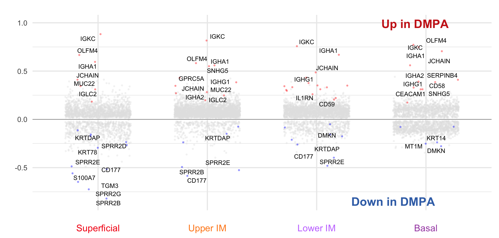
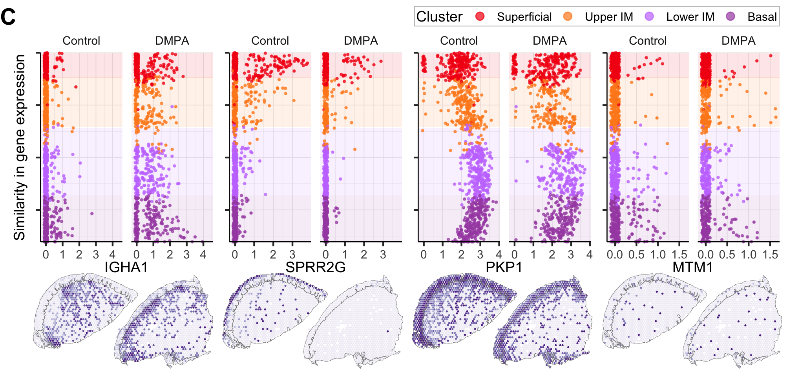

Figure 5
================
4/12/24

### Load data and libraries

``` r
##################
# LOAD LIBRARIES #
##################
library(tidyverse)
library(Seurat)
library(SeuratObject)
library(tidyseurat)
library(cowplot)
library(ggrepel)
#library(ggpubr)
#library(ggalluvial)
library(png)
library(grid)
library(patchwork)
#library(ggpuber)
library(openxlsx)

source("../../bin/spatial_visualization.R")
source("../../bin/plotting_functions.R")

#########
# PATHS #
#########
input_dir <- "../../results/08_spatial_dist/"
result_dir <- "../../results/09_figures/"
if( isFALSE(dir.exists(result_dir)) ) { dir.create(result_dir,recursive = TRUE) }
epi_clus <- "^5$|^6$|^7|^9" # non-filt

#############
# LOAD DATA #
#############
# DEGs_table <- read_csv(paste0(input_dir,"subset_100/DGEs_condition_wilcox_epi_100.csv")) %>% filter(groups == "DMPA")
DEGs_table <- read_csv(paste0("../../results/06_DGE_condition_st_data/","DGEs_condition_wilcox.csv"))
DATA <- readRDS(paste0(input_dir,"seuratObj_spatial_dist.RDS"))
img <- readPNG("../../resources/Schematic figure ST.png")
```

### Volcanoplot

``` r
# width 170 mm, 6.7 inches
ord <-  c("Superficial","Upper IM","Lower IM","Basal", "8","3","4","0","2","1")
col <- set_names(c("#F40014","#FF8A1E","#C77CFF","#A750B2"), ord[1:4])
###########################
# VOLCANO PLOT SUBMUCOSA #
###########################
ord <- c("Superficial","Upper IM","Lower IM","Basal")

DEGs_filt <- DEGs_table %>% 
  filter((grepl(paste0(ord, collapse = "|^"), .$layers))) %>%
  mutate(layers = factor(.$layers, levels = ord)) %>%
  filter(p_val < 0.099)

a <- col[DEGs_filt$layers]
set.seed(1);A <- DEGs_filt %>%
  Volcano.fun_logFC(., "layers", 
        y.axis="p-value", 
        lab_size = 2.1, dot_size = .3,
        up=c(.2, 0.05), down = c(-.2, 0.05)) + # labeling: (logFC, p-value)
  ylab("avg. Log2 fold change")  +
  annotate("text", x = 3.9, y = .99, size = 4, col = "#CB251C", label = "Up in DMPA",fontface = "bold") +
  annotate("text", x = 3.7, y = -.85, size = 4, col = "#3C71B5", label = "Down in DMPA", fontface = "bold") +
  theme(legend.position = "none", #y,x
        axis.text.x = element_text(colour = col, margin = margin(t = 10)),
        #axis.ticks.x.bottom = element_line(colour = col),
        plot.margin = unit(c(1, .5, .4, 1), "lines")) #t,r,b,l

a
```



``` r
#######################
# PLOTS VENN DIAGRAM #
######################
ord <-  c("Superficial","Upper IM","Lower IM","Basal", "8","3","4","0","2","1")
sig_table <- DEGs_table %>%
  filter(p_val_adj < 0.05) %>%
  #filter((grepl(paste0(ord, collapse = "|^"), .$layers))) %>%
  mutate(layers = factor(.$layers, levels = ord)) %>%
  mutate(Direction = ifelse(avg_log2FC > 0, "UP", "DOWN"))

venn_input.fun <- function(sig_table, gr_col){
  t <- sig_table %>% 
  # filter(grepl("_", .$layers)) %>%
  group_by({{gr_col}}) %>%
  nest() %>%
  ungroup() %>%
  arrange({{gr_col}}) %>%
  mutate(layers = ifelse(grepl("\\d", .$layers), paste0("Clus_",.$layers), as.character(.$layers) )) %>%
  mutate(genes = map( data, ~pluck(.x, "gene"))) %>% 
  mutate(genes = setNames(.[["genes"]], {{gr_col}})) %>%
  mutate(direction = map( data, ~pluck(.x, "Direction"))) %>%
  mutate(direction = setNames(.[["direction"]], {{gr_col}})) 
  return(t)}

t <- venn_input.fun(sig_table, layers) # cluster overlaps

# "./Figures/06/"
library(nVennR)
d <- plotVenn(t$genes[c("Basal","Lower IM","Superficial","Upper IM")], 
         sNames = names(t$genes[c("Basal","Lower IM","Superficial","Upper IM")]),
         systemShow=F,
         labelRegions=F, showNumbers=F,
         showPlot =T,
         opacity=0.1,
         setColors = col,
         outFile=paste0("./", "Venn_epi_sig.svg")
         )

# d <- plotVenn(t$genes[-c(5:8)], 
#          sNames = names(t$genes[-c(5:8)]),
#          outFile=paste0(params$fig.path, "Venn_epi_sig.svg")
#          )

# showSVG(d)
knitr::include_graphics(paste0("./", "Venn_epi_sig.svg"))
```


``` r
#########################
# COMBINE PANEL A AND C #
#########################
# dev.new(width=6.7, height=3.2, noRStudioGD = TRUE) 
A_B <- plot_grid(A, NULL, rel_widths = c(1,1), labels = c('A', 'B'), hjust = 0) 
```

``` r
# failed attempt at reading the svg file created by nVennR
a <- xml2::as_list( read_xml( paste0( "./", "Venn_epi_sig.svg")) )
l <- map_depth(a$svg$defs, 2,~pluck(.x, "path") ) %>% flatten()
l <- map(2:5,~a$svg$defs[[.x]]) %>% flatten() %>%

s <- get_shape(l[1] )
  
map_chr(l, ~attr(.x,"id")) 
attr(a$svg$defs$symbol,"id")
id <- map_chr(map(2:5,~a$svg$defs[[.x]]), ~attr(.x,"id"))
id <- map_chr(l, ~attr(.x,"id"))

x <- attributes(l[[1]]$path)

id <- l %>%
    map_chr(., ~attr(.x,"id")) %>% 
    set_names(seq_along(.), .)

id %>%
    map(., ~get_shape(l[[.x]]$path) ) %>%
    map(., ~as_tibble(.x, .name_repair="unique"))
  
  annot_coord <- id %>%
    map(., ~get_shape(a2[[1]]$svg[[.x]]) ) %>%
    map(., ~as_tibble(.x, .name_repair="unique")) 

myV3 <- createVennObj(nSets = 3, sSizes = c(rep(1, 8)))
myV3 <- plotVenn(nVennObj = myV3, systemShow=T, showPlot =F, labelRegions=F, 
                 showNumbers=F, opacity=0.2, borderWidth=4, 
                 outFile=paste0("./", "Venn_epi_sig.svg"))
```

### Plot dotplot and tissue

``` r
####################
# DOTPLOT FUNCTION #
####################
names <- c("Basal", "0", "1", "2", "3", "4", "8", "10")
clus_1 <- c("#F40014","#FF8A1E","#C77CFF","#A750B2") %>% set_names(., ord[1:4])
ID <- c("P118", "P105", "P080", "P031", "P097", "P108", "P114", "P107")

layer_dotplot.fun <- function(DATA, feat, 
                              facet = TRUE, 
                              txt_size = 5,
                              density = FALSE,  
                              x_max=NULL, 
                              col){
  
  rects <- DATA %>%
    group_by(layers) %>%
    summarise(., ystart=min(spatial_dist, na.rm=T), yend=max(spatial_dist, na.rm=T),
              Q1=quantile(spatial_dist, probs = 0.009, na.rm=T),
              Q3=quantile(spatial_dist, probs = 0.90, na.rm=T)) %>%
    filter(!(is.infinite(.$ystart))) %>%
    mutate(Q1 = ifelse(.$Q1 == min(.$Q1), 0,.$Q1)) %>%
    mutate(Q3 = ifelse(.$Q3 == max(.$Q3), max(.$yend),.$Q3)) %>%
    mutate(Q3 = ifelse(.$layers == "Lower IM", .$Q3+.3,.$Q3)) %>%
    #mutate(Q1 = ifelse(.$layers == "Basal", .$Q1+.3,.$Q1)) %>%
    arrange(layers) %>% ungroup()
  
  # rects <- DATA %>%
  #   group_by(layers) %>%
  #   summarise(., ystart=min(spatial_dist, na.rm=T), yend=max(spatial_dist, na.rm=T),
  #             Q1=quantile(spatial_dist, probs = 0.1, na.rm=T),
  #             Q3=quantile(spatial_dist, probs = .9, na.rm=T)) %>%
  #   filter(!(is.infinite(.$ystart))) %>%
  #   mutate(Q1 = ifelse(.$Q1 == min(.$Q1), 0,.$Q1)) %>%
  #   mutate(Q3 = ifelse(.$Q3 == max(.$Q3), max(.$yend),.$Q3)) %>%
  #   #mutate(Q3 = ifelse(.$layers == "Basal_2", .$Q3+.3,.$Q3)) %>%
  #   arrange(layers) %>% ungroup() %>%
  #   filter(., grepl(keep, .$layers))
  
  DAT <- DATA %>%
    #filter(., grepl("SubMuc", DATA$sp_annot) & !(grepl(epi_clus, DATA$Clusters))) %>%
    #filter(., (grepl(keep, DATA$layers))) %>%
    mutate(., FetchData(., vars = c(feat), slot = "data") ) %>%
    select(groups, ID="orig.ident", layers, all_of(c(feat)), spatial_dist) #%>%
    #mutate(ID = factor(.$ID, levels = ID))
   
  dens <- ggplot() + 
    geom_density(data = DAT %>% filter(., .[[feat]] != 0 ), aes(y=spatial_dist, color=ID)) + 
    scale_y_continuous(expand = c(0, 0)) + ggpubr::clean_theme()+
    scale_color_manual(values = col) +
    theme(panel.border = element_blank(), 
          plot.margin = unit(c(0,0,0,0), "inches"))

  if(facet == TRUE){facets <- facet_wrap(~groups, ncol = 2)
                    w <- 3}
  else{facets <- NULL
       w <- 1}
  
  dot <- ggplot() +
    #ggtitle(feature) +
    geom_rect(data = rects, alpha = 0.1, show.legend=FALSE,
              aes(xmin = -Inf, xmax = Inf, ymin = Q1, ymax = Q3, fill = layers)) +
    geom_jitter(data = DAT, aes(x=.data[[feat]], y=spatial_dist, col=layers), 
                width = 0.1, alpha = 0.7, size=.3) + #
    scale_fill_manual(values = col) + 
    scale_colour_manual(values = col) +
    coord_cartesian(clip = "off") +
    guides(col = guide_legend(override.aes = list(size=2), keyheight = .7, keywidth = .7, title = "Cluster")) +
    scale_y_reverse(expand = c(0, 0)) +
    #scale_y_continuous(expand = c(0, 0)) +
    #scale_x_continuous(expand = c(0, 0)) +
    {if(!(is.null(x_max))){xlim(-.5, x_max)}} +
    facets +
    my_theme + ylab("Similarity in gene expression") +
    theme(legend.position="top", legend.justification = "left",
          #legend.position = c(.1, 1.15), legend.direction = "horizontal",
          plot.background = element_rect(fill = "transparent", colour = NA),
          plot.margin = unit(c(2,.0,-2,.5), "lines"),
          panel.border = element_blank(),
          text = element_text(size = txt_size),
          axis.line = element_line(linewidth = .3),
          #axis.title.y = element_blank(),
          axis.text.y = element_blank(),
          axis.title.x.bottom = element_text(margin = margin(t = .5)),
          axis.title.y.left = element_text(margin = margin(r = 5)),
          panel.grid.major = element_line(linewidth = 0.2),
          panel.grid.minor = element_line(linewidth = 0.1))
  
  if(density == TRUE){dot <- dot + dens + plot_layout(ncol=2, nrow=1, widths=c(w, 1), guides = "collect")}
  
  return(dot)
}
```

``` r
###############
# FILTER DATA #
###############
DAT <- DATA %>%
  filter(!(grepl("\\d", .$layers))) %>%
  mutate(groups = if_else(groups =="ctrl", "Control", .$groups))

##############################
# CLUS DOTPLOT PER EPI LAYER #
##############################
# dev.new(height=1.9, width=6.7, noRStudioGD = TRUE)
# dev.new(height=2.4, width=6.7, noRStudioGD = TRUE) # with legend
feat <- c("IGHA1","SPRR2G","PKP1","MTM1" )
dot_fig <- map(feat, 
               ~layer_dotplot.fun(DAT, .x, 
                                  facet = T, 
                                  txt_size = 9,
                                  col = clus_1)) # , x_max = 6
# dot_fig[[1]]
C_1 <- wrap_plots(dot_fig, nrow = 1, guides = "collect" ) + 
  plot_layout(axis_titles = "collect") & 
  theme(#legend.position = c(.1, 1.15), legend.direction = "horizontal",
        plot.margin = unit(c(1,.2,0,.3), "lines"),
        legend.position = 'top', 
        legend.justification = "right", 
        legend.background = element_rect(colour ="gray", linewidth=.2),
        legend.margin=margin(1,2,1,1),
        legend.box.margin=margin(-25,0,-10,0),
        #legend.box.margin=margin(-30,0,-15,0), 
        # axis.title.y.left = element_text(margin = margin(r = 5))
        )

ggsave("./Figures/05/Fig_05C.png", C_1, width = 6.7, height = 2.4) #, dpi = 300

############################
# CLUS EXPRESION ON TISSUE #
############################
DAT <- DATA %>%
    filter(grepl("P118|P097", .$orig.ident))

col_feat <- c("#EFEDF5", "#DADAEB", "#BCBDDC", "#9E9AC8", "#807DBA", "#6A51A3", "#54278F", "#3F007D") # Purples
p <- map(feat, 
        ~plot_st_feat.fun( DAT,
                           geneid = .x,
                           txt = F,
                           save_space = F,
                           zoom = "zoom",
                           col = col_feat,
                           alpha = .9,
                           ncol = 2, 
                           #annot_col = "#dbd9d9",
                           annot_line = .1,
                           img_alpha = 0,
                           point_size = .6)) 

# dev.new(height=1, width=6.7/4, noRStudioGD = TRUE)
# p_list[[1]]
# dev.new(width=6.7, height=1, noRStudioGD = TRUE) 

p_list <- map(p, ~ .x + theme(plot.margin = unit(c(-25, -10, -10, -15), "pt"), #t,r,b,l
                #panel.background = element_rect(fill = "white"),
                panel.spacing.y = unit(-1.5, "lines"),
                panel.spacing.x = unit(-2, "lines"),
                legend.key.height = unit(0.2, "cm"),
                legend.box.margin=margin(-20,0,0,0),
                legend.title = element_blank(),
                legend.position = "none"
                ) )

#########################
# COMBINE PANEL A AND C #
#########################
# patchwork does not respect margins when nesting plots, use cowplot instead!
# dev.new(width=6.7, height=3.4, noRStudioGD = TRUE) 
c <- plot_grid( plotlist = p_list, ncol = 4, rel_heights = c(1), rel_widths = c(1))
C_2 <- plot_grid(NULL, c, rel_widths = c(.04,1))
(C <- plot_grid( C_1, C_2, ncol=1, rel_heights = c(3,1.1), labels = c('C'), hjust = 0))
```



``` r
# ggsave("./Figures/05/dotplot_gene_traject.png", C, width = 6.7, height = 3.2, bg = "white", dpi = 300)
```

``` r
#############################
# COMBINE ALL FIGURE PANELS #
#############################
# dev.new(width=6.7, height=6.7, noRStudioGD = TRUE)
Figure5 <- plot_grid( A_B, C, ncol=1, rel_heights = c(1,1)) 
ggsave("./Figures/05/Figure05.pdf", Figure5, width = 6.7, height = 6.7, bg = "white", dpi = 1000)

Figure5
```


