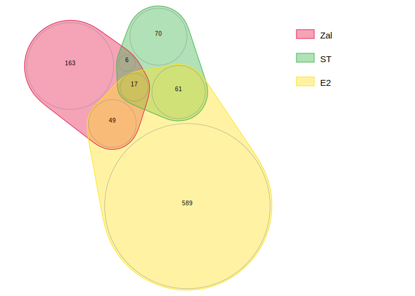

Figure 7
================
4/11/24

### Load data and libraries

``` r
##################
# LOAD LIBRARIES #
##################
library(tidyverse)
library(Seurat)
library(SeuratObject)
library(tidyseurat)
library(cowplot)
library(ggrepel)
library(gridtext)
library(png)
library(grid)
library(scatterpie)
library(patchwork)
library(openxlsx)
library(readxl)

# BiocManager::install("ComplexHeatmap")
library(ComplexHeatmap)

source("../../bin/spatial_visualization.R")
source("../../bin/plotting_functions.R")

#########
# PATHS #
#########
input_dir <- "../../results/08_spatial_dist/SM/"
input_dir <- "../../results/04_deconvolution_st_data/"
result_dir <- "../../results/09_figures/"
if( isFALSE(dir.exists(result_dir)) ) { dir.create(result_dir,recursive = TRUE) }
epi_clus <- "^5$|^6$|^7|^9" # non-filt

#############
# LOAD DATA #
#############
# DEGs_table <- read_csv(paste0(input_dir,"subset_100/DGEs_condition_wilcox_epi_100.csv")) %>% filter(groups == "DMPA")
DEGs_table <- read_csv(paste0("../../results/05_DGE_clusters_st_data/","DGEs_clusters_wilcox.csv"))
DATA <- readRDS(paste0(input_dir,"seuratObj_deconvolution_scdc.RDS"))
#DATA <- readRDS(paste0(input_dir,"seuratObj_spatial_dist_SM.RDS"))

# Zalenskya sig DEGs
Zal_DEGs <- read_xlsx("/Users/vilkal/work/Brolidens_work/Projects/Spatial_DMPA/data/Bulk_data/Zalenskaya_DEGs.xlsx", 
                         sheet = 'DMPA-vs-BL', col_names = TRUE, skip = 1 )
PlosPath_DGEs <- "/Users/vilkal/work/Brolidens_work/Projects/Spatial_DMPA/data/Bulk_data/DMPA_PlosPath_DEGs.csv"
DGEs_PP <- read_csv(PlosPath_DGEs)


DEGs_table <- read_csv(paste0("../../results/06_DGE_condition_st_data/","DGEs_condition_wilcox.csv"))
DEGs_table_E2lvl <- read_csv(paste0("../../results/06_DGE_condition_st_data/","DGEs_condition_E2lvl.csv")) 
```

``` r
# top 15 genes sorted by logFC for each epithelial layer
sig_nest <- DEGs_table %>%
  mutate(Direction = ifelse(avg_log2FC > 0, "UP", "DOWN")) %>%
  filter(p_val_adj < 0.05) %>%
  {. ->> sig_table } %>%
  group_by(layers, Direction) %>%
  #top_n(15, abs(avg_log2FC)) %>% 
  #top_n(-30, p_val) %>% 
  nest() %>% mutate(n = map_dbl(data, nrow)) %>%
  arrange(layers, Direction) %>%
  ungroup()

sig_nest_epi <- sig_nest %>% ungroup() %>% filter(grepl("_", .$layers))
sig_genes_epi <- unnest(sig_nest_epi, c(layers, Direction, data))
sig_genes <- unnest(sig_nest, c(layers, Direction, data))


# Significant genes from the PlosPath study
# Genes with FDR-adjusted P-values<0.05 were considered significant
PP_sig <- DGEs_PP %>%
  filter(DE != 0) %>%
  {. ->> sig_PP } %>%
  group_by(DE) %>%
  top_n(15, abs(logFC)) %>%
  arrange(logFC) %>%
  ungroup() %>%
  mutate(symbol = factor(.$symbol, levels=unique(.$symbol)))
```

### Check overlapping genes (bulk data)

``` r
######################
# CHECK GENE OVERLAP #
######################
E2 <- DEGs_table_E2lvl %>% filter(p_val_adj < 0.05) #%>% filter((grepl(epi_clus, .$subgroup)))
Z <- intersect(Zal_DEGs$symbol, sig_genes$gene)
B <- intersect(sig_PP$symbol, sig_genes$gene)
# intersect(Z, B)
# intersect(E2$gene, sig_genes$gene)
# intersect(Zal_DEGs$symbol, E2$gene)
# intersect(sig_PP$symbol, E2$gene)
# setdiff(sig_genes$gene, E2$gene)
# setdiff(E2$gene, sig_genes$gene)
# intersect(sig_genes$gene, E2$gene)
# intersect(E2$gene, sig_PP$symbol)

# Estrogen idenpendent genes
non_E2 <- setdiff(sig_genes$gene, E2$gene)

# Estrogen dependent genes
E2_dep <- setdiff(E2$gene, sig_genes$gene)

g <- intersect(E2_dep, Zal_DEGs$symbol)
# intersect(E2_dep, sig_PP$symbol)


#####################################
# TABLES WITH DEGs FROM ALL STUDIES #
#####################################
t <- list(Brad=sig_PP$symbol, Zal=Zal_DEGs$symbol, ST=sig_genes$gene, E2=E2$gene) %>%
  tibble(sig_DEGs=., study=names(.))

# Create table with DEGs from all clinical DMPA studies
# NB! Zalenskaya use fold change not -logFC
All_DEGs <- list(ST=sig_genes, Zal=Zal_DEGs, Brad=sig_PP, E2=E2) %>%
  map(., ~dplyr::select(.x, symbol=matches("symbol|gene"),
                            FDR=matches("p_val_adj|value"),
                            logFC=matches("FC|Fold"), cluster=matches("subgroup") )) %>%
  bind_rows(., .id = "study") %>%
  mutate(logFC = ifelse(.$study == "Zal"& .$logFC < 0, -log2(abs(.$logFC)),
                      ifelse(.$study == "Zal"& .$logFC > 0, log2(.$logFC), .$logFC)) )
```

``` r
#######################
# PLOTS VENN DIAGRAM #
######################
# "./Figures/06/"
library(nVennR)
t <- list(Zal=Zal_DEGs$symbol, ST=unique(sig_genes$gene), E2=unique(E2$gene), Brad=sig_PP$symbol) %>%
  tibble(sig_DEGs=., study=names(.))

getVennOverlap <- function(lsvenn) {
  ItemsList <- gplots::venn(lsvenn, show.plot = FALSE)
  print(lengths(attributes(ItemsList)$intersections))
  t <- attributes(ItemsList)$intersections %>%
    tibble(name = names(.), "Overlapping genes" = .) %>%
    mutate(n = map_dbl(.$`Overlapping genes`, ~length(.x)), .after="name")
  return(t)
}
col <- set_names(c('#ca0020','#f4a582','#0571b0',"#018571"), t$study)
# all four comparisons
# plotVenn(t$sig_DEGs, 
#          labelRegions=FALSE,
#          #sNames = names(t$sig_DEGs), 
#          systemShow=F) %>%
#   {. ->> d} %>%
#   showSVG(., 
#          setColors = col[names(d$orig)],
#          labelRegions=FALSE,
#          showNumbers=FALSE,
#          fontScale = 1,
#          systemShow=T,
#          outFile=paste0("./Figures/07/", "Venn_E2_all.svg")
#          )
# int_genes <- getVennOverlap(t$sig_DEGs) 

# Zalenskaya, ST and E2
plotVenn(t$sig_DEGs[1:3], 
         labelRegions=FALSE,
         sNames = names(t$sig_DEGs), 
         systemShow=F) %>%
  {. ->> d} %>%
  showSVG(., 
         setColors = col[names(d$orig)],
         labelRegions=FALSE,
         showNumbers=FALSE,
         fontScale = 2,
         systemShow=F,
         outFile=paste0("./Figures/06/", "Venn_E2_Zal.svg")
         )
```

    $def
     [1] "nVenn1.2" "3"        "Zal"      "ST"       "E2"       "0"       
     [7] "589"      "70"       "61"       "163"      "49"       "6"       
    [13] "17"      

    $set
    [1] "_F\n0\n_L\n7.98828\n21.7381\n7.80252\n21.7047\n7.63415\n21.6196\n7.48636\n21.5054\n7.33858\n21.3912\n7.19079\n21.277\n7.04302\n21.1627\n6.89523\n21.0485\n6.74744\n20.9343\n6.59966\n20.8201\n6.45187\n20.7059\n6.30407\n20.5917\n6.16582\n20.4651\n6.05029\n20.3174\n5.96094\n20.1526\n5.90023\n19.9751\n5.86987\n19.7901\n5.87071\n19.6026\n5.90273\n19.4178\n5.96503\n19.241\n6.05587\n19.0769\n6.17274\n18.9303\n6.31237\n18.8051\n6.47088\n18.7049\n6.64383\n18.6325\n6.82644\n18.5898\n7.01359\n18.5781\n7.20008\n18.5977\n7.38071\n18.6481\n7.55045\n18.7277\n7.70485\n18.834\n7.85731\n18.9427\n8.00976\n19.0513\n8.16223\n19.16\n8.3147\n19.2687\n8.46716\n19.3773\n8.62712\n19.5682\n8.73051\n19.7476\n8.83389\n19.9271\n8.93148\n20.1121\n8.90181\n20.3936\n8.85142\n20.5542\n8.80104\n20.7147\n8.75063\n20.8752\n8.70024\n21.0357\n8.64986\n21.1963\n8.59946\n21.3568\n8.50678\n21.4983\n8.34856\n21.6398\n8.17576\n21.7164\n_L\n9.75062\n21.0264\n9.55622\n21.0402\n9.38695\n21.0087\n9.22919\n20.9421\n9.07144\n20.8756\n8.91369\n20.8091\n8.75593\n20.7426\n8.59818\n20.6761\n8.44042\n20.6096\n8.23633\n20.4865\n8.15163\n20.3532\n8.12617\n20.1983\n8.1214\n20.0441\n8.11662\n19.89\n8.11185\n19.7358\n8.10227\n19.5463\n8.15797\n19.3982\n8.21365\n19.2501\n8.26933\n19.102\n8.32503\n18.9539\n8.38071\n18.8058\n8.4364\n18.6577\n8.52001\n18.5232\n8.62965\n18.4088\n8.7606\n18.3196\n8.90718\n18.2595\n9.06301\n18.231\n9.22137\n18.2355\n9.37539\n18.2726\n9.51837\n18.3408\n9.64413\n18.4372\n9.74721\n18.5575\n9.8232\n18.6965\n9.87265\n18.8466\n9.92209\n18.9966\n9.97153\n19.1467\n10.021\n19.2968\n10.0704\n19.4469\n10.1198\n19.5969\n10.1693\n19.747\n10.2187\n19.8971\n10.2682\n20.0472\n10.3137\n20.1989\n10.3252\n20.357\n10.3016\n20.5138\n10.2441\n20.6615\n10.1554\n20.7929\n10.0399\n20.9015\n9.90336\n20.9819\n_L\n11.8446\n23.5435\n11.7571\n23.8338\n11.6282\n24.1083\n11.4606\n24.361\n11.2579\n24.5865\n11.0244\n24.78\n10.7652\n24.9373\n10.4857\n25.0551\n10.1921\n25.1308\n9.89055\n25.1629\n9.58755\n25.1505\n9.28961\n25.0941\n9.00311\n24.9947\n8.7342\n24.8546\n8.48862\n24.6767\n8.27164\n24.4649\n8.08793\n24.2237\n7.94141\n23.9582\n7.83521\n23.6742\n7.77098\n23.3779\n7.71703\n23.0802\n7.66307\n22.7825\n7.60912\n22.4849\n7.55515\n22.1872\n7.50119\n21.8895\n7.44725\n21.5918\n7.39329\n21.2941\n7.37141\n20.9858\n7.49675\n20.7018\n7.79752\n20.4787\n8.009\n20.2169\n8.22047\n19.9551\n8.56915\n19.8048\n8.88562\n19.7743\n9.2021\n19.7438\n9.5406\n19.6225\n9.8435\n19.6558\n10.1033\n19.814\n10.2752\n20.0642\n10.4445\n20.3154\n10.6138\n20.5666\n10.783\n20.8179\n10.9523\n21.0691\n11.1216\n21.3203\n11.2909\n21.5716\n11.4601\n21.8228\n11.6272\n22.0757\n11.7564\n22.3501\n11.8441\n22.6403\n11.8886\n22.9402\n11.8887\n23.2435\n_C\n0\n4.29497e+09\n0\n6.98986\n19.7014\n1.05212\n8.36143\n19.6272\n0.201859\n8.53729\n20.2125\n0.339779\n9.12105\n18.9897\n0.68948\n9.61077\n20.3297\n0.643631\n9.82307\n23.0928\n2\n8.00872\n21.0906\n0.57686\n"

    $reg
    $reg[[1]]
      [1] "MUC1"       "S100A11"    "FCGBP"      "CLCA4"      "SPRR2F"    
      [6] "RPS28"      "KRT24"      "CXCL17"     "ANXA2"      "PDZK1IP1"  
     [11] "CEACAM6"    "ATP5MF"     "ID1"        "TNFSF10"    "LYPD3"     
     [16] "ANXA1"      "SERPINB1"   "SOD2"       "TMEM258"    "HLA-DPA1"  
     [21] "CD46"       "XDH"        "SERF2"      "HOPX"       "NAMPT"     
     [26] "RAB25"      "S100A2"     "ALDH1A3"    "NDUFB3"     "TMSB10"    
     [31] "TACSTD2"    "RPL18A"     "TYMP"       "GNG5"       "ATP5MC3"   
     [36] "PRSS22"     "ADGRF1"     "TXNDC17"    "ETHE1"      "ABRACL"    
     [41] "LY6D"       "PDLIM1"     "PSMA7"      "CDKN2B"     "HLA-DRA"   
     [46] "NDUFA1"     "TP53I3"     "DGAT2"      "PRDX5"      "MSMO1"     
     [51] "CDH1"       "SDC1"       "SQOR"       "ATP5PO"     "CALR"      
     [56] "RPL41"      "CYP51A1"    "STAT1"      "FUT2"       "ARPC3"     
     [61] "STEAP4"     "CAPN2"      "MBOAT2"     "JPT1"       "SQLE"      
     [66] "PRSS27"     "S100A16"    "NECTIN2"    "PSMA1"      "PARP9"     
     [71] "CRB3"       "TMEM54"     "MAP2K1"     "CHCHD2"     "EMC3"      
     [76] "HEPHL1"     "CTNND1"     "SH3GLB1"    "HMGCS1"     "PLSCR1"    
     [81] "GSN"        "NOP10"      "SCAMP2"     "OST4"       "GJB2"      
     [86] "GJB6"       "CEACAM5"    "CLTC"       "HLA-DQA1"   "SNRPF"     
     [91] "VWA1"       "TOR1AIP1"   "COMTD1"     "CDC42"      "CLCA2"     
     [96] "ANXA11"     "PDIA6"      "SEC11C"     "SEC61B"     "RCOR1"     
    [101] "PLAT"       "KLK7"       "ATP13A4"    "SLURP2"     "DUOX1"     
    [106] "HMGN2"      "NET1"       "TMED7"      "RBM8A"      "IL4R"      
    [111] "ITM2B"      "STAT3"      "TM9SF2"     "HERC6"      "PPP4C"     
    [116] "PRELID1"    "MINK1"      "YIPF3"      "ATP5MG"     "ZG16B"     
    [121] "DRAP1"      "SMAGP"      "HLA-DQB1"   "C19orf33"   "ITGB1"     
    [126] "CCT6A"      "MICOS10"    "FDPS"       "CXCL6"      "DTX2"      
    [131] "DHRS3"      "PSMD8"      "ERGIC3"     "PSME1"      "ACKR3"     
    [136] "MRPS18C"    "VAMP8"      "DBI"        "CAP1"       "COPB2"     
    [141] "SPRR1A"     "TMED9"      "ST5"        "KLK6"       "COX7A2"    
    [146] "TMEM165"    "TCP1"       "BAIAP2L1"   "H1FX"       "VAPB"      
    [151] "SPTAN1"     "FASN"       "HLA-DRB1"   "ACTR2"      "HSPA5"     
    [156] "ACTR3"      "CMTM6"      "OSBPL2"     "CD9"        "RPL37"     
    [161] "PTPN2"      "HLA-C"      "TAF13"      "CD81"       "ELOB"      
    [166] "NEBL"       "ATP1B1"     "CEBPD"      "SLIRP"      "RBM4"      
    [171] "GLO1"       "FUT3"       "TMED2"      "TOMM7"      "CLIC1"     
    [176] "POMP"       "ARHGAP1"    "TAPBP"      "LMO2"       "LYN"       
    [181] "RPS19"      "SLPI"       "CASP4"      "SURF4"      "ATP6V0E1"  
    [186] "AURKAIP1"   "C1orf43"    "PSMB5"      "SDCBP"      "HSPA4"     
    [191] "TRAM1"      "ARF4"       "TMPRSS2"    "EIF3M"      "CCT5"      
    [196] "UQCR11"     "CNDP2"      "SELENOH"    "EIF3L"      "SDC4"      
    [201] "SH3YL1"     "TPRG1"      "AP3D1"      "IL13RA1"    "FSCN1"     
    [206] "COX16"      "ANAPC11"    "SLC5A1"     "LLGL2"      "ATP11B"    
    [211] "S100A12"    "MORF4L2"    "ISG15"      "BRD2"       "CCT3"      
    [216] "ATP5MC2"    "PSMB1"      "RNF213"     "GNB1"       "COX6B1"    
    [221] "AK2"        "NDUFB1"     "DEFB4A"     "ZFR"        "PPP2R1A"   
    [226] "SC5D"       "MIEN1"      "PGLS"       "PSMB4"      "TGM1"      
    [231] "ST14"       "OCIAD1"     "OCLN"       "F11R"       "FKBP3"     
    [236] "KLF5"       "DDT"        "NDUFB2"     "TXNL4A"     "MAP1LC3B"  
    [241] "CNOT1"      "FAM177A1"   "CDC42EP1"   "JAK1"       "SLC11A2"   
    [246] "CST6"       "MGST2"      "SAR1B"      "NDUFAF3"    "HSPA8"     
    [251] "PNP"        "TM4SF1"     "CAPZA1"     "TTLL12"     "MX1"       
    [256] "SPINT1-AS1" "HINT1"      "SNX3"       "SNRPG"      "NHP2"      
    [261] "MBD2"       "SEMA3F"     "MFSD5"      "TWF1"       "COX7C"     
    [266] "PPP6R1"     "TMEM141"    "TOR1AIP2"   "PGAM1"      "RBX1"      
    [271] "CNN3"       "SRP72"      "COX17"      "SAMD9L"     "SLC25A23"  
    [276] "GORASP1"    "CAPZB"      "NT5C2"      "CAPRIN1"    "MT-CO1"    
    [281] "ZDHHC13"    "NORAD"      "EIF5A"      "PYGL"       "DBNL"      
    [286] "HIF1A"      "EIF3F"      "PET100"     "ITGA2"      "IQGAP1"    
    [291] "SHROOM3"    "GTF2A2"     "TBC1D20"    "SUN2"       "GBP2"      
    [296] "RTKN2"      "S100A6"     "LGMN"       "UPK3BL1"    "NDUFA6"    
    [301] "B3GNT5"     "SEC61G"     "UQCC3"      "H3F3A"      "SLC9A3R1"  
    [306] "ASCC2"      "MPZL1"      "UBE2L3"     "MDH2"       "CNN2"      
    [311] "RPL18"      "TMEM219"    "C1QBP"      "TJP3"       "HIST1H2BC" 
    [316] "RNPEP"      "DNAJC3"     "GAPVD1"     "XBP1"       "HSPB1"     
    [321] "ARPP19"     "DAP3"       "RRM1"       "AC104825.1" "COTL1"     
    [326] "PPP2CB"     "RAB5IF"     "TAP1"       "DYNC1I2"    "RPL34"     
    [331] "GNB2"       "UBL5"       "GHITM"      "UBE2V2"     "CRK"       
    [336] "RPS16"      "SLC6A14"    "HNRNPA2B1"  "VPS29"      "SUN1"      
    [341] "SF3B6"      "SDF4"       "RAB11FIP1"  "SH2D4A"     "ARPC1A"    
    [346] "NDUFA3"     "CRISP3"     "KPRP"       "LCE3E"      "YOD1"      
    [351] "FAM25A"     "HMOX1"      "CRNN"       "QSOX1"      "PABPC3"    
    [356] "ALOX12"     "UPP1"       "SPRR3"      "A2ML1"      "PPL"       
    [361] "ADIRF"      "MXD1"       "MTRNR2L12"  "PPDPF"      "RIOK3"     
    [366] "ANKRD37"    "ZFP36"      "KLK10"      "GPSM1"      "RPL23A"    
    [371] "FABP5"      "ATP5MD"     "SEM1"       "RAB22A"     "RPS25"     
    [376] "UBE2D2"     "RPL37A"     "RAB14"      "EDN3"       "MRPL57"    
    [381] "ANXA8"      "WDR1"       "RPLP0"      "DPYD"       "GTF2H5"    
    [386] "NDUFA5"     "RPL22"      "CD52"       "MSRB2"      "MPZL2"     
    [391] "TMEM167A"   "RPS15A"     "GADD45GIP1" "NSDHL"      "BST2"      
    [396] "HLA-DPB1"   "DTX3L"      "AGPAT2"     "RPL14"      "MTSS1"     
    [401] "PSENEN"     "TOMM6"      "RPL12"      "GSTK1"      "LSM7"      
    [406] "PSMB3"      "RAP1B"      "COX14"      "CHCHD5"     "DYNLT1"    
    [411] "RPS15"      "MRPS28"     "FAM3C"      "NDRG2"      "RPL36AL"   
    [416] "MIF"        "LLPH"       "RPS23"      "BCL3"       "RPL6"      
    [421] "PFN1"       "SMDT1"      "RPL15"      "ACP1"       "RPL30"     
    [426] "TRPC4AP"    "CALML3"     "COX7B"      "RPL28"      "CXCL1"     
    [431] "RPL36A"     "SLC25A5"    "IFI27"      "RPS24"      "ALOX15B"   
    [436] "PCBD1"      "POLR2E"     "FAU"        "TIPRL"      "LRRC8A"    
    [441] "TAP2"       "POLD2"      "UBA52"      "VPS25"      "RPL7A"     
    [446] "GNG10"      "KDELR2"     "LINC01503"  "RPL26"      "GOLT1B"    
    [451] "APOL2"      "STAU1"      "MGST3"      "CD47"       "MVP"       
    [456] "SPAG7"      "PARP14"     "DHRS7"      "MRPL36"     "RAB10"     
    [461] "CDH3"       "PSMB6"      "RPS14"      "LITAF"      "ATP5MPL"   
    [466] "SRP19"      "ELK3"       "DDOST"      "SDHB"       "AKIP1"     
    [471] "RPS5"       "NLRX1"      "PSME2"      "TCHP"       "PLA2G4D"   
    [476] "IL18"       "UPK1A"      "PEBP1"      "AL627171.2" "S100A14"   
    [481] "PITX1"      "B4GALT1"    "ERO1A"      "CTNNBIP1"   "UACA"      
    [486] "IGFBP7"     "TMPRSS11D"  "EMP1"       "SERPINB13"  "MT-ND2"    
    [491] "ZBTB7A"     "MUC21"      "HSPB8"      "NDUFA12"    "RPS7"      
    [496] "LCN2"       "RPS3A"      "EPHX3"      "CKLF"       "ALDOA"     
    [501] "FAM83A"     "RPSA"       "ATP5ME"     "ARF5"       "PSMB9"     
    [506] "EFHD2"      "RPLP1"      "CYB5A"      "SMAD3"      "GRN"       
    [511] "SEC24C"     "MYDGF"      "UBC"        "ID2"        "ZC3H12A"   
    [516] "COX5A"      "RPL17"      "IRF1"       "SRI"        "SFN"       
    [521] "GBP6"       "KRT2"       "AHNAK"      "ELL2"       "TMEM79"    
    [526] "FAM3D"      "EEF2"       "ACTN4"      "RAPGEFL1"   "H19"       
    [531] "CTSS"       "MYO1B"      "RPL11"      "BTF3"       "DSP"       
    [536] "ALDH3A2"    "MT-ND1"     "GJA1"       "ALDH3A1"    "CSTB"      
    [541] "IGHG3"      "IVL"        "HSP90AA1"   "CCDC80"     "GAS5"      
    [546] "DSC3"       "NBL1"       "NFIC"       "BGN"        "ANKRD12"   
    [551] "COL6A2"     "THY1"       "BPTF"       "EDNRA"      "ESF1"      
    [556] "MITF"       "RHCG"       "MXRA5"      "PMEPA1"     "GOLGA4"    
    [561] "EHF"        "RAB31"      "DAAM1"      "DST"        "FOXN3"     
    [566] "SH3KBP1"    "C1QTNF7"    "MFN2"       "RPL36"      "ECRG4"     
    [571] "CD74"       "TAGLN"      "C3"         "RPL35"      "RGS5"      
    [576] "MDK"        "PAPPA"      "CFD"        "MYH11"      "CPE"       
    [581] "MYL9"       "IGFBP4"     "PCOLCE"     "SULF2"      "CDH11"     
    [586] "FBLN2"      "NT5E"       "RTL8C"      "LY6E"      

    $reg[[2]]
     [1] "SPRR2E"    "KRT13"     "SPRR2A"    "SPRR2D"    "SAMHD1"    "JCHAIN"   
     [7] "PLPP3"     "IGHG1"     "CAST"      "ZFHX4"     "PTN"       "TCEAL4"   
    [13] "ATP5F1E"   "MEG3"      "KRT5"      "VIM"       "LINC00632" "BNIP3L"   
    [19] "EEF1A1"    "SSR3"      "RPL7"      "ALDH1A1"   "IL6ST"     "SBDS"     
    [25] "CAV1"      "CCNI"      "PDS5B"     "NPC2"      "RPS8"      "SSBP3"    
    [31] "CLIC4"     "GPM6B"     "SNHG6"     "LPAR1"     "THAP12"    "TMED10"   
    [37] "FGFR1"     "KLF4"      "TSKU"      "HNRNPA1"   "LAMA2"     "SNX18"    
    [43] "HNRNPC"    "VEZF1"     "TXNDC5"    "SEC63"     "IGKC"      "IGLC1"    
    [49] "REV3L"     "KRT4"      "COL6A3"    "MT1E"      "LUM"       "MT1X"     
    [55] "COL5A1"    "RPS27"     "SLC7A8"    "THBS2"     "PPIA"      "XIST"     
    [61] "AQP3"      "BOD1L1"    "HIST1H4C"  "GSTP1"     "MT1M"      "CD58"     
    [67] "CCNG2"     "SPRR2B"    "SPRR2G"    "MUC22"    

    $reg[[3]]
     [1] "KRTDAP"    "S100A7"    "KRT6C"     "IGFBP5"    "SERPINB4"  "IGHA1"    
     [7] "IGHA2"     "NUCKS1"    "TPT1"      "TMSB4X"    "B2M"       "LGALS7"   
    [13] "CCN5"      "SNHG5"     "S100A9"    "KRT6A"     "SPRR1B"    "S100A8"   
    [19] "MT-CO2"    "FLG"       "RPL5"      "NACA"      "PBX1"      "RPS27A"   
    [25] "IGF1"      "S100A10"   "FMOD"      "H3F3B"     "RPL19"     "SPARC"    
    [31] "IGLC2"     "SERPINB3"  "COMP"      "RPS26"     "COL6A1"    "SERPINH1" 
    [37] "COL5A2"    "MMP2"      "RPL32"     "RPS12"     "PSAP"      "PABPC1"   
    [43] "SPINK5"    "ACTG1"     "NEAT1"     "IGLC3"     "TMPRSS11B" "SCEL"     
    [49] "CD24"      "GAPDH"     "TCN1"      "PKP1"      "IL1RN"     "CRCT1"    
    [55] "CD59"      "DUOX2"     "SAMD9"     "DEFB1"     "KRT78"     "GLUL"     
    [61] "CSTA"     

    $reg[[4]]
      [1] "CYP26B1"      "PGBD5"        "GPX3"         "TMEM45A"      "WISP2"       
      [6] "RASSF10"      "SERPINB7"     "RGS20"        "LOX"          "CTSC"        
     [11] "PPP2R2C"      "SOX9"         "SH2D1B"       "PCDH8"        "POF1B"       
     [16] "CLDN17"       "DUSP14"       "SLC27A2"      "ALOX12B"      "HS3ST1"      
     [21] "STS"          "MAP2"         "ELOVL4"       "ABI3BP"       "IL17RB"      
     [26] "DNASE1L3"     "JMY"          "FOXA1"        "SLC15A2"      "ACAA2"       
     [31] "AADACL2"      "SEMA3C"       "SDR16C5"      "IL36RN"       "ABCG1"       
     [36] "NT5C3"        "PENK"         "CDSN"         "ABCA12"       "PRR5L"       
     [41] "LHX4"         "SH3GL3"       "MPPED2"       "B4GALT5"      "CD36"        
     [46] "LY6G6C"       "TGFBR3"       "CADPS"        "NCEH1"        "USP53"       
     [51] "PLCE1"        "SERPINB12"    "LYPD5"        "TF"           "PNLIPRP3"    
     [56] "F13A1"        "ADCYAP1"      "SLC2A13"      "ERRFI1"       "IGFBP2"      
     [61] "KRT18"        "SVEP1"        "SDR9C7"       "PCSK5"        "RBPMS"       
     [66] "HAL"          "TNC"          "PXK"          "SNX31"        "MECOM"       
     [71] "ADAMTSL3"     "ANKRD20A11P"  "GPNMB"        "PADI1"        "PMAIP1"      
     [76] "ABHD6"        "PNMA2"        "ST6GAL2"      "LOC100505702" "LRMP"        
     [81] "COL12A1"      "SDC2"         "LRRC20"       "GYS2"         "CSF2RB"      
     [86] "COL21A1"      "ME1"          "DKK3"         "ABAT"         "PAPLN"       
     [91] "FN1"          "GJA3"         "MUC20"        "TNFRSF19"     "C3orf80"     
     [96] "OR7E14P"      "MRC1"         "XG"           "KIAA0226L"    "FLVCR2"      
    [101] "CYP2C18"      "MGC16121"     "GLRX"         "SPRR2C"       "AMPD3"       
    [106] "F2R"          "ACADM"        "ANK2"         "CHI3L1"       "NELL2"       
    [111] "EPB41L3"      "PTGER3"       "CWH43"        "COL17A1"      "RIMS2"       
    [116] "TENM2"        "KCNIP4"       "PDLIM5"       "TXNIP"        "PRSS12"      
    [121] "SEMA3G"       "CD163"        "LOC645638"    "MUC15"        "SPINK6"      
    [126] "LYZ"          "NAP1L3"       "FRZB"         "PTPRZ1"       "CNST"        
    [131] "PRKAA2"       "FOXC1"        "GPR133"       "COL4A1"       "NEFL"        
    [136] "ALDH1A2"      "BCHE"         "THBS1"        "NABP1"        "TPBG"        
    [141] "TMEM158"      "IFRD1"        "CPA3"         "MUM1L1"       "BNIP3"       
    [146] "NID1"         "ABCA6"        "IL1R1"        "RBM20"        "PGF"         
    [151] "PRRG3"        "DIRAS3"       "SGCE"         "PDGFRB"       "DSC2"        
    [156] "TMTC1"        "RBM24"        "CSGALNACT2"   "PRELP"        "MAB21L3"     
    [161] "BAG2"         "PROK1"        "CRIM1"       

    $reg[[5]]
     [1] "RPTN"     "DUSP4"    "GABRP"    "PRSS23"   "PCP4L1"   "GREB1"   
     [7] "PPIF"     "DSG1"     "SULT1C4"  "LTBP1"    "LCE3D"    "DIO2"    
    [13] "SORBS2"   "VCAN"     "CAPN14"   "SLC16A3"  "DCN"      "PLCXD1"  
    [19] "CXCL14"   "CYP4B1"   "KIF21A"   "TMPRSS4"  "CITED2"   "ELF3"    
    [25] "GCNT3"    "CLDN7"    "SPON1"    "SERINC2"  "KRT6B"    "LRG1"    
    [31] "SBSN"     "WNT16"    "FSTL1"    "S100P"    "KRT16"    "PAPSS2"  
    [37] "MUC4"     "APOBEC3A" "RDH10"    "LOR"      "SERPINF1" "C4orf19" 
    [43] "PI3"      "C10orf99" "KRT1"     "CALD1"    "SFRP1"    "PLAC8"   
    [49] "FGFBP1"  

    $reg[[6]]
    [1] "GPRC5A" "CD177"  "PRLR"   "CYP1B1" "STC1"   "KRT19" 

    $reg[[7]]
     [1] "DMKN"    "PGR"     "KRT10"   "OLFM4"   "TGM3"    "KRT14"   "PTGDS"  
     [8] "SFRP4"   "FBN1"    "COL1A2"  "SLC18A2" "CTSK"    "CEACAM1" "COL1A1" 
    [15] "FBLN1"   "COL14A1" "COL3A1" 


    $orig
    $orig$Zal
      [1] "CYP26B1"      "RPTN"         "PGBD5"        "GPX3"         "DUSP4"       
      [6] "TMEM45A"      "DMKN"         "PGR"          "GABRP"        "WISP2"       
     [11] "RASSF10"      "SERPINB7"     "RGS20"        "LOX"          "PRSS23"      
     [16] "CTSC"         "PPP2R2C"      "SOX9"         "SH2D1B"       "PCDH8"       
     [21] "PCP4L1"       "KRT10"        "POF1B"        "CLDN17"       "DUSP14"      
     [26] "SLC27A2"      "ALOX12B"      "GREB1"        "PPIF"         "HS3ST1"      
     [31] "STS"          "DSG1"         "MAP2"         "OLFM4"        "ELOVL4"      
     [36] "SULT1C4"      "ABI3BP"       "LTBP1"        "TGM3"         "LCE3D"       
     [41] "DIO2"         "SORBS2"       "VCAN"         "IL17RB"       "DNASE1L3"    
     [46] "JMY"          "FOXA1"        "SLC15A2"      "ACAA2"        "CAPN14"      
     [51] "AADACL2"      "SEMA3C"       "SDR16C5"      "IL36RN"       "SLC16A3"     
     [56] "ABCG1"        "DCN"          "NT5C3"        "PENK"         "CDSN"        
     [61] "KRT14"        "PLCXD1"       "ABCA12"       "PRR5L"        "LHX4"        
     [66] "SH3GL3"       "MPPED2"       "B4GALT5"      "CD36"         "LY6G6C"      
     [71] "TGFBR3"       "CADPS"        "CXCL14"       "NCEH1"        "CYP4B1"      
     [76] "USP53"        "PLCE1"        "GPRC5A"       "SERPINB12"    "LYPD5"       
     [81] "KIF21A"       "PTGDS"        "SFRP4"        "TMPRSS4"      "TF"          
     [86] "CITED2"       "PNLIPRP3"     "F13A1"        "ADCYAP1"      "SLC2A13"     
     [91] "FBN1"         "ERRFI1"       "IGFBP2"       "ELF3"         "GCNT3"       
     [96] "KRT18"        "SVEP1"        "SDR9C7"       "PCSK5"        "CLDN7"       
    [101] "RBPMS"        "HAL"          "TNC"          "SPON1"        "COL1A2"      
    [106] "PXK"          "SNX31"        "MECOM"        "ADAMTSL3"     "SERINC2"     
    [111] "CD177"        "ANKRD20A11P"  "GPNMB"        "PADI1"        "PMAIP1"      
    [116] "ABHD6"        "PNMA2"        "ST6GAL2"      "LOC100505702" "SLC18A2"     
    [121] "LRMP"         "COL12A1"      "SDC2"         "LRRC20"       "GYS2"        
    [126] "CSF2RB"       "KRT6B"        "COL21A1"      "ME1"          "CTSK"        
    [131] "DKK3"         "LRG1"         "ABAT"         "SBSN"         "WNT16"       
    [136] "CEACAM1"      "PAPLN"        "FN1"          "GJA3"         "MUC20"       
    [141] "FSTL1"        "TNFRSF19"     "C3orf80"      "COL1A1"       "OR7E14P"     
    [146] "MRC1"         "XG"           "S100P"        "KRT16"        "PAPSS2"      
    [151] "MUC4"         "APOBEC3A"     "KIAA0226L"    "FLVCR2"       "FBLN1"       
    [156] "CYP2C18"      "MGC16121"     "GLRX"         "RDH10"        "LOR"         
    [161] "SPRR2C"       "AMPD3"        "F2R"          "ACADM"        "PRLR"        
    [166] "SERPINF1"     "ANK2"         "CYP1B1"       "CHI3L1"       "NELL2"       
    [171] "STC1"         "EPB41L3"      "PTGER3"       "CWH43"        "COL17A1"     
    [176] "RIMS2"        "C4orf19"      "TENM2"        "COL14A1"      "KCNIP4"      
    [181] "PDLIM5"       "PI3"          "KRT19"        "C10orf99"     "TXNIP"       
    [186] "PRSS12"       "SEMA3G"       "CD163"        "LOC645638"    "MUC15"       
    [191] "KRT1"         "SPINK6"       "LYZ"          "NAP1L3"       "FRZB"        
    [196] "PTPRZ1"       "CNST"         "CALD1"        "PRKAA2"       "FOXC1"       
    [201] "GPR133"       "COL4A1"       "NEFL"         "ALDH1A2"      "BCHE"        
    [206] "THBS1"        "NABP1"        "SFRP1"        "TPBG"         "COL3A1"      
    [211] "TMEM158"      "IFRD1"        "CPA3"         "MUM1L1"       "BNIP3"       
    [216] "NID1"         "ABCA6"        "IL1R1"        "RBM20"        "PGF"         
    [221] "PRRG3"        "PLAC8"        "DIRAS3"       "SGCE"         "PDGFRB"      
    [226] "DSC2"         "TMTC1"        "RBM24"        "CSGALNACT2"   "PRELP"       
    [231] "MAB21L3"      "BAG2"         "PROK1"        "FGFBP1"       "CRIM1"       

    $orig$ST
      [1] "SPRR2E"    "KRT13"     "SPRR2A"    "KRTDAP"    "S100A7"    "SPRR2D"   
      [7] "KRT6C"     "SAMHD1"    "JCHAIN"    "OLFM4"     "IGFBP5"    "PLPP3"    
     [13] "KRT10"     "IGHG1"     "SERPINB4"  "IGHA1"     "IGHA2"     "CAST"     
     [19] "ZFHX4"     "NUCKS1"    "PTN"       "TPT1"      "TMSB4X"    "B2M"      
     [25] "LGALS7"    "CCN5"      "SNHG5"     "TCEAL4"    "ATP5F1E"   "S100A9"   
     [31] "KRT6A"     "SPRR1B"    "S100A8"    "MEG3"      "MT-CO2"    "KRT5"     
     [37] "SLC18A2"   "CYP1B1"    "COL14A1"   "VIM"       "FBN1"      "LINC00632"
     [43] "BNIP3L"    "EEF1A1"    "SSR3"      "RPL7"      "FLG"       "STC1"     
     [49] "RPL5"      "ALDH1A1"   "IL6ST"     "SBDS"      "CAV1"      "CCNI"     
     [55] "NACA"      "PBX1"      "RPS27A"    "SFRP4"     "IGF1"      "PDS5B"    
     [61] "NPC2"      "RPS8"      "S100A10"   "SSBP3"     "CLIC4"     "GPM6B"    
     [67] "FMOD"      "SNHG6"     "PGR"       "LPAR1"     "FBLN1"     "THAP12"   
     [73] "TMED10"    "FGFR1"     "PRLR"      "KLF4"      "TSKU"      "HNRNPA1"  
     [79] "LAMA2"     "H3F3B"     "SNX18"     "HNRNPC"    "VEZF1"     "RPL19"    
     [85] "TXNDC5"    "SEC63"     "COL1A1"    "COL3A1"    "COL1A2"    "SPARC"    
     [91] "KRT14"     "IGKC"      "IGLC1"     "IGLC2"     "REV3L"     "SERPINB3" 
     [97] "COMP"      "KRT4"      "COL6A3"    "RPS26"     "MT1E"      "COL6A1"   
    [103] "LUM"       "PTGDS"     "MT1X"      "CTSK"      "SERPINH1"  "COL5A1"   
    [109] "COL5A2"    "RPS27"     "MMP2"      "RPL32"     "RPS12"     "SLC7A8"   
    [115] "THBS2"     "PPIA"      "PSAP"      "PABPC1"    "SPINK5"    "ACTG1"    
    [121] "XIST"      "NEAT1"     "AQP3"      "IGLC3"     "TMPRSS11B" "SCEL"     
    [127] "BOD1L1"    "CD24"      "HIST1H4C"  "GAPDH"     "GSTP1"     "DMKN"     
    [133] "MT1M"      "CEACAM1"   "TCN1"      "CD58"      "PKP1"      "CD177"    
    [139] "IL1RN"     "KRT19"     "GPRC5A"    "CRCT1"     "CD59"      "DUOX2"    
    [145] "CCNG2"     "SAMD9"     "DEFB1"     "SPRR2B"    "TGM3"      "KRT78"    
    [151] "SPRR2G"    "GLUL"      "MUC22"     "CSTA"     

    $orig$E2
      [1] "S100A7"     "S100A8"     "MUC1"       "S100A11"    "FCGBP"     
      [6] "CLCA4"      "SPRR2F"     "OLFM4"      "TMPRSS4"    "LGALS7"    
     [11] "RPS28"      "KRT24"      "CEACAM1"    "CXCL17"     "ANXA2"     
     [16] "S100P"      "GABRP"      "PDZK1IP1"   "CEACAM6"    "MUC4"      
     [21] "SERPINB3"   "ATP5MF"     "ID1"        "TNFSF10"    "S100A9"    
     [26] "LYPD3"      "ANXA1"      "SERPINB1"   "SOD2"       "TMEM258"   
     [31] "HLA-DPA1"   "CD46"       "XDH"        "SERF2"      "HOPX"      
     [36] "SERINC2"    "NAMPT"      "RAB25"      "S100A2"     "ALDH1A3"   
     [41] "SAMD9"      "NDUFB3"     "CLDN7"      "TMSB10"     "APOBEC3A"  
     [46] "FGFBP1"     "TACSTD2"    "RPL18A"     "TYMP"       "S100A10"   
     [51] "GNG5"       "ATP5MC3"    "PRSS22"     "ADGRF1"     "TXNDC17"   
     [56] "SERPINB4"   "ETHE1"      "ABRACL"     "LY6D"       "PDLIM1"    
     [61] "PSMA7"      "CDKN2B"     "HLA-DRA"    "NDUFA1"     "TP53I3"    
     [66] "DGAT2"      "PRDX5"      "MSMO1"      "CDH1"       "SDC1"      
     [71] "SQOR"       "ATP5PO"     "CALR"       "RPL41"      "TMSB4X"    
     [76] "CYP51A1"    "STAT1"      "FUT2"       "ARPC3"      "STEAP4"    
     [81] "CAPN2"      "MBOAT2"     "JPT1"       "SQLE"       "PRSS27"    
     [86] "S100A16"    "NECTIN2"    "LRG1"       "PSMA1"      "CAPN14"    
     [91] "PARP9"      "CRB3"       "TMEM54"     "MAP2K1"     "RDH10"     
     [96] "CHCHD2"     "EMC3"       "HEPHL1"     "CTNND1"     "SH3GLB1"   
    [101] "HMGCS1"     "PLSCR1"     "GSN"        "NOP10"      "SCAMP2"    
    [106] "OST4"       "GJB2"       "GJB6"       "CEACAM5"    "CLTC"      
    [111] "HLA-DQA1"   "SNRPF"      "VWA1"       "TOR1AIP1"   "COMTD1"    
    [116] "CDC42"      "DEFB1"      "CD24"       "CLCA2"      "ANXA11"    
    [121] "PDIA6"      "SEC11C"     "SEC61B"     "RCOR1"      "PLAT"      
    [126] "KLK7"       "ATP13A4"    "SLURP2"     "DUOX1"      "HMGN2"     
    [131] "NET1"       "TMED7"      "RBM8A"      "B2M"        "IL4R"      
    [136] "ITM2B"      "STAT3"      "TM9SF2"     "HERC6"      "PPP4C"     
    [141] "PRELID1"    "PI3"        "MINK1"      "YIPF3"      "ATP5MG"    
    [146] "ZG16B"      "DRAP1"      "SMAGP"      "HLA-DQB1"   "C19orf33"  
    [151] "ITGB1"      "CCT6A"      "MICOS10"    "FDPS"       "CXCL6"     
    [156] "DTX2"       "DHRS3"      "KRT6A"      "PSMD8"      "ERGIC3"    
    [161] "PSME1"      "ACKR3"      "MRPS18C"    "VAMP8"      "DBI"       
    [166] "RPS12"      "CAP1"       "COPB2"      "SPRR1A"     "TMED9"     
    [171] "ST5"        "KLK6"       "COX7A2"     "TMEM165"    "TCP1"      
    [176] "BAIAP2L1"   "H1FX"       "VAPB"       "SPTAN1"     "FASN"      
    [181] "HLA-DRB1"   "ACTR2"      "HSPA5"      "ACTR3"      "CMTM6"     
    [186] "OSBPL2"     "CD9"        "RPL37"      "PTPN2"      "HLA-C"     
    [191] "GCNT3"      "TAF13"      "CD81"       "ELOB"       "NEBL"      
    [196] "ATP1B1"     "CEBPD"      "SLIRP"      "RBM4"       "GLO1"      
    [201] "FUT3"       "TMED2"      "TOMM7"      "CLIC1"      "POMP"      
    [206] "ARHGAP1"    "DUSP4"      "TAPBP"      "LMO2"       "LYN"       
    [211] "RPS19"      "SLPI"       "CASP4"      "SURF4"      "ATP6V0E1"  
    [216] "AURKAIP1"   "C1orf43"    "PSMB5"      "SDCBP"      "HSPA4"     
    [221] "TRAM1"      "ARF4"       "TMPRSS2"    "EIF3M"      "CCT5"      
    [226] "UQCR11"     "CNDP2"      "SORBS2"     "SELENOH"    "EIF3L"     
    [231] "SDC4"       "SH3YL1"     "TPRG1"      "AP3D1"      "CD59"      
    [236] "IL13RA1"    "FSCN1"      "COX16"      "ANAPC11"    "SLC5A1"    
    [241] "LLGL2"      "SLC16A3"    "ATP11B"     "S100A12"    "MORF4L2"   
    [246] "ISG15"      "BRD2"       "CCT3"       "ATP5MC2"    "PSMB1"     
    [251] "RNF213"     "GNB1"       "COX6B1"     "AK2"        "NDUFB1"    
    [256] "PLAC8"      "DEFB4A"     "ZFR"        "ACTG1"      "PPP2R1A"   
    [261] "SC5D"       "MIEN1"      "PGLS"       "PSMB4"      "TGM1"      
    [266] "ST14"       "OCIAD1"     "OCLN"       "F11R"       "FKBP3"     
    [271] "KRT6B"      "KLF5"       "DDT"        "NDUFB2"     "TXNL4A"    
    [276] "MAP1LC3B"   "CNOT1"      "FAM177A1"   "CDC42EP1"   "JAK1"      
    [281] "SLC11A2"    "CST6"       "MGST2"      "SAR1B"      "DUOX2"     
    [286] "NDUFAF3"    "HSPA8"      "PNP"        "TM4SF1"     "CAPZA1"    
    [291] "TTLL12"     "MX1"        "SPINT1-AS1" "HINT1"      "SNX3"      
    [296] "SNRPG"      "NHP2"       "MBD2"       "SEMA3F"     "MFSD5"     
    [301] "TWF1"       "COX7C"      "PPP6R1"     "TMEM141"    "TOR1AIP2"  
    [306] "PGAM1"      "RBX1"       "CNN3"       "CYP4B1"     "SRP72"     
    [311] "TCN1"       "COX17"      "SAMD9L"     "SLC25A23"   "GORASP1"   
    [316] "TPT1"       "CAPZB"      "NT5C2"      "CAPRIN1"    "MT-CO1"    
    [321] "ZDHHC13"    "NORAD"      "EIF5A"      "DIO2"       "PYGL"      
    [326] "DBNL"       "HIF1A"      "EIF3F"      "PET100"     "ITGA2"     
    [331] "IQGAP1"     "SHROOM3"    "GTF2A2"     "TBC1D20"    "SUN2"      
    [336] "GBP2"       "C4orf19"    "RTKN2"      "S100A6"     "LGMN"      
    [341] "UPK3BL1"    "NDUFA6"     "B3GNT5"     "SPRR1B"     "SEC61G"    
    [346] "IGLC2"      "UQCC3"      "H3F3A"      "SLC9A3R1"   "ASCC2"     
    [351] "MPZL1"      "UBE2L3"     "MDH2"       "CNN2"       "RPL18"     
    [356] "TMEM219"    "C1QBP"      "TJP3"       "HIST1H2BC"  "RNPEP"     
    [361] "DNAJC3"     "GAPVD1"     "XBP1"       "HSPB1"      "ARPP19"    
    [366] "DAP3"       "RRM1"       "AC104825.1" "COTL1"      "PPP2CB"    
    [371] "RAB5IF"     "TAP1"       "DYNC1I2"    "RPL34"      "GNB2"      
    [376] "UBL5"       "GHITM"      "UBE2V2"     "CRK"        "RPS16"     
    [381] "SLC6A14"    "HNRNPA2B1"  "VPS29"      "SUN1"       "SF3B6"     
    [386] "SDF4"       "RAB11FIP1"  "SH2D4A"     "ARPC1A"     "NDUFA3"    
    [391] "LCE3D"      "CRISP3"     "FLG"        "SPINK5"     "KRT1"      
    [396] "NEAT1"      "KPRP"       "LCE3E"      "CRCT1"      "YOD1"      
    [401] "COL1A2"     "FAM25A"     "HMOX1"      "CRNN"       "IGFBP5"    
    [406] "PABPC1"     "PLCXD1"     "TGM3"       "QSOX1"      "PABPC3"    
    [411] "ALOX12"     "UPP1"       "SPRR3"      "A2ML1"      "PPL"       
    [416] "ADIRF"      "MXD1"       "MTRNR2L12"  "PPDPF"      "RPTN"      
    [421] "COL1A1"     "PPIF"       "CITED2"     "RIOK3"      "ANKRD37"   
    [426] "ZFP36"      "KLK10"      "PTGDS"      "PKP1"       "GPSM1"     
    [431] "RPL23A"     "FABP5"      "ATP5MD"     "SEM1"       "RAB22A"    
    [436] "RPS25"      "UBE2D2"     "RPL37A"     "RAB14"      "EDN3"      
    [441] "MRPL57"     "ANXA8"      "WDR1"       "RPLP0"      "DPYD"      
    [446] "C10orf99"   "GTF2H5"     "NDUFA5"     "RPL22"      "CD52"      
    [451] "MSRB2"      "MPZL2"      "TMEM167A"   "RPS15A"     "GADD45GIP1"
    [456] "NSDHL"      "BST2"       "RPL32"      "RPS27A"     "HLA-DPB1"  
    [461] "DTX3L"      "AGPAT2"     "RPL14"      "RPS26"      "MTSS1"     
    [466] "PSENEN"     "TOMM6"      "RPL12"      "GSTK1"      "LSM7"      
    [471] "PSMB3"      "RAP1B"      "COX14"      "CHCHD5"     "DYNLT1"    
    [476] "RPS15"      "MRPS28"     "FAM3C"      "NDRG2"      "RPL36AL"   
    [481] "MIF"        "LLPH"       "RPS23"      "BCL3"       "RPL6"      
    [486] "NACA"       "PFN1"       "SMDT1"      "H3F3B"      "RPL15"     
    [491] "ACP1"       "RPL30"      "TRPC4AP"    "CALML3"     "COX7B"     
    [496] "RPL28"      "CXCL1"      "RPL36A"     "SLC25A5"    "IFI27"     
    [501] "RPS24"      "ALOX15B"    "PCBD1"      "POLR2E"     "FAU"       
    [506] "TIPRL"      "LRRC8A"     "TAP2"       "POLD2"      "UBA52"     
    [511] "VPS25"      "RPL7A"      "GNG10"      "KDELR2"     "LINC01503" 
    [516] "RPL26"      "GOLT1B"     "APOL2"      "STAU1"      "MGST3"     
    [521] "CD47"       "MVP"        "SPAG7"      "PARP14"     "DHRS7"     
    [526] "MRPL36"     "RAB10"      "CDH3"       "PSMB6"      "RPS14"     
    [531] "LITAF"      "ATP5MPL"    "SRP19"      "RPL5"       "ELK3"      
    [536] "DDOST"      "SDHB"       "AKIP1"      "RPS5"       "RPL19"     
    [541] "NLRX1"      "PSME2"      "TCHP"       "PLA2G4D"    "SBSN"      
    [546] "COL3A1"     "IL18"       "KRT78"      "UPK1A"      "PEBP1"     
    [551] "AL627171.2" "S100A14"    "PITX1"      "B4GALT1"    "ERO1A"     
    [556] "CTNNBIP1"   "CXCL14"     "UACA"       "IL1RN"      "SPARC"     
    [561] "COL6A1"     "IGFBP7"     "TMPRSS11D"  "GAPDH"      "EMP1"      
    [566] "SERPINB13"  "LOR"        "MT-ND2"     "ZBTB7A"     "PAPSS2"    
    [571] "MUC21"      "HSPB8"      "KRT6C"      "NDUFA12"    "RPS7"      
    [576] "LCN2"       "SNHG5"      "RPS3A"      "EPHX3"      "CKLF"      
    [581] "GLUL"       "ALDOA"      "FAM83A"     "RPSA"       "ATP5ME"    
    [586] "ARF5"       "ELF3"       "PSMB9"      "EFHD2"      "RPLP1"     
    [591] "CYB5A"      "SMAD3"      "PCP4L1"     "GRN"        "SEC24C"    
    [596] "MYDGF"      "UBC"        "ID2"        "ZC3H12A"    "COX5A"     
    [601] "RPL17"      "IRF1"       "SRI"        "SFN"        "DSG1"      
    [606] "KRTDAP"     "SFRP4"      "GBP6"       "FBLN1"      "KRT2"      
    [611] "GREB1"      "AHNAK"      "CCN5"       "ELL2"       "CSTA"      
    [616] "TMEM79"     "FAM3D"      "EEF2"       "ACTN4"      "RAPGEFL1"  
    [621] "H19"        "CTSS"       "MYO1B"      "RPL11"      "BTF3"      
    [626] "KRT14"      "DSP"        "KRT16"      "ALDH3A2"    "MT-ND1"    
    [631] "GJA1"       "DMKN"       "KRT10"      "ALDH3A1"    "IGHA2"     
    [636] "COMP"       "IGLC3"      "CSTB"       "IGHA1"      "IGHG3"     
    [641] "IVL"        "PRSS23"     "VCAN"       "TMPRSS11B"  "IGF1"      
    [646] "HSP90AA1"   "COL14A1"    "CCDC80"     "GAS5"       "FBN1"      
    [651] "SLC18A2"    "DSC3"       "NBL1"       "NFIC"       "LTBP1"     
    [656] "BGN"        "DCN"        "PGR"        "ANKRD12"    "COL6A2"    
    [661] "KIF21A"     "THY1"       "BPTF"       "EDNRA"      "FMOD"      
    [666] "ESF1"       "MITF"       "MT-CO2"     "RHCG"       "MXRA5"     
    [671] "PMEPA1"     "SFRP1"      "GOLGA4"     "EHF"        "RAB31"     
    [676] "DAAM1"      "DST"        "FOXN3"      "SH3KBP1"    "SCEL"      
    [681] "C1QTNF7"    "MFN2"       "PBX1"       "RPL36"      "ECRG4"     
    [686] "CD74"       "TAGLN"      "C3"         "RPL35"      "RGS5"      
    [691] "MDK"        "PAPPA"      "WNT16"      "NUCKS1"     "CFD"       
    [696] "MYH11"      "CPE"        "MYL9"       "CALD1"      "IGFBP4"    
    [701] "FSTL1"      "COL5A2"     "PCOLCE"     "SULF2"      "SPON1"     
    [706] "CTSK"       "PSAP"       "SERPINF1"   "SERPINH1"   "MMP2"      
    [711] "CDH11"      "FBLN2"      "SULT1C4"    "NT5E"       "RTL8C"     
    [716] "LY6E"      


    $svg
    [1] "<svg xmlns=\"http://www.w3.org/2000/svg\" xmlns:xlink=\"http://www.w3.org/1999/xlink\" width=\"700\" height=\"500\">\n<defs>\n<style type=\"text/css\"><![CDATA[\n  .borderLine {\n\t   stroke: none;\n\t   fill-opacity:  0.4 ;\n  }\n  .outLine {\n\t   stroke-width:  1 ;\n\t   fill: none;\n  }\n  .circle {\n\t   stroke: #888888;\n\t   stroke-width: 0.5;\n\t   fill: none;\n    pointer-events: all;\n  }\n  .nLabel { \n display: none;\n\t   font-family: Arial;\n    pointer-events: none;\n\t   font-size: 20px;\n\t   text-anchor: middle;\n\t   alignment-baseline: central;\n  }\n  .belong { \n display: none;\n\t   font-family: Arial;\n    pointer-events: none;\n\t   font-size: 10px;\n\t   text-anchor: middle;\n\t   alignment-baseline: central;\n  }\n  .legend {\n    font-family: Arial;\n    font-size: 15px;\n  }\n  #legendBox {\n    display:  inline ;\n  }\n  .p0{\n    stroke: none;\n    fill:  #ca0020 ;\n  }\n  .q0{\n    fill: none;\n    stroke:  #ca0020 ;\n  }\n  .p1{\n    stroke: none;\n    fill:  #f4a582 ;\n  }\n  .q1{\n    fill: none;\n    stroke:  #f4a582 ;\n  }\n  .p2{\n    stroke: none;\n    fill:  #0571b0 ;\n  }\n  .q2{\n    fill: none;\n    stroke:  #0571b0 ;\n  }\n]]>\n</style>\n<symbol id=\"bl0\">\n<path d=\"M 201.00 250.94 L 196.80 251.87 L 192.54 252.38 L 188.25 252.46 L 183.97 252.12 L 179.75 251.36 L 175.61 250.22 L 171.59 248.70 L 167.70 246.84 L 163.94 244.72 L 160.31 242.37 L 156.78 239.87 L 153.31 237.29 L 149.87 234.66 L 146.44 232.02 L 143.01 229.37 L 139.58 226.72 L 136.16 224.07 L 132.73 221.43 L 129.31 218.78 L 125.88 216.12 L 122.45 213.47 L 119.03 210.83 L 115.60 208.18 L 112.18 205.53 L 108.75 202.88 L 105.33 200.23 L 101.91 197.58 L 98.48 194.94 L 95.06 192.29 L 91.64 189.63 L 88.22 186.98 L 84.80 184.33 L 81.38 181.68 L 77.98 179.00 L 74.61 176.29 L 71.30 173.51 L 68.06 170.65 L 64.93 167.67 L 61.94 164.56 L 59.11 161.30 L 56.46 157.89 L 53.99 154.35 L 51.74 150.67 L 49.68 146.88 L 47.85 142.97 L 46.23 138.97 L 44.84 134.89 L 43.67 130.73 L 42.74 126.52 L 42.05 122.26 L 41.59 117.97 L 41.37 113.66 L 41.39 109.34 L 41.65 105.03 L 42.16 100.75 L 42.89 96.49 L 43.87 92.29 L 45.08 88.15 L 46.51 84.07 L 48.17 80.09 L 50.05 76.20 L 52.14 72.42 L 54.43 68.77 L 56.93 65.25 L 59.62 61.87 L 62.49 58.64 L 65.54 55.59 L 68.75 52.71 L 72.12 50.00 L 75.63 47.50 L 79.28 45.19 L 83.05 43.08 L 86.93 41.19 L 90.91 39.52 L 94.97 38.07 L 99.11 36.86 L 103.31 35.87 L 107.56 35.12 L 111.85 34.60 L 116.15 34.33 L 120.47 34.29 L 124.78 34.50 L 129.07 34.95 L 133.33 35.63 L 137.54 36.55 L 141.70 37.71 L 145.79 39.09 L 149.79 40.70 L 153.70 42.52 L 157.52 44.54 L 161.24 46.74 L 164.89 49.08 L 168.48 51.51 L 172.04 53.98 L 175.59 56.49 L 179.13 58.99 L 182.66 61.51 L 186.20 64.02 L 189.74 66.54 L 193.27 69.06 L 196.81 71.57 L 200.34 74.09 L 203.88 76.62 L 207.41 79.15 L 210.92 81.69 L 214.39 84.28 L 217.77 86.96 L 221.01 89.80 L 224.08 92.84 L 226.98 96.07 L 229.76 99.49 L 232.42 103.12 L 234.97 106.94 L 237.45 110.93 L 239.88 115.03 L 242.27 119.18 L 244.62 123.37 L 246.88 127.60 L 248.95 131.89 L 250.66 136.29 L 251.84 140.81 L 252.38 145.49 L 252.32 150.33 L 251.80 155.32 L 250.89 160.47 L 249.64 165.78 L 248.15 171.23 L 246.50 176.75 L 244.79 182.32 L 243.04 187.90 L 241.29 193.48 L 239.53 199.06 L 237.76 204.64 L 235.96 210.20 L 234.07 215.71 L 231.99 221.11 L 229.62 226.28 L 226.88 231.11 L 223.77 235.48 L 220.37 239.32 L 216.76 242.64 L 213.00 245.44 L 209.11 247.74 L 205.11 249.57 Z\" />\n</symbol>\n<symbol id=\"bl1\">\n<path d=\"M 321.18 200.20 L 317.72 201.51 L 314.06 202.57 L 310.20 203.36 L 306.13 203.90 L 301.95 204.15 L 297.76 204.10 L 293.66 203.74 L 289.68 203.06 L 285.81 202.11 L 282.03 200.92 L 278.31 199.56 L 274.62 198.09 L 270.95 196.57 L 267.29 195.04 L 263.63 193.50 L 259.97 191.96 L 256.31 190.41 L 252.65 188.87 L 248.99 187.33 L 245.33 185.80 L 241.66 184.25 L 238.00 182.71 L 234.34 181.16 L 230.69 179.60 L 227.04 178.00 L 223.40 176.33 L 219.80 174.55 L 216.25 172.61 L 212.82 170.50 L 209.60 168.21 L 206.71 165.70 L 204.24 162.94 L 202.24 159.94 L 200.68 156.74 L 199.55 153.37 L 198.76 149.89 L 198.23 146.35 L 197.89 142.78 L 197.66 139.21 L 197.51 135.63 L 197.38 132.05 L 197.26 128.46 L 197.15 124.86 L 197.03 121.21 L 196.92 117.48 L 196.81 113.61 L 196.77 109.62 L 196.88 105.59 L 197.26 101.64 L 197.97 97.85 L 198.95 94.23 L 200.11 90.71 L 201.36 87.24 L 202.63 83.80 L 203.92 80.36 L 205.21 76.93 L 206.51 73.49 L 207.80 70.06 L 209.10 66.62 L 210.39 63.19 L 211.68 59.75 L 212.98 56.32 L 214.28 52.89 L 215.59 49.47 L 216.94 46.07 L 218.37 42.71 L 219.94 39.41 L 221.68 36.22 L 223.62 33.14 L 225.75 30.19 L 228.08 27.41 L 230.60 24.78 L 233.29 22.34 L 236.15 20.10 L 239.16 18.05 L 242.30 16.22 L 245.56 14.61 L 248.92 13.24 L 252.37 12.10 L 255.90 11.20 L 259.47 10.55 L 263.09 10.15 L 266.72 10.00 L 270.35 10.10 L 273.97 10.46 L 277.56 11.06 L 281.09 11.92 L 284.56 13.01 L 287.94 14.34 L 291.22 15.91 L 294.39 17.70 L 297.42 19.70 L 300.31 21.91 L 303.03 24.32 L 305.59 26.90 L 307.95 29.66 L 310.13 32.58 L 312.10 35.63 L 313.87 38.81 L 315.45 42.09 L 316.86 45.46 L 318.14 48.88 L 319.34 52.33 L 320.51 55.80 L 321.67 59.28 L 322.82 62.75 L 323.96 66.23 L 325.11 69.70 L 326.26 73.19 L 327.41 76.66 L 328.56 80.14 L 329.71 83.63 L 330.86 87.10 L 332.00 90.58 L 333.15 94.07 L 334.29 97.54 L 335.44 101.02 L 336.59 104.50 L 337.74 107.98 L 338.88 111.46 L 340.03 114.94 L 341.17 118.43 L 342.32 121.91 L 343.46 125.39 L 344.60 128.87 L 345.72 132.36 L 346.80 135.86 L 347.82 139.38 L 348.72 142.92 L 349.45 146.49 L 349.96 150.10 L 350.21 153.72 L 350.20 157.36 L 349.92 160.98 L 349.38 164.58 L 348.58 168.12 L 347.51 171.59 L 346.19 174.98 L 344.63 178.26 L 342.83 181.41 L 340.79 184.42 L 338.54 187.28 L 336.09 189.95 L 333.44 192.45 L 330.62 194.73 L 327.62 196.79 L 324.48 198.62 Z\" />\n</symbol>\n<symbol id=\"bl2\">\n<path d=\"M 458.27 357.66 L 457.57 364.60 L 456.54 371.49 L 455.18 378.33 L 453.48 385.09 L 451.46 391.76 L 449.11 398.33 L 446.44 404.77 L 443.47 411.08 L 440.19 417.23 L 436.61 423.22 L 432.75 429.03 L 428.61 434.64 L 424.19 440.04 L 419.52 445.22 L 414.61 450.17 L 409.45 454.88 L 404.08 459.32 L 398.49 463.50 L 392.71 467.41 L 386.74 471.02 L 380.61 474.35 L 374.32 477.37 L 367.88 480.08 L 361.33 482.47 L 354.67 484.55 L 347.91 486.29 L 341.08 487.71 L 334.19 488.79 L 327.25 489.53 L 320.29 489.94 L 313.31 490.00 L 306.34 489.73 L 299.39 489.11 L 292.48 488.16 L 285.62 486.87 L 278.84 485.26 L 272.14 483.31 L 265.55 481.03 L 259.08 478.44 L 252.74 475.54 L 246.55 472.33 L 240.52 468.83 L 234.68 465.03 L 229.03 460.95 L 223.58 456.60 L 218.35 451.99 L 213.35 447.14 L 208.60 442.04 L 204.10 436.72 L 199.87 431.19 L 195.91 425.45 L 192.24 419.53 L 188.86 413.43 L 185.78 407.18 L 183.01 400.78 L 180.55 394.26 L 178.39 387.63 L 176.51 380.91 L 174.86 374.12 L 173.37 367.29 L 171.99 360.43 L 170.68 353.56 L 169.40 346.68 L 168.14 339.80 L 166.88 332.92 L 165.63 326.04 L 164.37 319.15 L 163.12 312.26 L 161.86 305.37 L 160.61 298.48 L 159.35 291.58 L 158.10 284.69 L 156.84 277.80 L 155.59 270.91 L 154.34 264.01 L 153.08 257.12 L 151.84 250.22 L 150.61 243.31 L 149.43 236.40 L 148.37 229.45 L 147.51 222.47 L 147.03 215.47 L 147.11 208.50 L 148.00 201.64 L 149.90 194.97 L 152.91 188.55 L 157.04 182.43 L 162.13 176.61 L 167.81 170.95 L 173.61 165.30 L 179.20 159.54 L 184.53 153.66 L 189.71 147.74 L 194.96 141.93 L 200.54 136.42 L 206.67 131.44 L 213.42 127.13 L 220.74 123.74 L 228.27 121.11 L 235.80 119.23 L 243.28 117.90 L 250.70 116.87 L 258.11 115.90 L 265.56 114.76 L 273.07 113.34 L 280.65 111.68 L 288.22 110.06 L 295.67 108.93 L 302.91 108.63 L 309.87 109.31 L 316.51 110.97 L 322.77 113.58 L 328.59 117.06 L 333.91 121.30 L 338.71 126.17 L 343.11 131.52 L 347.26 137.13 L 351.27 142.88 L 355.22 148.68 L 359.15 154.49 L 363.07 160.31 L 366.99 166.14 L 370.91 171.96 L 374.83 177.78 L 378.74 183.61 L 382.66 189.43 L 386.57 195.25 L 390.49 201.07 L 394.40 206.89 L 398.31 212.70 L 402.23 218.52 L 406.13 224.33 L 410.04 230.15 L 413.95 235.97 L 417.86 241.79 L 421.76 247.61 L 425.64 253.43 L 429.50 259.27 L 433.29 265.15 L 436.97 271.09 L 440.45 277.14 L 443.68 283.32 L 446.63 289.64 L 449.27 296.09 L 451.60 302.66 L 453.60 309.33 L 455.28 316.09 L 456.62 322.93 L 457.63 329.83 L 458.30 336.77 L 458.63 343.73 L 458.62 350.70 Z\" />\n</symbol>\n</defs>\n<!-- isDone: 0 -->\n<rect width=\"700\" height=\"500\" style=\"fill:#fff;stroke-width:0\" />\n<use class=\"p0 borderLine\" xlink:href=\"#bl0\"/>\n<use class=\"p1 borderLine\" xlink:href=\"#bl1\"/>\n<use class=\"p2 borderLine\" xlink:href=\"#bl2\"/>\n<use class=\"q0 outLine\" xlink:href=\"#bl0\"/>\n<use class=\"q1 outLine\" xlink:href=\"#bl1\"/>\n<use class=\"q2 outLine\" xlink:href=\"#bl2\"/>\n<circle onclick=\"fromCircle(4)\" class=\"circle\" cx=\"118.5364\" cy=\"111.6844\" r=\"73.3597\" />\n<text class=\"nLabel\" x=\"118.54\" y=\"106.68\">163</text>\n<text class=\"belong\" x=\"118.54\" y=\"116.68\">(1)</text>\n<circle onclick=\"fromCircle(6)\" class=\"circle\" cx=\"214.1698\" cy=\"106.5106\" r=\"14.0747\" />\n<text class=\"nLabel\" x=\"214.17\" y=\"101.51\">6</text>\n<text class=\"belong\" x=\"214.17\" y=\"111.51\">(1, 2)</text>\n<circle onclick=\"fromCircle(7)\" class=\"circle\" cx=\"226.4317\" cy=\"147.3210\" r=\"23.6913\" />\n<text class=\"nLabel\" x=\"226.43\" y=\"142.32\">17</text>\n<text class=\"belong\" x=\"226.43\" y=\"152.32\">(1, 2, 3)</text>\n<circle onclick=\"fromCircle(2)\" class=\"circle\" cx=\"267.1346\" cy=\"62.0607\" r=\"48.0743\" />\n<text class=\"nLabel\" x=\"267.13\" y=\"57.06\">70</text>\n<text class=\"belong\" x=\"267.13\" y=\"67.06\">(2)</text>\n<circle onclick=\"fromCircle(3)\" class=\"circle\" cx=\"301.2806\" cy=\"155.4929\" r=\"44.8775\" />\n<text class=\"nLabel\" x=\"301.28\" y=\"150.49\">61</text>\n<text class=\"belong\" x=\"301.28\" y=\"160.49\">(2, 3)</text>\n<circle onclick=\"fromCircle(1)\" class=\"circle\" cx=\"316.0833\" cy=\"348.1513\" r=\"139.4510\" />\n<text class=\"nLabel\" x=\"316.08\" y=\"343.15\">589</text>\n<text class=\"belong\" x=\"316.08\" y=\"353.15\">(3)</text>\n<circle onclick=\"fromCircle(5)\" class=\"circle\" cx=\"189.5769\" cy=\"208.5469\" r=\"40.2218\" />\n<text class=\"nLabel\" x=\"189.58\" y=\"203.55\">49</text>\n<text class=\"belong\" x=\"189.58\" y=\"213.55\">(1, 3)</text>\n<g id=\"legendBox\">\n<rect class=\"p0 borderLine\" x=\"500.00\" y=\"50.00\" width=\"30.00\" height=\"15.00\" />\n<rect class=\"q0\" x=\"500.00\" y=\"50.00\" width=\"30.00\" height=\"15.00\" />\n<text class=\"legend\" x=\"540.00\" y=\"65.00\">Zal</text>\n<rect class=\"p1 borderLine\" x=\"500.00\" y=\"90.00\" width=\"30.00\" height=\"15.00\" />\n<rect class=\"q1\" x=\"500.00\" y=\"90.00\" width=\"30.00\" height=\"15.00\" />\n<text class=\"legend\" x=\"540.00\" y=\"105.00\">ST</text>\n<rect class=\"p2 borderLine\" x=\"500.00\" y=\"130.00\" width=\"30.00\" height=\"15.00\" />\n<rect class=\"q2\" x=\"500.00\" y=\"130.00\" width=\"30.00\" height=\"15.00\" />\n<text class=\"legend\" x=\"540.00\" y=\"145.00\">E2</text>\n</g>\n</svg>\n"

    attr(,"class")
    [1] "list"     "nVennObj"

``` r
int_genes <- getVennOverlap(t$sig_DEGs[1:3]) 
```

           E2        ST       Zal     ST:E2    Zal:E2    Zal:ST Zal:ST:E2 
          589        70       163        61        49         6        17 

``` r
write.xlsx(int_genes, paste0(result_dir, "Venn_table_genes.xlsx"))
knitr::include_graphics(paste0("./Figures/06/", "Venn_E2_Zal.svg"))
```



``` r
# get genes for the overlaps:
# getVennRegion(d, c("E2", "Brad"))

#plot(d)

#p <- grImport2::readPicture(paste0("../Figures/06/", "Venn_E2_Zal.svg"))
```

``` r
#### Tassos r object ####
umap_obj_Tassos <- readRDS("/Users/vilkal/work/Brolidens_work/Projects/DMPA/data/umap_obj_Tassos.RDS")

ptc_br <- c('#FB5273', '#4FCEEF')

#### meta data ####
meta_dt <- umap_obj_Tassos %>% 
  mutate(group = ifelse(.$group == "non", "Ctrl", .$group)) %>%
  #df %>% select(ID) %>% unique() %>%
  mutate(st_group = case_match(ID,
        c("P114", "P107") ~ "DMPA high",
        c("P097", "P108") ~ "DMPA low",
        c("P031", "P105","P118", "P080") ~ "ST ctrl",
        .default = group)) %>%
  mutate(txt = ifelse(grepl("high|low|ST", .$st_group), .$ID, NA)) %>%
  mutate(st_group = factor(.$st_group, levels= c("DMPA", "Ctrl", "DMPA high", "DMPA low", "ST ctrl" )))

#### use Tassos UMAP ####
cpm1_3_umap_dt <- meta_dt %>% 
  #left_join(., select(meta_dt, ID, txt, st_group="group"), by="ID") %>% 
  dplyr::rename(UMAP1 = "X1", UMAP2 = "X2") %>%
  add_row(., UMAP1 = 0.370858994263568, UMAP2 = -1.15998967007587, txt="P118",
    ML = "ML8310", ID = "P118", group = "Ctrl", st_group = "ST ctrl") 
  #filter(!(.$ID == "P118")) %>%
  #filter(!(is.na(.$txt))) 

#### UMAP plotting ####
txt_df <- cpm1_3_umap_dt[!(is.na(cpm1_3_umap_dt$txt)),] %>%
  mutate(UMAP2 = UMAP2+c(0, .1, rep(0,6)))

(C <- ggplot(cpm1_3_umap_dt, aes(x=UMAP1, y=UMAP2, fill=st_group))+ 
  #geom_jitter( shape=21, size=3, color="white", width=.5, height=.5) +  # Tassos used jitter
  geom_point( shape=21, size=2, color="white", alpha = .7) +  
  scale_fill_manual(values=c('#4FCEEF','#FB5273', "#6B51A3","#9D9AC8", "#e68633"), name="Group")+ 
  guides(fill = guide_legend( keywidth = .1, keyheight = 1) ) + #, override.aes = list(size=10)
  geom_text(data=txt_df, aes(x=UMAP1, y=UMAP2, label=txt), size=3,
            hjust = 0, nudge_x = 0.07, color="gray51") +
  theme_bw()+ # base_size=14
  xlab("UMAP 1") + ylab("UMAP 2") +
  theme(legend.position = "top",
        legend.title = element_blank(),
        text = element_text(size = 8),
        legend.text = element_text(size = 9),
        legend.spacing.x = unit(4, 'pt'),
        legend.justification = "right",
        legend.margin=margin(0,2,-7,2), # moves the legend box
        legend.box.margin=margin(-5,1,-3,-30), # moves the legend
        line=element_blank(),
        axis.text = element_blank(),
        axis.title.x.bottom = element_text(margin = margin(t = 1)),
        axis.title.y.left = element_text(margin = margin(r = 0)),
        axis.ticks=element_blank(), 
        aspect.ratio=.7, 
        )   )
```


``` r
# dev.new(height=16.11, width=16.11, units="cm")
# ggsave(paste0("../Figures/07/", "Bulk_UMAP.png"), p)
```

``` r
library(ComplexHeatmap)
library(circlize)

#### GENES THAT ARE UNIQELY OVERLAPING ####
getVennOverlap <- function(lsvenn) {
  
  ItemsList <- gplots::venn(lsvenn, show.plot = FALSE)
  print(lengths(attributes(ItemsList)$intersections))
  return(attributes(ItemsList)$intersections)
}
################
# SELECT GENES #
################
int_genes <- t$sig_DEGs[2:4] %>%
  getVennOverlap() %>% 
  tibble(name = names(.), Uniqe_int = .) %>%
  mutate(n = map_dbl(.$Uniqe_int, ~length(.x)), .after="name")
```

    ST:E2:Brad         E2         ST       Brad      ST:E2    E2:Brad    ST:Brad 
            28        479         61       2115         50        159         15 

``` r
E2_split <- DEGs_table_E2lvl %>% 
  filter(p_val_adj < 0.05) %>% 
  mutate(morf = ifelse(grepl(epi_clus, .$subgroup), "epi", "submuc")) %>%
  split(., ~morf) 


E2_lvl_ord <- c("P114", "P107", "P108", "P097", "P118", "P080", "P105","P031")
# lvl_layers <- c("Sup_1","Sup_2","Basal_2","Basal_1","8","3","0","4","1","2" ,"10")
lvl_layers <- c("Superficial","Upper IM","Lower IM","Basal","8","3","0","4","1","2","10")

################
# PLOT HEATMAP #
################
heatmap.fun <- function(genes){
meta_df <- DATA %>% as_tibble() %>% dplyr::select(1:4, layers) 
###############
# GET MATRIX #
###############
# expression ctrl vs DMPA
tbl <- DATA %>% 
  FetchData(vars = genes ) %>% 
  cbind(., "id"=meta_df$orig.ident,"groups"=meta_df$groups, "layers"=meta_df$layers) %>%
  mutate(id=factor(.$id, levels=E2_lvl_ord)) %>%
  {if(morf=="epi") filter(., !(grepl("\\d+", .$layers))) else .} %>%
  {if(morf=="subMuc") filter(., grepl("8|3|^0", .$layers)) else .} %>% # select epithelium only |8|4|^0
  #filter(., grepl("8|3|^0", .$layers)) %>% 
  as_tibble(., rownames = "cell_id") 

# select column grouping
matx <- tbl %>%
  # group_by(groups, layers) %>% # summed by group + layer
  mutate(id = factor(.$id, levels = E2_lvl_ord)) %>%
  group_by(id, groups, layers) %>% # summed by id + group +layer
  summarise(across(-cell_id, ~sum(.)), .groups = "keep") %>%
  mutate(gr = pmap_chr(cur_group(), paste, sep = "_"), .before = "id") %>%
  #mutate(groups = paste0(.$groups,"_", .$layers)) %>%
  arrange(id) %>%
  arrange(groups) %>%
  arrange(layers) %>%
  ungroup() %>%
  {. ->> meta_df} %>%
  dplyr::select(gr, any_of(genes)) %>%
  column_to_rownames(var = "gr") %>%
  as.matrix() %>% scale() %>% t()

##############
# ANNOTATION #
##############
annot_row <- E2 %>%
  select(gene, layers) %>%
  #filter(layers %in% tbl$layers) %>%
  mutate(row = .$gene, rown= 1) %>%
  #mutate(Z = ifelse(.$genes %in% g_Z, "Z", NA)) %>%
  mutate(B = ifelse(.$gene %in% sig_PP$symbol, "B", NA)) %>%
  mutate(ST = ifelse(.$gene %in% sig_genes$gene, "ST", NA)) %>%
  pivot_wider(., names_from = "layers", values_from = "rown", values_fill = NA) %>%
  column_to_rownames(var = "row") %>%
  .[genes, ] # arranges the rows in same order as matx

left_anno_row <- rowAnnotation(df = annot_row %>% select(all_of(sort(unique(tbl$layers)))),
  simple_anno_size = unit(.1, "cm"),
  na_col = "white",
  show_legend = FALSE, show_annotation_name = FALSE,
  col = list("Superficial" = c("1"="#E41A1C"),"Upper IM" = c("1"="#FF7F00"),"Lower IM" = c("1"="#C77CFF"),"Basal" = c("1"="#984EA3"),
            "8" = c("1"="#00BFC4"),"3" = c("1"="#00A9FF"),"0" = c("1"="#CD9600")) )

right_anno_row <- rowAnnotation(
  show_annotation_name = F,
  simple_anno_size = unit(.15, "cm"),
  "B" = annot_row$B,
  "ST" = annot_row$ST,
  na_col = "white",
  show_legend = FALSE,
  col = list("ST" = c("ST"="#FFDACC"), "B" = c("B"="#99CEC6")) )

annot_col <- meta_df %>%
  dplyr::select(1:4) %>%
  filter(layers %in% tbl$layers) %>%
  mutate(gr = paste0(.$layers, "_",.$groups)) %>%
  mutate(E2_lvl = ifelse(grepl("P114|P107", .$id), "high", 
                         ifelse(grepl("P097|P108", .$id), "low", "ctrl"))) %>%
  mutate(E2_lvl = ifelse(grepl("P031|P105", .$id), "ctrl_high", .$E2_lvl))

column_labels = structure(str_extract(colnames(matx), "P\\d\\d\\d"), names = colnames(matx))

col_E2 <- c("ctrl_high"="#FF7F00", "ctrl"="#FED9A6", "high"="#6A51A3", "low"="#9E9AC8" )
lgd = Legend(
    title = "E2", 
    title_gp = gpar(fontsize = 7),
    labels = gt_render(c("ctrl_high", "ctrl", "high", "low")),
    legend_gp = gpar(fill =col_E2)
)

################
# DRAW HEATMAP #
################

quantile(matx, c(0.1, 0.95))
# average expression:
set.seed(123)
H <- Heatmap(matx, name = " ",
             col = circlize::colorRamp2(c(min(matx), 0, 4), c("#440154FF", "#21908CFF", "#FDE725FF")),
             #row_km = 6, #column_km = 2, # kmeans change every time you run it
             column_split =  factor(as.character(annot_col$layers), levels = unique(annot_col$layers)),
             row_split = 5,  # hierarchical static
             show_row_dend = FALSE,
             cluster_columns = F,
             
             # text
             row_title = gt_render("", padding = unit(c(0, 0, 0, 0), "pt")),
             
             column_labels = gt_render(column_labels, padding = unit(c(0, 0, 0, 0), "pt")),
             column_title_gp = grid::gpar(fontsize = 8),
             #column_labels_gp =  grid::gpar(fontsize = 8),
             
             column_names_gp = grid::gpar(fontsize = 6),
             row_names_gp = grid::gpar(fontsize = 6),
            
             
             # annotation
             right_annotation = right_anno_row, left_annotation = left_anno_row,
             top_annotation = 
               columnAnnotation(E2=annot_col$E2_lvl, 
                                #show_legend = FALSE,
                                show_annotation_name = F,
                                annotation_legend_param = list(grid_height = unit(.1, "mm"), grid_width = unit(2, "mm"), title = "",
                                                               labels_gp = gpar(fontsize = 7), title_gp = gpar(fontsize = 8)),
                                simple_anno_size = unit(.1, "cm"),
                                #gap = unit(1, "cm"),
                                col=list( E2= set_names(c("#6A51A3","#9E9AC8","#FED9A6","#FF7F00"), unique(annot_col$E2_lvl)) ) ),
             
             # legend
             heatmap_legend_param = list(legend_height = unit(20, "mm"), grid_width = unit(2, "mm"), 
                                         labels_gp = gpar(fontsize = 7))
             #annotation_legend_param = list(size = unit(2, "mm"))

             ) #colorRampPalette(c(col))(10) 

# set.seed(1) Tassos seed

return(H)
}
# Heatmap global options:
ht_opt$COLUMN_ANNO_PADDING = unit(.05, "cm")
ht_opt$HEATMAP_LEGEND_PADDING = unit(0, "cm")
ht_opt$TITLE_PADDING = unit(.05, "cm")
ht_opt$DIMNAME_PADDING = unit(.05, "cm")

# Epi
genes <- intersect(E2_split$epi$gene, Zal_DEGs$symbol)
morf <- "epi"
H_epi <- heatmap.fun(genes)
H_epi <- grid.grabExpr(draw(H_epi, show_heatmap_legend = FALSE, merge_legend = TRUE))

# SubMuc
genes <- intersect(E2_split$submuc$gene, Zal_DEGs$symbol)
morf <- "subMuc"
H_sub <- heatmap.fun(genes)
H_sub <- grid.grabExpr(draw(H_sub, heatmap_legend_side = "left", merge_legend = TRUE ))


################
# COMBINE PLOTS #
################
# dev.new(width=3.5, height=7.48, noRStudioGD = TRUE)
(B <- plot_grid(H_epi, H_sub, labels = c('B'), ncol = 1, rel_heights = c(1, .8)))
```


``` r
################
# SAVE RESULTS #
################
# dev.new(width=8.5, height=8, noRStudioGD = TRUE,  res = 300)
# png(file=paste0("./Figures/07/", "E2lvl_heatmap_Sub_Zal.png"), 
#     units = "in", res = 300,
#     #width = 8.5, height = 10 # Epi
#     width = 8.5, height = 8 # Sub
# )
# H_epi 
# dev.off()
```

``` r
# get higest logFC values from top sig genes list
filter_hig_pval.fun <- function(df, n){
  top_u <- df %>%
  mutate(Direction = ifelse(avg_log2FC > 0, "UP", "DOWN")) %>%
  mutate(Direction = factor(.$Direction, levels = c("UP", "DOWN"))) %>%
  slice_max(n=n, order_by = tibble(abs(avg_log2FC), p_val), by="Direction", with_ties = F) %>%
  filter(n()==1 | n()>1 & p_val==max(p_val), .by="gene") # filter duplicate genes

  g <- set_names(top_u$gene, top_u$Direction) %>% .[!duplicated(.)]

  DEGs <- top_u %>%  
    filter(., gene %in% c(g[names(g)=="UP"][1:15], g[names(g)=="DOWN"][1:15]))
return(DEGs)
}

DEGs_E2lvl <- filter_hig_pval.fun(DEGs_table_E2lvl, n=30)

# top_df <- DEGs_E2high
# genes <- DEGs_E2high$gene
top_df <- DEGs_E2lvl
genes <- DEGs_E2lvl$gene

df <- DATA %>%
  mutate(E2_lvl = ifelse(grepl("P114|P107", .$orig.ident), "high", 
                         ifelse(grepl("P097|P108", .$orig.ident), "low", "ctrl"))) %>%
  mutate(E2_lvl = ifelse(grepl("P031|P105", .$orig.ident), "ctrl high", .$E2_lvl)) %>%
  mutate(., FetchData(., vars = c(genes), slot = "counts")) %>%
  filter(sp_annot == "epi") %>%
  as_tibble() %>%
  select(1:5, E2_lvl, layers, all_of(genes)) %>%
  pivot_longer(cols = any_of(genes), names_to = "gene", values_to = "values") %>%
  group_by( E2_lvl, gene) %>%
  summarize(sum_counts = sum(values), .groups="drop") %>%
  mutate("Sum counts(log10)" = log10(.$sum_counts)) %>%
  left_join(., select(top_df, Direction, gene), by="gene") %>%
  arrange(`Sum counts(log10)`) %>%
  mutate(gene = factor(.$gene, levels=unique(.$gene)))

col <- c("ctrl high"="#FF7F00", "ctrl"="#FED9A6", "high"="#6A51A3", "low"="#9E9AC8" )

(D <- ggplot2::ggplot(data=df, aes(x=gene, y=`Sum counts(log10)`)) +
  geom_point(aes(col=E2_lvl), size = 1) +
  scale_colour_manual(values = col) +
  facet_wrap("Direction", ncol = 2, strip.position = "top", scales = "free_x", shrink = F) +
  theme_minimal() +
  theme(legend.position = "bottom",
        plot.margin = unit(c(0,-3,5,1),units = "pt"),
        legend.margin = margin(-15,2,-8,2), # moves the legend box
        legend.title = element_blank(),
        legend.text = element_text(size = 8),
        legend.spacing.x = unit(4, 'pt'),
        axis.title = element_text(size=6),
        axis.text.x = element_text(size=7, angle=45, hjust=1, color="black"),
        axis.title.x = element_blank(),
        text = element_text(size = 9),
  ) )
```


``` r
#############################
# COMBINE ALL FIGURE PANELS #
#############################
# dev.new(width=3.74, height=7.48, noRStudioGD = TRUE)
A_C_D <- plot_grid( NULL, C, D, ncol=1, rel_heights = c(.75,1,1), labels = c('A','C','D'),  hjust = -.2) 

# dev.new(width=7.48, height=7.48, noRStudioGD = TRUE)
Figure7 <- plot_grid( A_C_D, B, ncol=2, rel_widths = c(1,1)) 
ggsave("./Figures/07/Figure07.png", Figure7, width = 7.48, height = 7.48, bg = "white", dpi = 1000)
ggsave("./Figures/07/Figure07.pdf", Figure7, width = 7.48, height = 7.48, bg = "white")

Figure7
```


