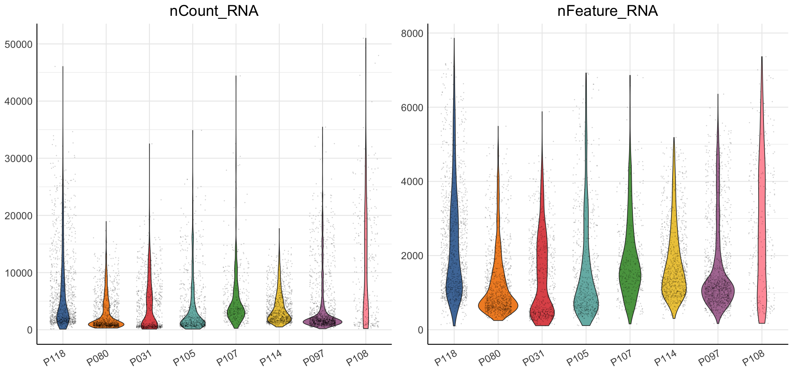
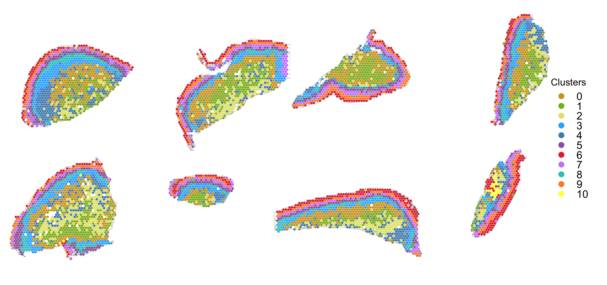

Supplemental Figure 1
================
11/13/24

### Load data and libraries

``` r
##################
# LOAD LIBRARIES #
##################
library(tidyverse)
library(Seurat)
library(SeuratObject)
library(tidyseurat)
library(cowplot)
library(ggrepel)
library(png)
library(grid)

source("../../bin/spatial_visualization.R")
source("../../bin/plotting_functions.R")

#########
# PATHS #
#########
input_dir <- "../../results/04_deconvolution_st_data/"
result_dir <- "../../results/09_figures/"
if( isFALSE(dir.exists(result_dir)) ) { dir.create(result_dir,recursive = TRUE) }
epi_clus <- "^5$|^6$|^7|^9" # non-filt

#############
# LOAD DATA #
#############
DATA <- readRDS(paste0(input_dir,"seuratObj_deconvolution_scdc.RDS"))

#################
# COLOUR PALLET #
#################
sample_id <- c("P118", "P080", "P031", "P105", "P107", "P114", "P097", "P108")
friendly_cols <- c("#4E79A7", "#F28E2B", "#E15759", "#76B7B2", "#59A14F", "#EDC948", "#B07AA1", "#FF9DA7", "#9C755F", "#BAB0AC") 
```

``` r
################################
# VIOLIN PLOT AFTER FILTERING #
################################
# dev.new(width=7, height=3.3, noRStudioGD = TRUE)
DAT <- DATA %>% mutate(orig.ident = factor(.$orig.ident, levels = sample_id))

feature <-  c("nCount_RNA", "nFeature_RNA")
A <-  map(feature, ~violin.fun(DAT, feature=.x, 
                               fill="orig.ident", 
                               col_pal=friendly_cols, 
                               n=1, txt_size=8, dot_size=.02))
(A <- plot_grid(plotlist=A, nrow = 1, byrow = F))
```



``` r
DATA@misc$cell_annot %>% 
  mutate(cell_annot_1 = ifelse(.$cell_annot_1 == "Epithelial", "Keratinocyte", .$cell_annot_1)) %>%
  {. ->> DATA@misc$cell_annot }
```

``` r
colors <- c( "#CD9600", "#7CAE00", "#e0e067", "#00A9FF", "#377EB8","#984EA3", "#E41A1C", "#C77CFF",
             "#00BFC4", "#FF7F00","#FFFF33")
clus_n <- 0:10
colors <- set_names(colors, clus_n)

C <- DATA %>%
  #mutate(Clusters = as.character(.$Clusters)) %>%
  plot_spatial.fun( .,
                 geneid = "Clusters",
                 sampleid = c("P118", "P080","P031", "P105", "P097","P108", "P114", "P107"),
                 save_space = T,
                 lab = F,
                 zoom = "zoom",
                 col = colors,
                 alpha = .9,
                 ncol = 4, 
                 #annot_col = "#dbd9d9",
                 annot_line = .1,
                 img_alpha = 0,
                 point_size = .7) + 
  theme(legend.box.margin=margin(0,30,-0,-30)) # moves the legend)
  
C
```



``` r
# dev.new(height=3.3, width=7, noRStudioGD = TRUE)
# ggsave("./Figures/S1/clusters_on_tissue.pdf", clus, width = 7, height = 3.3, dpi = 500, bg = "white")
```

### Plot deconvolution cell proportion on tissue

``` r
#################################
# CELL TYPE PROPORTION PER SPOT #
#################################
col <- c("#FFD92F","#8DA0CB","#FC8D62","#66C2A5","#E78AC3","#A6D854","#377EB8","#eb6062","#4DAF4A","#984EA3","#B3B3B3","#E5C494","#FF7F00","#FFFF33","#A65628","#F781BF") # "#E5C494"
cell_type <- c("B cell", "T cell", "Keratinocyte","Endothelial","Fibroblast", "Myeloid", "Granulocyte", "NK cells","Lymphatics", "ILC", "Unknown") # "Smooth muscle"
cell_col <- set_names(col[1:length(cell_type)], cell_type)

DefaultAssay(DATA) <- "RNA"

(D <- DATA %>%
  plot_cell_pie.fun(.,
                   assay = "RNA",
                   ct.res = "cell_annot_1",
                   ct.select = cell_type, 
                   radius_adj = 3,
                   zoom = "zoom",
                   col = cell_col,
                   alpha = 1,
                   ncol = 4,
                   #annot_col = "#dbd9d9",
                   annot_line = .2,
                   img_alpha = 0)  + 
   guides(fill = guide_legend(keyheight = .7, keywidth = .7)) +
   theme(legend.box.margin=margin(0,25,-0,-20), # moves the legend)
         legend.title = element_blank()) )# moves the legend)
```


``` r
# dev.new(height=3.3, width=7, noRStudioGD = TRUE)
# ggsave("./Figures/S1/cell_prop_tissue.pdf", plot, width = 7, height = 3.3, dpi = 500, bg = "white")
```

``` r
#############################
# COMBINE ALL FIGURE PANELS #
#############################
# dev.new(width=7, height=8, noRStudioGD = TRUE)
A_B <- plot_grid(A, NA, rel_widths = c(1,.4), labels = c('a', 'b'))
Figure_S1 <- plot_grid( A_B, NA, C, NA, D, ncol=1, rel_heights = c(1,.3,.9,.2,.9), labels = c(NA, NA, 'c', NA, 'd')) 
ggsave("./Figures/Figure-3.pdf", Figure_S1, width = 7, height = 8, bg = "white", dpi = 1000)

Figure_S1
```


