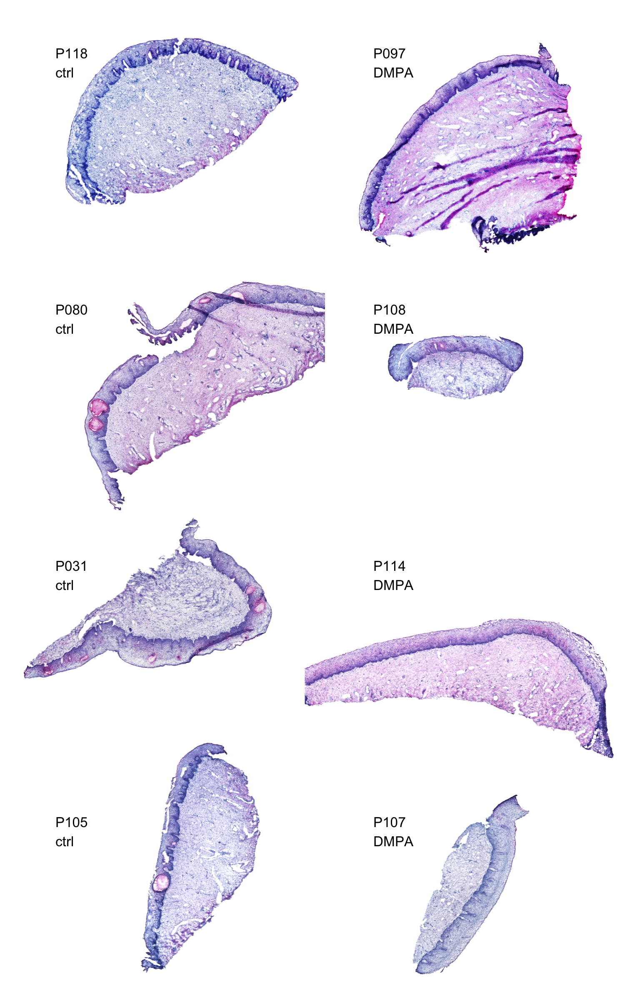
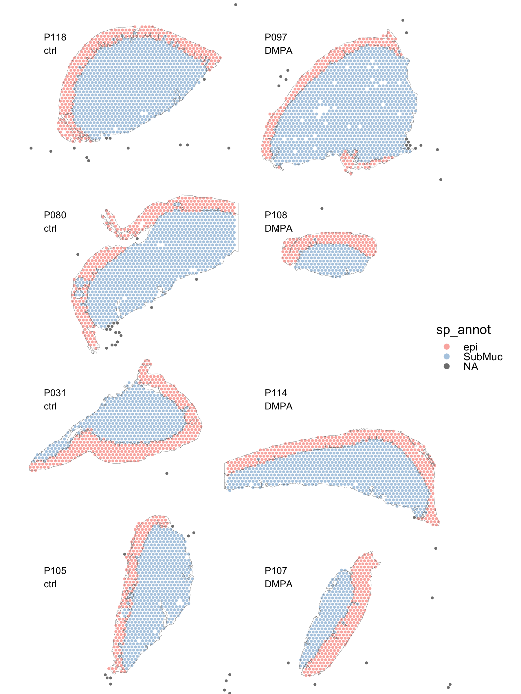
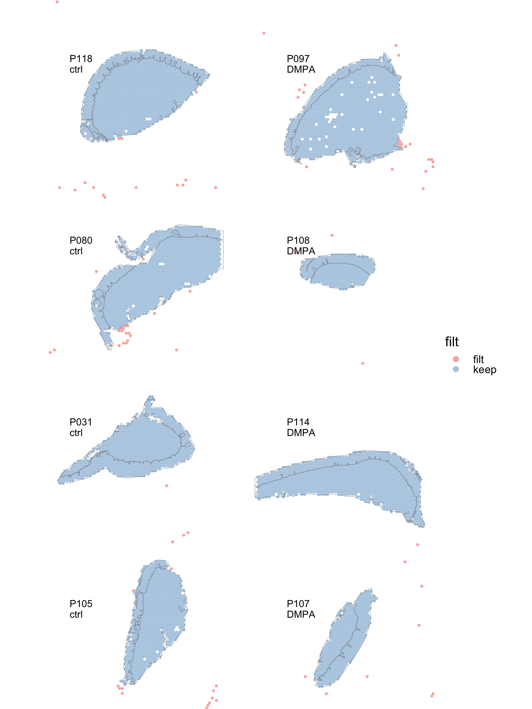

Load Spatial data
================
4/9/24

### Load libraries

``` r
##################
# LOAD LIBRARIES #
##################
library(tidyverse)
library(tidyseurat)
library(Seurat)
library(hdf5r)
# remotes::install_github("czarnewski/niceRplots",force=T)
library(niceRplots)

library(xml2) # loads the image 
library(sp)
library(terra)

source("../bin/help_functions.R")
source("../bin/spatial_visualization.R")

#################
# COLOR PALETTS #
#################
pal <- rep(c(RColorBrewer::brewer.pal(9,"Set1"),
         RColorBrewer::brewer.pal(9,"Pastel1"),
         RColorBrewer::brewer.pal(8,"Accent"),
         RColorBrewer::brewer.pal(8,"Set2"),
         RColorBrewer::brewer.pal(8,"Pastel2") ,
         scales::hue_pal()(8)),99)
```

### Load Visium data

``` r
#########
# PATHS #
#########
input_dir <- "../data/spatial_data"
result_dir <- "../results/00_load_st_data/"
if( isFALSE(dir.exists(result_dir)) ) { dir.create(result_dir,recursive = TRUE) }

#############
# LODA DATA #
#############
meta <- read_csv("../data/Clinical_data/Clinical_data_Spatial_DMPA.csv")
h5_files <- list.dirs(path = input_dir,
                      full.names = T, recursive = T) %>%
            grep("P\\d\\d\\d$", ., value = TRUE) %>%
            set_names(., str_extract(., "P\\d\\d\\d$"))

# h5_files <- h5_files[names(h5_files) %in% sample_id]
# the new version of seurat v5 does not allow to read in any other than low res img
# to circumvent this rename the higres to low res and move the lowres file
image <- map(h5_files, 
             ~Read10X_Image(
               filter.matrix = T,
               image.dir = paste0(.x, "/spatial"),
               image.name = "tissue_lowres_image.png"))

# Read in h5 files and create Seurat Object
seuratObj_list <- pmap(list(h5_files, image, names(h5_files)),
                       ~Load10X_Spatial(
                         filename = "filtered_feature_bc_matrix.h5",
                         filter.matrix = T,
                         assay = "RNA",
                         data.dir = ..1,
                         image =  ..2,
                         slice = ..3)) 

sample_id <- c("P118", "P080", "P031", "P105", "P097", "P108", "P114", "P107") %>% set_names()
```

### Tidy up the seurat object

``` r
####################################
# RENAME SAMPLES, SPOTS AND IMAGES #
####################################
seuratObj_list <- seuratObj_list %>%
  imap(., ~AddMetaData(object = .x, 
                       metadata = rep(.y, length(Idents(.x))), 
                       col.name = "orig.ident")) %>%
  map(.,  ~SetIdent(., value = .@meta.data$orig.ident)) %>%
  imap(., ~RenameCells(.x, 
                      new.names = paste0(.y,"_", gsub("-.*","",colnames(.x[["RNA"]])))) ) %>%
  imap(., ~ {.x@images <- set_names(.@images,.y); .x})

##################
# MERGE SAMPLES #
#################
# Merge datasets into one single seurat object

DATA  <- merge(seuratObj_list[[1]], y = seuratObj_list[2:length(seuratObj_list)])
# DATA <- JoinLayers(DATA) # Seurat version 5.0
```

### Load morphology annotation

``` r
##########################
# ADD MANUAL ANNOTATION #
#########################
# scale.factors <- map(DATA@images, ~pluck(.x, "scale.factors")$hires)
# img_coord <- map(DATA@images, ~pluck(.x, "coordinates"))
#   
# img_coord <- img_coord %>%
#   map2(., scale.factors, 
#        ~mutate(.x, imagecol = .$imagecol * .y,
#                    imagerow = .$imagerow * .y) )
  
a2 <- map(sample_id, ~xml2::as_list( read_xml( paste0( input_dir,"/",.x,"/",.x,".svg")) ) )
dd <- map(a2, ~as.numeric( strsplit( attributes(.x$svg)$viewBox , " ")[[1]] ))
dd2 <- map(sample_id, ~dim(DATA@images[[.x]]@image))

# sample_id <- "P097"
# a2 <- a2[["P097"]]
# dd <- dd[["P097"]]
# dd2 <- dd2[["P097"]]

# add image coordinates to the seurat object
get_img_coord <- function(DATA, sample_id){
  img_coord <- DATA@images[[sample_id]]@coordinates
  DATA@images[[sample_id]]@coordinates <<- img_coord 
}

# add manual spatial annotation
get_sp_annot <- function(a2, dd, dd2, sample_id){
  scale.factor <- DATA@images[[sample_id]]@scale.factors$hires
  img_coord <- DATA@images[[sample_id]]@coordinates
  
  id <- a2$svg %>%
    map_chr(., ~attr(.x,"id")) %>% 
    set_names(seq_along(.), .)
  
  annot_coord <- id %>%
    map(., ~get_shape(a2$svg[[.x]]) ) %>%
    map(., ~as_tibble(.x, .name_repair="unique"))  %>%
    # convert the view box from the svg to the pixel dimensions of the raster img:
    map(., ~mutate(.x, x = .x[[1]]*dd2[2]/dd[3],
                       y = .x[[2]]*dd2[1]/dd[4] )) %>%
    map(., ~rowid_to_column(., var = "path_idx")) %>%
    {. ->>  temp} %>%
    bind_rows(., .id="name") %>%
    group_by(., name) %>%
    mutate(elem_idx = cur_group_id()) %>% # group_indices(., name)
    ungroup() %>%
    mutate(colour = ifelse(grepl("fov|zoom|full_image",.$name),
                           "transparent", "black")) %>%
    list(.) %>%
    set_names(., sample_id[1])
  
  DATA@tools <<- append(DATA@tools, annot_coord )
  
  img_coord <- temp %>%
    list_modify("fov" = NULL, "full_image" = NULL, "zoom" = NULL) %>%
    compact() %>%
    imap(., ~mutate(img_coord, !!.y := sp::point.in.polygon(
         point.x = img_coord$imagecol*scale.factor,
         point.y = img_coord$imagerow*scale.factor,
         pol.x = .x$x,
         pol.y = .x$y )) ) %>%
    map(., ~select(.x, last_col())) %>%
    cbind(img_coord, .)
  
  DATA@images[[sample_id]]@coordinates <<- img_coord 
  
  sp_annot <- img_coord %>%
    rownames_to_column(., var = "barcodes") %>%
    mutate(across(7:ncol(.), ~ifelse(. == 0, NA, .)) ) %>%
    pivot_longer(., cols = 7:ncol(.), names_to ="sp_annot", values_to = "count") %>%
    filter(!(is.na(count))) %>%
    group_by(barcodes) %>%
    mutate(dupp = row_number()) %>%
    ungroup() %>%
    filter(., .$dupp == 1) %>%
    select(., barcodes, sp_annot)
  
  #DATA <<- left_join( DATA, sp_annot, by=c(".cell"="barcodes", "sp_annot"="sp_annot")) 
  
  return(list(coord=annot_coord, annot=sp_annot))
}
annot <- list(a2, dd, dd2, names(a2)) %>%
  pmap(., ~get_sp_annot(..1, ..2, ..3, ..4)) %>%
  set_names(., names(a2))

sp <- map(annot, 2) %>% bind_rows()
DATA <- left_join( DATA, sp, by=c(".cell"="barcodes")) 

DATA
```

    # A Seurat-tibble abstraction: 6,700 × 5
    # Features=36601 | Cells=6700 | Active assay=RNA | Assays=RNA
       .cell                 orig.ident nCount_RNA nFeature_RNA sp_annot
       <chr>                 <chr>           <dbl>        <int> <chr>   
     1 P031_AAACGAGACGGTTGAT P031              463          356 SubMuc  
     2 P031_AAACTGCTGGCTCCAA P031             4081         2232 SubMuc  
     3 P031_AAAGTAGCATTGCTCA P031             7595         2588 epi     
     4 P031_AAAGTGTGATTTATCT P031            11394         3873 epi     
     5 P031_AAAGTTGACTCCCGTA P031             4617         2270 epi     
     6 P031_AAATACCTATAAGCAT P031             5538         2507 epi     
     7 P031_AAATCGTGTACCACAA P031             1765         1084 SubMuc  
     8 P031_AAATGGCCCGTGCCCT P031              789          477 <NA>    
     9 P031_AAATTAACGGGTAGCT P031              639          465 SubMuc  
    10 P031_AAATTTGCGGGTGTGG P031             3570         1948 SubMuc  
    # ℹ 6,690 more rows

``` r
# adds a matrix with zeros outside the polygon boundary to DATA@misc$alpha
# when plotting it is added as a 4th dim to the image matrix  
# to specify alpha for each pixel in the image
mask_background.fun <- function(df, im, sampleid){
  # get polygon coordinates for individual polygons:
  df <- df %>%
    select( any_of(c("name","path_idx", "x", "y"))) %>% 
    filter(grepl("epi|SubMuc", .$name)) %>% 
    split(~name) 
  
  # Function to create SpatialPolygons from a dataframe
  createSpatialPolygons <- function(df) {
    # Convert dataframe to SpatialPointsDataFrame
    #coordinates(df) <- c("y","x")
    coordinates(df) <- c("x", "y")
    
    # Order the points based on 'path_idx'
    df <- df[order(df$path_idx, decreasing = F), ]
    #df <- df %>% arrange(desc(path_idx))
    
    # Create a SpatialPolygons object
    poly <- SpatialPolygons(list(Polygons(list(Polygon(df)), ID = df$name[1])))
    
    return(poly)
  }
  
  # Apply the function to each element of the list
  polygons_list <- map(df, ~createSpatialPolygons(.x))
  
  # Combine the SpatialPolygons into a single object
  combined_polygon <- do.call("rbind", polygons_list)
  
  # Convert it to a polygon (SpatVector)
  polygon <- vect(combined_polygon)
  
  # get image matrix and convert to rgb before rasterizing
  img <- matrix(
      rgb(im[,,1],im[,,2],im[,,3], im[4,,]* 1), nrow=dim(im)[1])
  raster <- rast(img)
  
  rasterized <- rasterize(polygon, raster)
  rasterized <- flip(rasterized, direction="vertical")
  
  # Plot the polygon
  # plot(polygon)

  # Crop the raster using the polygon
  cropped_raster <- mask(raster, rasterized, updatevalue=0)
  
  # Plot the cropped raster to verify
  # plot(cropped_raster)

  cropped_raster <- ifel(cropped_raster > 0, 1, cropped_raster)
  
  image_array <- as.array(cropped_raster)[,,1] # keep first dim only 
  #NA_idx <- which(is.na(image_array[,,1]))
  
  # minpulate image matrix
  #im <- replace(im, list = which(image_array != 0)), values = 1)
  DATA@misc$alpha <<- append(DATA@misc$alpha, set_names(list(image_array), sampleid) )
}

walk(sample_id, ~mask_background.fun(DATA@tools[[.x]], DATA@images[[.x]]@image, .x) )
```

``` r
# can identify the boundary of the tissue and use it to crop
# it gives a more pixelated border than when using a hand drawn polygon as in the function
# above "mask_background.fun()"
find_boundary.fun <- function(im){
  img <- matrix(
      rgb(im[,,1],im[,,2],im[,,3], im[4,,]* 1), nrow=dim(im)[1])
  img <- rast(img)
  #plot(img)
  
  i <- im[,,1]+im[,,2]+im[,,3]
  #i <- replace(im[,,1], list = which(im[,,1] > .7), values = 0)

  raster <- rast(i)
  # plot(raster)
  raster <- ifel(raster > 2.9, NA, raster)
  r <- sieve(raster, directions=8, threshold=500)
  # plot(r)
  
  rc2 <- classify(r, matrix(c(0, NA,
                              2, 1,
                              3, 1), ncol=2, byrow=TRUE), 
                  include.lowest=TRUE, brackets=F)
  plot(rc2)
  
  # Extract only the boundary
  bo <- boundaries(rc2, inner=F, classes=T)
  # plot(bo)
  
  # Convert SpatRaster to SpatialPolygonsDataFrame
  boundary_polygon <- as.polygons(bo) 
  # plot(boundary_polygon)
  
  # Crop the raster using the polygon
  cropped_raster <- mask(img, boundary_polygon, updatevalue=NA)
  plot(cropped_raster)
  
  return(boundary_polygon)
}

boundary_polygon <- find_boundary.fun(DATA@images[["P118"]]@image)
```

### Add meta data

``` r
meta <- meta %>%
  select(orig.ident="ID", groups=Contraception) %>%
  mutate(groups = ifelse(.$groups=="no HC", "ctrl", .$groups))

DATA <-  DATA %>%
  mutate(sp_annot2 = .$sp_annot) %>%
  mutate(sp_annot = ifelse(grepl("epi", .$sp_annot2), "epi", 
                           ifelse(grepl("SubMuc", .$sp_annot2), "SubMuc", .$sp_annot2 ))) %>%
  left_join(., meta, by="orig.ident") %>%
  select(groups, sp_annot, everything())
```

``` r
# dev.new(height=8, width=5, noRStudioGD = TRUE)
# dev.new(width=7, height=3.5, noRStudioGD = TRUE)
plot_spatial.fun(DATA, 
      sampleid=sample_id,
      sp_annot = F, 
      alpha = 0,
      geneid = "nFeature_RNA",
      zoom = "zoom",
      ncol = 2,
      annot_line = 1,
      img_alpha = 1,
      point_size = 0) +  theme(legend.position = "none") # theme_nothing() #
```



``` r
# dev.new(height=7, width=6, noRStudioGD = TRUE)
# dev.new(height=3.5, width=8, noRStudioGD = TRUE)
plot_st_meta.fun(DATA,  
          assay="RNA",
          feat = "sp_annot",
          zoom = "zoom",
          ncol = 2,
          annot_line = .1,
          img_alpha = 0,
          point_size = 0.9
        )
```


### Identify spots with missing morphology annotation

``` r
##########################
# SP MANUAL ANNOTATION #
#########################
keep_epi <- c("P097_CTATTTGCTTGGAGGA", "P031_ATAGAGTTATCAACTT", "P031_GCGGAGAGGGAGAACG", "P031_CCTATCTATATCGGAA", "P031_GGATCTTGACTCAACC","P031_GCCCTAGCCGTCGCGA", "P031_AGCTCTTTACTCAGTT", "P031_AGTCAACACCACCATC", "P031_CGAACCCGCATGCGTC", "P080_TCGAGCCAGGCAGGCC", "P080_AACCCGACAACCCGTG","P080_GGCCGTTTGGGTTTCA","P080_CATTTGAGTGGTACGT", "P080_TTGGTCACACTCGTAA", "P080_CGAACCCGCATGCGTC", "P080_TTGCTGATCATGTTCG", "P080_CGAGACCCTAGAGTGT", "P080_CCAGCCTGGACCAATA", "P080_CGCATGGTGCGATGCT", "P080_ATAGACAACGGGACCT", "P080_CTCATTAACGTTGCCC", "P097_CGAGTTCTGTCCCACC", "P097_GTATGAAATTTCACTC", "P097_AGCAACCGAAAGTAAT", "P097_GAAGCCACTGATTATG", "P097_GCACTGCCTACCTTTA", "P097_CACAGCACCCACGGCA", "P097_AGTTTGGCCAGACCTA", "P097_ACAGAACTGAGAACAA", "P097_GCTTTCAGAGGAGGTG", "P107_ACATCCCGGCCATACG", "P107_ACGCAAACTAATAGAT","P107_ACTTGACTCCCTCTTT", "P107_GATCTTGGAGGGCATA", "P105_AAGACTGCAAGCTACT", "P105_ACACGGGAACTTAGGG", "P105_CACATTCTTTCGATGG", "P105_CCCGACCATAGTCCGC", "P105_CCTATGGGTTACCGTC", "P105_CCTCTAATCTGCCAAG", "P105_CGAGGCTAAATATGGC", "P105_CGTTTCACTTCGGGCG", "P105_GCGCTAATTGAATAGA", "P105_GATATGCGGTAGCCAA", "P105_GGCTCTGCTCCAACGC", "P105_GGGCTGCCTAGGGCGA", "P105_GGCTCTGCTCCAACGC", "P105_GGGCTGCCTAGGGCGA", "P105_GGTTTACAATCTCAAT", "P105_TGTGGCGGGCTTCTGG", "P105_TTAATCAGTACGTCAG", "P105_TTCATGGCGCAACAGG", "P105_TTGGGACACTGCCCGC", "P114_ACCTGCGTGTCATGTT", "P114_CAAGGATCGCATGTTC", "P114_AATGTTGTCGTGAGAC", "P108_ATACGCCGGCGAAACC", "P108_CACGTCGGCAACCTCT", "P108_TCGCCGAAGTTGCGTC", "P108_TTGATTAGCTGTTTCT", "P118_AACCCGACAACCCGTG", "P118_TGAGCCATACAGTCTC", "P118_ATGGGACCTGCTGAAC", "P118_AGCTAACAAGCAATGT", "P118_TTGATTAGCTGTTTCT", "P118_CGTGTCTCGTTACGAC", "P118_GATCAACATAAAGGGA", "P118_TAACAGCGTTTGTGCT", "P118_TGAGCCATACAGTCTC", "P118_GATTACTGAATTTGGG", "P118_TCCAACTTTAAATTCT", "P118_CGATCCTCGCAACATA", "P118_AACCCGACAACCCGTG", "P118_TCTCTTACCGCGAACC", "P118_TATGTAAAGTGCTTAA", "P118_GAAGTTTCCACTCAAT", "P118_TAGTCCCGGAGACCAC", "P118_CGGCCAGAGCGACCAT", "P118_ATAAAGGCTCGGTCGT", "P118_TATTCGTGCCAGAATA", "P118_GGGAGTTAATGAGGCG", "P118_CCGGGCGGTCTCGTCA",
"P118_CTAAATCCGGTGTACA") 
keep_SubMuc <- c("P105_TGACATCGAGCGGACC", "P118_GTATCAAACGTTAGCT", "P097_AGGTGGTGACCTTCGC", "P097_AGCCCGGCATTAGAGG", "P031_CTAGTTGGGCCCGGTA","P031_TCTACCGTCCACAAGC", "P031_AAATGGCCCGTGCCCT", "P031_AATCTGGCTTTCTAGT", "P031_AAATGGCCCGTGCCCT", "P031_AATCTGGCTTTCTAGT", "P080_AGGCATTGTCGTAGGG", "P097_GGCAGCAAACCTATGC", "P097_ACAAAGCATGACCTAG", "P097_CCTCCTGTTGTGTCGT", "P097_CGTCGGATAGTGTTGA", "P107_TCTTGATGCGTAGCGA", "P105_ACGATCATCTTGTAAA", "P105_AGATATAATACGACTA", "P105_CTAGGTCTGAAGGAAT", "P114_AAGGGTTTGATTTCAG", "P114_GCACGTGGTTTACTTA", "P114_TAGGCCTATATAGTCT", "P107_TCTTCGATACCAATAA", "P108_GTGCGAAATCGAACAC", "P118_TCGAGACCAACACCGT", "P118_TCGGAGTACATGAGTA", "P118_TATTCAATTCTAATCC", "P118_AGGAGGCCTTCGCGCG",
"P118_ACAATTGTGTCTCTTT", "P118_ACTGAAACGCCGTTAG", "P118_CCCGGGTCGTTCAGGG", "P118_CCCTCCTCGCTCGTAT", "P118_GCGCCTCCCACTCCGA", "P118_GCTAACTGAAGTCTGA",
"P118_TGTGGCGGGCTTCTGG") 

###############################
# IDENTIFY MISSING ANNOTATION #
###############################
df <- map(sample_id, ~pluck(DATA@images, .x, "coordinates")) %>%
  bind_rows() %>%
  #cbind(.,as_tibble(select(DATA, filt))) %>%
  cbind(.,as_tibble(select(DATA, orig.ident))) %>%
  cbind(.,as_tibble(select(DATA, nCount_RNA))) %>%
  cbind(.,as_tibble(select(DATA, nFeature_RNA))) %>%
  cbind(.,as_tibble(select(DATA, sp_annot))) %>%
  rownames_to_column(var = "barcode") %>%
  as_tibble() %>%
  select(-starts_with(c("epi_", "SubMuc_")))

f <- df %>% 
  filter(orig.ident == "P097" & is.na(.$sp_annot)) #%>%
  #filter(orig.ident == "P118" & filt == "keep")

# dev.new(width=10, height=10, noRStudioGD = TRUE)
# dev.new(width=5, height=3, noRStudioGD = TRUE)
# DATA %>%
#   mutate(sp_annot = case_when(colnames(DATA) %in% keep_epi ~ 'epi',
#                               colnames(DATA) %in% keep_SubMuc ~ 'SubMuc',
#                               TRUE ~ .$sp_annot)) %>%
#   mutate(filt = case_when(is.na(.$sp_annot) & nCount_RNA < 500 ~ 'filt',
#                           colnames(DATA) %in% filt ~ 'filt',
#                           TRUE ~ 'keep')) %>%
#   filter(grepl("P097_TAGAATAGCCGATGAA", `.cell`)) %>%
#   plot_st_meta.fun(.,  
#           assay="RNA",
#           feat = "filt",
#           zoom = "full_image",
#           ncol = 2,
#           annot_line = .1,
#           img_alpha = 0,
#           point_size = 1
#         )
```

### Add missing morphology annotation

``` r
# dev.new(width=10, height=10, noRStudioGD = TRUE)
DATA <-  DATA %>%
  mutate(sp_annot = case_when(colnames(DATA) %in% keep_epi ~ 'epi',
                              colnames(DATA) %in% keep_SubMuc ~ 'SubMuc',
                              TRUE ~ .$sp_annot))

DATA %>%
  plot_st_meta.fun(.,  
          assay="RNA",
          feat = "sp_annot",
          zoom = "zoom",
          ncol = 2,
          annot_line = .1,
          img_alpha = 0,
          point_size = 0.8
        )
```



## Plot spots to be removed

``` r
# dev.new(width=10, height=10, noRStudioGD = TRUE)

DATA <-  DATA %>%
  mutate(filt = case_when(is.na(.$sp_annot)  ~ 'filt',
                          TRUE ~ 'keep')) 
DATA %>%
  plot_st_meta.fun(.,  
          assay="RNA",
          feat = "filt",
          zoom = "full_image",
          ncol = 2,
          annot_line = .1,
          img_alpha = 0,
          point_size = .8
        )
```



### Remove NA spots

``` r
dim(DATA)
```

    [1] 36601  6700

``` r
# Filter spots outside manual annotation
DATA <- DATA[, !(is.na(DATA$sp_annot))]
DATA$filt <- NULL

dim(DATA)
```

    [1] 36601  6612

``` r
DATA
```

    # A Seurat-tibble abstraction: 6,612 × 7
    # Features=36601 | Cells=6612 | Active assay=RNA | Assays=RNA
       .cell            groups sp_annot orig.ident nCount_RNA nFeature_RNA sp_annot2
       <chr>            <chr>  <chr>    <chr>           <dbl>        <int> <chr>    
     1 P031_AAACGAGACG… ctrl   SubMuc   P031              463          356 SubMuc   
     2 P031_AAACTGCTGG… ctrl   SubMuc   P031             4081         2232 SubMuc   
     3 P031_AAAGTAGCAT… ctrl   epi      P031             7595         2588 epi      
     4 P031_AAAGTGTGAT… ctrl   epi      P031            11394         3873 epi      
     5 P031_AAAGTTGACT… ctrl   epi      P031             4617         2270 epi      
     6 P031_AAATACCTAT… ctrl   epi      P031             5538         2507 epi      
     7 P031_AAATCGTGTA… ctrl   SubMuc   P031             1765         1084 SubMuc   
     8 P031_AAATGGCCCG… ctrl   SubMuc   P031              789          477 <NA>     
     9 P031_AAATTAACGG… ctrl   SubMuc   P031              639          465 SubMuc   
    10 P031_AAATTTGCGG… ctrl   SubMuc   P031             3570         1948 SubMuc   
    # ℹ 6,602 more rows

``` r
# dev.new(height=7, width=6, noRStudioGD = TRUE)
# dev.new(height=3.5, width=8, noRStudioGD = TRUE)
DATA %>%
  #filter(orig.ident == "P118" | orig.ident == "P097") %>%
  plot_st_meta.fun(.,  
          assay="RNA",
          feat = "sp_annot",
          zoom = "zoom",
          ncol = 2,
          annot_line = .1,
          annot_col = "black",
          img_alpha = 0,
          point_size = 0.8
        )
```


## Save seurat object

``` r
##################################
# SAVE INTERMEDIATE SEURAT OJECT #
##################################
saveRDS(DATA, paste0(result_dir,"seuratObj_merged.RDS"))
# DATA <- readRDS(paste0(result_dir,"seuratObj_merged.RDS")) # seuratObj_merged_seurat_v5.RDS
```

### Session info

``` r
sessionInfo()
```

    R version 4.3.3 (2024-02-29)
    Platform: x86_64-apple-darwin20 (64-bit)
    Running under: macOS Monterey 12.7.3

    Matrix products: default
    BLAS:   /Library/Frameworks/R.framework/Versions/4.3-x86_64/Resources/lib/libRblas.0.dylib 
    LAPACK: /Library/Frameworks/R.framework/Versions/4.3-x86_64/Resources/lib/libRlapack.dylib;  LAPACK version 3.11.0

    locale:
    [1] en_US.UTF-8/en_US.UTF-8/en_US.UTF-8/C/en_US.UTF-8/en_US.UTF-8

    time zone: Europe/Stockholm
    tzcode source: internal

    attached base packages:
    [1] stats     graphics  grDevices utils     datasets  methods   base     

    other attached packages:
     [1] RColorBrewer_1.1-3 terra_1.7-71       xml2_1.3.6         niceRplots_0.1.0  
     [5] hdf5r_1.3.9        Seurat_4.3.0       tidyseurat_0.8.0   SeuratObject_5.0.1
     [9] sp_2.1-3           ttservice_0.4.0    lubridate_1.9.3    forcats_1.0.0     
    [13] stringr_1.5.1      dplyr_1.1.4        purrr_1.0.2        readr_2.1.5       
    [17] tidyr_1.3.1        tibble_3.2.1       ggplot2_3.5.0      tidyverse_2.0.0   

    loaded via a namespace (and not attached):
      [1] rstudioapi_0.15.0      jsonlite_1.8.8         magrittr_2.0.3        
      [4] spatstat.utils_3.0-4   farver_2.1.1           rmarkdown_2.25        
      [7] fs_1.6.3               vctrs_0.6.5            ROCR_1.0-11           
     [10] spatstat.explore_3.2-6 htmltools_0.5.7        sctransform_0.4.1     
     [13] parallelly_1.37.0      KernSmooth_2.23-22     htmlwidgets_1.6.4     
     [16] ica_1.0-3              plyr_1.8.9             plotly_4.10.4         
     [19] zoo_1.8-12             igraph_2.0.2           mime_0.12             
     [22] lifecycle_1.0.4        pkgconfig_2.0.3        Matrix_1.6-5          
     [25] R6_2.5.1               fastmap_1.1.1          fitdistrplus_1.1-11   
     [28] future_1.33.1          shiny_1.8.0            digest_0.6.34         
     [31] colorspace_2.1-0       patchwork_1.2.0        tensor_1.5            
     [34] irlba_2.3.5.1          labeling_0.4.3         progressr_0.14.0      
     [37] fansi_1.0.6            spatstat.sparse_3.0-3  timechange_0.3.0      
     [40] httr_1.4.7             polyclip_1.10-6        abind_1.4-5           
     [43] compiler_4.3.3         bit64_4.0.5            withr_3.0.0           
     [46] MASS_7.3-60.0.1        tools_4.3.3            lmtest_0.9-40         
     [49] httpuv_1.6.14          future.apply_1.11.1    goftest_1.2-3         
     [52] glue_1.7.0             nlme_3.1-164           promises_1.2.1        
     [55] grid_4.3.3             Rtsne_0.17             cluster_2.1.6         
     [58] reshape2_1.4.4         generics_0.1.3         gtable_0.3.4          
     [61] spatstat.data_3.0-4    tzdb_0.4.0             data.table_1.15.0     
     [64] hms_1.1.3              utf8_1.2.4             spatstat.geom_3.2-8   
     [67] RcppAnnoy_0.0.22       ggrepel_0.9.5          RANN_2.6.1            
     [70] pillar_1.9.0           vroom_1.6.5            spam_2.10-0           
     [73] later_1.3.2            splines_4.3.3          lattice_0.22-5        
     [76] survival_3.5-8         bit_4.0.5              deldir_2.0-2          
     [79] tidyselect_1.2.0       miniUI_0.1.1.1         pbapply_1.7-2         
     [82] knitr_1.45             gridExtra_2.3          scattermore_1.2       
     [85] xfun_0.42              matrixStats_1.2.0      stringi_1.8.3         
     [88] lazyeval_0.2.2         yaml_2.3.8             evaluate_0.23         
     [91] codetools_0.2-19       cli_3.6.2              uwot_0.1.16           
     [94] xtable_1.8-4           reticulate_1.35.0      munsell_0.5.0         
     [97] Rcpp_1.0.12            globals_0.16.2         spatstat.random_3.2-2 
    [100] png_0.1-8              parallel_4.3.3         ellipsis_0.3.2        
    [103] dotCall64_1.1-1        listenv_0.9.1          viridisLite_0.4.2     
    [106] scales_1.3.0           ggridges_0.5.6         crayon_1.5.2          
    [109] leiden_0.4.3.1         rlang_1.1.3            cowplot_1.1.3         
