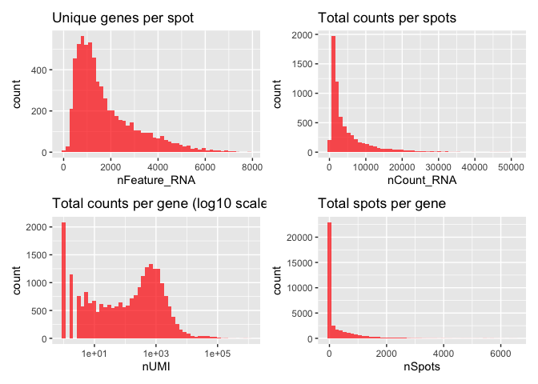
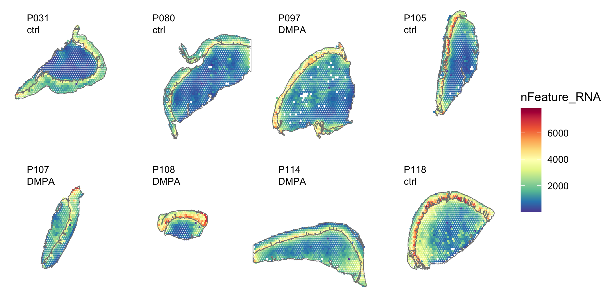
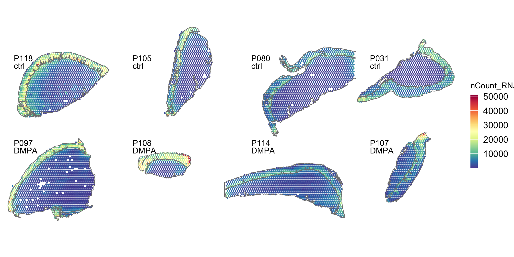
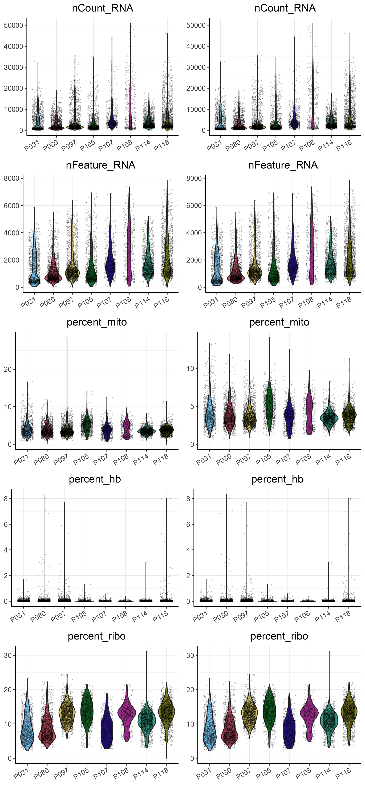
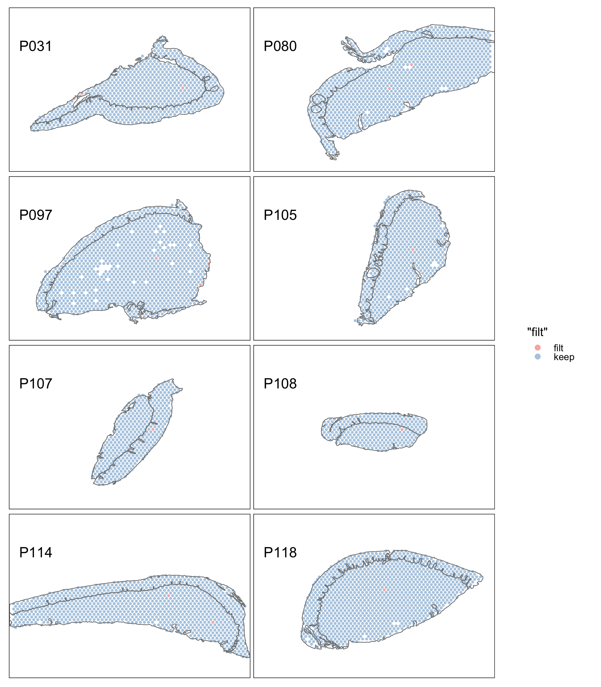
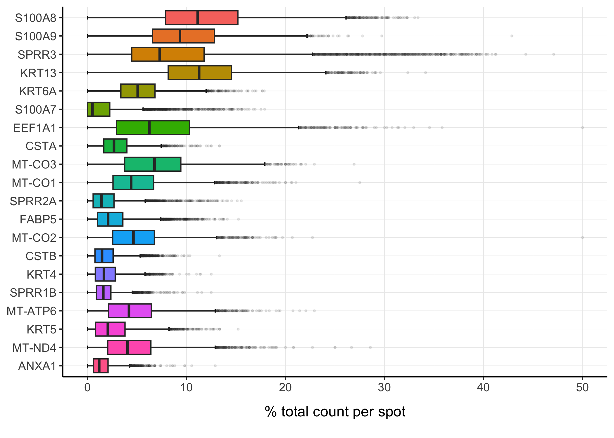

Quality Control Spatial data
================
4/9/24

### Load packages

``` r
##################
# LOAD LIBRARIES #
##################
library(tidyverse)
library(tidyseurat)
library(Seurat)
library(SeuratObject)
library(broom)
library(RColorBrewer)
library(cowplot)
library(patchwork)
# remotes::install_github("czarnewski/niceRplots",force=T)
library(niceRplots)

source("../bin/spatial_visualization.R")
```

### Load ST data

``` r
#########
# PATHS #
#########
input_dir <- "../results/00_load_st_data/"
result_dir <- "../results/01_QC_st_data/"
if( isFALSE(dir.exists(result_dir)) ) { dir.create(result_dir,recursive = TRUE) }

#############
# LODA DATA #
#############
#metadata <- read_csv("../data/Clinincal_data_Spatial_DMPA.csv")
DATA <- readRDS(paste0(input_dir,"seuratObj_merged.RDS"))
sample_id <- c("P118", "P105", "P080", "P031", "P097", "P108", "P114", "P107") %>% set_names()

#################
# COLOUR PALLET #
#################
friendly_cols <- c("#4E79A7", "#F28E2B", "#E15759", "#76B7B2", "#59A14F", "#EDC948", "#B07AA1", "#FF9DA7", "#9C755F", "#BAB0AC") 
```

``` r
###########################################
# QUALITY CONTROLL FEATURE & COUNTS PLOTS #
###########################################
p1 <- ggplot() +
  geom_histogram(data = DATA@meta.data, aes(nFeature_RNA), fill = "red", alpha = 0.7, bins = 50) +
  ggtitle("Unique genes per spot") 

p2 <- ggplot() +
  geom_histogram(data = DATA@meta.data, aes(nCount_RNA), fill = "red", alpha = 0.7, bins = 50) +
  ggtitle("Total counts per spots")

gene_attr <- data.frame(nUMI = Matrix::rowSums(assay_count), 
                        nSpots = Matrix::rowSums(assay_count > 0))

p3 <- ggplot() +
  geom_histogram(data = gene_attr, aes(nUMI), fill = "red", alpha = 0.7, bins = 50) +
  scale_x_log10() +
  ggtitle("Total counts per gene (log10 scale)")

p4 <- ggplot() +
  geom_histogram(data = gene_attr, aes(nSpots), fill = "red", alpha = 0.7,  bins = 50) +
  ggtitle("Total spots per gene")

plot_grid(ncol = 1, 
          p1 + p2 + p3 + p4)
```



### Add QC features to DATA

``` r
################################
# CALC. % MITO/RIBO/HEMO-GENES #
################################
DATA <- PercentageFeatureSet(DATA, "^MT-", col.name = "percent_mito")
DATA <- PercentageFeatureSet(DATA, "^HB[^(P)]", col.name = "percent_hb")
DATA <- PercentageFeatureSet(DATA, "^RP[SL]", col.name = "percent_ribo")
```

### Summary stats before filtering

``` r
#################
# SUMMARY STATS #
#################
feature <-  c("nCount_RNA", "nFeature_RNA","percent_mito","percent_hb", "percent_ribo")
sapply(DATA@meta.data[feature], summary) %>% 
  as_tibble(rownames = "stat") %>% 
  knitr::kable(digits = 1)
```

| stat    | nCount_RNA | nFeature_RNA | percent_mito | percent_hb | percent_ribo |
|:--------|-----------:|-------------:|-------------:|-----------:|-------------:|
| Min.    |        7.0 |          7.0 |          0.0 |        0.0 |          0.0 |
| 1st Qu. |     1267.5 |        838.0 |          2.9 |        0.0 |          8.4 |
| Median  |     2465.5 |       1355.0 |          3.6 |        0.0 |         11.4 |
| Mean    |     4866.6 |       1797.7 |          3.9 |        0.1 |         11.2 |
| 3rd Qu. |     6199.0 |       2430.2 |          4.6 |        0.0 |         13.9 |
| Max.    |    51014.0 |       7865.0 |         28.6 |        8.3 |         31.2 |

### Plot feature data on the tissue sections

``` r
# dev.new(width=7, height=3.5, noRStudioGD = TRUE)
# percentage of mitochondria
(plots_m <- DATA %>%
  plot_spatial.fun(., 
      sampleid = sample_id,
      geneid = "percent_mito",
      zoom = "zoom",
      ncol = 4,
      img_alpha = 0,
      point_size = .5)
    )
```


``` r
# number of genes per spot
(plots_f <- DATA %>%
  plot_spatial.fun(., 
      sampleid = sample_id,
      geneid = "nFeature_RNA",
      zoom = "zoom",
      ncol = 4,
      img_alpha = 0,
      point_size = .5)
    )
```



``` r
# number of reads per spot
(plots_c <- DATA %>%
  plot_spatial.fun(., 
      sampleid = sample_id,
      geneid = "nCount_RNA",
      zoom = "zoom",
      ncol = 4,
      img_alpha = 0,
      point_size = .5)
    )
```



## Filtering

Select all spots with less than 15% mitochondrial reads, less than 10%
hb-reads and 100 detected genes.<br/> Filter genes present in less than
2 spots and remove hemoglobin and MALAT1 genes.

``` r
##########################
# FILTER GENES AND CELLS #
##########################
# filter genes present in less than 2 spots:
filt_low_genes <- function(x, n_cell = 2) x[rowSums(x) >= n_cell]
# remove specified genes:
remove_genes <- function(x, gene_name) x[!(grepl(gene_name, rownames(x[["RNA"]]))), ]
# identify transcripts within the 0.005 percentile:
percentile <- function(x, nF) between(nF,quantile(nF,probs = c(0.005)), quantile(nF,probs = c(0.995)))


DATA <- DATA %>%
  # filter out spots with less than 100 genes and more than 15% mt and 10% hb:
  mutate(filt = case_when(nFeature_RNA < 100 ~ 'filt',
                          percent_mito > 15 ~ 'filt',
                          percent_hb > 10 ~ 'filt',
                              TRUE ~ "keep")) %>%
  mutate(orig.ident = factor(.$orig.ident, levels = sample_id)) %>%
  {. ->> temp } %>%
  #filter(., percentile(., .$nFeature_RNA)) %>%
  filter(filt == "keep") %>%
  filt_low_genes(., n_cell = 2) %>%
  remove_genes(., "MALAT1|^HB[^(P)]") %>% # "^MT-|MALAT1|^HB[^(P)]"
  select(-filt)
```

### Summary stats after filtering

Dimension of DATA before filtering, genes: 36601, spots: 6612<br/>
Dimension of DATA after filtering, genes: 22026, spots: 6598

``` r
###########################
# SUMMARY STATS ALL SPOTS #
###########################
feature <-  c("nCount_RNA", "nFeature_RNA","percent_mito","percent_hb", "percent_ribo")
sapply(DATA@meta.data[feature], summary) %>% 
  as_tibble(rownames = "stat") %>% 
  knitr::kable(digits = 1)
```

| stat    | nCount_RNA | nFeature_RNA | percent_mito | percent_hb | percent_ribo |
|:--------|-----------:|-------------:|-------------:|-----------:|-------------:|
| Min.    |      111.0 |        104.0 |          0.7 |        0.0 |          2.1 |
| 1st Qu. |     1221.2 |        840.2 |          2.9 |        0.0 |          8.4 |
| Median  |     2423.5 |       1355.0 |          3.6 |        0.0 |         11.4 |
| Mean    |     4836.2 |       1799.4 |          3.9 |        0.1 |         11.2 |
| 3rd Qu. |     6181.0 |       2429.0 |          4.6 |        0.0 |         13.9 |
| Max.    |    50999.0 |       7860.0 |         14.1 |        8.3 |         31.2 |

``` r
#########################
# SUMMARY STATS GROUPS #
#########################
DATA@meta.data %>%
  split(.$groups, drop = T) %>% 
  map(., ~.x %>%
        select(., any_of(feature[1:2])) %>%
        map(~tidy(summary(.x))) %>%
        bind_rows(.id = "stat")
        #tibble(.x, .name_repair="unique")
      ) %>%
  bind_rows(., .id = "groups") %>%
  arrange(stat) %>%
  knitr::kable(digits = 1)
```

| groups | stat         | minimum |   q1 | median |   mean |   q3 | maximum |
|:-------|:-------------|--------:|-----:|-------:|-------:|-----:|--------:|
| ctrl   | nCount_RNA   |     111 |  974 |   2279 | 4743.0 | 6458 |   46060 |
| DMPA   | nCount_RNA   |     183 | 1497 |   2585 | 4952.7 | 5749 |   50999 |
| ctrl   | nFeature_RNA |     104 |  708 |   1276 | 1735.3 | 2420 |    7860 |
| DMPA   | nFeature_RNA |     158 |  993 |   1422 | 1879.5 | 2453 |    7363 |

### Plotting QC before and after filtering

``` r
# dev.new(width=6, height=5, noRStudioGD = TRUE)
################################
# VIOLIN PLOT BEFORE FILTERING #
################################
feature <-  c("nCount_RNA", "nFeature_RNA","percent_mito","percent_hb", "percent_ribo")
p_ <-  map(feature, ~violin.fun(temp, feature=.x, fill="orig.ident", col_pal=friendly_cols, txt_size=20))
# plot_grid(plotlist=p_, ncol = 1)

################################
# VIOLIN PLOT AFTER FILTERING #
################################
p <-  map(feature, ~violin.fun(DATA, feature=.x, fill="orig.ident", col_pal=friendly_cols, n=1, txt_size=20))
plot_grid(plotlist=c(p_, p), nrow = 5, byrow = F)
```



### Filtered spots

``` r
temp %>%
  filter(filt == "filt") %>%
  arrange(nFeature_RNA) %>%
  as_tibble() %>%
  select(-sp_annot2) %>%
  knitr::kable(digits = 1)
```

| .cell                 | groups | sp_annot | orig.ident | nCount_RNA | nFeature_RNA | percent_mito | percent_hb | percent_ribo | filt |
|:----------------------|:-------|:---------|:-----------|-----------:|-------------:|-------------:|-----------:|-------------:|:-----|
| P031_AGAAGAGCGCCGTTCC | ctrl   | SubMuc   | P031       |         30 |           29 |          3.3 |        0.0 |         10.0 | filt |
| P031_AGATACCGGTGTTCAC | ctrl   | SubMuc   | P031       |        790 |          439 |         15.6 |        0.0 |         13.0 | filt |
| P031_GTGCCATCACACGGTG | ctrl   | SubMuc   | P031       |       1136 |          566 |         16.6 |        0.1 |         12.3 | filt |
| P080_AGAAGAGCGCCGTTCC | ctrl   | SubMuc   | P080       |         48 |           39 |          2.1 |        0.0 |          8.3 | filt |
| P080_TCGTGTACTATGGATG | ctrl   | SubMuc   | P080       |         17 |           17 |          0.0 |        0.0 |          5.9 | filt |
| P097_GCATCGGCCGTGTAGG | DMPA   | SubMuc   | P097       |         30 |           29 |          3.3 |        0.0 |         10.0 | filt |
| P097_TCGCGTAGCAGTGTCC | DMPA   | SubMuc   | P097       |          7 |            7 |         28.6 |        0.0 |         14.3 | filt |
| P097_TCGTGTACTATGGATG | DMPA   | SubMuc   | P097       |         88 |           82 |          3.4 |        0.0 |          8.0 | filt |
| P105_AGAAGAGCGCCGTTCC | ctrl   | SubMuc   | P105       |         63 |           62 |         11.1 |        0.0 |         19.0 | filt |
| P107_CATGGTAAGTAGCGTT | DMPA   | epi      | P107       |         63 |           59 |          4.8 |        0.0 |         15.9 | filt |
| P108_CATGGTAAGTAGCGTT | DMPA   | SubMuc   | P108       |         88 |           82 |          2.3 |        0.0 |         17.0 | filt |
| P114_TCGCGTAGCAGTGTCC | DMPA   | SubMuc   | P114       |         41 |           38 |          2.4 |        0.0 |         19.5 | filt |
| P114_TCGTGTACTATGGATG | DMPA   | SubMuc   | P114       |         58 |           56 |          6.9 |        0.0 |         13.8 | filt |
| P118_CATGGTAAGTAGCGTT | ctrl   | SubMuc   | P118       |         14 |           13 |          0.0 |        0.0 |          0.0 | filt |

### Plot filtered spots

``` r
# dev.new(width=7, height=3.5, noRStudioGD = TRUE)
(plots <- temp %>%
  plot_spatial.fun(., 
      sampleid = sample_id,
      geneid = "filt",
      zoom = "zoom",
      ncol = 4,
      img_alpha = 0,
      point_size = 0.5)
    )
```



### Plot top expressed genes

``` r
#############################
# GET TOP 20 ABUNDANT GENES #
#############################
top_genes <- assay_count %>%
  Matrix::rowSums(.) %>%
  sort(., decreasing = T) %>%
  .[1:20]

percent.fun <- function(df, sample_name, gene, count){
  sample_name <- enquo(sample_name)
  gene <- enquo(gene)
  count <- enquo(count)

  percent <- df %>%
    select(!!sample_name, !!gene, !!count) %>%
    group_by(!!sample_name) %>%
    mutate(Percent = (!!count/sum(!!count)*100)) %>%
    select(-!!count) %>%
    ungroup() 
  
  return(percent$Percent)
}
col = (scales::hue_pal())(20)[20:1]

##################
# PLOT TOP GENES #
##################
(genes_plot <- DATA %>%
   join_features(features = names(top_genes) ) %>%
   mutate(.feature = factor(.feature, levels = rev(names(top_genes)))) %>%
   mutate("% total count per spot" = percent.fun(., .cell, .feature, .abundance_RNA),
          .after=.abundance_RNA) %>%
   ggplot(aes(y=`% total count per spot`, x=.feature, fill=.feature)) +
   stat_boxplot(geom = "errorbar", width = 0.2) +
   geom_boxplot(outlier.alpha = 0.1, outlier.size = .5) +
   scale_fill_manual(values = col) + my_theme +
   theme(plot.title = element_text(hjust = 0.5),
         axis.title.y = element_blank()) +
   NoLegend() + coord_flip() )
```



## Save seurat object

``` r
##################################
# SAVE INTERMEDIATE SEURAT OJECT #
##################################
saveRDS(DATA, paste0(result_dir,"seuratObj_filtered.RDS"))
# saveRDS(DATA, paste0(result_dir,"seuratObjV5_filtered.RDS"))
# DATA <- readRDS(paste0(result_dir,"seuratObj_filtered.RDS"))
```

### Session info

``` r
sessionInfo()
```

    R version 4.3.3 (2024-02-29)
    Platform: x86_64-apple-darwin20 (64-bit)
    Running under: macOS Monterey 12.7.3

    Matrix products: default
    BLAS:   /Library/Frameworks/R.framework/Versions/4.3-x86_64/Resources/lib/libRblas.0.dylib 
    LAPACK: /Library/Frameworks/R.framework/Versions/4.3-x86_64/Resources/lib/libRlapack.dylib;  LAPACK version 3.11.0

    locale:
    [1] en_US.UTF-8/en_US.UTF-8/en_US.UTF-8/C/en_US.UTF-8/en_US.UTF-8

    time zone: Europe/Stockholm
    tzcode source: internal

    attached base packages:
    [1] stats     graphics  grDevices utils     datasets  methods   base     

    other attached packages:
     [1] niceRplots_0.1.0   patchwork_1.2.0    cowplot_1.1.3      RColorBrewer_1.1-3
     [5] broom_1.0.5        Seurat_4.3.0       tidyseurat_0.8.0   SeuratObject_5.0.1
     [9] sp_2.1-3           ttservice_0.4.0    lubridate_1.9.3    forcats_1.0.0     
    [13] stringr_1.5.1      dplyr_1.1.4        purrr_1.0.2        readr_2.1.5       
    [17] tidyr_1.3.1        tibble_3.2.1       ggplot2_3.5.0      tidyverse_2.0.0   

    loaded via a namespace (and not attached):
      [1] deldir_2.0-2           pbapply_1.7-2          gridExtra_2.3         
      [4] rlang_1.1.3            magrittr_2.0.3         RcppAnnoy_0.0.22      
      [7] spatstat.geom_3.2-8    matrixStats_1.2.0      ggridges_0.5.6        
     [10] compiler_4.3.3         reshape2_1.4.4         png_0.1-8             
     [13] vctrs_0.6.5            pkgconfig_2.0.3        fastmap_1.1.1         
     [16] backports_1.4.1        ellipsis_0.3.2         labeling_0.4.3        
     [19] utf8_1.2.4             promises_1.2.1         rmarkdown_2.25        
     [22] tzdb_0.4.0             xfun_0.42              jsonlite_1.8.8        
     [25] goftest_1.2-3          later_1.3.2            spatstat.utils_3.0-4  
     [28] irlba_2.3.5.1          parallel_4.3.3         cluster_2.1.6         
     [31] R6_2.5.1               ica_1.0-3              spatstat.data_3.0-4   
     [34] stringi_1.8.3          reticulate_1.35.0      parallelly_1.37.0     
     [37] lmtest_0.9-40          scattermore_1.2        Rcpp_1.0.12           
     [40] knitr_1.45             tensor_1.5             future.apply_1.11.1   
     [43] zoo_1.8-12             sctransform_0.4.1      httpuv_1.6.14         
     [46] Matrix_1.6-5           splines_4.3.3          igraph_2.0.2          
     [49] timechange_0.3.0       tidyselect_1.2.0       abind_1.4-5           
     [52] rstudioapi_0.15.0      yaml_2.3.8             spatstat.random_3.2-2 
     [55] spatstat.explore_3.2-6 codetools_0.2-19       miniUI_0.1.1.1        
     [58] listenv_0.9.1          plyr_1.8.9             lattice_0.22-5        
     [61] shiny_1.8.0            withr_3.0.0            ROCR_1.0-11           
     [64] evaluate_0.23          Rtsne_0.17             future_1.33.1         
     [67] survival_3.5-8         polyclip_1.10-6        fitdistrplus_1.1-11   
     [70] pillar_1.9.0           KernSmooth_2.23-22     plotly_4.10.4         
     [73] generics_0.1.3         hms_1.1.3              munsell_0.5.0         
     [76] scales_1.3.0           globals_0.16.2         xtable_1.8-4          
     [79] glue_1.7.0             lazyeval_0.2.2         tools_4.3.3           
     [82] data.table_1.15.0      RANN_2.6.1             fs_1.6.3              
     [85] leiden_0.4.3.1         dotCall64_1.1-1        grid_4.3.3            
     [88] colorspace_2.1-0       nlme_3.1-164           cli_3.6.2             
     [91] spatstat.sparse_3.0-3  spam_2.10-0            fansi_1.0.6           
     [94] viridisLite_0.4.2      uwot_0.1.16            gtable_0.3.4          
     [97] digest_0.6.34          progressr_0.14.0       ggrepel_0.9.5         
    [100] farver_2.1.1           htmlwidgets_1.6.4      htmltools_0.5.7       
    [103] lifecycle_1.0.4        httr_1.4.7             mime_0.12             
    [106] MASS_7.3-60.0.1       
