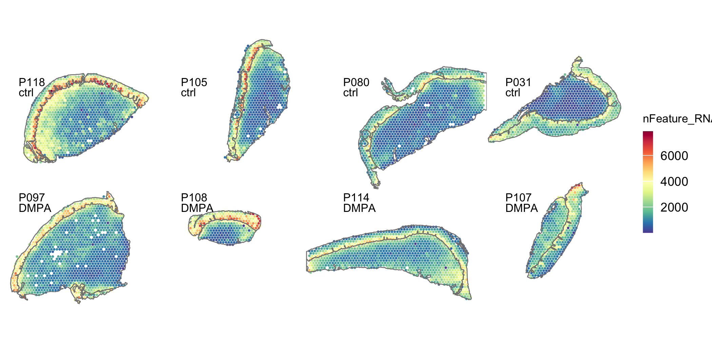
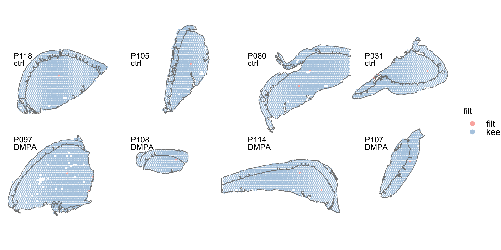
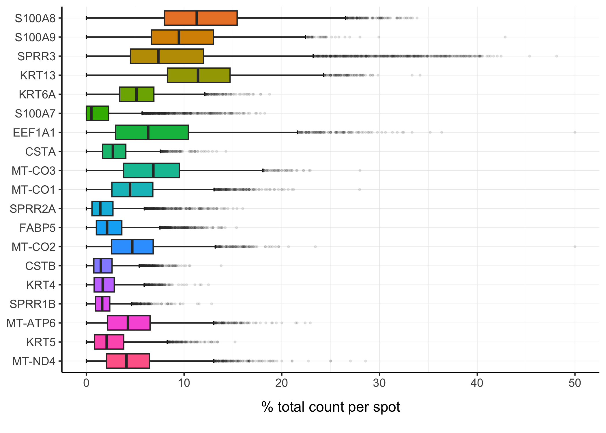

Quality Control Spatial data
================
3/14/23

### Load packages

``` r
##################
# LOAD LIBRARIES #
##################
library(tidyverse)
library(tidyseurat)
library(Seurat)
library(RColorBrewer)
library(cowplot)
library(patchwork)
# remotes::install_github("czarnewski/niceRplots",force=T)
library(niceRplots)
source("../bin/spatial_visualization.R")
```

### Load ST data

``` r
#########
# PATHS #
#########
input_dir <- "../results/00_load_st_data/"
result_dir <- "../results/01_QC_st_data/"
if( isFALSE(dir.exists(result_dir)) ) { dir.create(result_dir,recursive = TRUE) }

#############
# LODA DATA #
#############
#metadata <- read_csv("../data/Clinincal_data_Spatial_DMPA.csv")
DATA <- readRDS(paste0(input_dir,"seuratObj_merged.RDS"))
#sample_names <- unique(DATA$orig.ident)

#################
# COLOUR PALLET #
#################
friendly_cols <- c("#88CCEE", "#CC6677", "#DDCC77", "#117733", "#332288", "#AA4499", "#44AA99", "#999933", "#882255", "#661100", "#6699CC", "#F8D0A4", "#E3E6AD", "#be6a7d", "#f1a6b1", "#A8EDFC", "#7fe2e9", "#c4ce96", "#9aacce", "#e7b993", "#ffc8d9")
```

``` r
###########################################
# QUALITY CONTROLL FEATURE & COUNTS PLOTS #
###########################################
p1 <- ggplot() +
  geom_histogram(data = DATA@meta.data, aes(nFeature_RNA), fill = "red", alpha = 0.7, bins = 50) +
  ggtitle("Unique genes per spot") 

p2 <- ggplot() +
  geom_histogram(data = DATA@meta.data, aes(nCount_RNA), fill = "red", alpha = 0.7, bins = 50) +
  ggtitle("Total counts per spots")

gene_attr <- data.frame(nUMI = Matrix::rowSums(DATA@assays$RNA@counts), 
                        nSpots = Matrix::rowSums(DATA@assays$RNA@counts > 0))
p3 <- ggplot() +
  geom_histogram(data = gene_attr, aes(nUMI), fill = "red", alpha = 0.7, bins = 50) +
  scale_x_log10() +
  ggtitle("Total counts per gene (log10 scale)")

p4 <- ggplot() +
  geom_histogram(data = gene_attr, aes(nSpots), fill = "red", alpha = 0.7,  bins = 50) +
  ggtitle("Total spots per gene")

plot_grid(ncol = 1, 
          p1 + p2 + p3 + p4)
```


### Add QC features to DATA

``` r
################################
# CALC. % MITO/RIBO/HEMO-GENES #
################################
DATA <- PercentageFeatureSet(DATA, "^MT-", col.name = "percent_mito")
DATA <- PercentageFeatureSet(DATA, "^HB[^(P)]", col.name = "percent_hb")
DATA <- PercentageFeatureSet(DATA, "^RP[SL]", col.name = "percent_ribo")
```

### Summary stats before filtering

``` r
#################
# SUMMARY STATS #
#################
feature <-  c("nCount_RNA", "nFeature_RNA","percent_mito","percent_hb", "percent_ribo")
sapply(DATA@meta.data[feature], summary) %>% 
  as_tibble(rownames = "stat") %>% 
  knitr::kable(digits = 1)
```

| stat    | nCount_RNA | nFeature_RNA | percent_mito | percent_hb | percent_ribo |
|:--------|-----------:|-------------:|-------------:|-----------:|-------------:|
| Min.    |        7.0 |          7.0 |          0.0 |        0.0 |          0.0 |
| 1st Qu. |     1267.5 |        838.0 |          2.9 |        0.0 |          8.4 |
| Median  |     2465.5 |       1355.0 |          3.6 |        0.0 |         11.4 |
| Mean    |     4866.6 |       1797.7 |          3.9 |        0.1 |         11.2 |
| 3rd Qu. |     6199.0 |       2430.2 |          4.6 |        0.0 |         13.9 |
| Max.    |    51014.0 |       7865.0 |         28.6 |        8.3 |         31.2 |

### Plot feature data on the tissue sections

``` r
# dev.new(width=7, height=3.5, noRStudioGD = TRUE)
# percentage of mitochondria
plots <- DATA %>%
  mutate(group = orig.ident) %>%
  nest(., data = -group) %>%
  pmap(., 
    ~plot_spatial.fun(..2,
      assay="RNA",
      sampleid = ..1,
      geneid = "percent_mito",#"KRT15", #"PTPRC",#"sp_annot",#"CDH1",
      zoom = "zoom",
      img_alpha = 0,
      point_size = .5)
    )
legend <- get_legend(plots[[1]] + theme(legend.position="right"))
combined <- wrap_plots(plots, ncol=4) & theme(legend.position="none")
combined <- plot_grid( combined, legend, ncol = 2, rel_widths = c(1, .15)) 
combined
```


``` r
# number of genes per spot
plots_f <- DATA %>%
  mutate(group = orig.ident) %>%
  nest(., data = -group) %>%
  pmap(., 
    ~plot_spatial.fun(..2,
      samplei = ..1,
      geneid = "nFeature_RNA",#"KRT15", #"PTPRC",#"sp_annot",#"CDH1",
      zoom = "zoom",
      img_alpha = 0,
      point_size = .5)
    )
legend <- get_legend(plots_f[[1]] + theme(legend.position="right"))
combined <- wrap_plots(plots_f, ncol=4) & theme(legend.position="none")
combined <- plot_grid( combined, legend, ncol = 2, rel_widths = c(1, .15)) 
combined
```



``` r
# number of reads per spot
plots_c <- DATA %>%
  mutate(group = orig.ident) %>%
  nest(., data = -group) %>%
  pmap(., 
    ~plot_spatial.fun(..2,
      sampleid = ..1,
      geneid = "nCount_RNA",#"KRT15", #"PTPRC",#"sp_annot",#"CDH1",
      zoom = "zoom",
      img_alpha = 0,
      point_size = .5)
    )
legend <- get_legend(plots_c[[1]] + theme(legend.position="right"))
combined <- wrap_plots(plots_c, ncol=4) & theme(legend.position="none")
combined <- plot_grid( combined, legend, ncol = 2, rel_widths = c(1, .15)) 
combined
```


## Filtering

Select all spots with less than 15% mitochondrial reads, less than 10%
hb-reads and 100 detected genes.<br/> Filter genes present in less than
2 spots and remove hemoglobin and MALAT1 genes.

``` r
##########################
# FILTER GENES AND CELLS #
##########################
# filter genes present in less than 2 spots:
filt_low_genes <- function(x, n_cell = 2) x[rowSums(x) >= n_cell]
# remove specified genes:
remove_genes <- function(x, gene_name) x[!(grepl(gene_name, rownames(x[["RNA"]]))), ]
# identify transcripts within the 0.005 percentile:
percentile <- function(x, nF) between(nF,quantile(nF,probs = c(0.005)), quantile(nF,probs = c(0.995)))

DATA <- DATA %>%
  # filter out spots with less than 100 genes and more than 15% mt and 10% hb:
  mutate(filt = case_when(nFeature_RNA < 100 ~ 'filt',
                          percent_mito > 15 ~ 'filt',
                          percent_hb > 10 ~ 'filt',
                              TRUE ~ "keep")) %>%
  {. ->> temp } %>%
  #filter(., percentile(., .$nFeature_RNA)) %>%
  filter(filt == "keep") %>%
  filt_low_genes(., n_cell = 2) %>%
  remove_genes(., "MALAT1|^HB[^(P)]") # "^MT-|MALAT1|^HB[^(P)]"
```

### Summary stats

Dimension of DATA before filtering, genes: 36601, spots: 6612<br/>
Dimension of DATA after filtering, genes: 22026, spots: 6598

``` r
#################
# SUMMARY STATS #
#################
feature <-  c("nCount_RNA", "nFeature_RNA","percent_mito","percent_hb", "percent_ribo")
sapply(DATA@meta.data[feature], summary) %>% 
  as_tibble(rownames = "stat") %>% 
  knitr::kable(digits = 1)
```

| stat    | nCount_RNA | nFeature_RNA | percent_mito | percent_hb | percent_ribo |
|:--------|-----------:|-------------:|-------------:|-----------:|-------------:|
| Min.    |      111.0 |        104.0 |          0.7 |        0.0 |          2.1 |
| 1st Qu. |     1221.2 |        840.2 |          2.9 |        0.0 |          8.4 |
| Median  |     2423.5 |       1355.0 |          3.6 |        0.0 |         11.4 |
| Mean    |     4836.2 |       1799.4 |          3.9 |        0.1 |         11.2 |
| 3rd Qu. |     6181.0 |       2429.0 |          4.6 |        0.0 |         13.9 |
| Max.    |    50999.0 |       7860.0 |         14.1 |        8.3 |         31.2 |

### Plotting QC before and after filtering

``` r
# dev.new(width=8, height=10, noRStudioGD = TRUE)
################
# SEURAT PLOT #
################
# VlnPlot(DATA, features = c("nCount_RNA", "nFeature_RNA","percent_mito","percent_hb", "percent_ribo"), 
#         pt.size = 0.1, ncol = 1, y.max =100000) + NoLegend()
# 
# FeatureScatter(DATA, "nCount_RNA", "nFeature_RNA", group.by = "sample_name", pt.size = 0.5)

################################
# VIOLIN PLOT BEFORE FILTERING #
################################
feature <-  c("nCount_RNA", "nFeature_RNA","percent_mito","percent_hb", "percent_ribo")
p_ <-  map(feature, ~violin.fun(temp, .x, fill="orig.ident", col_pal=friendly_cols))
# plot_grid(plotlist=p_, ncol = 1)

################################
# VIOLIN PLOT AFTER FILTERING #
################################
p <-  map(feature, ~violin.fun(DATA, .x, fill="orig.ident", col_pal=friendly_cols, n=1))
plot_grid(plotlist=c(p_, p), nrow = 5, byrow = F)
```


### Filtered spots

``` r
temp %>%
  filter(filt == "filt") %>%
  arrange(nFeature_RNA) %>%
  as_tibble() %>%
  select(-sp_annot2) %>%
  knitr::kable(digits = 1)
```

| .cell                 | groups | sp_annot | orig.ident | nCount_RNA | nFeature_RNA | percent_mito | percent_hb | percent_ribo | filt |
|:----------------------|:-------|:---------|:-----------|-----------:|-------------:|-------------:|-----------:|-------------:|:-----|
| P097_TCGCGTAGCAGTGTCC | DMPA   | SubMuc   | P097       |          7 |            7 |         28.6 |        0.0 |         14.3 | filt |
| P118_CATGGTAAGTAGCGTT | ctrl   | SubMuc   | P118       |         14 |           13 |          0.0 |        0.0 |          0.0 | filt |
| P080_TCGTGTACTATGGATG | ctrl   | SubMuc   | P080       |         17 |           17 |          0.0 |        0.0 |          5.9 | filt |
| P031_AGAAGAGCGCCGTTCC | ctrl   | SubMuc   | P031       |         30 |           29 |          3.3 |        0.0 |         10.0 | filt |
| P097_GCATCGGCCGTGTAGG | DMPA   | SubMuc   | P097       |         30 |           29 |          3.3 |        0.0 |         10.0 | filt |
| P114_TCGCGTAGCAGTGTCC | DMPA   | SubMuc   | P114       |         41 |           38 |          2.4 |        0.0 |         19.5 | filt |
| P080_AGAAGAGCGCCGTTCC | ctrl   | SubMuc   | P080       |         48 |           39 |          2.1 |        0.0 |          8.3 | filt |
| P114_TCGTGTACTATGGATG | DMPA   | SubMuc   | P114       |         58 |           56 |          6.9 |        0.0 |         13.8 | filt |
| P107_CATGGTAAGTAGCGTT | DMPA   | epi      | P107       |         63 |           59 |          4.8 |        0.0 |         15.9 | filt |
| P105_AGAAGAGCGCCGTTCC | ctrl   | SubMuc   | P105       |         63 |           62 |         11.1 |        0.0 |         19.0 | filt |
| P097_TCGTGTACTATGGATG | DMPA   | SubMuc   | P097       |         88 |           82 |          3.4 |        0.0 |          8.0 | filt |
| P108_CATGGTAAGTAGCGTT | DMPA   | SubMuc   | P108       |         88 |           82 |          2.3 |        0.0 |         17.0 | filt |
| P031_AGATACCGGTGTTCAC | ctrl   | SubMuc   | P031       |        790 |          439 |         15.6 |        0.0 |         13.0 | filt |
| P031_GTGCCATCACACGGTG | ctrl   | SubMuc   | P031       |       1136 |          566 |         16.6 |        0.1 |         12.3 | filt |

### Plot filtered spots

``` r
# dev.new(width=7, height=8, noRStudioGD = TRUE)
plots <- temp %>%
  mutate(group = orig.ident) %>%
  nest(., data = -group) %>%
  pmap(., 
    ~plot_spatial.fun(..2,
      sampleid = ..1,
      geneid = "filt",#"KRT15", #"PTPRC",#"sp_annot",#"CDH1",
      zoom = "zoom",
      img_alpha = 0,
      point_size = 0.8)
    )
legend <- get_legend(plots[[1]] + theme(legend.position="right"))
combined <- wrap_plots(plots, ncol=2) & theme(legend.position="none")
combined <- plot_grid( combined, legend, ncol = 2, rel_widths = c(1, .2)) 
combined
```



### Plot top expressed genes

``` r
#############################
# GET TOP 20 ABUNDANT GENES #
#############################
top_genes <- DATA@assays$RNA@counts %>%
  Matrix::rowSums(.) %>%
  sort(., decreasing = T) %>%
  .[1:20]

percent.fun <- function(df, sample_name, gene, count){
  sample_name <- enquo(sample_name)
  gene <- enquo(gene)
  count <- enquo(count)

  percent <- df %>%
    select(!!sample_name, !!gene, !!count) %>%
    group_by(!!sample_name) %>%
    mutate(Percent = (!!count/sum(!!count)*100)) %>%
    select(-!!count) %>%
    ungroup() 
  
  return(percent$Percent)
}
col = (scales::hue_pal())(20)[20:1]

##################
# PLOT TOP GENES #
##################
(genes_plot <- DATA %>%
   join_features(features = names(top_genes) ) %>%
   mutate(.feature = factor(.feature, levels = rev(names(top_genes)))) %>%
   mutate("% total count per spot" = percent.fun(., .cell, .feature, .abundance_RNA),
          .after=.abundance_RNA) %>%
   ggplot(aes(y=`% total count per spot`, x=.feature, fill=.feature)) +
   stat_boxplot(geom = "errorbar", width = 0.2) +
   geom_boxplot(outlier.alpha = 0.1, outlier.size = .5) +
   scale_fill_manual(values = col) + my_theme +
   theme(plot.title = element_text(hjust = 0.5),
         axis.title.y = element_blank()) +
   NoLegend() + coord_flip() )
```



## Save seurat object

``` r
##################################
# SAVE INTERMEDIATE SEURAT OJECT #
##################################
saveRDS(DATA, paste0(result_dir,"seuratObj_filtered.RDS"))
#DATA <- readRDS(paste0(result_dir,"seuratObj_filtered.RDS"))
```

### Session info

``` r
sessionInfo()
```

    R version 4.1.2 (2021-11-01)
    Platform: x86_64-apple-darwin13.4.0 (64-bit)
    Running under: macOS Big Sur 10.16

    Matrix products: default
    BLAS/LAPACK: /Users/vilkal/Applications/miniconda3/envs/Spatial_DMPA/lib/libopenblasp-r0.3.21.dylib

    locale:
    [1] sv_SE.UTF-8/sv_SE.UTF-8/sv_SE.UTF-8/C/sv_SE.UTF-8/sv_SE.UTF-8

    attached base packages:
    [1] stats     graphics  grDevices utils     datasets  methods   base     

    other attached packages:
     [1] niceRplots_0.1.0   patchwork_1.1.2    cowplot_1.1.1      RColorBrewer_1.1-3
     [5] Seurat_4.3.0       tidyseurat_0.5.3   SeuratObject_4.1.3 sp_1.5-1          
     [9] ttservice_0.2.2    forcats_0.5.2      stringr_1.5.0      dplyr_1.0.10      
    [13] purrr_1.0.1        readr_2.1.3        tidyr_1.2.1        tibble_3.1.8      
    [17] ggplot2_3.4.0      tidyverse_1.3.2   

    loaded via a namespace (and not attached):
      [1] readxl_1.4.1           backports_1.4.1        plyr_1.8.8            
      [4] igraph_1.3.5           lazyeval_0.2.2         splines_4.1.2         
      [7] listenv_0.9.0          scattermore_0.8        digest_0.6.31         
     [10] htmltools_0.5.4        fansi_1.0.3            magrittr_2.0.3        
     [13] tensor_1.5             googlesheets4_1.0.1    cluster_2.1.4         
     [16] ROCR_1.0-11            tzdb_0.3.0             globals_0.16.2        
     [19] modelr_0.1.10          matrixStats_0.63.0     timechange_0.2.0      
     [22] spatstat.sparse_3.0-0  colorspace_2.0-3       rvest_1.0.3           
     [25] ggrepel_0.9.2          haven_2.5.1            xfun_0.36             
     [28] crayon_1.5.2           jsonlite_1.8.4         progressr_0.13.0      
     [31] spatstat.data_3.0-0    survival_3.5-0         zoo_1.8-11            
     [34] glue_1.6.2             polyclip_1.10-4        gtable_0.3.1          
     [37] gargle_1.2.1           leiden_0.4.3           future.apply_1.10.0   
     [40] abind_1.4-5            scales_1.2.1           DBI_1.1.3             
     [43] spatstat.random_3.0-1  miniUI_0.1.1.1         Rcpp_1.0.9            
     [46] viridisLite_0.4.1      xtable_1.8-4           reticulate_1.27       
     [49] htmlwidgets_1.6.1      httr_1.4.4             ellipsis_0.3.2        
     [52] ica_1.0-3              pkgconfig_2.0.3        farver_2.1.1          
     [55] uwot_0.1.14            dbplyr_2.2.1           deldir_1.0-6          
     [58] utf8_1.2.2             tidyselect_1.2.0       labeling_0.4.2        
     [61] rlang_1.0.6            reshape2_1.4.4         later_1.3.0           
     [64] munsell_0.5.0          cellranger_1.1.0       tools_4.1.2           
     [67] cli_3.6.0              generics_0.1.3         broom_1.0.2           
     [70] ggridges_0.5.4         evaluate_0.19          fastmap_1.1.0         
     [73] yaml_2.3.6             goftest_1.2-3          knitr_1.41            
     [76] fs_1.5.2               fitdistrplus_1.1-8     RANN_2.6.1            
     [79] pbapply_1.6-0          future_1.30.0          nlme_3.1-161          
     [82] mime_0.12              xml2_1.3.3             compiler_4.1.2        
     [85] rstudioapi_0.14        plotly_4.10.1          png_0.1-8             
     [88] spatstat.utils_3.0-1   reprex_2.0.2           stringi_1.7.12        
     [91] highr_0.10             lattice_0.20-45        Matrix_1.5-3          
     [94] vctrs_0.5.1            pillar_1.8.1           lifecycle_1.0.3       
     [97] spatstat.geom_3.0-3    lmtest_0.9-40          RcppAnnoy_0.0.20      
    [100] data.table_1.14.6      irlba_2.3.5.1          httpuv_1.6.8          
    [103] R6_2.5.1               promises_1.2.0.1       KernSmooth_2.23-20    
    [106] gridExtra_2.3          parallelly_1.33.0      codetools_0.2-18      
    [109] MASS_7.3-58.1          assertthat_0.2.1       withr_2.5.0           
    [112] sctransform_0.3.5      parallel_4.1.2         hms_1.1.2             
    [115] grid_4.1.2             rmarkdown_2.20         googledrive_2.0.0     
    [118] Rtsne_0.16             spatstat.explore_3.0-5 shiny_1.7.4           
    [121] lubridate_1.9.0       
