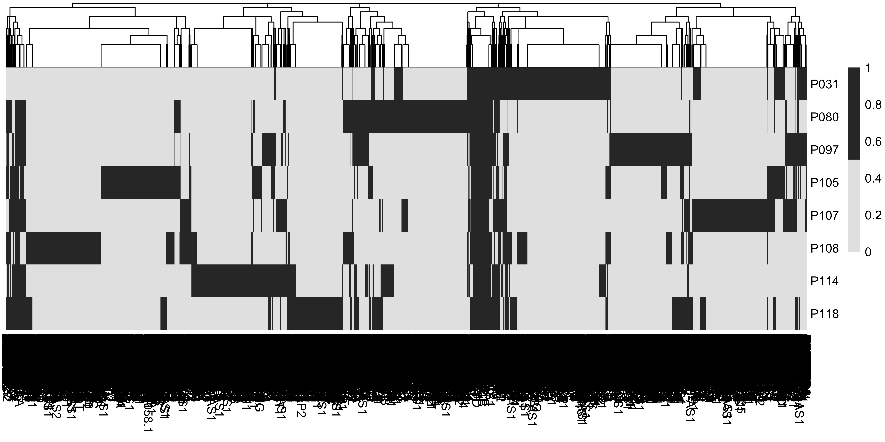

Integrate spatial data
================
3/21/23

### Load data and libraries

``` r
##################
# LOAD LIBRARIES #
##################
library(tidyverse)
library(Seurat)
library(tidyseurat)
library(cowplot)
library(harmony)
source("../bin/plotting_functions.R")

#########
# PATHS #
#########
input_dir <- "../results/01_QC_st_data/"
#input_dir <- "../results/00_load_st_data/"
result_dir <- "../results/02_integrate_st_data/"
if( isFALSE(dir.exists(result_dir)) ) { dir.create(result_dir,recursive = TRUE) }

#############
# LODA DATA #
#############
DATA <- readRDS(paste0(input_dir,"seuratObj_filtered.RDS"))
```

### Identify Highly Variable Genes (HVG) across samples

``` r
################################
# SPLIT INTO SEPERATE DATASETS #
################################
DATA_nested <- DATA %>%
  mutate(batch = orig.ident) %>%
  nest(data = -batch) %>%
  mutate(data = imap(
    data, ~ .x %>%
      NormalizeData(., normalization.method = "LogNormalize", 
                    verbose = FALSE) %>%
      FindVariableFeatures(selection.method = "vst", 
                           nfeatures = 2000, 
                           verbose = FALSE) )) %>%
  mutate(data = setNames(.[["data"]], .$batch))

#########################################
# FIND HIGLY VARIABLE GENES PER DATASET #
#########################################
hvgs_heat <- DATA_nested %>%
  .$data %>%
  map(., ~ .x@assays$RNA@var.features) %>%
  ( function(x){unique(unlist(x)) ->> hvgs_all; return(x)} ) %>%
  # intersect across all samples:
  ( function(x){Reduce(intersect, x) ->> hvgs; return(x)} ) %>% 
  imap_dfc(., ~hvgs_all %in% .x, .id=.y) %>%
  mutate(rownames = hvgs_all) %>%
  column_to_rownames(var = "rownames")

# choose the hvg present in at least two samples:
hig_var <- rownames(hvgs_heat)[rowSums(hvgs_heat)>2]

# remove all VDJ-genes from list of HVG
remove <- str_subset(hig_var, "^IGH|^IGK|^IGL|^TRA|^TRB|^TRD|^TRG")
hig_var <- setdiff(hig_var, remove)
```

### Heatmap of HVG in all samples

``` r
pheatmap::pheatmap(t(hvgs_heat * 1), cluster_rows = F, color = c("grey90", "grey20"))
```



### Integration

``` r
############
# HARMONY #
###########
DATA <- DATA %>%
  NormalizeData(verbose = FALSE) %>%
  FindVariableFeatures(selection.method = "vst",
                      nfeatures = 4000,
                      verbose = FALSE) %>%
  ScaleData(verbose = FALSE, features = hig_var ) %>%
  RunPCA(verbose = FALSE, npcs = 50) %>%
  RunUMAP(dims = 1:50,
          n.components = 2L,
          n.neighbors = 10,
          min.dist = .1,
          spread = .3) 

DATA <- DATA %>%
  RunHarmony(group.by.vars = "orig.ident", 
             reduction = "pca",
             dims.use = 1:50, 
             assay.use = "RNA") #%>%

DATA <-   DATA %>%
  RunUMAP(dims = 1:50, 
          n.neighbors = 10,
          min.dist = .1,
          spread = 1,
          repulsion.strength = 1,
          negative.sample.rate = 10,
          n.epochs = 100,
          reduction = "harmony",
          reduction.name = "umap_harmony")
```

### Alternative graph based UMAP

``` r
integrated <- DATA@reductions$harmony@cell.embeddings
ann <- RcppHNSW::hnsw_build(as.matrix(integrated), distance = "cosine")
knn <- RcppHNSW::hnsw_search(as.matrix(integrated) , ann = ann , k = 15)

UU2 <- uwot::umap(X = NULL,
                 nn_method =  knn,
                 n_components = 2,
                 ret_extra = c("model","fgraph"),
                 verbose = T,
                 min_dist = 0.1,
                 spread = .3,
                 repulsion_strength = 1,
                 negative_sample_rate = 10,
                 n_epochs = 150,
                 n_threads = 8)
dimnames(UU2$embedding) <- list(colnames(DATA),paste0("umap_harmony_knn_", 1:2))
DATA@reductions[["umap_harmony_knn"]] <- CreateDimReducObject(embeddings = UU2$embedding, 
                                                              key = "umap_harmony_knn_")
colnames(DATA@reductions$umap_harmony_knn@cell.embeddings) <- paste0("umap_harmony_knn_", 1:2)
```

``` r
res <- c("umap_harmony", "umap_harmony_knn")
p <- map(res, ~plot_clusters.fun(DATA, red=.x, cluster="orig.ident", lable=FALSE, txt_size = 7))
plot_grid(ncol = 2, 
          plotlist = p)
```


### Plot before and after integration

``` r
#  dev.new(height=6, width=6.6929133858, noRStudioGD = TRUE)
res <- c("PC", "harmony", "UMAP", "umap_harmony")
title <- c("PCA raw data", "PCA Harmony integrated", "UMAP raw data", "UMAP Harmony integrated")
p <- map2(res, title, 
          ~plot_clusters.fun(DATA, 
                             cluster="orig.ident", txt_size = 9,
                             red=.x, lable=FALSE, title=.y))
plot_grid(ncol = 2, 
         plotlist = p)
```


### Plot marker genes

``` r
#  dev.new(height=3, width=8, noRStudioGD = TRUE)
################################
# VISUALIZE EXPR. OF KEY GENES #
################################
# col <- c("grey90","grey80","grey60","navy","black")
col <- c("lightgray", "mistyrose", "red", "dark red", "black")
genes <- c("KRT1", "KRT15", "CDH1")
# genes <- c("CD8A", "SFRP2", "CD3E")
# genes <- c("CD8A", "MYOZ2", "CD3E", "EPCAM", "COL6A1", "CD4")

p <- map(genes, ~plot_genes.fun(DATA, .x, col = col, lable = FALSE))
plot_grid(ncol = 3, 
          plotlist = p)
```


## Save seurat object

``` r
##################################
# SAVE INTERMEDIATE SEURAT OJECT #
##################################
#saveRDS(DATA, paste0(result_dir,"seuratObj_harmony.RDS"))
saveRDS(DATA, paste0(result_dir,"seuratObj_harmony_filt.RDS"))
#DATA <- readRDS(paste0(result_dir,"seuratObj_harmony.RDS"))
```

### Session info

``` r
sessionInfo()
```

    R version 4.1.2 (2021-11-01)
    Platform: x86_64-apple-darwin13.4.0 (64-bit)
    Running under: macOS Big Sur 10.16

    Matrix products: default
    BLAS/LAPACK: /Users/vilkal/Applications/miniconda3/envs/Spatial_DMPA/lib/libopenblasp-r0.3.21.dylib

    locale:
    [1] sv_SE.UTF-8/sv_SE.UTF-8/sv_SE.UTF-8/C/sv_SE.UTF-8/sv_SE.UTF-8

    attached base packages:
    [1] stats     graphics  grDevices utils     datasets  methods   base     

    other attached packages:
     [1] harmony_0.1.1      Rcpp_1.0.9         cowplot_1.1.1      tidyseurat_0.5.3  
     [5] ttservice_0.2.2    SeuratObject_4.1.3 Seurat_4.3.0       forcats_0.5.2     
     [9] stringr_1.5.0      dplyr_1.0.10       purrr_1.0.1        readr_2.1.3       
    [13] tidyr_1.2.1        tibble_3.1.8       ggplot2_3.4.0      tidyverse_1.3.2   

    loaded via a namespace (and not attached):
      [1] readxl_1.4.1           backports_1.4.1        plyr_1.8.8            
      [4] igraph_1.3.5           lazyeval_0.2.2         sp_1.5-1              
      [7] splines_4.1.2          RcppHNSW_0.4.1         listenv_0.9.0         
     [10] scattermore_0.8        digest_0.6.31          htmltools_0.5.4       
     [13] fansi_1.0.3            magrittr_2.0.3         tensor_1.5            
     [16] googlesheets4_1.0.1    cluster_2.1.4          ROCR_1.0-11           
     [19] tzdb_0.3.0             globals_0.16.2         modelr_0.1.10         
     [22] matrixStats_0.63.0     timechange_0.2.0       spatstat.sparse_3.0-0 
     [25] colorspace_2.0-3       rvest_1.0.3            ggrepel_0.9.2         
     [28] haven_2.5.1            xfun_0.36              crayon_1.5.2          
     [31] jsonlite_1.8.4         progressr_0.13.0       spatstat.data_3.0-0   
     [34] survival_3.5-0         zoo_1.8-11             glue_1.6.2            
     [37] polyclip_1.10-4        gtable_0.3.1           gargle_1.2.1          
     [40] leiden_0.4.3           future.apply_1.10.0    abind_1.4-5           
     [43] scales_1.2.1           pheatmap_1.0.12        DBI_1.1.3             
     [46] spatstat.random_3.0-1  miniUI_0.1.1.1         viridisLite_0.4.1     
     [49] xtable_1.8-4           reticulate_1.27        htmlwidgets_1.6.1     
     [52] httr_1.4.4             RColorBrewer_1.1-3     ellipsis_0.3.2        
     [55] ica_1.0-3              farver_2.1.1           pkgconfig_2.0.3       
     [58] uwot_0.1.14            dbplyr_2.2.1           deldir_1.0-6          
     [61] utf8_1.2.2             labeling_0.4.2         tidyselect_1.2.0      
     [64] rlang_1.0.6            reshape2_1.4.4         later_1.3.0           
     [67] munsell_0.5.0          cellranger_1.1.0       tools_4.1.2           
     [70] cli_3.6.0              generics_0.1.3         broom_1.0.2           
     [73] ggridges_0.5.4         evaluate_0.19          fastmap_1.1.0         
     [76] yaml_2.3.6             goftest_1.2-3          knitr_1.41            
     [79] fs_1.5.2               fitdistrplus_1.1-8     RANN_2.6.1            
     [82] pbapply_1.6-0          future_1.30.0          nlme_3.1-161          
     [85] mime_0.12              xml2_1.3.3             compiler_4.1.2        
     [88] rstudioapi_0.14        plotly_4.10.1          png_0.1-8             
     [91] spatstat.utils_3.0-1   reprex_2.0.2           stringi_1.7.12        
     [94] lattice_0.20-45        Matrix_1.5-3           vctrs_0.5.1           
     [97] pillar_1.8.1           lifecycle_1.0.3        spatstat.geom_3.0-3   
    [100] lmtest_0.9-40          RcppAnnoy_0.0.20       data.table_1.14.6     
    [103] irlba_2.3.5.1          httpuv_1.6.8           patchwork_1.1.2       
    [106] R6_2.5.1               promises_1.2.0.1       KernSmooth_2.23-20    
    [109] gridExtra_2.3          parallelly_1.33.0      codetools_0.2-18      
    [112] MASS_7.3-58.1          assertthat_0.2.1       withr_2.5.0           
    [115] sctransform_0.3.5      parallel_4.1.2         hms_1.1.2             
    [118] grid_4.1.2             rmarkdown_2.20         googledrive_2.0.0     
    [121] Rtsne_0.16             spatstat.explore_3.0-5 shiny_1.7.4           
    [124] lubridate_1.9.0       

## Paulos base R code
