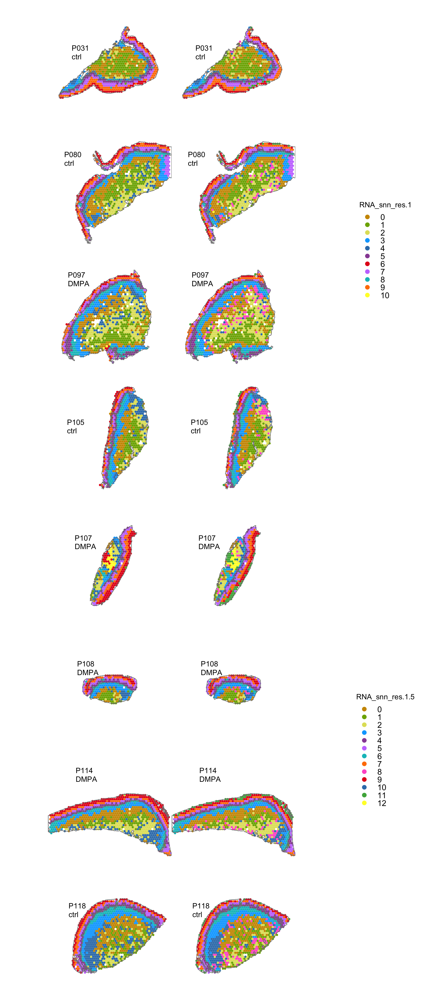
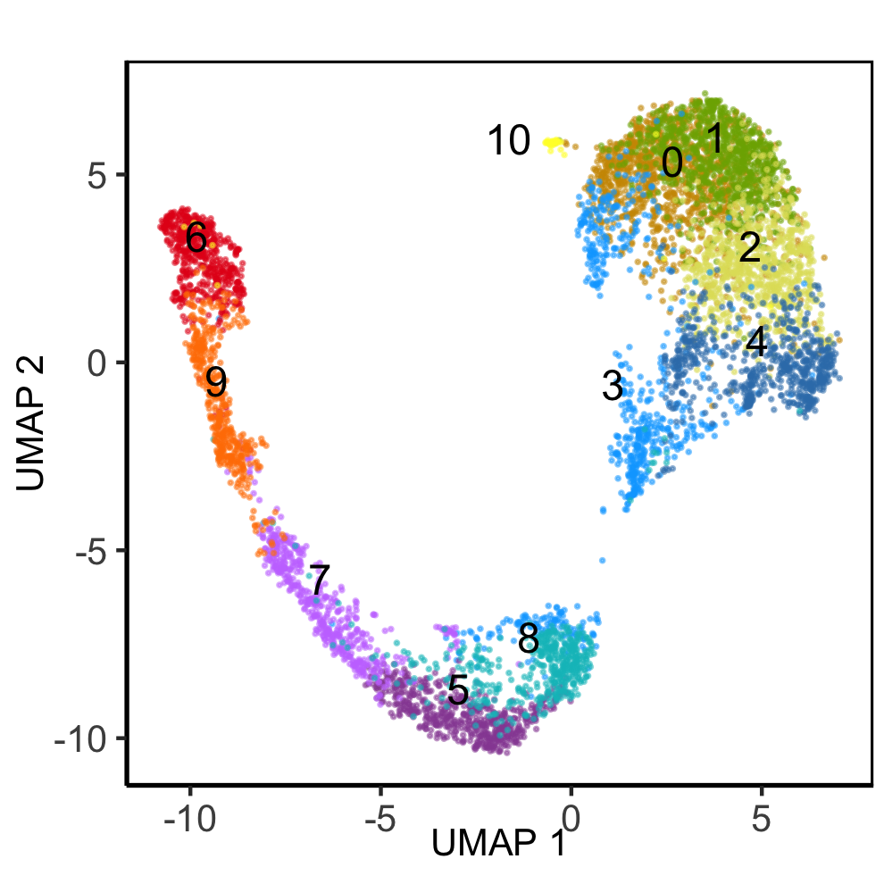
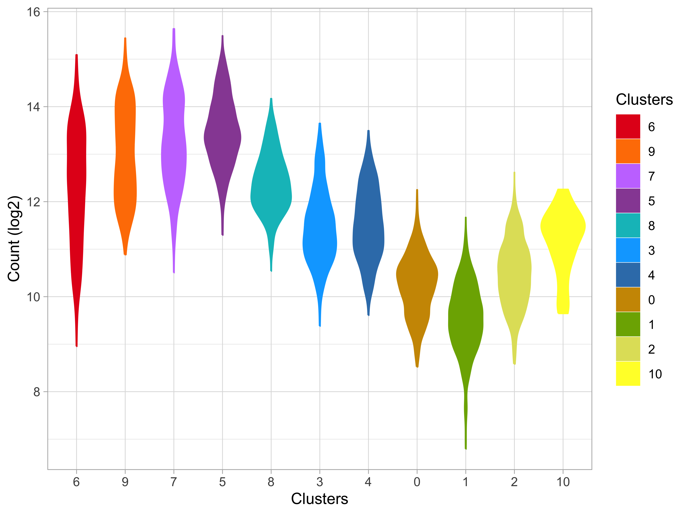

Clustering filtered spatial data
================
12/20/24

### Load data and libraries

``` r
##################
# LOAD LIBRARIES #
##################
library(tidyverse)
library(Seurat)
library(tidyseurat)
library(cowplot)
library(patchwork)

source("../bin/spatial_visualization.R")
source("../bin/plotting_functions.R")

#########
# PATHS #
#########
input_dir <- "../results/02_integrate_st_data/"
result_dir <- "../results/03_clustering_st_data/"
if( isFALSE(dir.exists(result_dir)) ) { dir.create(result_dir,recursive = TRUE) }

#############
# LODA DATA #
#############
DATA <- readRDS(paste0(input_dir,"seuratObj_integrated.RDS"))

#################
# COLOUR PALLET #
#################
clus_1.5 <- c("#CD9600","#7CAE00","#e0e067","#00A9FF","#984EA3","#C77CFF","#00BFC4","#FF7F00",
              "#FF61CC","#E41A1C","#377EB8","#4DAF4A","#FFFF33","#A65628","#F781BF","#999999") # "#F8766D"
clus_1 <- c( "#CD9600","#7CAE00","#e0e067","#00A9FF","#377EB8","#984EA3","#E41A1C","#C77CFF",
             "#00BFC4","#FF7F00","#FFFF33","#CD9600","#4DAF4A","#A65628","#F781BF","#999999")
```

## Clustering

``` r
##################################
# EVALUATE CLUSTERING RESOLUTION #
##################################
DATA <- FindNeighbors(DATA, reduction = "harmony", dims = 1:30, k.param = 15, prune.SNN = 1/15) 

# Clustering with louvain (algorithm 1) or leiden (algorithm 4)
for (res in c(0.1, 0.5, 1, 1.5, 2)) {
    DATA <- FindClusters(DATA, resolution = res, algorithm = 1)
}
```

    Modularity Optimizer version 1.3.0 by Ludo Waltman and Nees Jan van Eck

    Number of nodes: 6598
    Number of edges: 299026

    Running Louvain algorithm...
    Maximum modularity in 10 random starts: 0.9375
    Number of communities: 2
    Elapsed time: 0 seconds
    Modularity Optimizer version 1.3.0 by Ludo Waltman and Nees Jan van Eck

    Number of nodes: 6598
    Number of edges: 299026

    Running Louvain algorithm...
    Maximum modularity in 10 random starts: 0.8316
    Number of communities: 7
    Elapsed time: 0 seconds
    Modularity Optimizer version 1.3.0 by Ludo Waltman and Nees Jan van Eck

    Number of nodes: 6598
    Number of edges: 299026

    Running Louvain algorithm...
    Maximum modularity in 10 random starts: 0.7608
    Number of communities: 11
    Elapsed time: 0 seconds
    Modularity Optimizer version 1.3.0 by Ludo Waltman and Nees Jan van Eck

    Number of nodes: 6598
    Number of edges: 299026

    Running Louvain algorithm...
    Maximum modularity in 10 random starts: 0.7115
    Number of communities: 13
    Elapsed time: 0 seconds
    Modularity Optimizer version 1.3.0 by Ludo Waltman and Nees Jan van Eck

    Number of nodes: 6598
    Number of edges: 299026

    Running Louvain algorithm...
    Maximum modularity in 10 random starts: 0.6669
    Number of communities: 16
    Elapsed time: 0 seconds

``` r
# each time you run clustering, the data is stored in meta data columns:
# seurat_clusters - lastest results only RNA_snn_res.XX - for each different
# resolution you test.
```

### UMAP of cluster resolutions

``` r
# dev.new(width=6.6929133858, height=3.3, noRStudioGD = TRUE)
res <- c("RNA_snn_res.1", "RNA_snn_res.1.5")
p <- map2(res, list(clus_1,clus_1.5),
          ~plot_clusters.fun(DATA, cluster=.x, txt_size = 10, dot_size = 0.2,
                             color = .y, red = "umap_harmony") + xlab("UMAP 1") + ylab("UMAP 2")) 
plot_grid(ncol = 2, 
          plotlist = p)
```


### Cluster resolutions on tissue

``` r
# dev.new(width=6.6929133858, height=15, noRStudioGD = TRUE)
plots <- DATA %>%
  mutate(group = orig.ident) %>%
  nest(., data = -group) %>%
  mutate( "res_1" = pmap(., 
    ~plot_spatial.fun(..2, sampleid=..1, geneid="RNA_snn_res.1", 
                      point_size = 0.8, zoom="zoom", colors = clus_1))) %>%
  mutate( "res_2" = pmap(., 
    ~plot_spatial.fun(..2, sampleid=..1, geneid="RNA_snn_res.1.5",
                      point_size = 0.8, zoom="zoom", colors = clus_1.5)))

legend_1 <- get_legend(plots$res_1[[2]] + theme(legend.position="right"))
legend_2 <- get_legend(plots$res_2[[1]] + theme(legend.position="right"))
legend <- plot_grid( legend_1, legend_2, ncol = 1)
combined <- wrap_plots(plotlist=c(plots$res_1, plots$res_2), nrow = 8, byrow = F) & theme(legend.position="none")
combined <- plot_grid( combined, legend, ncol = 2, rel_widths = c(1, .3)) 
combined
```



### Set cluster resolution

``` r
DATA <- DATA %>%
  rename(Clusters="RNA_snn_res.1") %>%
  SetIdent(., value = "Clusters") %>%
  select(-any_of(contains(c("RNA_snn_res","seurat_clusters"))))
```

``` r
# dev.new(width=3.3, height=3.3, noRStudioGD = TRUE)
p[[1]] + ggtitle("")
```



### Spot distribution by clusters

``` r
DATA_sub <- DATA %>%
  mutate(gr = .$groups) %>%
  mutate(ID = .$orig.ident) %>%
  nest(., data=-c(gr, orig.ident)) %>%
  mutate(epi =  map(data, ~filter(.x, !(sp_annot == "SubMuc"))),
         subMuc =  map(data, ~filter(.x, sp_annot == "SubMuc"))) %>%
  mutate(across(c("epi", "subMuc"), ~map(., ~table(.x$Clusters)), .names = "{.col}_n_before")) %>%
  mutate(across(contains("_n_"), ~set_names(.x, paste0(.data[["gr"]],"_",.data[["orig.ident"]]))))
      
table(DATA$Clusters)

bind_cols(DATA_sub$epi_n_before, "Clus" = paste0("**",names(table(DATA$Clusters)),"**")) %>%
  rowwise() %>% 
  mutate(DMPA_sum = sum(c_across(starts_with("DMPA_"))),
         ctrl_sum = sum(c_across(starts_with("ctrl_")))) %>%
  select(sort(colnames(.)[1:8]), everything()) %>%
  knitr::kable(., caption = "Distribution of epithelial spots per cluster per subject")

bind_cols(DATA_sub$subMuc_n_before, "Clus" = paste0("**",names(table(DATA$Clusters)),"**")) %>%
  rowwise() %>% 
  mutate(DMPA_sum = sum(c_across(starts_with("DMPA_"))),
         ctrl_sum = sum(c_across(starts_with("ctrl_")))) %>%
  select(sort(colnames(.)[1:8]), everything()) %>%
  knitr::kable(., caption = "Distribution of submucosal spots per cluster per subject")
```


       0    1    2    3    4    5    6    7    8    9   10 
    1148  884  747  656  646  558  511  507  471  432   38 

| ctrl_P031 | ctrl_P080 | ctrl_P105 | ctrl_P118 | DMPA_P097 | DMPA_P107 | DMPA_P108 | DMPA_P114 | Clus   | DMPA_sum | ctrl_sum |
|----------:|----------:|----------:|----------:|----------:|----------:|----------:|----------:|:-------|---------:|---------:|
|         0 |         0 |         1 |         0 |         0 |         1 |         0 |         0 | **0**  |        1 |        1 |
|         1 |         0 |         0 |         0 |         0 |         1 |         0 |         1 | **1**  |        2 |        1 |
|         0 |         0 |         0 |         0 |         0 |         0 |         0 |         0 | **2**  |        0 |        0 |
|         3 |         0 |         3 |         0 |         0 |         0 |         0 |         1 | **3**  |        1 |        6 |
|         0 |         0 |         0 |         0 |         0 |         0 |         0 |         0 | **4**  |        0 |        0 |
|        79 |        67 |        47 |        77 |        67 |        31 |        37 |        67 | **5**  |      202 |      270 |
|        60 |        66 |        43 |        69 |        30 |        76 |        29 |       112 | **6**  |      247 |      238 |
|        89 |        67 |        34 |        77 |        49 |        51 |        38 |        61 | **7**  |      199 |      267 |
|        12 |         9 |         1 |         6 |         4 |         7 |         3 |         1 | **8**  |       15 |       28 |
|        92 |        69 |        33 |        53 |        51 |        51 |        26 |        56 | **9**  |      184 |      247 |
|         0 |         0 |         1 |         0 |         0 |         0 |         0 |         1 | **10** |        1 |        1 |

Distribution of epithelial spots per cluster per subject

| ctrl_P031 | ctrl_P080 | ctrl_P105 | ctrl_P118 | DMPA_P097 | DMPA_P107 | DMPA_P108 | DMPA_P114 | Clus   | DMPA_sum | ctrl_sum |
|----------:|----------:|----------:|----------:|----------:|----------:|----------:|----------:|:-------|---------:|---------:|
|       150 |       208 |       124 |       201 |       227 |        20 |        34 |       182 | **0**  |      463 |      683 |
|       131 |       192 |       118 |       121 |       182 |        10 |        36 |        91 | **1**  |      319 |      562 |
|        37 |       155 |        72 |        91 |       231 |        35 |         9 |       117 | **2**  |      392 |      355 |
|        46 |       100 |        76 |       130 |       141 |        25 |        43 |        88 | **3**  |      297 |      352 |
|        24 |        73 |        76 |       192 |       123 |        37 |        21 |       100 | **4**  |      281 |      365 |
|         1 |         5 |         8 |        20 |        41 |         1 |         1 |         9 | **5**  |       52 |       34 |
|         0 |         3 |         0 |         0 |         4 |        19 |         0 |         0 | **6**  |       23 |        3 |
|         1 |        33 |         0 |         2 |         4 |         0 |         0 |         1 | **7**  |        5 |       36 |
|        24 |        46 |        59 |        85 |       102 |        14 |        20 |        78 | **8**  |      214 |      214 |
|         0 |         0 |         0 |         0 |         1 |         0 |         0 |         0 | **9**  |        1 |        0 |
|         1 |         1 |         0 |         0 |         5 |        29 |         0 |         0 | **10** |       34 |        2 |

Distribution of submucosal spots per cluster per subject

### Plot final clusters on tissue section:

``` r
# Horizontal (aspect = width/height)
# dev.new(width=6.6929133858, height=3.5, noRStudioGD = TRUE)
############################
# PLOT FACET WRAP CLUSTERS #
############################
(p <- plot_st_meta.fun( DATA,
        feat =  "Clusters",
        zoom = "zoom",
        colors = clus_1,
        alpha = .9,
        #annot_col = "#dbd9d9",
        annot_line = .1,
        img_alpha = 0,
        point_size = .5))
```


``` r
###################
# ADD ANNOTATION #
##################
ord1 <- c("Superficial", "Upper IM", "Lower IM", "Basal", "8","3","4","0","2","1", "10")
ord2 <- c("6", "9", "7", "5","8","3","4","0","1","2","10")
epi_layers <- set_names(ord1, ord2)

DATA <- DATA %>%
mutate(layers = factor(epi_layers[as.character(.$Clusters)], levels = ord1), .after = "orig.ident")
```

The log2 count can work as a proxy for cell density. Here we see the
distribution of counts per cluster

``` r
clus_col <- c("#E41A1C","#FF7F00", "#C77CFF","#984EA3","#00BFC4", "#00A9FF","#377EB8","#CD9600","#7CAE00", "#e0e067","#FFFF33","#FF61CC","#F781BF", "#999999")
clus_lvl <- c("6", "9", "7", "5","8","3","4","0","1","2","10")

DATA %>%
  mutate("Count (log2)" = log2(.$nCount_RNA)) %>%
  mutate(Clusters = factor(.$Clusters, levels = clus_lvl)) %>%
  
  ggplot(., aes(x=Clusters, y=`Count (log2)`, fill=Clusters, color=Clusters)) + 
  geom_violin() + theme_light() +
  scale_fill_manual(values = clus_col, aesthetics = c("fill","colour"))
```



## Save seurat object

``` r
##################################
# SAVE INTERMEDIATE SEURAT OJECT #
##################################
saveRDS(DATA, paste0(result_dir,"seuratObj_clustered.RDS"))
# DATA <- readRDS(paste0(result_dir,"seuratObj_clustered.RDS"))
```

### Session info

``` r
sessionInfo()
```

    R version 4.3.3 (2024-02-29)
    Platform: x86_64-apple-darwin13.4.0 (64-bit)
    Running under: macOS Big Sur ... 10.16

    Matrix products: default
    BLAS/LAPACK: /Users/vilkal/Applications/miniconda3/envs/hdWGCNA/lib/libopenblasp-r0.3.27.dylib;  LAPACK version 3.12.0

    locale:
    [1] sv_SE.UTF-8/sv_SE.UTF-8/sv_SE.UTF-8/C/sv_SE.UTF-8/sv_SE.UTF-8

    time zone: Europe/Oslo
    tzcode source: system (macOS)

    attached base packages:
    [1] stats     graphics  grDevices utils     datasets  methods   base     

    other attached packages:
     [1] scatterpie_0.2.4   RColorBrewer_1.1-3 patchwork_1.2.0    cowplot_1.1.3     
     [5] tidyseurat_0.8.0   ttservice_0.4.1    SeuratObject_5.0.2 Seurat_4.4.0      
     [9] lubridate_1.9.3    forcats_1.0.0      stringr_1.5.1      dplyr_1.1.4       
    [13] purrr_1.0.2        readr_2.1.5        tidyr_1.3.1        tibble_3.2.1      
    [17] ggplot2_3.5.1      tidyverse_2.0.0   

    loaded via a namespace (and not attached):
      [1] deldir_2.0-4           pbapply_1.7-2          gridExtra_2.3         
      [4] rlang_1.1.4            magrittr_2.0.3         RcppAnnoy_0.0.22      
      [7] spatstat.geom_3.2-9    matrixStats_1.3.0      ggridges_0.5.6        
     [10] compiler_4.3.3         png_0.1-8              vctrs_0.6.5           
     [13] reshape2_1.4.4         pkgconfig_2.0.3        fastmap_1.2.0         
     [16] ellipsis_0.3.2         labeling_0.4.3         utf8_1.2.4            
     [19] promises_1.3.0         rmarkdown_2.27         tzdb_0.4.0            
     [22] xfun_0.49              jsonlite_1.8.8         goftest_1.2-3         
     [25] later_1.3.2            tweenr_2.0.3           spatstat.utils_3.0-5  
     [28] irlba_2.3.5.1          parallel_4.3.3         cluster_2.1.6         
     [31] R6_2.5.1               ica_1.0-3              spatstat.data_3.1-2   
     [34] stringi_1.8.4          reticulate_1.38.0      parallelly_1.37.1     
     [37] lmtest_0.9-40          scattermore_1.2        Rcpp_1.0.12           
     [40] knitr_1.47             tensor_1.5             future.apply_1.11.2   
     [43] zoo_1.8-12             sctransform_0.4.1      httpuv_1.6.15         
     [46] Matrix_1.6-5           splines_4.3.3          igraph_2.0.3          
     [49] timechange_0.3.0       tidyselect_1.2.1       abind_1.4-5           
     [52] rstudioapi_0.16.0      yaml_2.3.8             spatstat.random_3.2-3 
     [55] codetools_0.2-20       miniUI_0.1.1.1         spatstat.explore_3.2-7
     [58] listenv_0.9.1          lattice_0.22-6         plyr_1.8.9            
     [61] shiny_1.8.1.1          withr_3.0.0            ROCR_1.0-11           
     [64] evaluate_0.24.0        Rtsne_0.17             future_1.33.2         
     [67] survival_3.7-0         polyclip_1.10-6        fitdistrplus_1.1-11   
     [70] pillar_1.9.0           KernSmooth_2.23-24     ggfun_0.1.6           
     [73] plotly_4.10.4          generics_0.1.3         sp_2.1-4              
     [76] hms_1.1.3              munsell_0.5.1          scales_1.3.0          
     [79] globals_0.16.3         xtable_1.8-4           glue_1.7.0            
     [82] lazyeval_0.2.2         tools_4.3.3            data.table_1.15.4     
     [85] RANN_2.6.1             fs_1.6.4               leiden_0.4.3.1        
     [88] dotCall64_1.1-1        grid_4.3.3             colorspace_2.1-0      
     [91] nlme_3.1-165           ggforce_0.4.2          cli_3.6.3             
     [94] spatstat.sparse_3.1-0  spam_2.10-0            fansi_1.0.6           
     [97] viridisLite_0.4.2      uwot_0.2.2             gtable_0.3.5          
    [100] yulab.utils_0.1.7      digest_0.6.36          progressr_0.14.0      
    [103] ggrepel_0.9.5          farver_2.1.2           htmlwidgets_1.6.4     
    [106] htmltools_0.5.8.1      lifecycle_1.0.4        httr_1.4.7            
    [109] mime_0.12              MASS_7.3-60.0.1       
