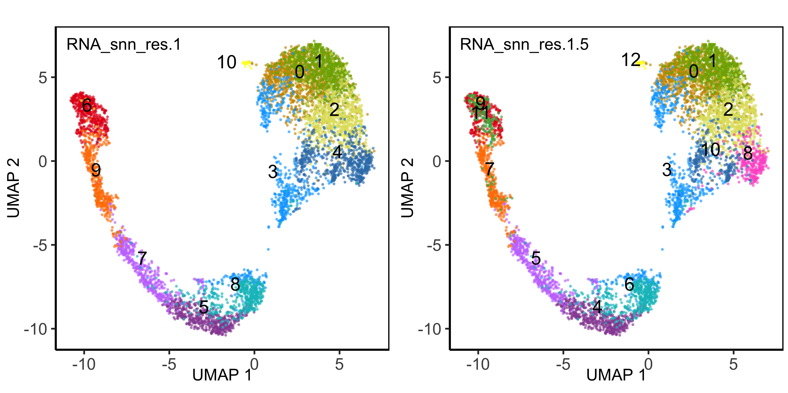

Clustering reference data
================
12/13/22

``` r
source("../bin/render_with_jobs.R")
file_name <- "./03_cluster_st_data.md"
lab_dir <- "../lab_book/03_cluster_st_data"

file <- paste0(basename(xfun::sans_ext(file_name)), '_', Sys.Date(), '.html')

# quarto
# render_html_with_job(out_dir = lab_dir)
# fs::file_move(path = file, new_path = paste0(lab_dir, file))

# currently using quarto for github and kniter for html due to source code option 
render_git_with_job()

# kniter
knit_html_with_job(out_dir = lab_dir)
```

## Load data and libraries

``` r
##################
# LOAD LIBRARIES #
##################
library(tidyverse)
library(Seurat)
library(tidyseurat)
library(cowplot)
library(patchwork)
source("../bin/spatial_visualization.R")
source("../bin/plotting_functions.R")
#library(harmony)

#########
# PATHS #
#########
input_dir <- "../results/02_integrate_st_data/"
result_dir <- "../results/03_clustering_st_data/"
if( isFALSE(dir.exists(result_dir)) ) { dir.create(result_dir,recursive = TRUE) }

#############
# LODA DATA #
#############
DATA <- readRDS(paste0(input_dir,"seuratObj_harmony.RDS"))

#################
# COLOUR PALLET #
#################
clus <- c(scales::hue_pal()(8),
             RColorBrewer::brewer.pal(9,"Set1"),
             RColorBrewer::brewer.pal(8,"Set2"),
             RColorBrewer::brewer.pal(8,"Accent"),
             RColorBrewer::brewer.pal(9,"Pastel1"),
             RColorBrewer::brewer.pal(8,"Pastel2") )
```

``` r
my_theme <-
  list(
    #scale_fill_manual(values = friendly_cols),
    #scale_color_manual(values = friendly_cols),
    theme_bw() +
      #guides(color = guide_legend(override.aes = list(size=2, alpha = 1))) +
      theme(
        panel.border = element_blank(),
        axis.line = element_line(),
        panel.grid.major = element_line(size = 0.2),
        panel.grid.minor = element_line(size = 0.1),
        text = element_text(size = 12),
        plot.title = element_text(hjust = 0.5),
        #legend.position = "bottom",
        #aspect.ratio = 1,
        strip.background = element_blank(),
        axis.title.x = element_text(margin = margin(t = 10, r = 10, b = 10, l = 10)),
        axis.title.y = element_text(margin = margin(t = 10, r = 10, b = 10, l = 10))
      )
  )
```

## Clustering

``` r
##################################
# EVALUATE CLUSTERING RESOLUTION #
##################################
DATA <- FindNeighbors(DATA, reduction = "harmony", dims = 1:20, k.param = 20, prune.SNN = 1/15) 

# Clustering with louvain (algorithm 1) or leiden (algorithm 4)
for (res in c(0.1, 0.25, 0.5, 1, 1.5, 2)) {
    DATA <- FindClusters(DATA, resolution = res, algorithm = 1)
}
```

    Modularity Optimizer version 1.3.0 by Ludo Waltman and Nees Jan van Eck

    Number of nodes: 6700
    Number of edges: 249921

    Running Louvain algorithm...
    Maximum modularity in 10 random starts: 0.9420
    Number of communities: 4
    Elapsed time: 0 seconds
    Modularity Optimizer version 1.3.0 by Ludo Waltman and Nees Jan van Eck

    Number of nodes: 6700
    Number of edges: 249921

    Running Louvain algorithm...
    Maximum modularity in 10 random starts: 0.8989
    Number of communities: 6
    Elapsed time: 0 seconds
    Modularity Optimizer version 1.3.0 by Ludo Waltman and Nees Jan van Eck

    Number of nodes: 6700
    Number of edges: 249921

    Running Louvain algorithm...
    Maximum modularity in 10 random starts: 0.8490
    Number of communities: 9
    Elapsed time: 0 seconds
    Modularity Optimizer version 1.3.0 by Ludo Waltman and Nees Jan van Eck

    Number of nodes: 6700
    Number of edges: 249921

    Running Louvain algorithm...
    Maximum modularity in 10 random starts: 0.7904
    Number of communities: 14
    Elapsed time: 0 seconds
    Modularity Optimizer version 1.3.0 by Ludo Waltman and Nees Jan van Eck

    Number of nodes: 6700
    Number of edges: 249921

    Running Louvain algorithm...
    Maximum modularity in 10 random starts: 0.7493
    Number of communities: 17
    Elapsed time: 1 seconds
    Modularity Optimizer version 1.3.0 by Ludo Waltman and Nees Jan van Eck

    Number of nodes: 6700
    Number of edges: 249921

    Running Louvain algorithm...
    Maximum modularity in 10 random starts: 0.7133
    Number of communities: 18
    Elapsed time: 1 seconds

``` r
# each time you run clustering, the data is stored in meta data columns:
# seurat_clusters - lastest results only CCA_snn_res.XX - for each different
# resolution you test.
```

``` r
# obj <- DATA
# cluster <- sym("RNA_snn_res.0.1")
# plot_clusters.fun <- function(obj, cluster, red = "umap_harmony", color = "Brew_all", lable = TRUE){
#   if(color == "Brew_all"){
#     pal <- clus}
#   
#   cluster <- sym(cluster)
#   
#   if(lable == TRUE){ lab <- cluster
#     text <- NoLegend() #+ labs(color= "Clusters")
#   }else{lab <- sym(lable)
#     text <- guides(color = "none")}
#   
#   feat <- obj %>%
#     select(.cell, !!(cluster), !!(lab), orig.ident, nCount_RNA, nFeature_RNA) %>%
#     group_by(!!(cluster)) %>%
#     add_tally() %>%
#     arrange(nFeature_RNA) %>%
#     arrange(desc(n))
#   
#   lable_df <- feat %>%
#     ungroup() %>%
#     group_by(!!(lab)) %>%
#     select(!!(lab), contains(red)) %>% 
#     summarize_all(mean)
#   
#   red_1 <- sym(paste0(red, "_1"))
#   red_2 <- sym(paste0(red, "_2"))
#   
#   p <- ggplot(feat, aes(!!(red_1), !!(red_2), 
#                         color = !!cluster), label=TRUE) + 
#     geom_point(alpha = 0.5, size=.5) + ggtitle(as_label(cluster)) +
#     geom_text(data = lable_df, aes(label = !!(lab)), col="black", size=2.5) +
#     #guides(color = guide_legend(override.aes = list(size=2, alpha = 1))) +
#     scale_color_manual(values = pal)  +
#     my_theme + text
#   return(p)
# }

res <- c("RNA_snn_res.1", "RNA_snn_res.1.5")
p <- map(res, ~plot_clusters.fun(DATA, cluster=.x))
plot_grid(ncol = 2, 
         plotlist = p)
```



``` r
DATA <- DATA %>%
  rename(Clusters="RNA_snn_res.1.5") %>%
  SetIdent(., value = "Clusters")
```

### Plot clusters on tissue section:

``` r
plot_fun <- function(obj){
p <- SpatialPlot(obj, 
            group.by = "Clusters", cols = clus,
            #cols = c("lightgray", "mistyrose", "red", "dark red", "black"),
            pt.size.factor = 5, ncol = 1, image.alpha = 0) + 
            theme(panel.grid.major = element_blank(), 
                  panel.grid.minor = element_blank(),
                  legend.title = element_blank())
}

DATA_n <- DATA %>%
  nest(data = -orig.ident)
p <- map(DATA_n$data, ~plot_fun(.x))

legend <- get_legend(p[[1]] + theme(legend.position="right"))
combined <- wrap_plots(p, ncol = 2) & theme(legend.position = "none")
(combined <- plot_grid( combined, legend, ncol = 2, rel_widths = c(1, .2)) )
```


``` r
#is.character(pull(DATA, RNA_snn_res.1.5))

plots <- DATA %>%
  mutate(group = orig.ident) %>%
  nest(., data = -group) %>%
  pmap(., 
    ~plot_spatial.fun(..2,
      sampleid = ..1,
      colors = clus,
      geneid = "Clusters",#"KRT15", #"PTPRC",#"sp_annot",#"CDH1",
      zoom = "zoom",
      img_alpha = 0,
      point_size = 1)
    )


legend <- get_legend(plots[[1]] + theme(legend.position="right"))
combined <- wrap_plots(plots, ncol=2) & theme(legend.position="none")
combined <- plot_grid( combined, legend, ncol = 2, rel_widths = c(1, .2)) 
combined
```


# Paulos Code

## Save seurat object

``` r
##################################
# SAVE INTERMEDIATE SEURAT OJECT #
##################################
saveRDS(DATA, paste0(result_dir,"seuratObj_clustered.RDS"))
# DATA<- readRDS(paste0(result_dir,"seuratObj_clustered.RDS"))
```

## Session info

``` r
sessionInfo()
```

    R version 4.1.2 (2021-11-01)
    Platform: x86_64-apple-darwin13.4.0 (64-bit)
    Running under: macOS Big Sur 10.16

    Matrix products: default
    BLAS/LAPACK: /Users/vilkal/Applications/miniconda3/envs/Spatial_DMPA/lib/libopenblasp-r0.3.18.dylib

    locale:
    [1] sv_SE.UTF-8/sv_SE.UTF-8/sv_SE.UTF-8/C/sv_SE.UTF-8/sv_SE.UTF-8

    attached base packages:
    [1] stats     graphics  grDevices utils     datasets  methods   base     

    other attached packages:
     [1] patchwork_1.1.1    cowplot_1.1.1      tidyseurat_0.5.3   ttservice_0.1.2   
     [5] SeuratObject_4.0.4 Seurat_4.1.0       forcats_0.5.1      stringr_1.4.1     
     [9] dplyr_1.0.7        purrr_0.3.4        readr_2.1.2        tidyr_1.2.0       
    [13] tibble_3.1.8       ggplot2_3.3.6      tidyverse_1.3.1   

    loaded via a namespace (and not attached):
      [1] Rtsne_0.15            colorspace_2.0-3      deldir_1.0-6         
      [4] ellipsis_0.3.2        ggridges_0.5.3        fs_1.5.2             
      [7] spatstat.data_2.1-4   rstudioapi_0.13       farver_2.1.1         
     [10] leiden_0.3.9          listenv_0.8.0         ggrepel_0.9.1        
     [13] fansi_1.0.3           lubridate_1.8.0       xml2_1.3.3           
     [16] codetools_0.2-18      splines_4.1.2         knitr_1.40           
     [19] polyclip_1.10-0       jsonlite_1.8.2        broom_0.7.12         
     [22] ica_1.0-2             cluster_2.1.4         dbplyr_2.1.1         
     [25] png_0.1-7             uwot_0.1.11           spatstat.sparse_2.1-0
     [28] sctransform_0.3.3     shiny_1.7.1           compiler_4.1.2       
     [31] httr_1.4.4            backports_1.4.1       lazyeval_0.2.2       
     [34] assertthat_0.2.1      Matrix_1.5-3          fastmap_1.1.0        
     [37] cli_3.4.1             later_1.3.0           htmltools_0.5.3      
     [40] tools_4.1.2           igraph_1.3.0          gtable_0.3.1         
     [43] glue_1.6.2            reshape2_1.4.4        RANN_2.6.1           
     [46] Rcpp_1.0.9            scattermore_0.8       cellranger_1.1.0     
     [49] vctrs_0.4.2           nlme_3.1-160          lmtest_0.9-40        
     [52] spatstat.random_2.2-0 xfun_0.33             globals_0.14.0       
     [55] rvest_1.0.2           mime_0.12             miniUI_0.1.1.1       
     [58] lifecycle_1.0.3       irlba_2.3.5           goftest_1.2-3        
     [61] future_1.24.0         MASS_7.3-58.1         zoo_1.8-9            
     [64] scales_1.2.1          spatstat.core_2.4-2   spatstat.utils_2.3-0 
     [67] hms_1.1.1             promises_1.2.0.1      parallel_4.1.2       
     [70] RColorBrewer_1.1-3    yaml_2.3.5            gridExtra_2.3        
     [73] reticulate_1.24       pbapply_1.5-0         rpart_4.1.16         
     [76] stringi_1.7.8         rlang_1.0.6           pkgconfig_2.0.3      
     [79] matrixStats_0.61.0    evaluate_0.18         lattice_0.20-45      
     [82] tensor_1.5            ROCR_1.0-11           labeling_0.4.2       
     [85] htmlwidgets_1.5.4     tidyselect_1.2.0      parallelly_1.31.0    
     [88] RcppAnnoy_0.0.19      plyr_1.8.7            magrittr_2.0.3       
     [91] R6_2.5.1              generics_0.1.3        DBI_1.1.2            
     [94] mgcv_1.8-40           pillar_1.8.1          haven_2.4.3          
     [97] withr_2.5.0           fitdistrplus_1.1-8    abind_1.4-5          
    [100] survival_3.4-0        future.apply_1.8.1    modelr_0.1.8         
    [103] crayon_1.5.2          KernSmooth_2.23-20    utf8_1.2.2           
    [106] spatstat.geom_2.4-0   plotly_4.10.0         tzdb_0.2.0           
    [109] rmarkdown_2.18        grid_4.1.2            readxl_1.3.1         
    [112] data.table_1.14.2     reprex_2.0.1          digest_0.6.30        
    [115] xtable_1.8-4          httpuv_1.6.5          munsell_0.5.0        
    [118] viridisLite_0.4.1    

### Paulo section
