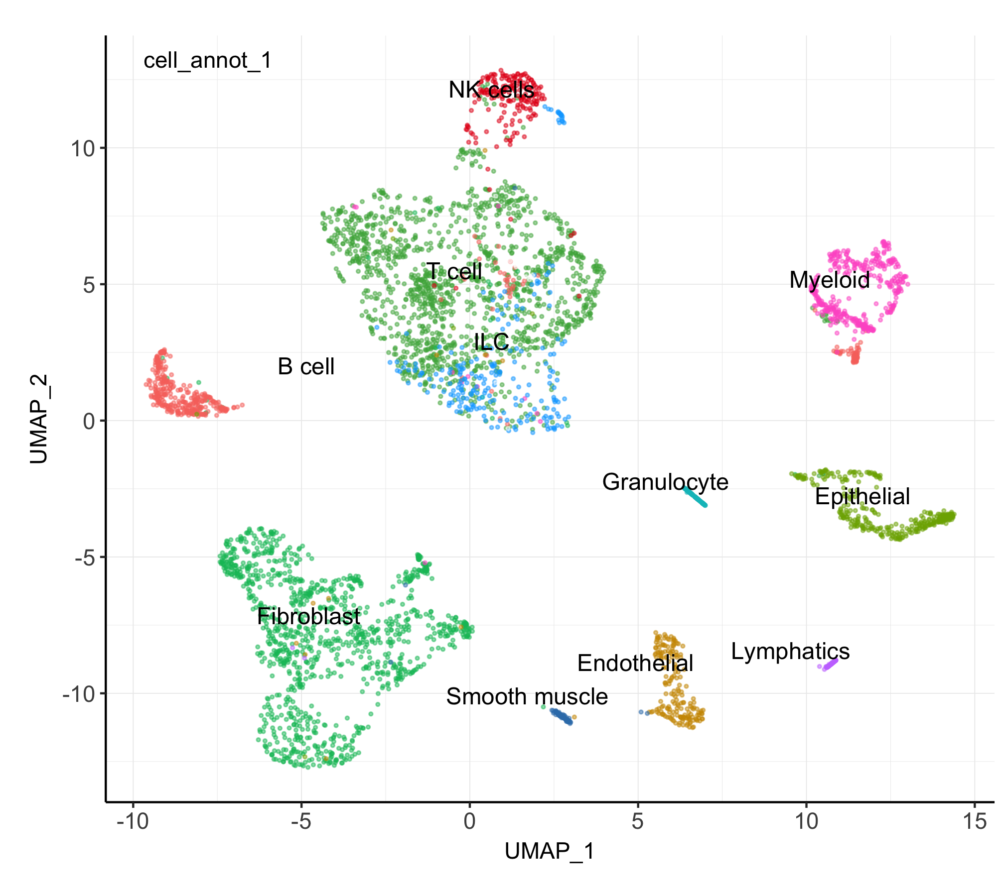

Deconvolut spatial and bulk data
================
3/17/23

### Load data and libraries

``` r
##################
# LOAD LIBRARIES #
##################
library(tidyverse)
library(Seurat)
library(SeuratObject)
library(tidyseurat)
library(openxlsx)

library(RColorBrewer)
library(cowplot)
library(patchwork)

library(snowfall)
library(scran)
library(NMF)
library(gplots)
library(BiocParallel)

# library("devtools");
# remotes::install_github("czarnewski/niceRplots")
# remotes::install_github("renozao/xbioc") #, dependencies = FALSE
# remotes::install_github("meichendong/SCDC")
library(SCDC)
library(Biobase)
source("../bin/plotting_functions.R")
source("../bin/spatial_visualization.R")

#########
# PATHS #
#########
input_dir_s <- "../results/03_clustering_st_data/"
input_dir_r <- "../results/04_DGE_ref_data/"
result_dir <- "../results/04_deconvolution_st_data/"
marker_dir <- "./marker_genes/"
bulk_path <- "/Users/vilkal/Raw_data/Bulk_Transcriptomics/Raw_counts_matrix.csv"
if( isFALSE(dir.exists(result_dir)) ) { dir.create(result_dir,recursive = TRUE) }
if( isFALSE(dir.exists(marker_dir)) ) { dir.create(marker_dir,recursive = TRUE) }

#############
# LODA DATA #
#############
DATA_st <- readRDS(paste0(input_dir_s,"seuratObj_clustered_filt.RDS"))
DATA_r <- readRDS(paste0(input_dir_r,"seuratObj_clustered.RDS"))
cell_id <- read.xlsx("../../Spatial_DMPA/data/Reference_data/annotation_single_cell.xlsx")
markers_genes <- readRDS(paste0(input_dir_r,"markers_genes.RDS"))

Bulk_data <- read_csv(bulk_path)
bulk_meta <- read_csv("/Users/vilkal/Raw_data/Clinincal_data/Clinical_visit_3_updateOct2022_wSampleInfo.csv")
```

### SCDC deconcolution steps

1.  subset the reference dataset to get more equal number of cells for
    each cluster
2.  Normalize the data and run UMAP
3.  select top marker genes
4.  Create expression set
5.  run deconvolution

### Subset scRNA reference dataset

``` r
# filter spots with too few reads
DATA_st_filt <- DATA_st  %>%
  filter(., nFeature_RNA > 200)

dim(DATA_st@assays$RNA@counts)
```

    [1] 22026  6598

``` r
dim(DATA_st_filt@assays$RNA@counts)
```

    [1] 22026  6578

``` r
#sum(DATA_st_filt@assays$RNA@counts[,"P031_TGCCTTGCCCTTACGG"])

# creating a subseted object with 200 spots selected from each cluster
DATA_sub <- DATA_r %>%
    filter(., .cell %in% WhichCells(., downsample = 200)) %>%
    SetIdent(., value = "Clusters")
      
table(DATA_r$Clusters)
```


       0    1    2    3    4    5    6    7    8    9   10   11   12   13   14   15 
    1952 1920 1763 1712 1619 1466 1454 1450  864  808  684  596  587  548  462  445 
      16   17   18   19   20   21   22   23   24   25   26   27   28 
     407  334  317  251  197  160  121   98   87   78   66   54   39 

``` r
table(DATA_sub$Clusters)
```


      0   1   2   3   4   5   6   7   8   9  10  11  12  13  14  15  16  17  18  19 
    200 200 200 200 200 200 200 200 200 200 200 200 200 200 200 200 200 200 200 200 
     20  21  22  23  24  25  26  27  28 
    197 160 121  98  87  78  66  54  39 

``` r
# run normalization and dimensionality reduction
# only necessary to get new subseted UMAP
DATA_sub <- DATA_sub %>%
  SCTransform(., ncells = 3000, verbose = FALSE, method = "poisson") %>% 
  RunPCA(verbose = FALSE) %>%
  RunUMAP(dims = 1:30)
```

### Plot UMAP of subseted reference data

``` r
# dev.new(width=6.6929133858, height=6.6929133858, noRStudioGD = TRUE)
p <- plot_clusters.fun(DATA_sub, cluster="Clusters", red = "UMAP", txt_size = 11)
p
```



### Select genes for deconvolution

``` r
# Identify the top genes that have a high difference in expression
top30 <- markers_genes %>%
  filter(.$gene %in% rownames(DATA_st@assays$RNA@counts)) %>%
  group_by(cluster) %>%
  top_n(-50, p_val_adj) %>%
  top_n(40, pct.diff) %>%
  top_n(30, log.pct.diff) 

# remove all VDJ-genes from list of HVG
# remove <- str_subset(top30$gene, "^IGH|^IGK|^IGL|^TRA|^TRB|^TRD|^TRG")
# top25_gr <- top25 %>%
#   ungroup() %>%
#   filter(., !(.$gene %in% remove)) %>%
#   group_by(cluster) %>%
#   group_split() %>%
#   set_names(., seq(0, length(.)-1) )

m_feats <- unique(as.character(top30$gene))
```

### Create ExpressionSet

``` r
# Create Expression Sets
eset_SC <- ExpressionSet(assayData = as.matrix(DATA_r@assays$RNA@counts[m_feats,
    ]), phenoData = AnnotatedDataFrame(DATA_r@meta.data))
eset_ST <- ExpressionSet(assayData = as.matrix(DATA_st_filt@assays$RNA@counts[m_feats,
    ]), phenoData = AnnotatedDataFrame(DATA_st_filt@meta.data))

bulk <- Bulk_data %>%
  select(-entrez, -length) %>%
  group_by(symbol) %>% 
  summarise_all(sum) %>%
  filter(!(is.na(.$symbol))) %>%
  filter(.$symbol %in% m_feats) %>%
  column_to_rownames(., var = "symbol")

eset_B <- ExpressionSet(assayData = as.matrix(bulk[m_feats,]))
```

## Deconvolution

``` r
################
# BULK DECONV. #
#################
deconvolution <- SCDC::SCDC_prop(bulk.eset = eset_B, sc.eset = eset_SC, 
                                 ct.varname = "Clusters",
                                 ct.sub = as.character(unique(eset_SC$Clusters)))

saveRDS(deconvolution, paste0(result_dir,"deconvolution_bulk_scdc.RDS"))
# deconvolution <- readRDS(paste0(result_dir,"deconvolution_bulk.RDS"))

###################
# SPATIAL DECONV. #
###################
deconvolution <- SCDC::SCDC_prop(bulk.eset = eset_ST, sc.eset = eset_SC, 
                                 ct.varname = "Clusters",
                                 ct.sub = as.character(unique(eset_SC$Clusters)))

saveRDS(deconvolution, paste0(result_dir,"deconvolution_scdc.RDS"))

head(deconvolution$prop.est.mvw)
```

### Add single cell deconvolution matrix to seurat object

``` r
deconvolution <- readRDS(paste0(result_dir,"deconvolution_scdc.RDS"))
all_spots <- c(rownames(deconvolution$prop.est.mvw), colnames(DATA_st)) %>% unique(.)

# Create empty matrix and populate with SCDC results
temp <- Matrix::Matrix(0, 
                 nrow = ncol(deconvolution$prop.est.mvw), 
                 ncol = length(all_spots), 
                 dimnames = list(colnames(deconvolution$prop.est.mvw), all_spots))

temp[,rownames(deconvolution$prop.est.mvw)] <- t(deconvolution$prop.est.mvw)
temp <- temp[,colnames(DATA_st)]

# take the deconvolution output and add it to the Seurat object as a new assay.
DATA_st@assays[["SCDC"]] <- CreateAssayObject(data = temp)
DATA_st@assays$SCDC@key <- "scdc_"
```

### Add cell annotation to seurat object

``` r
# This annotation will duplicate the spots it cannot be added directly to the SeuratObject
cell_type <- c("fibroblasts","fibroblasts","immune","immune","immune","immune","immune","immune","immune","fibroblasts","immune","endothelial","epithelial","immune","fibroblasts","fibroblasts","immune","immune","immune","fibroblasts","immune","epithelial","fibroblasts","granulocytes","immune","immune","endothelial","immune","immune") %>% set_names(., as.character(0:28))

annot2 <- c("fibroblasts","fibroblasts","T-cell","T-cell","T-cell","T-cell","T-cell","T-cell","T-cell","fibroblasts","T-cell",NA,NA,"T-cell","fibroblasts","fibroblasts","myeloid",NA,"myeloid",NA,NA,NA,NA,NA,"T-cell","B cell",NA,"T-cell", NA) %>% set_names(., as.character(0:28))

# tibble(cell_type)

df <- DATA_st@assays$SCDC@data %>%
  as_tibble(., rownames = "clus") %>%
  pivot_longer(., cols = -clus, names_to = ".cell", values_to = "values") %>%
  filter(!(values==0)) %>% 
  #nest( data = -clus) %>%
  left_join(., select(as_tibble(DATA_st),.cell, Clusters, groups, sp_annot), by=".cell") %>%
  mutate(., cell_type = cell_type[as.character(.$clus)]) %>%
  mutate(., cell_type_2 = annot2[as.character(.$clus)]) %>%
  mutate(., annot = paste0(.$clus, "_", cell_type_2)) %>%
  mutate(clus = factor(clus, levels = as.character(0:28)))

df <- df %>%
    #mutate(orig.ident = !!(facet)) %>%
    #mutate(orig.ident = factor(.data[["orig.ident"]], levels = lvls)) %>%
    #cbind(.,as_tibble(select(spe, groups))) %>%
  mutate(cell_type_2 = case_when(.$cell_type == "epithelial" & .$Clusters == "4" ~ 'ker_s1',
                                 .$cell_type == "epithelial" & .$Clusters == "7" ~ 'ker_b1',
                                 .$cell_type == "epithelial" & .$Clusters == "8" ~ 'ker_b2',
                                 .$cell_type == "epithelial" & .$Clusters == "9" ~ 'ker_int',
                                 .$cell_type == "epithelial" & .$Clusters == "10" ~ 'ker_s2',
                                 TRUE ~ .$cell_type_2))

# add cell type annotation to seurat object
DATA_st@assays[["misc"]] <- list(cell_annot = df)

  #mutate(Keratinocytes = ifelse(grepl("9|8|7", .$Clusters), ) 

# not in use
# decon_column <- DATA_st@assays$SCDC@data %>%
#   as_tibble(., rownames = ".cell") %>%
#   pivot_longer(., cols = -.cell, names_to = "decon_clus", values_to = "values") %>%
#   filter(!(values==0)) %>% nest( data = -decon_clus)

# DATA_st <- DATA_st %>% 
#   left_join(., decon_column, by=".cell")

# DATA_st <- DATA_st %>%
#   left_join(., select(df, .cell, decon="clus", cell_type, cell_type_2), by=".cell") %>%
#   relocate(any_of(c("decon", "cell_type", "cell_type_2")), .after = "nFeature_RNA")
```

### Save the cell annotation for the bulk data

``` r
deconvolution <- readRDS(paste0(result_dir,"deconvolution_bulk.RDS"))
gr <- set_names(bulk_meta$Contraception, bulk_meta$ID) 

decon_column_bulk <- deconvolution$prop.est.mvw %>%
  as_tibble(., rownames = "ID") %>%
  pivot_longer(., cols = -ID, names_to = "clus", values_to = "values") %>%
  mutate(clus = factor(clus, levels = as.character(0:28))) %>%
  #mutate(par_ID = str_extract(.$ID, "^P\\d\\d\\d")) %>%
  #filter(ID %in% DATA_st$orig.ident) %>%
  mutate(., groups = gr[.$ID])  %>%
  mutate(., cell_type = cell_type[as.character(.$clus)]) %>%
  mutate(., cell_type_2 = annot2[as.character(.$clus)]) %>%
  mutate(., annot = paste0(.$clus, "_", cell_type_2)) %>%
  mutate(., cell_type_2 = case_when(is.na(.$cell_type_2) ~ .$cell_type,
                                    TRUE ~ .$cell_type_2)) %>%
  mutate(., annot = case_when(is.na(.$cell_type_2) ~ paste0(.$clus, "_", .$cell_type),
                              TRUE ~ .$annot))

# saveRDS(deconvolution, paste0(result_dir,"deconvolution_bulk_cell_annotation.RDS"))
```

## Save seurat object

``` r
saveRDS(DATA_st, paste0(result_dir,"seuratObj_deconvolution_scdc_filt.RDS"))
# DATA_st <- readRDS(paste0(result_dir,"seuratObj_deconvolution.RDS"))
# DATA_st <- readRDS(paste0(result_dir,"seuratObj_deconvolution_scdc_filt.RDS"))
```

## Plotting deconvolution data

``` r
#################
# COLOUR PALLET #
#################
pal <- c(scales::hue_pal()(8),
             RColorBrewer::brewer.pal(9,"Set1"),
             RColorBrewer::brewer.pal(8,"Set2"),
             RColorBrewer::brewer.pal(8,"Accent"),
             RColorBrewer::brewer.pal(9,"Pastel1"),
             RColorBrewer::brewer.pal(8,"Pastel2") )

##########################
# CELL TYPE DISTRIBUTION #
##########################
# cell type distribution per cluster in each condition:
decon_column_st <- DATA_st@assays[["misc"]][["cell_annot"]] %>%
  arrange(clus) %>%
  mutate(annot = factor(annot, levels = unique(.$annot)))

ggplot(decon_column_st, aes(fill=annot, y=values, x=Clusters)) + 
  geom_bar(position="stack", stat="identity") +
  scale_fill_manual(values = pal) +
  facet_wrap(~groups + sp_annot) + theme_minimal() +
  guides(fill = guide_legend(override.aes = list(size=2), keyheight = .7, keywidth = .7))
```


### Keratins per cluster

``` r
# dev.new(height=4, width=6, noRStudioGD = TRUE)
######################
# GET KERATIN COUNTS #
######################
keratins <- rownames(DATA_st)[str_detect(rownames(DATA_st), "KRT[^AP|^DAP|^CAP].+")]
epi_markers <- c("KRT15", "KRT14", "KRT10", "KRT5", "KRT1", "LOR", "CDH1", "CD4") 
genes <- keratins

# counts of keratins per cluster in each condition:
ker <- DATA_st %>% 
  mutate(., FetchData(., vars = genes, slot = "data" )) %>%
  select(groups, Clusters, nCount_RNA, any_of(genes)) %>% # nCount_RNA,
  group_by(Clusters, groups) %>%
  summarise(across(where(is.numeric), ~sum(.))) %>%
  ungroup() %>%
  #mutate(across(any_of(genes), ~./.data[["nCount_RNA"]])) %>%
  select(-nCount_RNA) %>%
  pivot_longer(cols = -any_of(c("Clusters", "groups")), names_to="Genes", values_to = "values")

#######################
# PLOT KERATIN COUNTS #
#######################
ggplot(ker, aes(fill=Genes, y=values, x=Clusters)) +
  geom_bar(position="stack", stat="identity") +
  #scale_y_continuous(labels=scales::percent) +
  facet_wrap(~groups) + theme_minimal() +
  guides(fill = guide_legend(override.aes = list(size=2), keyheight = .7, keywidth = .7))
```


``` r
cell_type <- c("fibroblasts","fibroblasts","immune","immune","immune","immune","immune","immune","immune","fibroblasts","immune","endothelial","epithelial","immune","fibroblasts","fibroblasts","immune","immune","immune","fibroblasts","immune","epithelial","fibroblasts","granulocytes","immune","immune","endothelial","immune","immune") %>% set_names(., 0:28)

df <- tibble(cell_id =rep(0:28, 30)) %>%
   mutate(cell_name = cell_type[as.character(.$cell_id)])

ColourPalleteMulti <- function(df, group, subgroup){

  # Find how many colour categories to create and the number of colours in each
  categories <- aggregate(as.formula(paste(subgroup, group, sep="~" )), df, function(x) length(unique(x)))
  s <- c(RColorBrewer::brewer.pal(8,"Set2"), RColorBrewer::brewer.pal(8,"Set1"))
  e <- c(RColorBrewer::brewer.pal(8,"Pastel2"), RColorBrewer::brewer.pal(8,"Pastel1"))
  category.start <- (s[1:nrow(categories)]) # Set the top of the colour pallete
  category.end  <- (e[1:nrow(categories)]) # set the bottom

  # Build Colour pallette
  colours <- unlist(lapply(1:nrow(categories),
                          function(i){
                            colorRampPalette(colors = c(category.start[i],
                                                        category.end[i]))(categories[i,2])}))
  return(colours)
}
# choose higer and lower level:
# colours <- ColourPalleteMulti(candida_df, "rank", "taxName") %>% set_names(levels(candida_df$taxName))
#scales::show_col(scales::hue_pal()(8))
```

### Barplot of cell composition for bulk dataset

``` r
# dev.new(height=5, width=7, noRStudioGD = TRUE)
##################
# PLOT FUNCTIONS #
##################
get_order <- function(df, id, value){
  id <- enquo(id)
  id_name <- as_label(id)
  value <- enquo(value) 
  
  df %>%
    group_by(!!(id)) %>%
    add_tally(wt = !!(value), sort = F) %>%
    ungroup() %>%
    mutate(!!(id_name) := fct_reorder(!!(id), n))
    
}
get_order2 <- function(df, id, value_1, value_2){
  id <- enquo(id)
  id_name <- as_label(id)
  value_1 <- enquo(value_1)
  value_2 <- enquo(value_2)
  df %>%
    group_by(!!(id)) %>%
    add_tally(wt = !!(value_1), sort = F) %>%
    add_tally(wt = !!(value_2), sort = F, name = "n2") %>%
    ungroup() %>%
    mutate(!!(id_name) := fct_reorder2(!!(id), n, n2))
    
}
get_legend.fun <- function(df, title, id, colours){
  # https://stackoverflow.com/questions/73711918/how-to-remove-majority-of-blank-space-from-get-legend
  p <- ggplot() + geom_col(data = df, aes(fill=annot, y=values, x=.data[[id]])) +
    scale_fill_manual(title, values = colours[unique(pull(df, "annot"))]) +
    guides(fill = guide_legend(override.aes = list(size=2), keyheight = .7, keywidth = .7))
  l <- cowplot::get_legend(p)
  return(l)
}
#grid::grid.draw(c$legend[[1]])

####################
# ARRANGE ID ORDER #
####################
df <- decon_column_bulk %>%
  arrange(cell_type, cell_type_2) %>%
  mutate(annot = factor(.$annot, levels = unique(.$annot))) %>%
  mutate("14" = ifelse(.$clus == "14", .$values, NA)) %>%
  mutate("18" = ifelse(.$clus == "18", .$values, NA)) %>%
  #get_order2(., `18`, `14`)
  get_order(., id = `ID`,`14`)

colours <- ColourPalleteMulti(df, "cell_type", "annot") %>% set_names(levels(decon_column_bulk$annot))
# scales::show_col(colours)

##########
# LEGEND #
##########
c <- df %>%
  nest(data = -cell_type) %>%
  mutate(legend = pmap(., ~get_legend.fun(..2, ..1, "ID", colours)))

#################
# BULK BAR PLOT #
#################
bar <- ggplot(df, aes(fill=annot, y=values, x=ID)) + 
    geom_bar(position="stack", stat="identity") +
    theme_minimal() +
    scale_fill_manual(values = colours) +
    theme(axis.text.x = element_text(angle = 45, vjust = 0.5, hjust=1),
          legend.position = "none") +
    #facet_wrap(~group ) +
    facet_grid(cols = vars(groups), scales = "free_x", space = "free_x", switch = "x")

l <- plot_grid(plotlist = c$legend, nrow =3 , byrow = T ,
               rel_heights = c(1,1,3), rel_widths = c(.5,0.2),
               align = "hv", axis = "t")
plot_grid(bar, l ,rel_widths = c(1,.35))
```


### Barplot of cell composition for st dataset

``` r
# dev.new(height=5, width=6, noRStudioGD = TRUE)
decon_column_st <- DATA_st@assays[["misc"]][["cell_annot"]] %>%
  mutate(., cell_type_2 = case_when(is.na(.$cell_type_2) ~ .$cell_type,
                                    TRUE ~ .$cell_type_2)) %>%
  mutate(., annot = case_when(is.na(.$cell_type_2) ~ paste0(.$clus, "_", .$cell_type),
                              TRUE ~ .$annot))

####################
# ARRANGE ID ORDER #
####################
df <- decon_column_st %>%
  mutate(ID = str_extract(.$.cell, "^P\\d\\d\\d")) %>%
  arrange(cell_type, cell_type_2) %>%
  mutate(annot = factor(.$annot, levels = unique(.$annot))) %>%
  #mutate(decon_clus = factor(.$clus, levels = as.character(seq(1:28)))) %>%
  mutate("14" = ifelse(.$clus == "14", .$values, NA)) %>%
  mutate("fibroblast" = ifelse(grepl("14|1|22|0|9", .$clus), .$values, NA)) %>%
  #get_order2(., `18`, `14`)
  get_order(., id = `ID`,`fibroblast`)

colours <- ColourPalleteMulti(df, "cell_type", "annot") %>% set_names(levels(decon_column_st$annot))
# scales::show_col(colours)
##########
# LEGEND #
##########
c <- df %>%
  nest(data = -cell_type) %>%
  mutate(legend = pmap(., ~get_legend.fun(..2, ..1, ".cell", colours)))

###############
# ST BAR PLOT #
###############
bar <- ggplot(df, aes(fill=annot, y=values, x=ID)) + 
    geom_bar(position="stack", stat="identity") +
    theme_minimal() +
    scale_fill_manual(values = colours) +
    theme(axis.text.x = element_text(angle = 45, vjust = 0.5, hjust=1),
          legend.position = "none") +
    #facet_wrap(~group ) +
    facet_grid(cols = vars(groups), scales = "free_x", space = "free_x", switch = "x")

l <- plot_grid(plotlist = c$legend, nrow =3 , byrow = T , rel_heights = c(1,1,3), rel_widths = c(.5,0.2), align = "hv", axis = "t")
plot_grid(bar, l ,rel_widths = c(1,.7))
```


### Heatmap of bulk deconvolution

``` r
#install_github("jokergoo/ComplexHeatmap")
library(ComplexHeatmap)
#################
# COLOUR PALLET #
#################
col.pal <- function(df, col, n) {
          lable <- seq(max(df, na.rm = T), min(df, na.rm = T), length = n)
          #lable <- append(lable, 0, after = pos)
          col <- colorRampPalette(c(col))(n)
          #col <- brewer.pal(n=n, name=pal)
          #col <- append(col, "white", after = pos)
          col_fun = colorRamp2(lable, col)
}

# Colour pallet:
# lable <- seq(max(zscore), min(zscore), length = 8)
# lable <- append(lable, 0, after = 4)
# col <- brewer.pal(n=8, name="RdYlBu")
# col <- append(col, "white", after = 4)
# col_fun = colorRamp2(lable, col)

ptc_ss <- c("#364B9A", "#4A7BB7", "#6EA6CD", "#98CAE1", "#C2E4EF", "#EAECCC", "#FEDA8B", "#FDB366", "#F67E4B", "#DD3D2D", "#A50026")

##########
# MATRIX #
##########
matrix <- deconvolution$prop.est.mvw %>%
  as_tibble(., rownames = "ID") %>%
  arrange(ID) %>%
  pivot_longer(., cols = -ID, names_to = "decon_clus", values_to = "values") %>%
  group_by(decon_clus) %>%
  mutate(zscore = (values - mean(values))/sd(values)) %>%
  select(-values) %>%
  pivot_wider(., -c(ID), names_from = ID, 
              values_from = zscore, values_fn = sum ) %>%
  column_to_rownames(var = "decon_clus") %>%
  as.matrix()

# z-scores
zscore <- t(apply(matrix,1,function(i){scale(i,T,T)}))
colnames(zscore) <- colnames(matrix)
zscore[is.nan(zscore)] <- 0

##############
# ANNOTATION #
##############
annot <- meta %>%
  filter(Trx =="yes") %>%
  select(ID, HIVstatus, Contraception, Tissue_gr, BV_Diagnosis_v3) %>%
  column_to_rownames(var = "ID") %>%
  arrange(ID)

anno <- annot %>%
  HeatmapAnnotation(df = ., 
                    col = list(
                      Contraception = c("DMPA"='#FB5273', "none"='#4FCEEF'),
                      Tissue_gr = c("T1"="#0072B2", "T2"="#009E73", "T3"="#D55E00", "T4"="#CC79A7", "T5"="#E69F00"),
                      BV_Diagnosis_v3 = c("BV"="tomato", "Interm"="orange","Normal"="#d7d7d7"),
                      HIVstatus = c("neg"="#d7d7d7","pos"="tomato") 
                             ))
#colorRamp2(seq(0, 2, length.out=length(ptc_ss)), ptc_ss) strcture(ptc_ss) ptc_rnbwdcolorRamp2(c(0, 1, 2), c("blue", "white", "red"))
dim(matrix)
dim(annot)
#################
# PLOT HEATMAP #
################
(H <- Heatmap(matrix, 
             #col = genes.col,
             top_annotation = anno,
             show_column_names = T,
             show_row_names = T,
             #clustering_distance_rows= "spearman",
             #clustering_distance_columns=  "spearman",
             column_names_gp = grid::gpar(fontsize = 4),
             column_names_rot = 47,
             #direction = "horizontal"
             heatmap_legend_param = list(
               title = "Cell proportion \n(scaled)"
               #at = c(-4,-2,0,2, 4), 
               #labels = c("0.4%", "0.3%", "0.2%", "0.1%", "0%")
               )
             ) )
draw(H, merge_legend = TRUE)
```

### Cell types plotted on tissue

``` r
# dev.new(height=5.5, width=9, noRStudioGD = TRUE)
######################
# FACET WRAP CLUSTER #
#####################
# I want to plot the intensity of the cell population in 
clus_exp <- function(spe, clus_spe, clusters, gene, assay="RNA"){
  #c <- unique( pull(spe, as_label(clusters)))
  col=c("grey90","grey80","grey60", "blue4","navy","black")
  clus_col <- c("grey90","navy")
  clusters <- enquo(clusters)
  c <- unique( pull(clus_spe, !!(clusters))) %>% sort(.) %>% set_names()
    
  # Create Columns for induvidual clusters:
  clus_columns <- map(c, ~(clus_spe@meta.data[["Clusters"]] == .x)*1) %>% 
    map(.,~as.character(.x)) %>%
    set_names(., paste0("Clus_",names(.)))
  
  # Add the Cluster columns to seurat obj.
  clus_spe <- bind_cols(clus_spe, clus_columns)
  # Plot Individal plot for each cluster
  P <- {map(c, ~plot_clusters.fun(clus_spe, color=clus_col, paste0("Clus_",.x), 
                                  red="umap_harmony"), txt_size=20, dot_size = 0.2, lable=F)}
  #clus_plot <- plot_clusters.fun(spe, color=col, paste0("Clus_","2"), red="umapharmony", txt_size=20, lable=F)
  
  filt_empty<- function(x, n_spot = 0) {x[c(TRUE, colSums(select(x, !(.cell))) > n_spot)]}
  
  decon_columns <- spe@assays$SCDC@data %>% 
    Matrix::t() %>%
    as_tibble(., rownames = ".cell") %>% 
    mutate_if(is.numeric, ~1 * (. > 0)) %>%
    filt_empty(., 0) %>%
    mutate(across(-.cell, ~as.character(.x)))
    
    c <- intersect(as.character(c), colnames(decon_columns))
    
  PLOTS <- tibble("clus" = c) %>%
    #sample_n(., size = 2) %>%
    mutate(plots = pmap(.,
      ~plot_st_feat.fun( spe,  # filter(spe, decon_columns[[..1]]=="1"), # removes spots with no % of given cell type
        assay=assay,
        geneid = ..1,#"KRT15", #"PTPRC",#"sp_annot",#"CDH1",
        zoom = "zoom", #"zoom"
        col = col,
        maxs = max(spe@assays$SCDC@data[..1,],0.1),
        #annot_col = "#dbd9d9",
        annot_line = .1,
        img_alpha = 0,
        point_size = 0.5)
      )) %>% #PLOTS <- PLOTS %>%
    mutate(l = map(.$plots, ~length(.x))) %>%
    #mutate(plots = )
    mutate(clus_plot = ifelse(.$clus %in% names(P), P[.$clus], NA)) %>%
    mutate(., combined = pmap(.,
      ~plot_grid( ..4, ..2, ncol=2, rel_widths=c(2,4)) ))

  # PLOTS$combined[[1]]
  #PLOTS$data[[1]]

  combined <- plot_grid( plotlist=PLOTS$combined, ncol=1, rel_heights=rep_len(1, length(PLOTS$combined) ) )

  return(list(c = combined, eg = list(PLOTS$combined[11], PLOTS$combined[21])))
}
Key(DATA_st@reductions$umap_harmony) <- "umapharmony_"

# spe <- DATA_st
# clus_spe <- DATA_r
# clusters <- sym("Clusters")
# gene <- "CDH1"
# assay <- "SCDC"
# clus_col <- c("grey90","navy")
#gr <- c("P107", "P108", "P114", "P097","P118", "P105", "P080", "P031")
#DATA_r_ <- DATA_r %>% filter(Clusters == "22" | Clusters == "12")
#CLUS_PLOTS <- clus_exp(DATA_st, DATA_r_, clusters=Clusters, assay="SCDC")
CLUS_PLOTS <- clus_exp(DATA_st, DATA_r, clusters=Clusters, assay="SCDC")

ggsave(paste0("./Figures/04/", "clus_plots.pdf"),
       CLUS_PLOTS$c, height = 60, width = 10, limitsize = FALSE)

plot_grid( CLUS_PLOTS$eg[[1]][[1]], CLUS_PLOTS$eg[[2]][[1]], ncol=1) 
```


## Session info

``` r
sessionInfo()
```

    R version 4.1.2 (2021-11-01)
    Platform: x86_64-apple-darwin13.4.0 (64-bit)
    Running under: macOS Big Sur 10.16

    Matrix products: default
    BLAS/LAPACK: /Users/vilkal/Applications/miniconda3/envs/Spatial_DMPA/lib/libopenblasp-r0.3.21.dylib

    locale:
    [1] sv_SE.UTF-8/sv_SE.UTF-8/sv_SE.UTF-8/C/sv_SE.UTF-8/sv_SE.UTF-8

    attached base packages:
    [1] stats4    stats     graphics  grDevices utils     datasets  methods  
    [8] base     

    other attached packages:
     [1] SCDC_0.0.0.9000             BiocParallel_1.28.3        
     [3] gplots_3.1.3                NMF_0.25                   
     [5] cluster_2.1.4               rngtools_1.5.2             
     [7] registry_0.5-1              scran_1.22.1               
     [9] scuttle_1.4.0               SingleCellExperiment_1.16.0
    [11] SummarizedExperiment_1.24.0 Biobase_2.54.0             
    [13] GenomicRanges_1.46.1        GenomeInfoDb_1.30.1        
    [15] IRanges_2.28.0              S4Vectors_0.32.4           
    [17] BiocGenerics_0.40.0         MatrixGenerics_1.6.0       
    [19] matrixStats_0.63.0          snowfall_1.84-6.2          
    [21] snow_0.4-4                  patchwork_1.1.2            
    [23] cowplot_1.1.1               RColorBrewer_1.1-3         
    [25] openxlsx_4.2.5.1            tidyseurat_0.5.3           
    [27] ttservice_0.2.2             SeuratObject_4.1.3         
    [29] Seurat_4.3.0                forcats_0.5.2              
    [31] stringr_1.5.0               dplyr_1.0.10               
    [33] purrr_1.0.1                 readr_2.1.3                
    [35] tidyr_1.2.1                 tibble_3.1.8               
    [37] ggplot2_3.4.0               tidyverse_1.3.2            

    loaded via a namespace (and not attached):
      [1] scattermore_0.8           pkgmaker_0.32.7          
      [3] bit64_4.0.5               knitr_1.41               
      [5] irlba_2.3.5.1             DelayedArray_0.20.0      
      [7] data.table_1.14.6         KEGGREST_1.34.0          
      [9] RCurl_1.98-1.9            doParallel_1.0.17        
     [11] generics_0.1.3            ScaledMatrix_1.2.0       
     [13] RSQLite_2.2.20            RANN_2.6.1               
     [15] future_1.30.0             bit_4.0.5                
     [17] tzdb_0.3.0                spatstat.data_3.0-0      
     [19] xml2_1.3.3                lubridate_1.9.0          
     [21] httpuv_1.6.8              assertthat_0.2.1         
     [23] gargle_1.2.1              xfun_0.36                
     [25] hms_1.1.2                 evaluate_0.19            
     [27] promises_1.2.0.1          fansi_1.0.3              
     [29] caTools_1.18.2            dbplyr_2.2.1             
     [31] readxl_1.4.1              igraph_1.3.5             
     [33] DBI_1.1.3                 htmlwidgets_1.6.1        
     [35] spatstat.geom_3.0-3       googledrive_2.0.0        
     [37] ellipsis_0.3.2            backports_1.4.1          
     [39] gridBase_0.4-7            deldir_1.0-6             
     [41] sparseMatrixStats_1.6.0   vctrs_0.5.1              
     [43] ROCR_1.0-11               abind_1.4-5              
     [45] cachem_1.0.6              withr_2.5.0              
     [47] progressr_0.13.0          vroom_1.6.0              
     [49] checkmate_2.1.0           fastmatrix_0.4-1245      
     [51] sctransform_0.3.5         goftest_1.2-3            
     [53] lazyeval_0.2.2            crayon_1.5.2             
     [55] spatstat.explore_3.0-5    labeling_0.4.2           
     [57] edgeR_3.36.0              pkgconfig_2.0.3          
     [59] nlme_3.1-161              rlang_1.0.6              
     [61] globals_0.16.2            lifecycle_1.0.3          
     [63] miniUI_0.1.1.1            modelr_0.1.10            
     [65] rsvd_1.0.5                cellranger_1.1.0         
     [67] polyclip_1.10-4           lmtest_0.9-40            
     [69] Matrix_1.5-3              zoo_1.8-11               
     [71] reprex_2.0.2              ggridges_0.5.4           
     [73] googlesheets4_1.0.1       pheatmap_1.0.12          
     [75] png_0.1-8                 viridisLite_0.4.1        
     [77] bitops_1.0-7              KernSmooth_2.23-20       
     [79] Biostrings_2.62.0         blob_1.2.3               
     [81] DelayedMatrixStats_1.16.0 parallelly_1.33.0        
     [83] spatstat.random_3.0-1     beachmat_2.10.0          
     [85] scales_1.2.1              memoise_2.0.1            
     [87] magrittr_2.0.3            plyr_1.8.8               
     [89] ica_1.0-3                 zlibbioc_1.40.0          
     [91] compiler_4.1.2            dqrng_0.3.0              
     [93] fitdistrplus_1.1-8        cli_3.6.0                
     [95] XVector_0.34.0            listenv_0.9.0            
     [97] pbapply_1.6-0             MASS_7.3-58.1            
     [99] tidyselect_1.2.0          stringi_1.7.12           
    [101] yaml_2.3.6                BiocSingular_1.10.0      
    [103] locfit_1.5-9.7            ggrepel_0.9.2            
    [105] grid_4.1.2                tools_4.1.2              
    [107] timechange_0.2.0          future.apply_1.10.0      
    [109] parallel_4.1.2            rstudioapi_0.14          
    [111] bluster_1.4.0             foreach_1.5.2            
    [113] metapod_1.2.0             gridExtra_2.3            
    [115] farver_2.1.1              Rtsne_0.16               
    [117] digest_0.6.31             BiocManager_1.30.19      
    [119] shiny_1.7.4               Rcpp_1.0.9               
    [121] broom_1.0.2               later_1.3.0              
    [123] RcppAnnoy_0.0.20          httr_1.4.4               
    [125] AnnotationDbi_1.56.2      L1pack_0.41-2            
    [127] colorspace_2.0-3          rvest_1.0.3              
    [129] fs_1.5.2                  tensor_1.5               
    [131] reticulate_1.27           splines_4.1.2            
    [133] uwot_0.1.14               statmod_1.5.0            
    [135] spatstat.utils_3.0-1      sp_1.5-1                 
    [137] xbioc_0.1.19              plotly_4.10.1            
    [139] xtable_1.8-4              jsonlite_1.8.4           
    [141] R6_2.5.1                  pillar_1.8.1             
    [143] htmltools_0.5.4           mime_0.12                
    [145] nnls_1.4                  glue_1.6.2               
    [147] fastmap_1.1.0             BiocNeighbors_1.12.0     
    [149] codetools_0.2-18          utf8_1.2.2               
    [151] lattice_0.20-45           spatstat.sparse_3.0-0    
    [153] leiden_0.4.3              gtools_3.9.4             
    [155] zip_2.2.2                 survival_3.5-0           
    [157] limma_3.50.3              rmarkdown_2.20           
    [159] munsell_0.5.0             GenomeInfoDbData_1.2.7   
    [161] iterators_1.0.14          haven_2.5.1              
    [163] reshape2_1.4.4            gtable_0.3.1             

### BayesPrism

### Paulos code
