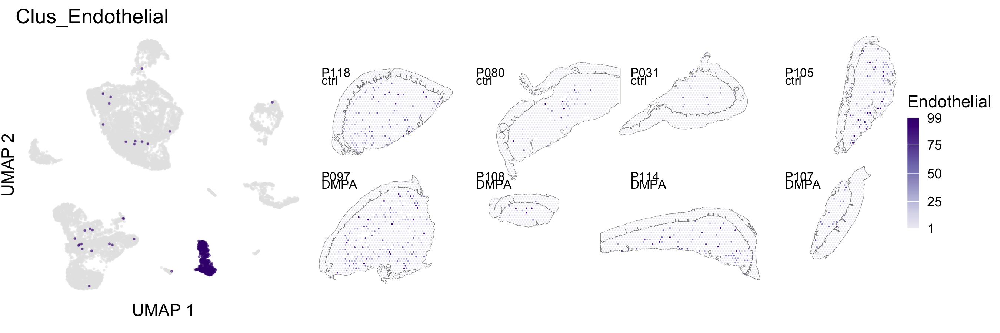

Deconvolut spatial and bulk data
================
4/9/24

### Load data and libraries

``` r
##################
# LOAD LIBRARIES #
##################
library(tidyverse)
library(Seurat)
library(SeuratObject)
library(tidyseurat)
library(openxlsx)

library(RColorBrewer)
library(cowplot)
library(patchwork)

library(snowfall)
library(scran)
library(NMF)
library(gplots)
library(BiocParallel)

# library("devtools");
# remotes::install_github("czarnewski/niceRplots")
# BiocManager::install("scran")
# remotes::install_github("renozao/xbioc") #, dependencies = FALSE
# remotes::install_github("meichendong/SCDC")

library(SCDC)
library(Biobase)
source("../bin/plotting_functions.R")
source("../bin/spatial_visualization.R")

#########
# PATHS #
#########
input_dir_s <- "../results/03_clustering_st_data/"
input_dir_r <- "../results/06_plot_annotation_ref_data/"
result_dir <- "../results/04_deconvolution_st_data/"
bulk_path <- "/Users/vilkal/Raw_data/Bulk_Transcriptomics/Visit_3/Raw_counts_matrix.csv"
if( isFALSE(dir.exists(result_dir)) ) { dir.create(result_dir,recursive = TRUE) }

#############
# LODA DATA #
#############
DATA_st <- readRDS(paste0(input_dir_s,"seuratObj_clustered.RDS"))
DATA_r <- readRDS(paste0(input_dir_r,"seuratObj_annotated_celltypes.RDS"))
cell_id <- read.xlsx("../../Spatial_DMPA/data/Reference_data/annotation_single_cell.xlsx", sheet = "edited")
markers_genes_clus <- readRDS(paste0("../results/04_DGE_ref_data/","markers_genes.RDS"))
#markers_genes_annot1 <- readRDS(paste0(input_dir_r,"markers_genes_annot1.RDS"))
#markers_genes_annot2 <- readRDS(paste0(input_dir_r,"markers_genes_annot2.RDS"))
markers_genes_annot1 <- readRDS(paste0(input_dir_r,"markers_genes_annot1_filt.RDS"))
markers_genes_annot2 <- readRDS(paste0(input_dir_r,"markers_genes_annot2_filt.RDS"))

Bulk_data <- read_csv(bulk_path)
bulk_meta <- read_csv("/Users/vilkal/Raw_data/Clinical_data/Clinical_visit_2_3_updateJune2023_wSampleInfo.csv")

epi_clus <- "^5$|^6$|^7|^9"
```

### SCDC deconcolution steps

1.  subset the reference dataset to get more equal number of cells for
    each cluster
2.  Normalize the data and run UMAP
3.  select top marker genes
4.  Create expression set
5.  run deconvolution

### Subset scRNA reference dataset

``` r
# filter spots with too few reads
DATA_st_filt <- DATA_st  %>%
  filter(., nFeature_RNA > 200)

dim(DATA_st@assays$RNA@counts)
```

    [1] 22026  6598

``` r
dim(DATA_st_filt@assays$RNA@counts)
```

    [1] 22026  6578

``` r
#sum(DATA_st_filt@assays$RNA@counts[,"P031_TGCCTTGCCCTTACGG"])

# creating a subseted object with 200 spots selected from each cluster
set.seed(1)
DATA_sub <- DATA_r %>%
    filter(., .cell %in% WhichCells(., downsample = 200)) %>%
    SetIdent(., value = "Clusters")
      
table(DATA_r$Clusters)
```


       0    1    2    3    4    5    6    7    8    9   10   11   12   13   14   15 
    1156 1008  917  750  902 1184  872  772  637  586  396  571  398  423  367  420 
      16   17   18   19   20   21   22   23   24   25   26   27   28 
     389  299  275  151  157  145   97   91   45   71   66   24   10 

``` r
table(DATA_sub$Clusters)
```


      0   1   2   3   4   5   6   7   8   9  10  11  12  13  14  15  16  17  18  19 
    200 200 200 200 200 200 200 200 200 200 200 200 200 200 200 200 200 200 200 151 
     20  21  22  23  24  25  26  27  28 
    157 145  97  91  45  71  66  24  10 

### Plot UMAP of subseted reference data

``` r
# dev.new(width=6.6929133858, height=6.6929133858, noRStudioGD = TRUE)
p <- plot_clusters.fun(DATA_sub, cluster="cell_annot_1", red = "UMAP", txt_size = 11)
p
```


### Select genes for deconvolution

``` r
# Identify the top genes that have a high difference in expression
top30_clus <- markers_genes_clus %>%
  filter(.$gene %in% rownames(DATA_st@assays$RNA@counts)) %>%
  group_by(cluster) %>%
  top_n(-50, p_val_adj) %>%
  top_n(40, pct.diff) %>%
  top_n(30, log.pct.diff) 

top30_annot1 <- markers_genes_annot1 %>%
  filter(.$gene %in% rownames(DATA_st@assays$RNA@counts)) %>%
  group_by(cluster) %>%
  top_n(-50, p_val_adj) %>%
  top_n(40, pct.diff) %>%
  top_n(30, log.pct.diff) 

top30_annot2 <- markers_genes_annot2 %>%
  filter(.$gene %in% rownames(DATA_st@assays$RNA@counts)) %>%
  group_by(cluster) %>%
  top_n(-50, p_val_adj) %>%
  top_n(40, pct.diff) %>%
  top_n(30, log.pct.diff) 

# remove all VDJ-genes from list of HVG
# remove <- str_subset(top30$gene, "^IGH|^IGK|^IGL|^TRA|^TRB|^TRD|^TRG")
# top25_gr <- top25 %>%
#   ungroup() %>%
#   filter(., !(.$gene %in% remove)) %>%
#   group_by(cluster) %>%
#   group_split() %>%
#   set_names(., seq(0, length(.)-1) )

m_feats_clus <- unique(as.character(top30_clus$gene))
m_feats_annot1 <- unique(as.character(top30_annot1$gene))
m_feats_annot2 <- unique(as.character(top30_annot2$gene))
```

### Create ExpressionSet

``` r
bulk <- Bulk_data %>%
  select(-entrez, -length) %>%
  group_by(symbol) %>% 
  summarise_all(sum) %>%
  filter(!(is.na(.$symbol))) %>%
  #filter(.$symbol %in% m_feats) %>%
  column_to_rownames(., var = "symbol")

deconvolution <- tibble(genes = list("clus" = m_feats_clus, "annot1" = m_feats_annot1, "annot2" = m_feats_annot2),
                        column = c("Clusters", "cell_annot_1", "cell_annot_2"))

# Create Expression Sets
deconvolution <- deconvolution %>%
  mutate(eset_SC = pmap(., ~ExpressionSet(
                assayData = as.matrix(DATA_r@assays$RNA@counts[..1,]), 
                phenoData = AnnotatedDataFrame(DATA_r@meta.data))) 
         ) %>%
  mutate(eset_ST = pmap(., ~ExpressionSet(
                assayData = as.matrix(DATA_st_filt@assays$RNA@counts[..1,]), 
                phenoData = AnnotatedDataFrame(DATA_st_filt@meta.data))) 
         ) %>%
  mutate(eset_B = pmap(., ~ExpressionSet(
                assayData = as.matrix(bulk[..1,]) )) ) %>%
  mutate(ct.sub = pmap(., ~as.character(unique(..3[[..2]])))) %>%
  mutate(ct.sub = map(ct.sub, ~replace_na(.x, "unknown")))
```

## Deconvolution

``` r
###################
# SPATIAL DECONV. #
###################
deconvolution <- deconvolution %>%
  mutate(decon_ST = pmap(., ~SCDC::SCDC_prop(
    bulk.eset = ..4, sc.eset = ..3, 
    ct.varname = ..2, ct.sub = ..6)
    ))
################
# BULK DECONV. #
#################
deconvolution <- deconvolution %>%
  mutate(decon_bulk = pmap(., ~SCDC::SCDC_prop(
    bulk.eset = ..5, sc.eset = ..3, 
    ct.varname = ..2, ct.sub = ..6)
                           ))

saveRDS(deconvolution, paste0(result_dir,"deconvolution_scdc_filt_ST.RDS"))
pmap(deconvolution, ~write_csv(as_tibble(..8$prop.est.mvw, rownames = "ID"), 
                               paste0(result_dir,"deconvolution_bulk_",..2,".csv")))

head(deconvolution$decon_ST$annot1$prop.est.mvw)
```

### Add single cell deconvolution matrix to seurat object

``` r
all_spots <- c(rownames(deconvolution$decon_ST[[1]]$prop.est.mvw), colnames(DATA_st)) %>% unique(.)

# Create empty matrix and populate with SCDC results
scdc_mtx.fun <- function(decon, all_spots){
  temp <- Matrix::Matrix(0, 
                 nrow = ncol(decon), 
                 ncol = length(all_spots), 
                 dimnames = list(colnames(decon), all_spots))

temp[,rownames(decon)] <- t(decon)
temp <- temp[,colnames(DATA_st)]
return(temp)
}

deconvolution %>%
  mutate(matrix_ST = pmap(., ~scdc_mtx.fun(..7$prop.est.mvw, all_spots) )) %>%
  pmap(., ~CreateAssayObject(data = ..8)) %>%

  # take the deconvolution output and add it to the Seurat object as a new assay.
  imap(., ~{.x ->> DATA_st@assays[[paste0("SCDC_",.y)]] }) %>%
  imap(., ~{ paste0("scdc_",.y, "_") ->> DATA_st@assays[[paste0("SCDC_",.y)]]@key }) 
```

### Add cell annotation to seurat object

``` r
# Cell annotations:
cell_type <- set_names(cell_id$annotation_level1, as.character(cell_id$cluster))
cell_annot_1 <- set_names(cell_id$annotation_level2, as.character(cell_id$cluster))
cell_annot_2 <- set_names(cell_id$annotation_level3, as.character(cell_id$cluster))

# tibble(cell_type)

df <- DATA_st@assays$SCDC_clus@data %>%
  as_tibble(., rownames = "clus") %>%
  pivot_longer(., cols = -clus, names_to = ".cell", values_to = "values") %>%
  filter(!(values==0)) %>% 
  #nest( data = -clus) %>%
  left_join(., select(as_tibble(DATA_st),.cell, ID="orig.ident",
                      layers, Clusters, groups, sp_annot), by=".cell") %>%
  #group_by(orig.ident) %>%
  mutate(Percent = 100 *values/sum(values), .by = "ID")  %>%
  mutate(., cell_type = cell_type[as.character(.$clus)]) %>%
  mutate(., cell_annot_1 = cell_annot_1[as.character(.$clus)]) %>%
  mutate(., cell_annot_2 = cell_annot_2[as.character(.$clus)]) %>%
  #mutate(., annot = paste0(.$clus, "_", cell_annot_2)) %>%
  mutate(clus = factor(clus, levels = as.character(0:28))) 

# This annotation will duplicate the spots, so it cannot be added directly to the SeuratObject
# instead its added to the miscellaneous assay 

DATA_st@assays[["misc"]] <- list(cell_annot = df)
```

### Save seurat object

``` r
saveRDS(DATA_st, paste0(result_dir,"seuratObj_deconvolution_scdc.RDS"))
# DATA_st <- readRDS(paste0(result_dir,"seuratObj_deconvolution_scdc.RDS"))
```

### Load allready saved data

### Save the cell annotation for the bulk data

``` r
gr <- set_names(bulk_meta$Contraception, bulk_meta$ID) 

decon_column_bulk <- deconvolution$decon_bulk$clus$prop.est.mvw %>%
  as_tibble(., rownames = "ID") %>%
  pivot_longer(., cols = -ID, names_to = "clus", values_to = "values") %>%
  mutate(clus = factor(clus, levels = as.character(0:28))) %>%
  #mutate(par_ID = str_extract(.$ID, "^P\\d\\d\\d")) %>%
  #filter(ID %in% DATA_st$orig.ident) %>%
  mutate(., groups = gr[.$ID])  %>%
  mutate(., cell_type = cell_type[as.character(.$clus)]) %>%
  mutate(., cell_annot_1 = cell_annot_1[as.character(.$clus)]) %>%
  mutate(., cell_annot_2 = cell_annot_2[as.character(.$clus)])

write_csv(decon_column_bulk, paste0(result_dir,"decon_bulk_annotation.csv"))
# decon_column_bulk <- read_csv(paste0(result_dir,"decon_bulk_annotation.csv"))
```

### Load allready saved data

### Keratins per cluster

``` r
# dev.new(height=4, width=6, noRStudioGD = TRUE)
######################
# GET KERATIN COUNTS #
######################
DefaultAssay(object=DATA_st) <- "RNA"
keratins <- rownames(DATA_st)[str_detect(rownames(DATA_st), "KRT[^AP|^DAP|^CAP].+")]
epi_markers <- c("KRT15", "KRT14", "KRT10", "KRT5", "KRT1", "LOR", "CDH1", "CD4") 
genes <- keratins

# counts of keratins per cluster in each condition:
ker <- DATA_st %>% 
  mutate(., FetchData(., vars = genes, slot = "data" )) %>%
  select(groups, layers, nCount_RNA, any_of(genes)) %>% 
  #mutate(layers = ifelse(grepl("\\d", .$layers), paste0("Clus_",.$layers), .$layers)) %>%
  group_by(layers, groups) %>%
  summarise(across(where(is.numeric), ~sum(.))) %>%
  ungroup() %>%
  select(-nCount_RNA) %>%
  pivot_longer(cols = -any_of(c("layers", "groups")), names_to="Genes", values_to = "values") %>%
  mutate(Percent_gr = 100 *values/sum(values), .by = c("layers", "groups"))

#################
# COLOUR PALLET #
#################
pal <- c(#scales::hue_pal()(8),
         c("#4E79A7", "#F28E2B", "#E15759", "#76B7B2", "#59A14F", "#EDC948", "#B07AA1", "#FF9DA7", "#9C755F", "#BAB0AC"),
         RColorBrewer::brewer.pal(8,"Set2"),
         RColorBrewer::brewer.pal(8,"Accent"),
         RColorBrewer::brewer.pal(8,"Pastel2"),
         RColorBrewer::brewer.pal(9,"Pastel1"),
         RColorBrewer::brewer.pal(9,"Set1")
          )

#######################
# PLOT KERATIN COUNTS #
#######################
ggplot(ker, aes(fill=Genes, y=Percent_gr, x=layers)) +
  geom_bar(position="stack", stat="identity") +
  #scale_y_continuous(labels=scales::percent) +
  scale_fill_manual(values = pal) +
  facet_wrap(~groups) + theme_minimal() +
  theme(axis.text.x = element_text(angle = 45, vjust = 1.4, hjust=1)) +
  guides(fill = guide_legend(override.aes = list(size=2), keyheight = .7, keywidth = .7))
```


``` r
####################################
# COLOUR PALLET SUBGROUPS FUNCTION #
####################################
# maximum levels in the subgroup is 16
s_col <- c("#FFD92F","#8DA0CB","#FC8D62","#E78AC3","#66C2A5","#E6F5C9","#eb6062","#377EB8","#984EA3","#4DAF4A","#E5C494","#B3B3B3","#FF7F00","#FFFF33","#A65628","#F781BF")
e_col <- c("#FFF2AE","#CBD5E8","#FDCDAC","#F4CAE4","#B3E2CD","#A6D854","#FBB4AE","#B3CDE3","#DECBE4","#CCEBC5","#F1E2CC","#CCCCCC","#FED9A6","#FFFFCC","#E5D8BD","#FDDAEC")

#### function ####
ColourPalleteMulti <- function(df, group, subgroup){

  # Find how many colour categories to create and the number of colours in each
  categories <- aggregate(as.formula(paste(subgroup, group, sep="~" )), df, function(x) length(unique(x)))
  #categories <- arrange(categories, group)
  s <- s_col # c(RColorBrewer::brewer.pal(8,"Set2"), RColorBrewer::brewer.pal(8,"Set1"))
  e <- e_col # c(RColorBrewer::brewer.pal(8,"Pastel2"), RColorBrewer::brewer.pal(8,"Pastel1"))
  category.start <- (s[1:nrow(categories)]) # Set the top of the colour pallete
  category.end  <- (e[1:nrow(categories)]) # set the bottom

  # Build Colour pallette
  colours <- unlist(lapply(1:nrow(categories),
                          function(i){
                            colorRampPalette(colors = c(category.start[i],
                                                        category.end[i]))(categories[i,2])}))
  return(colours)
  #return(categories)
}

# choose higer and lower level:
# colours <- ColourPalleteMulti(candida_df, "rank", "taxName") %>% set_names(levels(candida_df$taxName))
#scales::show_col(scales::hue_pal()(8))
```

### Barplot of cell composition for st dataset

``` r
##################
# PLOT FUNCTIONS #
##################
get_order <- function(df, id, value){
  id <- enquo(id)
  id_name <- as_label(id)
  value <- enquo(value) 
  
  df %>%
    group_by(!!({id})) %>%
    add_tally(wt = !!(value), sort = F) %>%
    ungroup() %>%
    mutate(!!(id_name) := fct_reorder(!!(id), n))}

get_legend.fun <- function(df, title, id, colours, txt_size = 10){
  # https://stackoverflow.com/questions/73711918/how-to-remove-majority-of-blank-space-from-get-legend
  p <- ggplot() + 
    geom_col(data = df, aes(fill=annot, y=values, x=.data[[id]])) +
    scale_fill_manual(title, values = colours[unique(pull(df, "annot"))]) +
    guides(fill = guide_legend(override.aes = list(size=2), keyheight = .7, keywidth = .7)) +
    theme(text = element_text(size = txt_size),
          #legend.box.background = element_rect(fill = "gray"),
          legend.spacing.x = unit(4, 'pt'),
          legend.spacing.y = unit(2, 'pt'),
          legend.margin=margin(0,0,0,0), # moves the legend box
          legend.box.margin=margin(0,0,0,0) 
          )
  l <- cowplot::get_legend(p)
  return(l)
}

###################
# GET DECON ASSAY #
###################
decon_column_st <- DATA_st@assays[["misc"]][["cell_annot"]] 

####################
# ARRANGE ID ORDER #
####################
meta_group <- "cell_annot_1"
subgroup <- "cell_annot_2"
meta_group_lvl <- c("B cell", "T cell", "Keratinocyte", "Fibroblast", "Endothelial","Myeloid",  "NK cells",  "Granulocyte", "ILC", "Lymphatics") # ,"Unknown" ,"Smooth muscle"

df <- decon_column_st %>%
  filter(grepl(paste0(meta_group_lvl,collapse = "|"),.$cell_annot_1)) %>%
  mutate(ID = str_extract(.cell, "^P\\d+")) %>%
  mutate(Percent_id = 100 *values/sum(values), .by = c("ID", "sp_annot")) %>%
  mutate(cell_annot_1 = replace_na(as.character(.$cell_annot_1), "NA")) %>%

  # arrange the leves and order of colours:
  mutate(meta_group = factor(.[[meta_group]], levels = meta_group_lvl)) %>%
  mutate(annot = .[[subgroup]]) %>%
  mutate("fibroblast" = ifelse(grepl("14|1|22|0|9", .$clus), .$values, NA)) %>%
  get_order(., id = `ID`,`fibroblast`) %>%
  arrange(meta_group) %>%
  mutate(annot = factor(.[[subgroup]], levels = unique(.[[subgroup]])))

  # check that the percent adds up to 100:
  df %>%
  nest(data = -c(sp_annot, ID)) %>%
  mutate(p = map_dbl(data, ~sum(.x[["Percent_id"]])) )
```

    # A tibble: 16 × 4
       ID    sp_annot data                      p
       <fct> <chr>    <list>                <dbl>
     1 P031  SubMuc   <tibble [1,547 × 15]>   100
     2 P080  SubMuc   <tibble [1,849 × 15]>   100
     3 P097  SubMuc   <tibble [4,211 × 15]>   100
     4 P105  SubMuc   <tibble [2,168 × 15]>   100
     5 P105  epi      <tibble [371 × 15]>     100
     6 P107  epi      <tibble [419 × 15]>     100
     7 P108  SubMuc   <tibble [714 × 15]>     100
     8 P114  SubMuc   <tibble [1,855 × 15]>   100
     9 P114  epi      <tibble [490 × 15]>     100
    10 P118  SubMuc   <tibble [3,016 × 15]>   100
    11 P031  epi      <tibble [521 × 15]>     100
    12 P097  epi      <tibble [428 × 15]>     100
    13 P107  SubMuc   <tibble [421 × 15]>     100
    14 P108  epi      <tibble [359 × 15]>     100
    15 P118  epi      <tibble [710 × 15]>     100
    16 P080  epi      <tibble [443 × 15]>     100

``` r
colours <- ColourPalleteMulti(df, "meta_group", "annot") %>% 
  set_names(unique(df$annot))

# scales::show_col(colours)
##########
# LEGEND #
##########
c <- df %>%
  nest(data = -meta_group) %>%
  mutate(legend = pmap(., ~get_legend.fun(..2, ..1, ".cell", colours, txt_size = 12))) 

# plot_grid(plotlist = c$legend)

#########################################
# ST CELL TYPE DISTRIBUTION PER SUBJECT #
#########################################
bar <- ggplot(df, aes(fill=annot, y=Percent_id, x=ID)) + 
    geom_bar(position="stack", stat="identity") +
    theme_minimal() + 
    scale_fill_manual(values = colours) +
    scale_y_continuous(labels = scales::percent_format(scale = 1)) +
    theme(axis.text.x = element_text(angle = 45, vjust = 1.4, hjust=1),
          axis.title = element_blank(),
          text = element_text(size = 12),
          legend.position = "none") +
    #facet_wrap(~group ) +
    facet_grid(cols = vars(groups), rows = vars(sp_annot), 
               labeller = as_labeller(c(epi='Epithelial spots', SubMuc='Submucosal spots', ctrl="Controls", DMPA="DMPA")),
               scales = "free_x", space = "free_x", switch = "x")

l <- plot_grid(plotlist = c$legend, nrow = 5 , byrow = T , 
               rel_heights = c(1.5,1.4,1,1,1), rel_widths = c(1,1), align = "vh", axis="t") # align = "hv",

(p <- plot_grid(bar, plot_grid(l,NULL, nrow=2, rel_heights = c(1,.5)), rel_widths = c(.7,1)))
```


``` r
# dev.new(height=6, width=6.6, noRStudioGD = TRUE)
#ggsave(paste0("./Figures/01/", "decon_bar_plot.png"), p, height=6, width=6.6, bg = "white")
```

``` r
###############################
# DECON CELL POPULATION TABLE #
###############################
round.fun <- function(x){
    df <- x %>%
    mutate_if(
    is.numeric,
    ~ round(.x, digits = 1))
  }

# sum % coming from epithelial/submucosal spots:
decon_percent_morf <- df %>%
  #nest(data = -meta_group) %>%
  mutate(Percent_morf = 100 *values/sum(values), .by = c("sp_annot"), .before="meta_group") %>%
  {. ->> df} %>%
  summarise(sum = sum(Percent_morf), .by = c("sp_annot","meta_group")) %>%
  arrange(sp_annot) %>%
  pivot_wider(names_from = c("sp_annot"), values_from = "sum", values_fill= 0 ) %>%
  mutate("All spots" = SubMuc+epi)

# check that the percent adds up to 100:
  df %>%
  nest(data = -c(sp_annot)) %>%
  mutate(p = map_dbl(data, ~sum(.x[["Percent_morf"]])) )
```

    # A tibble: 2 × 3
      sp_annot data                       p
      <chr>    <list>                 <dbl>
    1 SubMuc   <tibble [15,781 × 17]>   100
    2 epi      <tibble [3,741 × 17]>    100

``` r
# % cell populations in each sample:
aggregate <- c("Myeloid|NK cells|Granulocyte|ILC")
t <- list()
decon_percent_id <- df %>%
  mutate( ID = str_extract(.cell, "^P\\d\\d\\d")) %>%
  summarise(sum = sum(Percent_id), .by = c("meta_group", "ID")) %>%
  arrange(ID) %>%
  pivot_wider(names_from = c("ID"), values_from = "sum", values_fill= 0) %>% 
  group_by(meta_group) %>%
  group_walk(., ~ {t <<- append(t, wilcox.test(data=.x, 
                                               x=as.double(.x[1:4]), 
                                               y=as.double(.x[5:8]))$p.value)}) %>%
  ungroup() %>%
  mutate(p.value = unlist(t)) %>%
  left_join(., decon_percent_morf, by="meta_group") %>%
  mutate(across(-any_of(c("meta_group", "p.value")), ~./sum(.)*100)) %>%
  mutate(DMPA = rowMeans(.[,2:5]), .before = "p.value" ) %>%
  mutate(Control = rowMeans(.[,6:9]), .before = "p.value" ) %>%
  mutate(Average = rowMeans(.[,2:9]), .before = "DMPA" ) %>%
  round.fun(.) %>%
  mutate(meta_group = ifelse(grepl(aggregate, .$meta_group), "Immune", as.character(.$meta_group))) %>%
  summarise(across(where(is.numeric), sum), .by = "meta_group") %>%
  add_column(" " = "", .before = "DMPA") %>%
  add_column("  " = "", .before = "SubMuc") %>%
  dplyr::rename("   "="meta_group", "% of Submucosal spots"="SubMuc", "% of Epithelial spots"="epi")

#write.xlsx(decon_percent, paste0(result_dir, "deconvolution_scdc_percent_.xlsx"))
knitr::kable(decon_percent_id)
```

|              | P031 | P080 | P097 | P105 | P107 | P108 | P114 | P118 | Average |     | DMPA | Control | p.value |     | % of Submucosal spots | % of Epithelial spots | All spots |
|:-------------|-----:|-----:|-----:|-----:|-----:|-----:|-----:|-----:|--------:|:----|-----:|--------:|--------:|:----|----------------------:|----------------------:|----------:|
| B cell       |  2.1 |  0.5 |  1.3 |  1.7 |  0.2 |  4.6 |  0.4 |  0.4 |     1.4 |     |  1.4 |     1.4 |     0.3 |     |                   2.0 |                   0.0 |       1.0 |
| T cell       |  1.3 |  0.3 |  0.4 |  1.1 |  0.1 |  0.6 |  0.1 |  0.5 |     0.6 |     |  0.8 |     0.3 |     0.3 |     |                   0.8 |                   0.2 |       0.5 |
| Keratinocyte | 71.3 | 53.1 | 67.8 | 59.1 | 49.8 | 64.4 | 53.4 | 50.4 |    58.7 |     | 62.8 |    54.5 |     0.2 |     |                  21.3 |                  94.7 |      58.0 |
| Fibroblast   | 21.3 | 44.1 | 18.2 | 29.1 | 46.9 | 24.0 | 42.8 | 42.7 |    33.6 |     | 28.2 |    39.1 |     0.3 |     |                  64.5 |                   4.5 |      34.5 |
| Endothelial  |  2.1 |  1.1 |  6.9 |  5.2 |  2.1 |  2.3 |  2.7 |  3.8 |     3.3 |     |  3.8 |     2.7 |     0.9 |     |                   6.8 |                   0.3 |       3.5 |
| Immune       |  1.8 |  0.7 |  2.8 |  3.4 |  0.5 |  3.7 |  0.6 |  1.8 |     1.9 |     |  2.1 |     1.6 |     2.0 |     |                   3.1 |                   0.3 |       1.7 |
| Lymphatics   |  0.1 |  0.2 |  2.5 |  0.3 |  0.4 |  0.3 |  0.1 |  0.4 |     0.5 |     |  0.8 |     0.3 |     0.7 |     |                   1.3 |                   0.0 |       0.7 |

## Plotting deconvolution data

``` r
# dev.new(height=5, width=6.6, noRStudioGD = TRUE)
#################
# COLOUR PALLET #
#################
pal <- c(#scales::hue_pal()(8),
         #RColorBrewer::brewer.pal(9,"Set1"),
         #RColorBrewer::brewer.pal(8,"Set2"),
         #RColorBrewer::brewer.pal(8,"Accent"),
         RColorBrewer::brewer.pal(8,"Pastel2"),
         RColorBrewer::brewer.pal(9,"Pastel1")
          )

######################################
# CELL TYPE DISTRIBUTION PER CLUSTER #
######################################
# cell type distribution per cluster in each condition:
decon_percent_layers <- df %>%
  filter(grepl(epi_clus, .$Clusters) & sp_annot == "epi" |
           !(grepl(epi_clus, .$Clusters)) & sp_annot == "SubMuc") %>%
  mutate(Percent_layers = 100 *values/sum(values), .by = c("layers", "sp_annot", "groups"), .before="Percent") %>%
  arrange(layers) %>%
  mutate(cell_annot_1 = factor(cell_annot_1, levels = unique(.$cell_annot_1)))

# ggplot(decon_percent_layers, aes(fill=cell_annot_1, y=Percent_layers, x=Clusters)) +
#   geom_bar(position="stack", stat="identity") +
#   scale_fill_manual(values = pal, na.value = "grey90") +
#   facet_wrap(~groups + sp_annot) + theme_minimal() +
#   guides(fill = guide_legend(override.aes = list(size=2), keyheight = .7, keywidth = .7))

bar_sub <- ggplot(decon_percent_layers, aes(fill=annot, y=Percent_layers, x=layers)) + 
  geom_bar(position="stack", stat="identity") +
  scale_fill_manual(values = colours, na.value = "grey90") +
  scale_y_continuous(labels = scales::percent_format(scale = 1)) +
  facet_grid(cols = vars(sp_annot), rows = vars(groups), scales="free_x", space = "free") + 
  theme_minimal() +
  theme(text = element_text(size = 10),
        axis.text.x = element_text(angle = 45, vjust = 1, hjust=1, size = 10),
        axis.title = element_blank(),
        legend.position="none") 

##########
# LEGEND #
##########
c <- df %>%
  nest(data = -meta_group) %>%
  mutate(legend = pmap(., ~get_legend.fun(..2, ..1, ".cell", colours, txt_size = 10))) 

l <- plot_grid(plotlist = c$legend, nrow =5 , byrow = T , 
               rel_heights = c(.3,.3,.3,.3), rel_widths = c(.3,.2), align = "hv", axis = "t")

# dev.new(height=5, width=6, noRStudioGD = TRUE)
plot_grid(bar_sub, plot_grid(l,NULL, nrow=2, rel_heights = c(1,.3)) ,rel_widths = c(.5,.4))
```


### Barplot of cell composition for bulk dataset

``` r
# dev.new(height=5, width=7, noRStudioGD = TRUE)
##################
# PLOT FUNCTIONS #
##################
get_order <- function(df, id, value){
  id <- enquo(id)
  id_name <- as_label(id)
  value <- enquo(value) 
  
  df %>%
    group_by(!!(id)) %>%
    add_tally(wt = !!(value), sort = F) %>%
    ungroup() %>%
    mutate(!!(id_name) := fct_reorder(!!(id), n))
    
}
get_order2 <- function(df, id, value_1, value_2){
  id <- enquo(id)
  id_name <- as_label(id)
  value_1 <- enquo(value_1)
  value_2 <- enquo(value_2)
  df %>%
    group_by(!!(id)) %>%
    add_tally(wt = !!(value_1), sort = F) %>%
    add_tally(wt = !!(value_2), sort = F, name = "n2") %>%
    ungroup() %>%
    mutate(!!(id_name) := fct_reorder2(!!(id), n, n2))
    
}
get_legend.fun <- function(df, title, id, colours, txt_size = 10){
  # https://stackoverflow.com/questions/73711918/how-to-remove-majority-of-blank-space-from-get-legend
  p <- ggplot() + geom_col(data = df, aes(fill=annot, y=values, x=.data[[id]])) +
    scale_fill_manual(title, values = colours[unique(pull(df, "annot"))]) +
    guides(fill = guide_legend(override.aes = list(size=2), keyheight = .7, keywidth = .7)) +
    theme(text = element_text(size = txt_size),)
  l <- cowplot::get_legend(p)
  return(l)
}
#grid::grid.draw(c$legend[[1]])

####################
# ARRANGE ID ORDER #
####################
meta_group <- "cell_annot_1"# "comb"
subgroup <- "cell_annot_2"
meta_group_lvl <- c("B cell", "T cell", "Keratinocyte", "Fibroblast", "Endothelial","Myeloid",  "NK cells",  "Granulocyte", "ILC", "Lymphatics") # ,"Unknown" ,"Smooth muscle"
#dput(sort(unique(df[[meta_group]])))

df <- decon_column_bulk %>%
  filter(grepl(paste0(meta_group_lvl,collapse = "|"),.$cell_annot_1)) %>%
  mutate(comb = ifelse( grepl("B cell|T cell", .$cell_annot_1), .$cell_annot_1, .$cell_type))  %>%
  mutate(Percent = 100 *values/sum(values), .by = "ID", .before="groups") %>%
  
  # arrange the levels and order of colours:
  mutate(meta_group = factor(.[[meta_group]], levels = meta_group_lvl)) %>%
  mutate(annot = .[[subgroup]]) %>%
  mutate("14" = ifelse(.$clus == "14", .$Percent, NA)) %>%
  mutate("18" = ifelse(.$clus == "18", .$Percent, NA)) %>%
  #get_order2(., `18`, `14`)
  get_order(., id = `ID`,`14`) %>%
  arrange(meta_group) %>%
  mutate(annot = factor(.[[subgroup]], levels = unique(.[[subgroup]])))

 # check that the percent adds up to 100:
  df %>%
  nest(data = -c(ID)) %>%
  mutate(p = map_dbl(data, ~sum(.x[["Percent"]])) )
```

    # A tibble: 112 × 3
       ID    data                   p
       <fct> <list>             <dbl>
     1 P088  <tibble [27 × 13]>   100
     2 P089  <tibble [27 × 13]>   100
     3 P090  <tibble [27 × 13]>   100
     4 P092  <tibble [27 × 13]>   100
     5 P096  <tibble [27 × 13]>   100
     6 P094  <tibble [27 × 13]>   100
     7 P101  <tibble [27 × 13]>   100
     8 P100  <tibble [27 × 13]>   100
     9 P051  <tibble [27 × 13]>   100
    10 P095  <tibble [27 × 13]>   100
    # ℹ 102 more rows

``` r
colours <- ColourPalleteMulti(df, "meta_group", "annot") %>% 
  set_names(unique(df$annot))
# scales::show_col(colours)

##########
# LEGEND #
##########
c <- df %>%
  nest(data = -sym(meta_group)) %>%
  mutate(legend = pmap(., ~get_legend.fun(..2, ..1, "ID", colours)))

#################
# BULK BAR PLOT #
#################
bar <- ggplot(df, aes(fill=annot, y=Percent, x=ID)) + 
    geom_bar(position="stack", stat="identity") +
    theme_minimal() +
    scale_fill_manual(values = colours) +
    theme(axis.text.x = element_text(angle = 90, vjust = 0.5, 
                                     hjust=1, size = 4, margin = margin(t=-5, b=3)),
          axis.title.y = element_blank(),
          legend.position = "none") +
    #facet_wrap(~group ) +
    facet_grid(cols = vars(groups), scales = "free_x", space = "free_x", switch = "x")


l <- plot_grid(plotlist = c$legend, nrow = 10 , byrow = T , 
               rel_heights = c(.4,.3,.3,.3,.2,.3,.2,.2,.2,.2),
               rel_widths = c(1,1), align = "vh", axis="t") # align = "hv",

# dev.new(height=6, width=7.4, noRStudioGD = TRUE)
plot_grid(bar, l, rel_widths = c(1,.2)) #plot_grid(l,NULL, nrow=2, rel_heights = c(1,.3))
```


``` r
##################################
# PLOT CELL PREDICTION ON TISSUE #
##################################
cell_summary <- DATA_st@assays[["misc"]]$cell_annot %>%
  filter(cell_annot_1 == "B cell" | cell_annot_1 == "T cell") %>%
  filter(values > 0) %>%
  #mutate(values = ifelse(.$values > 0, 1, 0)) %>%
  select(ID, cell_annot_1, values) %>%
  #nest(.by = c(ID, cell_annot_1))
  mutate(n = dplyr::n(), .by = c(ID, cell_annot_1)) %>%
  summarise(across(values, sum), .by = c("ID", "cell_annot_1", "n") ) %>%
  pivot_wider(.,  names_from = cell_annot_1, values_from = c(values, n))
  

# TIP!:
# When plotting on tissue image you can put alpha inside geom_point( aes(alpha = .data[[feat]]) )
# this makes the lower values more see through
##################
# DESCRETE VALUE #
##################
DefaultAssay(object=DATA_st) <- "SCDC_annot1"

# dev.new(width=5, height=2, noRStudioGD = TRUE)
DATA_st %>%
  #filter(orig.ident == "P118" | orig.ident == "P097") %>%
  mutate(., FetchData(., vars = c("B cell", "T cell")), .after = "nFeature_RNA" ) %>%
  mutate(across(c("B cell", "T cell"), ~ ifelse(. > 0, "yes", "other"))) %>%
  plot_st_meta.fun(.,  
          assay="RNA",
          feat = "B cell",
          col = c("other"="#FFFFFF", "yes"="#FF7F00"), # "#00000000"
          zoom = "zoom",
          ncol = 4,
          annot_line = .1,
          annot_col = "black",
          img_alpha = .5,
          point_size = 0.5
        )
```


``` r
####################
# CONTINEOUS VALUE #
####################
col <- c("#EFEDF5", "#DADAEB", "#BCBDDC", "#9E9AC8", "#807DBA", "#6A51A3", "#54278F", "#3F007D")

plots <- DATA_st %>%
  plot_st_feat.fun(.,
      scale = F,
      assay="SCDC_annot1",
      geneid = "T cell",
      ncol = 4,
      col = col,
      img_alpha = .5,
      point_size = .6)
```

### Cell types plotted on tissue

``` r
# dev.new(height=5.5, width=9, noRStudioGD = TRUE)
######################################
# COMBINED SPATIAL AND SC CELL TYPES #
######################################
# I want to plot the intensity of the cell population in 
clus_exp <- function(spe, clus_spe, clusters_sc, gene, assay="RNA"){
  #c <- unique( pull(spe, as_label(clusters)))
  col<- c("#EFEDF5", "#DADAEB", "#BCBDDC", "#9E9AC8", "#807DBA", "#6A51A3", "#54278F", "#3F007D")
  clus_col <- c("grey90","#3F007D")
  clusters_sc <- enquo(clusters_sc)
  c <- unique( pull(clus_spe, !!(clusters_sc))) %>% sort(.) %>% set_names()
    
  # Create Columns for induvidual clusters:
  clus_columns <- map(c, ~(clus_spe@meta.data[[as_label(clusters_sc)]] == .x)*1) %>% 
    map(.,~as.character(.x)) %>%
    set_names(., paste0("Clus_",c))
  
  # Add the Cluster columns to seurat obj.
  clus_spe <- bind_cols(clus_spe, clus_columns)
  # Plot Individal plot for each cluster
  P <- {map(c, ~plot_clusters.fun(clus_spe,  paste0("Clus_",.x), color=clus_col, 
                                  red="UMAP", dot_size = 0.2, lable=F) + 
              theme_void() + xlab("UMAP 1") + ylab("UMAP 2") +
              theme(#plot.margin = 
                    axis.title.x = element_text(margin = margin(b = 10)), 
                    axis.title.y = element_text(margin = margin(l = 0),angle = 90), 
                    legend.position = "none")
            )} #txt_size=20,
  #clus_plot <- plot_clusters.fun(spe, paste0("Clus_","2"), color=col, red="umapharmony", txt_size=20, lable=F)
  
  filt_empty<- function(x, n_spot = 0) {x[c(TRUE, colSums(select(x, !(.cell))) > n_spot)]}
  
  decon_columns <- spe@assays[[assay]]@data %>% 
    Matrix::t() %>%
    as_tibble(., rownames = ".cell") %>% 
    mutate_if(is.numeric, ~1 * (. > 0)) %>%
    filt_empty(., 0) %>%
    mutate(across(-.cell, ~as.character(.x)))
    
    c <- intersect(as.character(c), colnames(decon_columns))
    
  PLOTS <- tibble("clus" = c) %>%
    #sample_n(., size = 2) %>%
    # filter(spe, decon_columns[[..1]]=="1"), # removes spots with no % of given cell type
    mutate(plots = pmap(.,
      ~plot_st_feat.fun( spe, 
        assay=assay,
        geneid = ..1,
        zoom = "zoom",
        col = col,
        maxs = max(spe@assays[[assay]]@data[..1,],0.1),
        #annot_col = "#dbd9d9",
        annot_line = .1,
        img_alpha = 0,
        point_size = 0.5) + theme(legend.box.margin = margin(0,20,0,-20)) # moves the legend
      )) %>% #PLOTS <- PLOTS %>%
    mutate(l = map(.$plots, ~length(.x))) %>%
    mutate(clus_plot = ifelse(.$clus %in% names(P), P[.$clus], NA)) %>%
    mutate(., combined = pmap(.,
      ~plot_grid( ..4, ..2, ncol=2, rel_widths=c(1.9,4.2)) ))

  return(PLOTS)
}

#Key(DATA_st@reductions$umap_harmony) <- "umapharmony_"

# spe <- DATA_st
# clus_spe <- DATA_r
# clusters <- sym("Clusters")
# assay <- "SCDC"
# clus_col <- c("grey90","navy")

#m <- list(Assay=paste0("SCDC_annot",1:2), Column=deconvolution$column[2:3])

decon_annot1 <- clus_exp(DATA_st, DATA_r, clusters_sc=cell_annot_1, assay="SCDC_annot1")
decon_annot2 <- clus_exp(DATA_st, DATA_r, clusters_sc=cell_annot_2, assay="SCDC_annot2")

ggsave("./Figures/04/Decon_combined_annot1.pdf", gridExtra::marrangeGrob(grobs = decon_annot1$combined, nrow=1, ncol=1, top=NULL), width = 9, height = 3)
ggsave("./Figures/04/Decon_on_tissue_annot1.pdf", gridExtra::marrangeGrob(grobs = decon_annot1$plots, nrow=1, ncol=1, top=NULL), width = 6, height = 2.5)

# dev.new(height=3, width=9, noRStudioGD = TRUE)
decon_annot1$combined[[2]]
```



## Session info

``` r
sessionInfo()
```

    R version 4.3.3 (2024-02-29)
    Platform: x86_64-apple-darwin20 (64-bit)
    Running under: macOS Monterey 12.7.3

    Matrix products: default
    BLAS:   /Library/Frameworks/R.framework/Versions/4.3-x86_64/Resources/lib/libRblas.0.dylib 
    LAPACK: /Library/Frameworks/R.framework/Versions/4.3-x86_64/Resources/lib/libRlapack.dylib;  LAPACK version 3.11.0

    locale:
    [1] en_US.UTF-8/en_US.UTF-8/en_US.UTF-8/C/en_US.UTF-8/en_US.UTF-8

    time zone: Europe/Stockholm
    tzcode source: internal

    attached base packages:
    [1] stats4    stats     graphics  grDevices utils     datasets  methods  
    [8] base     

    other attached packages:
     [1] SCDC_0.0.0.9000             BiocParallel_1.36.0        
     [3] gplots_3.1.3.1              NMF_0.27                   
     [5] cluster_2.1.6               rngtools_1.5.2             
     [7] registry_0.5-1              scran_1.30.2               
     [9] scuttle_1.12.0              SingleCellExperiment_1.24.0
    [11] SummarizedExperiment_1.32.0 Biobase_2.62.0             
    [13] GenomicRanges_1.54.1        GenomeInfoDb_1.38.6        
    [15] IRanges_2.36.0              S4Vectors_0.40.2           
    [17] BiocGenerics_0.48.1         MatrixGenerics_1.14.0      
    [19] matrixStats_1.2.0           snowfall_1.84-6.3          
    [21] snow_0.4-4                  patchwork_1.2.0            
    [23] cowplot_1.1.3               RColorBrewer_1.1-3         
    [25] openxlsx_4.2.5.2            tidyseurat_0.8.0           
    [27] ttservice_0.4.0             SeuratObject_5.0.1         
    [29] Seurat_4.3.0                lubridate_1.9.3            
    [31] forcats_1.0.0               stringr_1.5.1              
    [33] dplyr_1.1.4                 purrr_1.0.2                
    [35] readr_2.1.5                 tidyr_1.3.1                
    [37] tibble_3.2.1                ggplot2_3.5.0              
    [39] tidyverse_2.0.0            

    loaded via a namespace (and not attached):
      [1] fs_1.6.3                  spatstat.sparse_3.0-3    
      [3] bitops_1.0-7              httr_1.4.7               
      [5] doParallel_1.0.17         tools_4.3.3              
      [7] sctransform_0.4.1         backports_1.4.1          
      [9] utf8_1.2.4                R6_2.5.1                 
     [11] lazyeval_0.2.2            uwot_0.1.16              
     [13] withr_3.0.0               sp_2.1-3                 
     [15] xbioc_0.1.19              gridExtra_2.3            
     [17] progressr_0.14.0          textshaping_0.3.7        
     [19] cli_3.6.2                 spatstat.explore_3.2-6   
     [21] pkgmaker_0.32.8           labeling_0.4.3           
     [23] nnls_1.5                  spatstat.data_3.0-4      
     [25] ggridges_0.5.6            pbapply_1.7-2            
     [27] systemfonts_1.0.5         parallelly_1.37.0        
     [29] limma_3.58.1              rstudioapi_0.15.0        
     [31] RSQLite_2.3.6             generics_0.1.3           
     [33] vroom_1.6.5               gtools_3.9.5             
     [35] ica_1.0-3                 spatstat.random_3.2-2    
     [37] zip_2.3.1                 Matrix_1.6-5             
     [39] fansi_1.0.6               abind_1.4-5              
     [41] lifecycle_1.0.4           yaml_2.3.8               
     [43] edgeR_4.0.16              SparseArray_1.2.4        
     [45] Rtsne_0.17                grid_4.3.3               
     [47] blob_1.2.4                promises_1.2.1           
     [49] dqrng_0.3.2               crayon_1.5.2             
     [51] miniUI_0.1.1.1            lattice_0.22-5           
     [53] beachmat_2.18.1           KEGGREST_1.42.0          
     [55] pillar_1.9.0              knitr_1.45               
     [57] metapod_1.10.1            future.apply_1.11.1      
     [59] codetools_0.2-19          leiden_0.4.3.1           
     [61] glue_1.7.0                data.table_1.15.0        
     [63] vctrs_0.6.5               png_0.1-8                
     [65] spam_2.10-0               gtable_0.3.4             
     [67] assertthat_0.2.1          cachem_1.0.8             
     [69] xfun_0.42                 S4Arrays_1.2.0           
     [71] mime_0.12                 survival_3.5-8           
     [73] pheatmap_1.0.12           iterators_1.0.14         
     [75] statmod_1.5.0             bluster_1.12.0           
     [77] ellipsis_0.3.2            fitdistrplus_1.1-11      
     [79] ROCR_1.0-11               nlme_3.1-164             
     [81] bit64_4.0.5               RcppAnnoy_0.0.22         
     [83] irlba_2.3.5.1             KernSmooth_2.23-22       
     [85] colorspace_2.1-0          DBI_1.2.2                
     [87] tidyselect_1.2.0          bit_4.0.5                
     [89] compiler_4.3.3            BiocNeighbors_1.20.2     
     [91] DelayedArray_0.28.0       plotly_4.10.4            
     [93] checkmate_2.3.1           scales_1.3.0             
     [95] caTools_1.18.2            lmtest_0.9-40            
     [97] digest_0.6.34             goftest_1.2-3            
     [99] spatstat.utils_3.0-4      rmarkdown_2.25           
    [101] XVector_0.42.0            L1pack_0.41-24           
    [103] htmltools_0.5.7           pkgconfig_2.0.3          
    [105] sparseMatrixStats_1.14.0  fastmap_1.1.1            
    [107] rlang_1.1.3               htmlwidgets_1.6.4        
    [109] shiny_1.8.0               DelayedMatrixStats_1.24.0
    [111] farver_2.1.1              zoo_1.8-12               
    [113] jsonlite_1.8.8            BiocSingular_1.18.0      
    [115] RCurl_1.98-1.14           magrittr_2.0.3           
    [117] GenomeInfoDbData_1.2.11   dotCall64_1.1-1          
    [119] munsell_0.5.0             Rcpp_1.0.12              
    [121] reticulate_1.35.0         stringi_1.8.3            
    [123] zlibbioc_1.48.0           MASS_7.3-60.0.1          
    [125] plyr_1.8.9                parallel_4.3.3           
    [127] listenv_0.9.1             ggrepel_0.9.5            
    [129] deldir_2.0-2              Biostrings_2.70.3        
    [131] splines_4.3.3             tensor_1.5               
    [133] hms_1.1.3                 locfit_1.5-9.9           
    [135] igraph_2.0.2              spatstat.geom_3.2-8      
    [137] reshape2_1.4.4            ScaledMatrix_1.10.0      
    [139] evaluate_0.23             BiocManager_1.30.22      
    [141] tzdb_0.4.0                foreach_1.5.2            
    [143] httpuv_1.6.14             RANN_2.6.1               
    [145] polyclip_1.10-6           future_1.33.1            
    [147] scattermore_1.2           fastmatrix_0.5-772       
    [149] gridBase_0.4-7            rsvd_1.0.5               
    [151] xtable_1.8-4              later_1.3.2              
    [153] ragg_1.2.7                viridisLite_0.4.2        
    [155] memoise_2.0.1             AnnotationDbi_1.64.1     
    [157] timechange_0.3.0          globals_0.16.2           
