Differential gene expression clusters
================
Invalid Date

## Load data and libraries

``` r
##################
# LOAD LIBRARIES #
##################
library(tidyverse)
library(Seurat)
library(SeuratObject)
library(tidyseurat)
library(cowplot)
library(ggrepel)
library(niceRplots)
library(MAST)
library(scran)
library(openxlsx)

source("../bin/plotting_functions.R")
source("../bin/spatial_visualization.R")

#########
# PATHS #
#########
input_dir <- "../results/04_deconvolution_st_data/"
result_dir <- "../results/05_DGE_clusters_st_data/"
marker_dir <- "./marker_genes_clusters/"
if( isFALSE(dir.exists(result_dir)) ) { dir.create(result_dir,recursive = TRUE) }
if( isFALSE(dir.exists(marker_dir)) ) { dir.create(marker_dir,recursive = TRUE) }

#############
# LODA DATA #
#############
DATA <- readRDS(paste0(input_dir,"seuratObj_deconvolution_scdc.RDS"))
#DATA <- readRDS(paste0("../results/03_clustering_st_data/","seuratObj_clustered.RDS"))
epi_clus <- "^5$|^6$|^7|^9" # non-filt
```

``` r
########################
# SEURAT DGEs FUNCTION #
########################
# obj <- DATA_sub$data[[1]]
# clusters <- "Clusters"
DEGs_fun <- function(obj, clusters){
  obj <- SetIdent(obj, value = clusters)
  
  DATA_degs <- obj %>%
     FindAllMarkers(.,
                   test.use = "wilcox",
                   only.pos = F,
                   return.thresh = 1,
                   max.cells.per.ident = Inf,
                   logfc.threshold = -Inf,
                   assay = "RNA",
                   min.pct = -Inf)

  DEGs_table <- DATA_degs %>%
    as_tibble(.) %>%
    #map2(., comb$comb, ~mutate(.x, Combination = .y)) %>%
    mutate(cluster = paste0(.$cluster, "_all")) %>%
    mutate(pct.diff = -.$pct.2-.$pct.1) %>%
    mutate(log.pct.diff = -log2(.$pct.2/.$pct.1))
  return(DEGs_table)
}
```

``` r
####################################
# SUBSET SEURAT OBJECT PER CLUSTER #
####################################
# creating a subseted object with 25 spots per sampleID for each cluster
set.seed(1)
DATA_sub <- DATA %>%
  mutate(gr = .$groups) %>%
  mutate(ID = .$orig.ident) %>%
  mutate(sp = .$sp_annot) %>%
  nest(., data=-c(gr, orig.ident, sp)) %>%
  mutate(downsample = ifelse(.$sp == "epi", 25, 50)) %>%
  mutate(downsample_morf = ifelse(.$sp == "epi", 25, 25)) %>%
  mutate(subset = map2(data, .$downsample, ~filter(.x, .cell %in% WhichCells(., downsample = .y)))) %>%
  mutate(subset_morf = map2(data, .$downsample_morf, ~filter(.x, .cell %in% WhichCells(., downsample = .y)))) %>%
  mutate(across(c("data", "subset", "subset_morf"), ~map(., ~table(.x$Clusters)), .names = "n_{.col}")) %>%
  mutate(across(contains("n_"), ~set_names(.x, paste0(.data[["gr"]],"_",.data[["orig.ident"]])))) %>%
  mutate(across(contains("n_subset_morf"), ~set_names(.x, paste0(.data[["gr"]],"_",.data[["orig.ident"]],"_", .data[["sp"]])))) %>%
  select(-data) %>%
  {. ->> full_subset } %>% # [,-c("subset", "n_subset")]
  select(-contains("_morf")) %>%
  split(., ~sp) %>%
  c(., full_subset = list(full_subset))

saveRDS(DATA_sub, paste0(result_dir, "DATA_sub.RDS"))
```

``` r
DATA_sub <- readRDS(paste0(result_dir, "DATA_sub.RDS"))
```

``` r
##############
# EPITHELIUM #
##############
bind_cols(DATA_sub$epi$n_subset, "Clus" = paste0("**",names(table(DATA$Clusters)),"**")) %>%
  rowwise() %>% 
  mutate(DMPA_sum = sum(c_across(starts_with("DMPA_"))),
         ctrl_sum = sum(c_across(starts_with("ctrl_")))) %>%
  select(sort(colnames(.)[1:8]), everything()) %>%
  knitr::kable(., caption = "Distribution of epithelial spots per cluster per subject")
```

| ctrl_P031 | ctrl_P080 | ctrl_P105 | ctrl_P118 | DMPA_P097 | DMPA_P107 | DMPA_P108 | DMPA_P114 | Clus   | DMPA_sum | ctrl_sum |
|----------:|----------:|----------:|----------:|----------:|----------:|----------:|----------:|:-------|---------:|---------:|
|         0 |         0 |         1 |         0 |         0 |         1 |         0 |         0 | **0**  |        1 |        1 |
|         1 |         0 |         0 |         0 |         0 |         1 |         0 |         1 | **1**  |        2 |        1 |
|         0 |         0 |         0 |         0 |         0 |         0 |         0 |         0 | **2**  |        0 |        0 |
|         3 |         0 |         3 |         0 |         0 |         0 |         0 |         1 | **3**  |        1 |        6 |
|         0 |         0 |         0 |         0 |         0 |         0 |         0 |         0 | **4**  |        0 |        0 |
|        25 |        25 |        25 |        25 |        25 |        25 |        25 |        25 | **5**  |      100 |      100 |
|        25 |        25 |        25 |        25 |        25 |        25 |        25 |        25 | **6**  |      100 |      100 |
|        25 |        25 |        25 |        25 |        25 |        25 |        25 |        25 | **7**  |      100 |      100 |
|        12 |         9 |         1 |         6 |         4 |         7 |         3 |         1 | **8**  |       15 |       28 |
|        25 |        25 |        25 |        25 |        25 |        25 |        25 |        25 | **9**  |      100 |      100 |
|         0 |         0 |         1 |         0 |         0 |         0 |         0 |         1 | **10** |        1 |        1 |

Distribution of epithelial spots per cluster per subject

``` r
#############
# SUBMUCOSA #
#############
bind_cols(DATA_sub$SubMuc$n_subset, "Clus" = paste0("**",names(table(DATA$Clusters)),"**")) %>%
  rowwise() %>% 
  mutate(DMPA_sum = sum(c_across(starts_with("DMPA_"))),
         ctrl_sum = sum(c_across(starts_with("ctrl_")))) %>%
  select(sort(colnames(.)[1:8]), everything()) %>%
  knitr::kable(., caption = "Distribution of submucosal spots per cluster per subject")
```

| ctrl_P031 | ctrl_P080 | ctrl_P105 | ctrl_P118 | DMPA_P097 | DMPA_P107 | DMPA_P108 | DMPA_P114 | Clus   | DMPA_sum | ctrl_sum |
|----------:|----------:|----------:|----------:|----------:|----------:|----------:|----------:|:-------|---------:|---------:|
|        50 |        50 |        50 |        50 |        50 |        20 |        34 |        50 | **0**  |      154 |      200 |
|        50 |        50 |        50 |        50 |        50 |        10 |        36 |        50 | **1**  |      146 |      200 |
|        37 |        50 |        50 |        50 |        50 |        35 |         9 |        50 | **2**  |      144 |      187 |
|        46 |        50 |        50 |        50 |        50 |        25 |        43 |        50 | **3**  |      168 |      196 |
|        24 |        50 |        50 |        50 |        50 |        37 |        21 |        50 | **4**  |      158 |      174 |
|         1 |         5 |         8 |        20 |        41 |         1 |         1 |         9 | **5**  |       52 |       34 |
|         0 |         3 |         0 |         0 |         4 |        19 |         0 |         0 | **6**  |       23 |        3 |
|         1 |        33 |         0 |         2 |         4 |         0 |         0 |         1 | **7**  |        5 |       36 |
|        24 |        46 |        50 |        50 |        50 |        14 |        20 |        50 | **8**  |      134 |      170 |
|         0 |         0 |         0 |         0 |         1 |         0 |         0 |         0 | **9**  |        1 |        0 |
|         1 |         1 |         0 |         0 |         5 |        29 |         0 |         0 | **10** |       34 |        2 |

Distribution of submucosal spots per cluster per subject

``` r
###################
# SUBMUC VS EPI #
##################
bind_cols(DATA_sub$full_subset$n_subset_morf, "Clus" = paste0("**",names(table(DATA$Clusters)),"**")) %>%
  rowwise() %>% 
  mutate(SubMuc_sum = sum(c_across(ends_with("_SubMuc"))),
         epi_sum = sum(c_across(ends_with("_epi")))) %>%
  select(sort(colnames(.)[1:8]), everything()) %>%
  {. ->> tab} %>%
  knitr::kable(., caption = "Distribution of spots per cluster per subject")
```

| ctrl_P031_epi | ctrl_P031_SubMuc | ctrl_P080_epi | ctrl_P080_SubMuc | ctrl_P105_epi | ctrl_P105_SubMuc | DMPA_P097_epi | DMPA_P097_SubMuc | DMPA_P107_epi | DMPA_P107_SubMuc | DMPA_P108_SubMuc | DMPA_P108_epi | DMPA_P114_SubMuc | DMPA_P114_epi | ctrl_P118_SubMuc | ctrl_P118_epi | Clus   | SubMuc_sum | epi_sum |
|--------------:|-----------------:|--------------:|-----------------:|--------------:|-----------------:|--------------:|-----------------:|--------------:|-----------------:|-----------------:|--------------:|-----------------:|--------------:|-----------------:|--------------:|:-------|-----------:|--------:|
|             0 |               25 |             0 |               25 |             1 |               25 |             0 |               25 |             1 |               20 |               25 |             0 |               25 |             0 |               25 |             0 | **0**  |        195 |       2 |
|             1 |               25 |             0 |               25 |             0 |               25 |             0 |               25 |             1 |               10 |               25 |             0 |               25 |             1 |               25 |             0 | **1**  |        185 |       3 |
|             0 |               25 |             0 |               25 |             0 |               25 |             0 |               25 |             0 |               25 |                9 |             0 |               25 |             0 |               25 |             0 | **2**  |        184 |       0 |
|             3 |               25 |             0 |               25 |             3 |               25 |             0 |               25 |             0 |               25 |               25 |             0 |               25 |             1 |               25 |             0 | **3**  |        200 |       7 |
|             0 |               24 |             0 |               25 |             0 |               25 |             0 |               25 |             0 |               25 |               21 |             0 |               25 |             0 |               25 |             0 | **4**  |        195 |       0 |
|            25 |                1 |            25 |                5 |            25 |                8 |            25 |               25 |            25 |                1 |                1 |            25 |                9 |            25 |               20 |            25 | **5**  |         70 |     200 |
|            25 |                0 |            25 |                3 |            25 |                0 |            25 |                4 |            25 |               19 |                0 |            25 |                0 |            25 |                0 |            25 | **6**  |         26 |     200 |
|            25 |                1 |            25 |               25 |            25 |                0 |            25 |                4 |            25 |                0 |                0 |            25 |                1 |            25 |                2 |            25 | **7**  |         33 |     200 |
|            12 |               24 |             9 |               25 |             1 |               25 |             4 |               25 |             7 |               14 |               20 |             3 |               25 |             1 |               25 |             6 | **8**  |        183 |      43 |
|            25 |                0 |            25 |                0 |            25 |                0 |            25 |                1 |            25 |                0 |                0 |            25 |                0 |            25 |                0 |            25 | **9**  |          1 |     200 |
|             0 |                1 |             0 |                1 |             1 |                0 |             0 |                5 |             0 |               25 |                0 |             0 |                0 |             1 |                0 |             0 | **10** |         32 |       2 |

Distribution of spots per cluster per subject

``` r
colSums(tab[,c("SubMuc_sum", "epi_sum")]) %>%
  knitr::kable(., caption = "Total number of spots in epi and Submucosa")
```

|            |    x |
|:-----------|-----:|
| SubMuc_sum | 1304 |
| epi_sum    |  857 |

Total number of spots in epi and Submucosa

### Run differential gene expression analysis

``` r
##################################
# DGEs ONE AGAINST THE REST #
##################################
DEGs_table_epi <- DATA_sub$epi %>%
  unnest(subset) %>%
  filter(grepl(epi_clus, .$Clusters)) %>%
  DEGs_fun(., "Clusters") 

DEGs_table_subMuc <- DATA_sub$subMuc %>%
  unnest(subset) %>%
  filter(!(grepl(epi_clus, .$Clusters))) %>%
  DEGs_fun(., "Clusters") 

DEGs_table <- bind_rows(DEGs_table_epi, DEGs_table_subMuc)

###################
# ADD ANNOTATION #
##################
ord1 <- c("Sup_1","Sup_2","Basal_2","Basal_1","0","1","2","3","4","8","10")
ord2 <- c("6_all","9_all","7_all","5_all","0_all","1_all","2_all","3_all","4_all","8_all","10_all")
ord2 <- c("6","9","7","5","0","1","2","3","4","8","10")
epi_layers <- set_names(ord1, ord2)

DEGs_table <- DEGs_table %>%
  mutate(clus = str_extract(.$cluster, "\\d")) %>%
  mutate(cluster = factor(.$cluster, levels = paste0(ord2, "_all"))) %>%
  mutate(layers = factor(epi_layers[as.character(.$clus)], levels = ord1)) 
```

``` r
##############################
# DGEs EPI AGAINST SUBMUCOSA #
##############################
DEGs_table_morf <- DATA_sub$full_subset %>%
  unnest(subset_morf) %>%
  DEGs_fun(., "sp_annot") %>%
  filter(cluster == "epi_all") 

sig_morf <- DEGs_table_morf %>%
  mutate(Direction = ifelse(avg_log2FC > 0, "UP", "DOWN")) %>%
  group_by(Direction) %>%
  top_n(10, abs(avg_log2FC))
```

### Save files

``` r
#################
# SAVE CLUSTERS #
#################
write_csv(DEGs_table, paste0(result_dir, "DGEs_clusters_wilcox.csv"))

DEGs_list <- DEGs_table %>% 
  filter(p_val < 0.9) %>%
  group_split(., cluster) %>% 
  set_names(., unique(DEGs_table$cluster))

write.xlsx(DEGs_list, keepNA=TRUE, na.string="NA", overwrite=TRUE,
           file=paste0(result_dir,"DGEs_clusters_wilcox",".xlsx"))

###################
# SAVE MORPHOLOGY #
###################
write_csv(DEGs_table_morf, paste0(result_dir, "DGEs_clusters_morf_25_25.csv"))

DEGs_filt <- DEGs_table_morf %>% 
  filter(p_val < 0.9) 

write.xlsx(DEGs_filt, keepNA=TRUE, na.string="NA", overwrite=TRUE,
           file=paste0(result_dir,"DGEs_epi_vs_Submuc_25_25_wilcox",".xlsx"))
```

### Load allready saved data

### Volcano plot of DEGs for each cluster

``` r
###########################
# VOLCANO PLOT EPITHELIUM #
###########################
DEGs_filt <- DEGs_table %>% 
  filter(grepl(epi_clus, .$clus)) %>%
  filter(p_val < 0.099) 

Volcano.fun_logFC(DEGs_filt, "layers", y.axis="p-value", 
                  up=c(.2, 0.05), down = c(-.2, 0.05)) # labeling: (logFC, p-value)
```

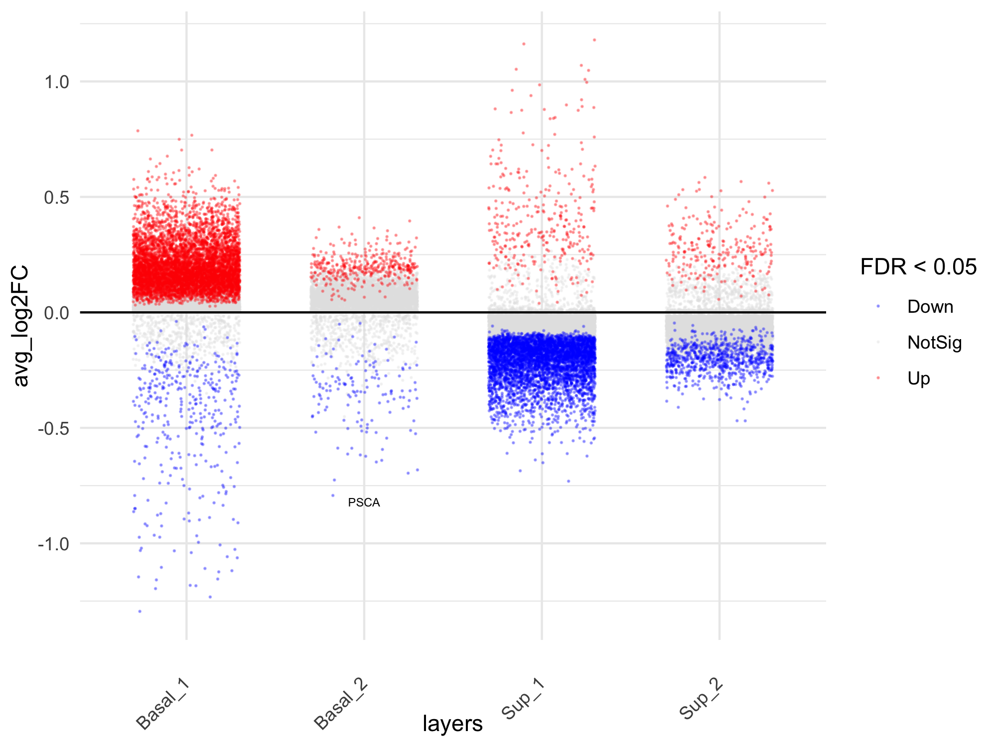

``` r
###########################
# VOLCANO PLOT SUBMUCOSA #
###########################
DEGs_filt <- DEGs_table %>% 
  filter(!(grepl(epi_clus, .$clus))) %>%
  filter(p_val < 0.099) 

Volcano.fun_logFC(DEGs_filt, "cluster", y.axis="p-value", 
                  up=c(.2, 0.05), down = c(-.2, 0.05)) # labeling: (logFC, p-value)
```

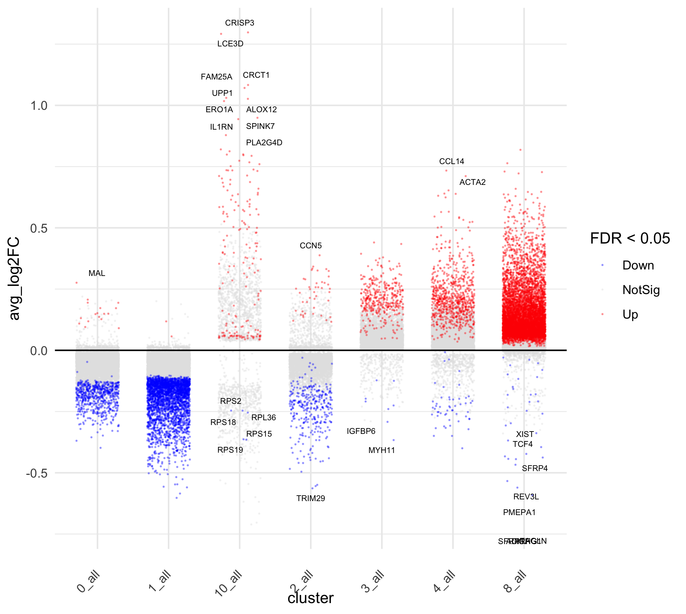

``` r
#############################
# TOP 15 DOWN/UP DEGS TABLE #
#############################
top30 <- DEGs_table_morf %>%
  mutate(Direction = ifelse(avg_log2FC > 0, "UP", "DOWN")) %>%
  #filter(Direction == "UP") %>%
  #filter(pct.1 > 0.2) %>%
  group_by(Direction) %>%
  
  #top_n(-40, p_val_adj) %>% 
  top_n(15, abs(avg_log2FC)) %>%
  arrange(avg_log2FC, Direction)


write.xlsx(list("DEGs"=DEGs_filt, "top 15 DEGs by log2FC"=top30), keepNA=TRUE, na.string="NA", overwrite=TRUE,
           file=paste0(result_dir,"DGEs_epi_vs_Submuc_25_25_wilcox",".xlsx"))
```

``` r
############################
# MARKER GENES FOR DOTPLOT #
############################
marker_genes_morf <- DEGs_table_morf %>%
  mutate(Direction = ifelse(avg_log2FC > 0, "UP", "DOWN")) %>%
  group_by(Direction) %>%
  top_n(-70, p_val_adj) %>%
  top_n(40, abs(log.pct.diff)) %>%
  {.->> top_40} %>%
  top_n(10, abs(avg_log2FC)) %>%
  arrange(pct.diff, Direction)

# get order of marker genes to seperate clusters
ord <- niceRplots::getcluster(DATA, unique(top_40$gene), "sp_annot")

###################################
# DOTPLOT TOP 10 DOWN AND UP DEGs #
###################################
# dev.new(width=4, height=40*.3+2, noRStudioGD = TRUE) # vertical
#pdf( paste0("./top_20_DEG_subset_epi.pdf"),width=8.27,height=length(ord)/6+2)
par(mfrow=c(1,1), mar=c(7,6,1,5))
plot_dots(DATA, names(sort(ord)), clustering = "sp_annot", 
          show_grid = T,
          main = "top cluster markers",
          cex.main=1,font.main=1,cex.col = 1,srt = 90,cex.row = 1.1)
abline(v=cumsum(c(table(sub( "_.*","",names(table(DATA$sp_annot))))))+0.5)
```

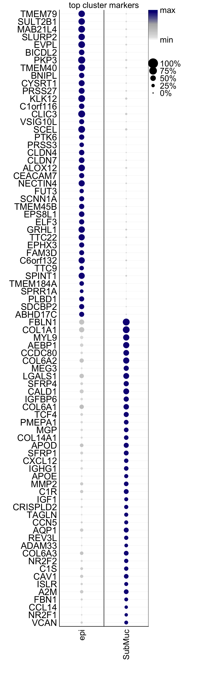

``` r
#dev.off()
```

``` r
################################
# DOTPLOT MARKER GENE FUNCTION #
################################
library(ggnewscale)
get_order <- function(df, markers, markers_id, value){
  m <- set_names(markers, markers_id)
  value <- enquo(value) 
  
  df <- df %>%
    mutate(marker_id =  map_chr(.$marker, ~names(m)[which(m == as.character(.x))])) %>%
    nest(., .by=c(groups)) %>%
    mutate(., data = pmap(., ~filter(..2, marker_id == .[[1]]))) %>%
    mutate(., data = pmap(., ~arrange(..2, desc(!!(value))))) %>%
    unnest(cols = c("data")) %>%
    #mutate(marker = fct_reorder2(marker, Avg, Pct))
    mutate(row_id = cur_group_rows(), .by=c(groups))
  return(df[["marker"]]) # use rev() to reorder the dots depending on horizontal/vertical 
}
get_df_for_dotplot.fun <- function(obj, markers, groups="Clusters", gr_col, rect=TRUE, alpha=.2, gr_lvl=NULL){
  col <- c("#EFEDF5", "#DADAEB", "#BCBDDC", "#9E9AC8", "#807DBA", "#6A51A3", "#54278F", "#3F007D") # 
  markers_lvl <- set_names(seq_along(markers), markers)
  gr <- unique(obj[[groups]])[[1]]
  gr_lvl <- set_names(seq_along(gr), if(is.null(gr_lvl)){gr}else{gr_lvl})
  
  df <- obj %>%
    mutate(., FetchData(., vars = c(markers)) ) %>%
    as_tibble() %>%
    select(., .cell, any_of(c(groups, markers))) %>%
    pivot_longer(., cols = -c(".cell", groups), 
                 names_to = "marker", values_to = "values") %>%
    #mutate(Clusters = factor(.$Clusters, levels=names(clus_lvl))) %>%
    group_by(!!sym(groups), marker) %>%
    summarise(Avg = mean(values),
              Avg_ = mean(values)/max(values), # gives the median as a percentage of max value among spots if .5 you have a normal dist.
              Pct = sum(values > 0) / length(values) * 100, .groups="drop") %>%
    #group_by(marker) %>%
    #nest()
    mutate(Avg_p = Avg/max(Avg), .by = "marker") %>%
    mutate(marker = factor(.$marker, levels=get_order(., markers, markers_id, Avg))) %>% 
    mutate(., ymin = gr_lvl[as.character(.[[groups]])]-.5,
              ymax = gr_lvl[as.character(.[[groups]])]+.5) %>%
    mutate(., xmin = markers_lvl[as.character(.$marker)]-0.5,
              xmax = markers_lvl[as.character(.$marker)]+0.5) %>%
    mutate(!!sym(groups) := factor(unlist(.[,1]), levels=names(gr_lvl)))
  
  df_rect <- df %>% select(1, ymin,  ymax) %>% slice_max(., n=1, order_by=ymin, by=groups, with_ties=F)
  
  p <- ggplot(df, aes(x=marker, y=.data[[groups]])) +
    {if(rect == TRUE)
      list(new_scale_fill(),
      
      annotate(geom = "rect", ymin=df_rect$ymin, ymax=df_rect$ymax,
                  xmin=rep(0, length(gr)), xmax=rep(length(markers_lvl)+1, length(gr)),
                  fill = gr_col[1:length(gr)], colour = NA, alpha = alpha),
      coord_cartesian(expand = F) )} +
    
    new_scale_fill() +
    geom_point(aes(size = Pct, fill = Avg_), col = "gray", shape = 21) + #"#6A2595"
    scale_fill_gradientn(colours = col,
                       guide = guide_colorbar(ticks.colour = "black",
                                              frame.colour = "black"),
                       name = "Average\nexpression") +
    
    
    theme_bw() +
    guides(size = guide_legend(override.aes = list(color = "black") ) ) +
    theme(axis.text.x = element_text(size=12, angle=45, hjust=1, color="black"),
          axis.text.y = element_text(size=12, color="black",hjust=.9 ),
          legend.text = element_text(size=10),
          legend.margin=margin(0,0,0,0),
          legend.box.margin=margin(0,-10,-10,-10),
          axis.title = element_blank(),
          #panel.grid.major = element_blank(), 
          #panel.grid.minor = element_blank(), 
          axis.ticks.y = element_blank(),
          plot.margin = unit(c(.2,.2,.2,.2),units = "cm") #trbl
          ) 
  return(p)
}

###################################
# DOTPLOT TOP 10 DOWN AND UP DEGs #
###################################
# dev.new(width=6, height=2, noRStudioGD = TRUE)
gr_col <- c("#F0B6AD","#BACCE5")
markers <-  marker_genes_morf$gene
markers_id <- rep("epi", length(markers))
groups="sp_annot"
(plot <- get_df_for_dotplot.fun(DATA, markers, groups="sp_annot", gr_col, rect=T ) + theme(legend.position="top")) 
```

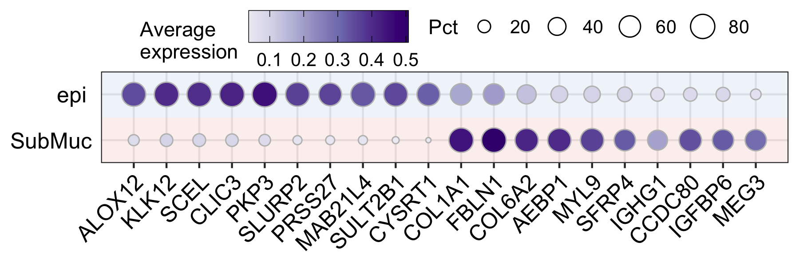

``` r
ggsave(paste0("./Figures/05/","Marker_genes_morf", ".pdf"), plot,  width = 6, height = 2)
```

### Identify marker genes to seperate epithelial clusters

``` r
#######################################
# FILTER BY P-VAL logFC AND pct.diff #
######################################
filter_top.fun <- function(nested_df, n, var, min_pct = 0){
  if(is.na(n[4])){n[4] = min_pct}
  res <- nested_df %>% # res <- top20$data[[1]] %>%
    #mutate(p_val_adj = 1.000-.$p_val_adj) %>%
    filter(p_val_adj < 0.05) %>%
    arrange(desc(avg_log2FC)) %>%
    filter(pct.1 > n[4]) %>%
    top_n(., n=n[1], abs(!!sym(var[1]))) %>%
    arrange(desc(avg_log2FC)) %>%
    top_n(., n=n[2], abs(!!sym(var[2]))) %>%
    top_n(., n=n[3], abs(!!sym(var[3]))) 
  print(res)
  return(res[1:n[3],])
}

sel_epi <- list(
  Sup_1 = list(n=c(-40, 50, 5),var=c("p_val_adj", "pct.diff", "log.pct.diff")),
  #Sup_1 = list(n=c(-100, 70, 5, 0.5),var=c("pct.diff", "p_val_adj", "log.pct.diff")),
  Sup_2 = list(n=c(-40, 50, 5),var=c("p_val_adj", "pct.diff", "log.pct.diff")),
  #Sup_2 = list(n=c(20, 5, 5),var=c("avg_log2FC", "log.pct.diff", "log.pct.diff")),
  Basal_2 = list(n=c(25, 7, 5, .5),var=c("avg_log2FC", "log.pct.diff", "log.pct.diff")),
  Basal_1 = list(n=c(10, 5, 5, .8),var=c("avg_log2FC", "log.pct.diff", "log.pct.diff")) )

# Identify the top genes that have a high difference in expression between the clusters
top20_epi <- DEGs_table %>%
  filter(grepl(epi_clus, .$clus)) %>%
  mutate(Direction = ifelse(avg_log2FC > 0, "UP", "DOWN")) %>%
  filter(Direction == "UP") %>%
  #filter(!(pct.2 > 0.2)) %>%
  nest(., .by = "layers") %>%
  mutate(data = pmap(., ~filter_top.fun(..2, n=sel_epi[[..1]]$n, var=sel_epi[[..1]]$var)) ) %>%
  unnest(., cols=c("data"))
```

    # A tibble: 5 × 11
         p_val avg_log2FC pct.1 pct.2 p_val_adj cluster gene   pct.diff log.pct.diff
         <dbl>      <dbl> <dbl> <dbl>     <dbl> <chr>   <chr>     <dbl>        <dbl>
    1 2.22e-14      0.322 0.765 0.463  4.89e-10 7_all   ENDOU     -1.23        0.724
    2 1.10e-14      0.320 0.77  0.46   2.41e-10 7_all   LTB4R     -1.23        0.743
    3 5.42e-13      0.300 0.76  0.478  1.19e- 8 7_all   TMEM1…    -1.24        0.669
    4 1.70e-14      0.298 0.715 0.408  3.73e-10 7_all   FAM83G    -1.12        0.809
    5 4.45e-13      0.296 0.655 0.375  9.80e- 9 7_all   ALOX1…    -1.03        0.805
    # ℹ 2 more variables: clus <dbl>, Direction <chr>
    # A tibble: 5 × 11
         p_val avg_log2FC pct.1 pct.2 p_val_adj cluster gene   pct.diff log.pct.diff
         <dbl>      <dbl> <dbl> <dbl>     <dbl> <chr>   <chr>     <dbl>        <dbl>
    1 8.40e-58      0.767 0.84  0.287  1.85e-53 5_all   COL7A1    -1.13         1.55
    2 3.60e-55      0.703 0.865 0.35   7.93e-51 5_all   STMN1     -1.22         1.31
    3 1.02e-53      0.676 0.915 0.41   2.25e-49 5_all   THSD4     -1.32         1.16
    4 1.03e-60      0.664 0.81  0.228  2.28e-56 5_all   FGFR2     -1.04         1.83
    5 1.43e-57      0.644 0.81  0.23   3.14e-53 5_all   LAMA5     -1.04         1.82
    # ℹ 2 more variables: clus <dbl>, Direction <chr>
    # A tibble: 5 × 11
         p_val avg_log2FC pct.1 pct.2 p_val_adj cluster gene   pct.diff log.pct.diff
         <dbl>      <dbl> <dbl> <dbl>     <dbl> <chr>   <chr>     <dbl>        <dbl>
    1 1.79e-65      1.18  0.83  0.31   3.95e-61 6_all   RNASE7   -1.14          1.42
    2 1.80e-56      0.985 0.83  0.338  3.97e-52 6_all   HMOX1    -1.17          1.30
    3 1.16e-55      0.887 0.75  0.243  2.55e-51 6_all   DUOXA2   -0.993         1.63
    4 5.17e-63      0.844 0.74  0.173  1.14e-58 6_all   DHRS9    -0.913         2.10
    5 2.77e-54      0.667 0.535 0.062  6.11e-50 6_all   CHAC1    -0.597         3.11
    # ℹ 2 more variables: clus <dbl>, Direction <chr>
    # A tibble: 5 × 11
         p_val avg_log2FC pct.1 pct.2 p_val_adj cluster gene   pct.diff log.pct.diff
         <dbl>      <dbl> <dbl> <dbl>     <dbl> <chr>   <chr>     <dbl>        <dbl>
    1 1.37e-26      0.562 0.845 0.523  3.03e-22 9_all   PLA2G…   -1.37         0.692
    2 4.96e-28      0.560 0.895 0.538  1.09e-23 9_all   CEACA…   -1.43         0.734
    3 6.19e-31      0.532 0.905 0.535  1.36e-26 9_all   VSIG1…   -1.44         0.758
    4 7.09e-30      0.525 0.87  0.517  1.56e-25 9_all   FAM3D    -1.39         0.751
    5 3.73e-26      0.489 0.69  0.302  8.22e-22 9_all   LINC0…   -0.992        1.19 
    # ℹ 2 more variables: clus <dbl>, Direction <chr>

### Dotplot of epithelial marker genes

``` r
###################################
# DOTPLOT TOP 10 MARKER GENES EPI #
###################################
# dev.new(width=6.5, height=3, noRStudioGD = TRUE)
gr_col <-c("#EB5253","#FA9F50","#D7A1FF","#984EA3")
markers <- top20_epi$gene
markers_id <- top20_epi$layers
#markers <- c("FLG","DUOXA2","DHRS9","SPRR2B","KPRP","LINC02487","CLCA4","CD177","SERPINB2","RPTN","TGM1","TMEM184A","EPHA1","FAM83G","ALOX15B","GALNT5","MUC22","COL7A1","STMN1","FGFR2","LAMA5","MEGF6","MIR205HG")
#markers_id <- c(rep("Sup_1",5), rep("Sup_2",6),rep("Basal_2",6),rep("Basal_1",6))
groups="layers"
gr_lvl <- rev(c("Sup_1", "Sup_2", "Basal_2", "Basal_1"))
(plot <- DATA %>%
    filter(grepl(epi_clus, .$Clusters) & sp_annot == "epi") %>%
    get_df_for_dotplot.fun(., markers, groups="layers", gr_col, rect=T, gr_lvl=gr_lvl)  +
    theme(legend.position="top") )#+ coord_flip(expand=F))
```

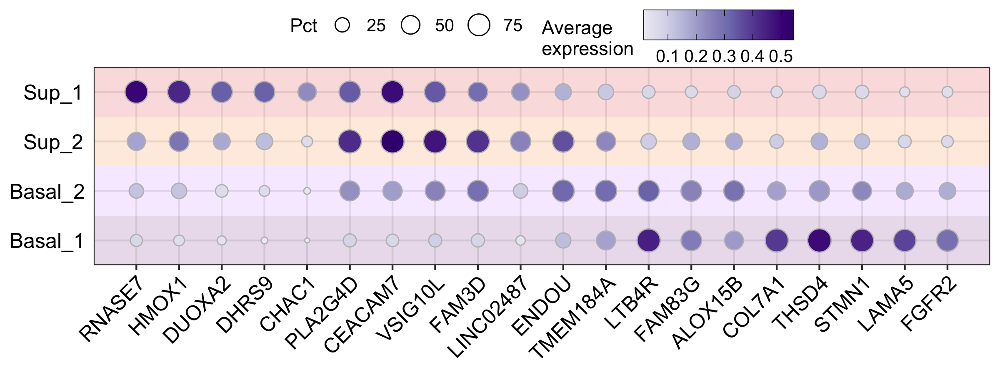

``` r
# dev.new(width=8, height=3, noRStudioGD = TRUE) # horizontal
# dev.new(width=5, height=6.5, noRStudioGD = TRUE) # vertical
# ggsave(paste0("./Figures/05/","Marker_genes_epi", ".pdf"), plot,  width = 8, height = 3)
```

### Identify marker genes to seperate Submucosal clusters

``` r
#######################################
# FILTER BY P-VAL logFC AND pct.diff #
######################################
filter_top.fun <- function(nested_df, n, var, min_pct = 0.001){
  if(is.na(n[4])){n[4] = min_pct}
  res <- nested_df %>% # res <- top20$data[[3]] %>%
    #mutate(p_val_adj = 1.000-.$p_val_adj) %>%
    filter(pct.1 > n[4]) %>%
    top_n(., n=n[1], abs(!!sym(var[1]))) %>%
    top_n(., n=n[2], abs(!!sym(var[2]))) %>%
    top_n(., n=n[3], abs(!!sym(var[3]))) 
  print(res)
  return(res[1:n[3],])
}
sel_s <- list(
  "8" = list(n=c(-100, 50, 5),var=c("p_val_adj", "pct.diff", "log.pct.diff")),
  "3" = list(n=c(-150, 100, 5),var=c("p_val_adj", "pct.diff", "log.pct.diff")),
  "4" = list(n=c(-100, 50, 5),var=c("p_val_adj", "pct.diff", "log.pct.diff")),
  "0" = list(n=c(-150, 50, 5, 0.04),var=c("p_val_adj", "pct.diff", "log.pct.diff")),
  "1" = list(n=c(-150, 50, 5, 0.04),var=c("p_val_adj", "pct.diff", "log.pct.diff")),
  "2" = list(n=c(-150, 50, 5, 0.04),var=c("p_val_adj", "pct.diff", "log.pct.diff"))
  )

# Identify the top genes that have a high difference in expression between the clusters
top20_sub <- DEGs_table %>%
  filter(grepl("^8|^3|^4|^0|1$|^2", .$clus)) %>%
  mutate(Direction = ifelse(avg_log2FC > 0, "UP", "DOWN")) %>%
  filter(Direction == "UP") %>%
  #filter(!(pct.2 > 0.2)) %>%
  nest(., .by = "layers") %>%
  mutate(data = pmap(., ~filter_top.fun(..2, n=sel_s[[..1]]$n, var=sel_s[[..1]]$var)) ) %>%
  unnest(., cols=c("data"))
```

    # A tibble: 5 × 11
         p_val avg_log2FC pct.1 pct.2 p_val_adj cluster gene   pct.diff log.pct.diff
         <dbl>      <dbl> <dbl> <dbl>     <dbl> <chr>   <chr>     <dbl>        <dbl>
    1 1.83e-89      0.818 0.812 0.222  4.03e-85 8_all   MT1X     -1.03          1.87
    2 2.55e-85      0.728 0.75  0.175  5.61e-81 8_all   COL17…   -0.925         2.10
    3 1.28e-78      0.659 0.789 0.192  2.81e-74 8_all   DAPL1    -0.981         2.04
    4 1.19e-72      0.636 0.734 0.183  2.63e-68 8_all   AKR1B…   -0.917         2.00
    5 6.82e-62      0.558 0.694 0.18   1.50e-57 8_all   HSPE1    -0.874         1.95
    # ℹ 2 more variables: clus <dbl>, Direction <chr>
    # A tibble: 5 × 11
         p_val avg_log2FC pct.1 pct.2 p_val_adj cluster gene   pct.diff log.pct.diff
         <dbl>      <dbl> <dbl> <dbl>     <dbl> <chr>   <chr>     <dbl>        <dbl>
    1 2.95e-54      0.734 0.684 0.276  6.51e-50 4_all   CCL14    -0.96          1.31
    2 5.13e-52      0.711 0.681 0.28   1.13e-47 4_all   ACTA2    -0.961         1.28
    3 5.36e-50      0.653 0.557 0.18   1.18e-45 4_all   ACKR1    -0.737         1.63
    4 6.40e-34      0.523 0.548 0.23   1.41e-29 4_all   PECAM1   -0.778         1.25
    5 2.12e-31      0.504 0.5   0.203  4.67e-27 4_all   PLVAP    -0.703         1.30
    # ℹ 2 more variables: clus <dbl>, Direction <chr>
    # A tibble: 5 × 11
          p_val avg_log2FC pct.1 pct.2 p_val_adj cluster gene  pct.diff log.pct.diff
          <dbl>      <dbl> <dbl> <dbl>     <dbl> <chr>   <chr>    <dbl>        <dbl>
    1 0.0000282     0.204  0.602 0.541     0.621 0_all   S100…    -1.14        0.154
    2 0.00689       0.0282 0.709 0.801     1     0_all   NEAT1    -1.51       -0.176
    3 0.0726        0.0152 0.647 0.728     1     0_all   GSTP1    -1.38       -0.170
    4 0.224         0.0163 0.576 0.652     1     0_all   CD24     -1.23       -0.179
    5 0.485         0.0132 0.59  0.672     1     0_all   KRT1     -1.26       -0.188
    # ℹ 2 more variables: clus <dbl>, Direction <chr>
    # A tibble: 5 × 11
         p_val avg_log2FC pct.1 pct.2 p_val_adj cluster gene   pct.diff log.pct.diff
         <dbl>      <dbl> <dbl> <dbl>     <dbl> <chr>   <chr>     <dbl>        <dbl>
    1 7.99e-20      0.440 0.577 0.318  1.76e-15 3_all   JCHAIN   -0.895        0.860
    2 3.39e-18      0.367 0.544 0.295  7.47e-14 3_all   KRT16    -0.839        0.883
    3 1.89e-17      0.358 0.654 0.373  4.16e-13 3_all   DSC3     -1.03         0.810
    4 4.30e-17      0.339 0.602 0.335  9.46e-13 3_all   PLP2     -0.937        0.846
    5 9.23e-17      0.354 0.522 0.303  2.03e-12 3_all   HLA-D…   -0.825        0.785
    # ℹ 2 more variables: clus <dbl>, Direction <chr>
    # A tibble: 5 × 11
         p_val avg_log2FC pct.1 pct.2 p_val_adj cluster gene   pct.diff log.pct.diff
         <dbl>      <dbl> <dbl> <dbl>     <dbl> <chr>   <chr>     <dbl>        <dbl>
    1 3.90e-31      1.30  0.889 0.203  8.59e-27 10_all  CRISP3    -1.09         2.13
    2 6.53e-21      1.29  0.861 0.327  1.44e-16 10_all  LCE3D     -1.19         1.40
    3 5.46e-18      1.02  0.861 0.339  1.20e-13 10_all  ERO1A     -1.2          1.34
    4 3.23e-17      0.949 0.861 0.295  7.10e-13 10_all  SPINK7    -1.16         1.55
    5 4.14e-14      0.813 0.806 0.29   9.12e-10 10_all  TMPRS…    -1.10         1.47
    # ℹ 2 more variables: clus <dbl>, Direction <chr>
    # A tibble: 5 × 11
         p_val avg_log2FC pct.1 pct.2 p_val_adj cluster gene   pct.diff log.pct.diff
         <dbl>      <dbl> <dbl> <dbl>     <dbl> <chr>   <chr>     <dbl>        <dbl>
    1 1.57e-18      0.301 0.816 0.718  3.46e-14 2_all   MYL9      -1.53        0.185
    2 6.55e-14      0.326 0.674 0.556  1.44e- 9 2_all   IGFBP6    -1.23        0.278
    3 2.40e-12      0.250 0.761 0.671  5.28e- 8 2_all   CALD1     -1.43        0.182
    4 2.69e-11      0.292 0.68  0.585  5.92e- 7 2_all   MEG3      -1.26        0.217
    5 3.35e-11      0.235 0.77  0.698  7.37e- 7 2_all   DST       -1.47        0.142
    # ℹ 2 more variables: clus <dbl>, Direction <chr>

### Dotplot of submucosal marker genes

``` r
######################################
# DOTPLOT TOP 10 MARKER GENES SUBMUC #
######################################
# dev.new(width=6.5, height=3, noRStudioGD = TRUE)
gr_col <- c("#FBAAB1","#FFDAB8","#F1D2FF","#E6B3E9","#8BCFCE","#92DBFF","#ABC9E1", "#E5C264","#BBD99B", "#E1E2A4", "#FDFFD3")[5:10]
markers <- top20_sub$gene
markers_id <- top20_sub$layers
groups="Clusters"
gr_lvl <- c("8","3","4","2","1","0")
(plot <- DATA %>%
    filter(grepl("^8|^3|^4|^0|1$|^2", .$Clusters) & sp_annot == "SubMuc") %>%
    get_df_for_dotplot.fun(., markers, groups="Clusters", gr_col, rect=T, alpha = .3, gr_lvl=NULL) + 
    theme(legend.position="top") )#coord_flip(expand = F) )
```

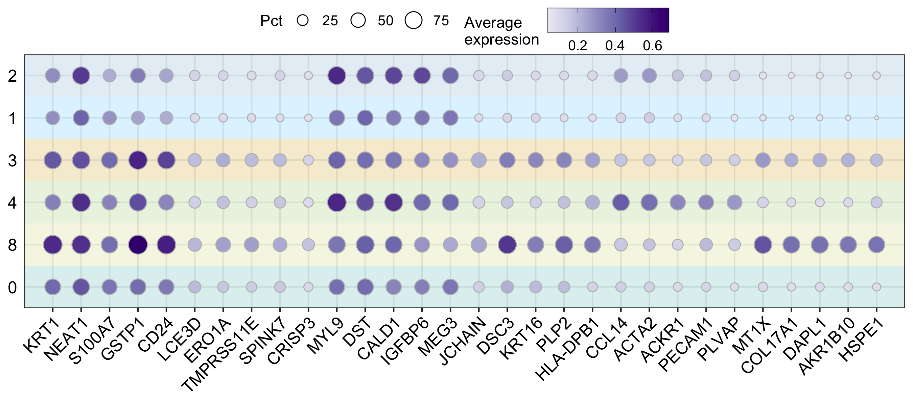

``` r
# dev.new(width=9, height=4, noRStudioGD = TRUE) # horizontal
# dev.new(width=6.5, height=3, noRStudioGD = TRUE) # vertical
# ggsave(paste0("./Figures/05/","Marker_genes_SubMuc", ".pdf"), plot,  width = 6.5, height = 3)
```

``` r
# Identify the top genes that have a high difference in expression between the clusters
top_epi <- DEGs_table %>%
  filter(grepl(epi_clus, .$clus )) %>%
  filter(avg_log2FC > 0) %>%
  group_by(layers) %>%
  top_n(-60, p_val_adj) %>%
  top_n(20, pct.diff) %>%
  slice_max(., n=10, order_by=log.pct.diff, with_ties = F )

# Select marker genes to seperate clusters
DAT <- DATA  %>% 
  filter(grepl(epi_clus, .$Clusters )) %>%
  mutate(layers = factor(.$layers, levels=c("Sup_1", "Sup_2", "Basal_2", "Basal_1") ) )
  
ord <- niceRplots::getcluster(DAT, unique(top_epi$gene), "layers")

######################################
# DOTPLOT TOP 10 MARKERS PER CLUSTER #
######################################
# dev.new(width=6, height=40*.2+2, noRStudioGD = TRUE)
#pdf( paste0("./Figures/05/","top_20_DEG_subset_epi_pval.pdf"), width=8.27,height=length(ord)/6+2, bg = "transparent")
par(mfrow=c(1,1), mar=c(7,6,1,5))
plot_dots(DAT, names(sort(ord)), clustering = "layers", 
          show_grid = T,
          main = "top cluster markers",
          cex.main=1, font.main=1,
          cex.col = 1, srt = 90,cex.row = 1.1)
abline(v=cumsum(c(table(sub( "_.*","",names(table(DAT$layers))))))+0.5)
```

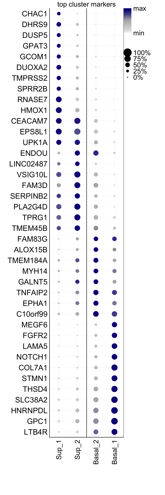

``` r
#dev.off()
```

``` r
# Identify the top genes that have a high difference in expression between the clusters
top_sub <- DEGs_table %>%
  filter(!(grepl(epi_clus, .$clus ))) %>%
  filter(avg_log2FC > 0) %>%
  filter(pct.1 > .4) %>%
  group_by(layers) %>%
  top_n(-60, p_val_adj) %>%
  top_n(20, pct.diff) %>%
  slice_max(., n=10, order_by=log.pct.diff, with_ties = F )

# Select marker genes to seperate clusters
DAT <- DATA  %>% 
  filter(!(grepl(epi_clus, .$Clusters ))) %>%
  mutate(layers = factor(.$layers, levels=c("8","3","4","2","1","0","10") ) )
  
ord <- niceRplots::getcluster(DAT, top_sub$gene, "layers")

######################################
# DOTPLOT TOP 10 MARKERS PER CLUSTER #
######################################
# dev.new(width=6, height=40*.25+2, noRStudioGD = TRUE)
#pdf( paste0("./Figures/05/","top_20_DEG_subset_epi_pval.pdf"), width=8.27,height=length(ord)/6+2, bg = "transparent")
par(mfrow=c(1,1), mar=c(7,6,1,5))
plot_dots(DAT, names(sort(ord)), clustering = "layers", 
          show_grid = T,
          main = "top cluster markers",
          cex.main=1, font.main=1,
          cex.col = 1, srt = 90,cex.row = 1.1)
abline(v=cumsum(c(table(sub( "_.*","",names(table(DAT$layers))))))+0.5)
```

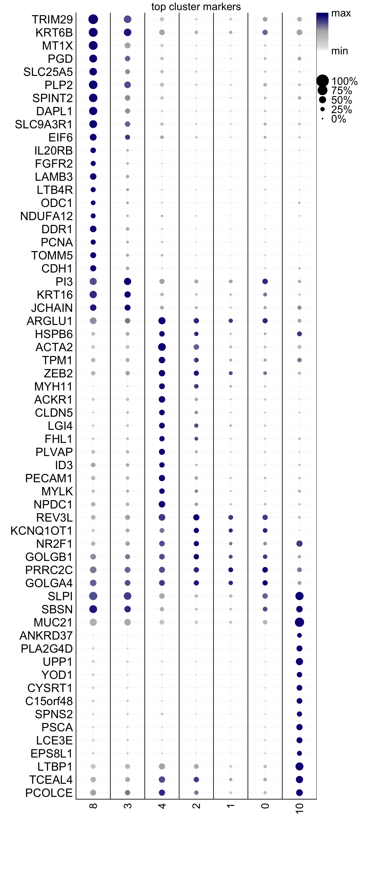

``` r
#dev.off()
```

``` r
# dev.new(width=6.6929133858, height=round(length(unique(top20_morf$epi$gene))/3)*2, noRStudioGD = TRUE) 
################################
# VIOLIN PLOT BEFORE FILTERING #
################################
col <- c("#E41A1C","#FF7F00","#C77CFF","#984EA3")
feature <-  top20_epi$gene

DAT <- DATA  %>%
  filter(grepl(epi_clus, .$Clusters )) %>%
  mutate(., FetchData(., vars = c(feature)) ) 
p <-  map(feature, ~violin.fun(DAT, facet="layers", .x, fill="layers", col_pal=col))

plot_grid(plotlist=p, nrow = ceiling(length(feature)/3), ncol = 3, byrow = T)
```

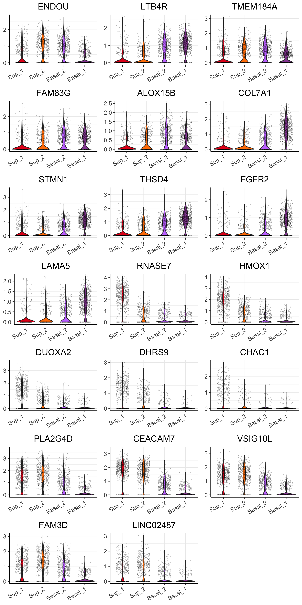

``` r
# dev.new(width=6.6929133858, height=round(length(unique(top20_sm_vs_epi$gene))/2)*2, noRStudioGD = TRUE) 
# dev.new(width=6.6929133858, height=round(length(feature)/2)*2, noRStudioGD = TRUE) 
################################
# VIOLIN PLOT BEFORE FILTERING #
################################
col <- c("#E41A1C","#FF7F00","#C77CFF","#984EA3", "#CD9600","#00BFC4","#F8766D","#7CAE00", "#00A9FF", "#377EB8","#FFFF33")
feature <-  marker_genes_morf$gene

DAT <- DATA  %>%
  mutate(., FetchData(., vars = c(feature)) ) 
p <-  map(feature, ~violin.fun(DAT, facet="layers", .x, fill="layers", col_pal=col))

plot_grid(plotlist=p, nrow = ceiling(length(feature)/2), ncol = 2, byrow = T)
```

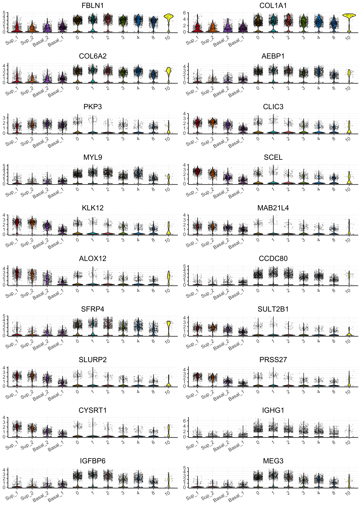

``` r
###################################
# BARPLOT TOP 10 DOWN AND UP DEGs #
###################################
# dev.new(width=10, height=6, noRStudioGD = TRUE) 
top20 <- bind_rows(top_epi, top_sub)

par(mfrow=c(2, 5), mar = c(4, 6, 3, 1))
for (i in unique(top20$layers)[1:10]) {
    barplot(sort(setNames(top20$avg_log2FC, top20$gene)[top20$layers == i], F),
        horiz = T, las = 1, main = paste0(i, " vs. rest"), border = "white", yaxs = "i")
    abline(v = c(0, 0.25), lty = c(1, 2))
}
```

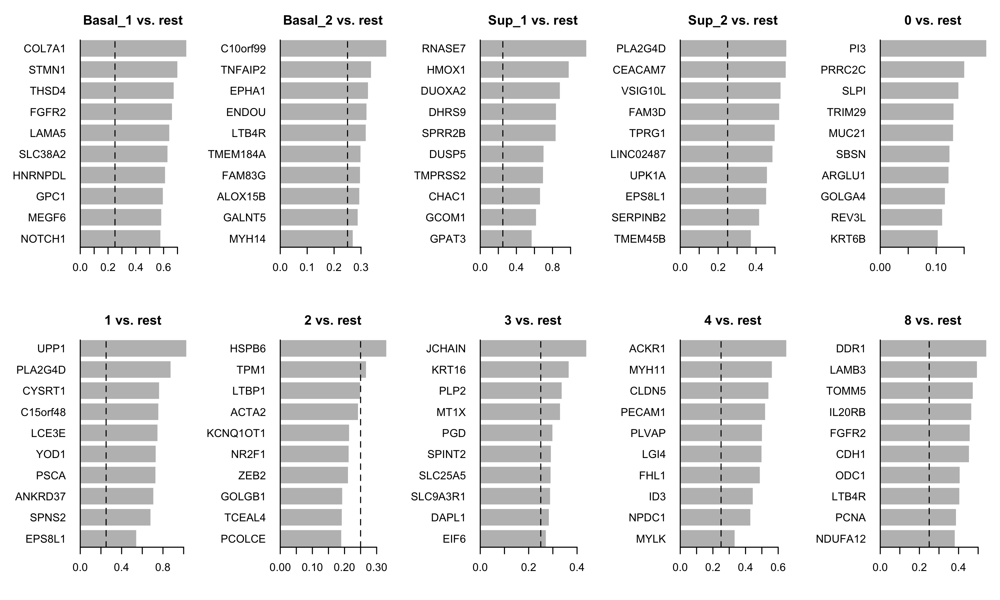

``` r
# dev.new(width=8.5, height=6.5, noRStudioGD = TRUE) 
################################
# UMAP TOP 10 DOWN AND UP DEGs #
################################
col <- c("#EFEDF5", "#DADAEB", "#BCBDDC", "#9E9AC8", "#807DBA", "#6A51A3", "#54278F", "#3F007D") # Purples
clus <-   c("#CD9600","#7CAE00","#e0e067","#00A9FF","#377EB8","#984EA3","#E41A1C","#C77CFF","#00BFC4","#FF7F00","#FFFF33")

clus_plot <- plot_clusters.fun(DATA, red = "umapharmony", color = clus,
                               dot_size = 0.2, cluster="Clusters") + theme_void() + NoLegend()

grid_genes <- function(plot_list, title){
  title <- ggdraw() + draw_label(paste0("Top 10 Markers for Cluster ", title), fontface='bold')
  g <- plot_grid(plotlist = plot_list,
            ncol = 4)
  g_ <- plot_grid(title, g, ncol=1, rel_heights=c(0.1, 1))
  return(g_)
}

top20_gr <- top20 %>%
  ungroup() %>%
  split(., f = .$layers)

plots <- imap(top20_gr, "gene") %>%
  map(., map, ~plot_genes.fun(DATA, red = "umapharmony", .x, col = col, lable = "Clusters", point_size = .2))

cluster_markers <- plots %>%
  map(., ~c("Clusters"=list(clus_plot), .x)) %>%
  imap(., ~grid_genes(.x, .y ))

cluster_markers[[10]]
```

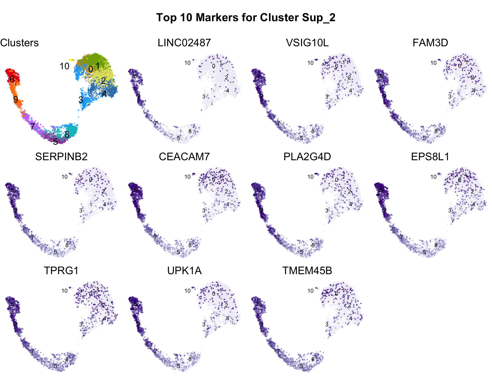

``` r
# imap(cluster_markers, ~ggsave(paste0(marker_dir,"Marker_genes_cluster_", .y, ".jpg"), plot=.x, height = 6.5, width = 8.5))
pdf(paste0("./Figures/05/","Marker_genes_UMAP", ".pdf"), height = 6.5, width = 8.5)
cluster_markers
```

    $`0`


    $`1`


    $`2`


    $`3`


    $`4`


    $`8`


    $Basal_1


    $Basal_2


    $Sup_1


    $Sup_2

``` r
dev.off()
```

    quartz_off_screen 
                    2 

## Session info

``` r
sessionInfo()
```

    R version 4.1.2 (2021-11-01)
    Platform: x86_64-apple-darwin13.4.0 (64-bit)
    Running under: macOS Big Sur 10.16

    Matrix products: default
    BLAS/LAPACK: /Users/vilkal/Applications/miniconda3/envs/Spatial_DMPA/lib/libopenblasp-r0.3.21.dylib

    locale:
    [1] sv_SE.UTF-8/sv_SE.UTF-8/sv_SE.UTF-8/C/sv_SE.UTF-8/sv_SE.UTF-8

    attached base packages:
    [1] stats4    stats     graphics  grDevices utils     datasets  methods  
    [8] base     

    other attached packages:
     [1] ggnewscale_0.4.9            openxlsx_4.2.5.1           
     [3] scran_1.22.1                scuttle_1.4.0              
     [5] MAST_1.20.0                 SingleCellExperiment_1.16.0
     [7] SummarizedExperiment_1.24.0 Biobase_2.54.0             
     [9] GenomicRanges_1.46.1        GenomeInfoDb_1.30.1        
    [11] IRanges_2.28.0              S4Vectors_0.32.4           
    [13] BiocGenerics_0.40.0         MatrixGenerics_1.6.0       
    [15] matrixStats_0.63.0          niceRplots_0.1.0           
    [17] ggrepel_0.9.3               cowplot_1.1.1              
    [19] tidyseurat_0.5.3            ttservice_0.2.2            
    [21] SeuratObject_4.1.3          Seurat_4.3.0               
    [23] forcats_1.0.0               stringr_1.5.0              
    [25] dplyr_1.1.2                 purrr_1.0.1                
    [27] readr_2.1.3                 tidyr_1.3.0                
    [29] tibble_3.2.1                ggplot2_3.4.3              
    [31] tidyverse_1.3.2            

    loaded via a namespace (and not attached):
      [1] utf8_1.2.3                spatstat.explore_3.0-5   
      [3] reticulate_1.28           tidyselect_1.2.0         
      [5] htmlwidgets_1.6.2         grid_4.1.2               
      [7] BiocParallel_1.28.3       Rtsne_0.16               
      [9] munsell_0.5.0             ScaledMatrix_1.2.0       
     [11] codetools_0.2-19          ica_1.0-3                
     [13] statmod_1.5.0             future_1.32.0            
     [15] miniUI_0.1.1.1            withr_2.5.0              
     [17] spatstat.random_3.0-1     colorspace_2.1-0         
     [19] progressr_0.13.0          knitr_1.42               
     [21] rstudioapi_0.14           ROCR_1.0-11              
     [23] tensor_1.5                listenv_0.9.0            
     [25] labeling_0.4.3            GenomeInfoDbData_1.2.7   
     [27] polyclip_1.10-4           farver_2.1.1             
     [29] bit64_4.0.5               parallelly_1.36.0        
     [31] vctrs_0.6.3               generics_0.1.3           
     [33] xfun_0.38                 timechange_0.2.0         
     [35] R6_2.5.1                  rsvd_1.0.5               
     [37] locfit_1.5-9.7            bitops_1.0-7             
     [39] spatstat.utils_3.0-1      DelayedArray_0.20.0      
     [41] assertthat_0.2.1          vroom_1.6.0              
     [43] promises_1.2.0.1          scales_1.2.1             
     [45] googlesheets4_1.0.1       gtable_0.3.4             
     [47] beachmat_2.10.0           globals_0.16.2           
     [49] goftest_1.2-3             rlang_1.1.1              
     [51] splines_4.1.2             lazyeval_0.2.2           
     [53] gargle_1.2.1              spatstat.geom_3.0-3      
     [55] broom_1.0.4               yaml_2.3.7               
     [57] reshape2_1.4.4            abind_1.4-5              
     [59] modelr_0.1.10             backports_1.4.1          
     [61] httpuv_1.6.9              tools_4.1.2              
     [63] ellipsis_0.3.2            RColorBrewer_1.1-3       
     [65] ggridges_0.5.4            Rcpp_1.0.10              
     [67] plyr_1.8.8                sparseMatrixStats_1.6.0  
     [69] zlibbioc_1.40.0           RCurl_1.98-1.9           
     [71] deldir_1.0-6              pbapply_1.7-0            
     [73] zoo_1.8-11                haven_2.5.1              
     [75] cluster_2.1.4             fs_1.6.2                 
     [77] magrittr_2.0.3            data.table_1.14.6        
     [79] scattermore_0.8           lmtest_0.9-40            
     [81] reprex_2.0.2              RANN_2.6.1               
     [83] googledrive_2.0.0         fitdistrplus_1.1-8       
     [85] hms_1.1.2                 patchwork_1.1.2          
     [87] mime_0.12                 evaluate_0.21            
     [89] xtable_1.8-4              readxl_1.4.1             
     [91] gridExtra_2.3             compiler_4.1.2           
     [93] KernSmooth_2.23-20        crayon_1.5.2             
     [95] htmltools_0.5.5           later_1.3.0              
     [97] tzdb_0.3.0                lubridate_1.9.0          
     [99] DBI_1.1.3                 dbplyr_2.2.1             
    [101] MASS_7.3-60               Matrix_1.6-1             
    [103] cli_3.6.1                 metapod_1.2.0            
    [105] parallel_4.1.2            igraph_1.4.1             
    [107] pkgconfig_2.0.3           sp_1.5-1                 
    [109] plotly_4.10.1             spatstat.sparse_3.0-0    
    [111] xml2_1.3.3                dqrng_0.3.0              
    [113] XVector_0.34.0            rvest_1.0.3              
    [115] digest_0.6.31             sctransform_0.3.5        
    [117] RcppAnnoy_0.0.20          spatstat.data_3.0-0      
    [119] rmarkdown_2.21            cellranger_1.1.0         
    [121] leiden_0.4.3              edgeR_3.36.0             
    [123] uwot_0.1.14               DelayedMatrixStats_1.16.0
    [125] shiny_1.7.4               lifecycle_1.0.3          
    [127] nlme_3.1-163              jsonlite_1.8.5           
    [129] BiocNeighbors_1.12.0      limma_3.50.3             
    [131] viridisLite_0.4.2         fansi_1.0.4              
    [133] pillar_1.9.0              lattice_0.21-8           
    [135] fastmap_1.1.1             httr_1.4.5               
    [137] survival_3.5-5            glue_1.6.2               
    [139] zip_2.2.2                 png_0.1-8                
    [141] bit_4.0.5                 bluster_1.4.0            
    [143] stringi_1.7.12            BiocSingular_1.10.0      
    [145] irlba_2.3.5.1             future.apply_1.10.0      
