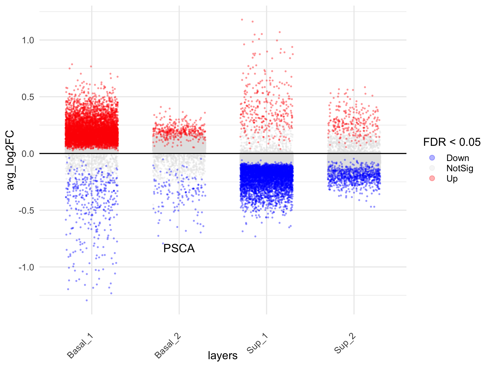
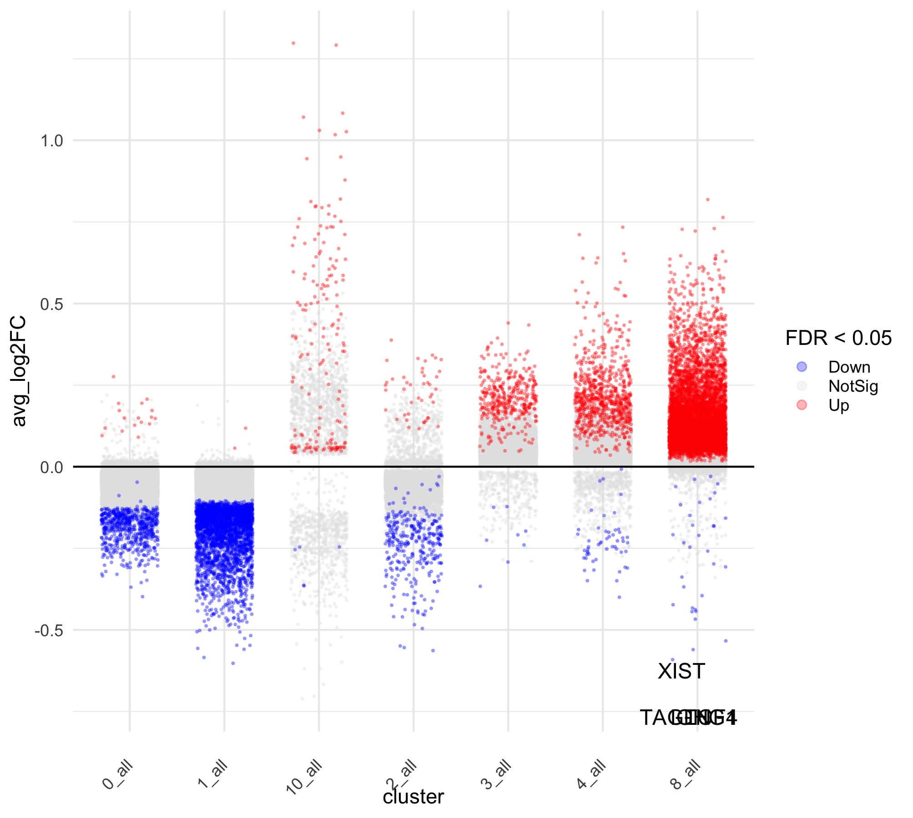

Differential gene expression clusters
================
4/3/23

## Load data and libraries

``` r
##################
# LOAD LIBRARIES #
##################
library(tidyverse)
library(Seurat)
library(SeuratObject)
library(tidyseurat)
library(cowplot)
library(ggrepel)
library(niceRplots)
library(MAST)
library(scran)
library(openxlsx)

source("../bin/plotting_functions.R")
source("../bin/spatial_visualization.R")

#########
# PATHS #
#########
input_dir <- "../results/04_deconvolution_st_data/"
result_dir <- "../results/05_DGE_clusters_st_data/"
marker_dir <- "./marker_genes_clusters/"
if( isFALSE(dir.exists(result_dir)) ) { dir.create(result_dir,recursive = TRUE) }
if( isFALSE(dir.exists(marker_dir)) ) { dir.create(marker_dir,recursive = TRUE) }

#############
# LODA DATA #
#############
DATA <- readRDS(paste0(input_dir,"seuratObj_deconvolution_scdc.RDS"))
epi_clus <- "^5$|^6$|^7|^9" # non-filt
```

``` r
########################
# SEURAT DGEs FUNCTION #
########################
# obj <- DATA_sub$data[[1]]
# clusters <- "Clusters"
DEGs_fun <- function(obj, clusters){
  obj <- SetIdent(obj, value = clusters)
  
  DATA_degs <- obj %>%
     FindAllMarkers(.,
                   test.use = "wilcox",
                   only.pos = F,
                   return.thresh = 1,
                   max.cells.per.ident = Inf,
                   logfc.threshold = -Inf,
                   assay = "RNA",
                   min.pct = -Inf)

  DEGs_table <- DATA_degs %>%
    as_tibble(.) %>%
    #map2(., comb$comb, ~mutate(.x, Combination = .y)) %>%
    mutate(cluster = paste0(.$cluster, "_all")) %>%
    mutate(pct.diff = -.$pct.2-.$pct.1) %>%
    mutate(log.pct.diff = -log2(.$pct.2/.$pct.1))
  return(DEGs_table)
}
```

``` r
####################################
# SUBSET SEURAT OBJECT PER CLUSTER #
####################################
# creating a subseted object with 25 spots per sampleID for each cluster
DATA_sub <- DATA %>%
  mutate(gr = .$groups) %>%
  mutate(ID = .$orig.ident) %>%
  nest(., data=-c(gr, orig.ident)) %>%
  mutate(epi =  map(data, ~filter(.x, !(sp_annot == "SubMuc"))),
         subMuc =  map(data, ~filter(.x, sp_annot == "SubMuc"))) %>%
  select(-data) %>%
  mutate(across(c("epi", "subMuc"), ~map(., ~table(.x$Clusters)), .names = "{.col}_n_before")) %>%
  mutate(epi = map(epi, ~filter(.x, .cell %in% WhichCells(., downsample = 25)))) %>%
  mutate(subMuc = map(subMuc, ~filter(.x, .cell %in% WhichCells(., downsample = 50)))) %>%
  mutate(across(c("epi", "subMuc"), ~map(., ~table(.x$Clusters)), .names = "{.col}_n_after")) %>%
  mutate(across(contains("_n_"), ~set_names(.x, paste0(.data[["gr"]],"_",.data[["orig.ident"]]))))

bind_cols(DATA_sub$epi_n_after, "Clus" = paste0("**",names(table(DATA$Clusters)),"**")) %>%
  rowwise() %>% 
  mutate(DMPA_sum = sum(c_across(starts_with("DMPA_"))),
         ctrl_sum = sum(c_across(starts_with("ctrl_")))) %>%
  select(sort(colnames(.)[1:8]), everything()) %>%
  knitr::kable(., caption = "Distribution of epithelial spots per cluster per subject")
```

| ctrl_P031 | ctrl_P080 | ctrl_P105 | ctrl_P118 | DMPA_P097 | DMPA_P107 | DMPA_P108 | DMPA_P114 | Clus   | DMPA_sum | ctrl_sum |
|----------:|----------:|----------:|----------:|----------:|----------:|----------:|----------:|:-------|---------:|---------:|
|         0 |         0 |         1 |         0 |         0 |         1 |         0 |         0 | **0**  |        1 |        1 |
|         1 |         0 |         0 |         0 |         0 |         1 |         0 |         1 | **1**  |        2 |        1 |
|         0 |         0 |         0 |         0 |         0 |         0 |         0 |         0 | **2**  |        0 |        0 |
|         3 |         0 |         3 |         0 |         0 |         0 |         0 |         1 | **3**  |        1 |        6 |
|         0 |         0 |         0 |         0 |         0 |         0 |         0 |         0 | **4**  |        0 |        0 |
|        25 |        25 |        25 |        25 |        25 |        25 |        25 |        25 | **5**  |      100 |      100 |
|        25 |        25 |        25 |        25 |        25 |        25 |        25 |        25 | **6**  |      100 |      100 |
|        25 |        25 |        25 |        25 |        25 |        25 |        25 |        25 | **7**  |      100 |      100 |
|        12 |         9 |         1 |         6 |         4 |         7 |         3 |         1 | **8**  |       15 |       28 |
|        25 |        25 |        25 |        25 |        25 |        25 |        25 |        25 | **9**  |      100 |      100 |
|         0 |         0 |         1 |         0 |         0 |         0 |         0 |         1 | **10** |        1 |        1 |

Distribution of epithelial spots per cluster per subject

``` r
bind_cols(DATA_sub$subMuc_n_after, "Clus" = paste0("**",names(table(DATA$Clusters)),"**")) %>%
  rowwise() %>% 
  mutate(DMPA_sum = sum(c_across(starts_with("DMPA_"))),
         ctrl_sum = sum(c_across(starts_with("ctrl_")))) %>%
  select(sort(colnames(.)[1:8]), everything()) %>%
  knitr::kable(., caption = "Distribution of submucosal spots per cluster per subject")
```

| ctrl_P031 | ctrl_P080 | ctrl_P105 | ctrl_P118 | DMPA_P097 | DMPA_P107 | DMPA_P108 | DMPA_P114 | Clus   | DMPA_sum | ctrl_sum |
|----------:|----------:|----------:|----------:|----------:|----------:|----------:|----------:|:-------|---------:|---------:|
|        50 |        50 |        50 |        50 |        50 |        20 |        34 |        50 | **0**  |      154 |      200 |
|        50 |        50 |        50 |        50 |        50 |        10 |        36 |        50 | **1**  |      146 |      200 |
|        37 |        50 |        50 |        50 |        50 |        35 |         9 |        50 | **2**  |      144 |      187 |
|        46 |        50 |        50 |        50 |        50 |        25 |        43 |        50 | **3**  |      168 |      196 |
|        24 |        50 |        50 |        50 |        50 |        37 |        21 |        50 | **4**  |      158 |      174 |
|         1 |         5 |         8 |        20 |        41 |         1 |         1 |         9 | **5**  |       52 |       34 |
|         0 |         3 |         0 |         0 |         4 |        19 |         0 |         0 | **6**  |       23 |        3 |
|         1 |        33 |         0 |         2 |         4 |         0 |         0 |         1 | **7**  |        5 |       36 |
|        24 |        46 |        50 |        50 |        50 |        14 |        20 |        50 | **8**  |      134 |      170 |
|         0 |         0 |         0 |         0 |         1 |         0 |         0 |         0 | **9**  |        1 |        0 |
|         1 |         1 |         0 |         0 |         5 |        29 |         0 |         0 | **10** |       34 |        2 |

Distribution of submucosal spots per cluster per subject

### Run differential gene expression analysis

``` r
##################################
# DGEs ONE AGAINST THE REST #
##################################
DEGs_table_epi <- DATA_sub %>%
  unnest(epi) %>%
  filter(grepl(epi_clus, .$Clusters)) %>%
  DEGs_fun(., "Clusters") 

DEGs_table_subMuc <- DATA_sub %>%
  unnest(subMuc) %>%
  filter(!(grepl(epi_clus, .$Clusters))) %>%
  DEGs_fun(., "Clusters") 

DEGs_table <- bind_rows(DEGs_table_epi, DEGs_table_subMuc)

###################
# ADD ANNOTATION #
##################
ord1 <- c("Sup_1","Sup_2","Basal_2","Basal_1","0","1","2","3","4","8","10")
ord2 <- c("6_all","9_all","7_all","5_all","0_all","1_all","2_all","3_all","4_all","8_all","10_all")
ord2 <- c("6","9","7","5","0","1","2","3","4","8","10")
epi_layers <- set_names(ord1, ord2)

DEGs_table <- DEGs_table %>%
  mutate(clus = str_extract(.$cluster, "\\d")) %>%
  mutate(cluster = factor(.$cluster, levels = paste0(ord2, "_all"))) %>%
  mutate(layers = factor(epi_layers[as.character(.$clus)], levels = ord1)) 
```

### Save files

``` r
##############
# SAVE FILES #
##############
# write_csv(DEGs_table, paste0(result_dir, "DGEs_clusters_wilcox.csv"))

DEGs_list <- DEGs_table %>% 
  filter(p_val < 0.9) %>%
  group_split(., cluster) %>% 
  set_names(., unique(DEGs_table$cluster))

write.xlsx(DEGs_list, keepNA=TRUE, na.string="NA", overwrite=TRUE,
           file=paste0(result_dir,"DGEs_clusters_wilcox",".xlsx"))
```

### Load allready saved data

``` r
# Load data
DEGs_table <- read_csv(paste0(result_dir,"DGEs_clusters_wilcox.csv"))
```

### Volcano plot of DEGs for each cluster

``` r
###########################
# VOLCANO PLOT EPITHELIUM #
###########################
DEGs_filt <- DEGs_table %>% 
  filter(grepl(epi_clus, .$clus)) %>%
  filter(p_val < 0.099) 

Volcano.fun_logFC(DEGs_filt, "layers", y.axis="p-value", 
                  up=c(.2, 0.05), down = c(-.2, 0.05)) # labeling: (logFC, p-value)
```



``` r
###########################
# VOLCANO PLOT SUBMUCOSA #
###########################
DEGs_filt <- DEGs_table %>% 
  filter(!(grepl(epi_clus, .$clus))) %>%
  filter(p_val < 0.099) 

Volcano.fun_logFC(DEGs_filt, "cluster", y.axis="p-value", 
                  up=c(.2, 0.05), down = c(-.2, 0.05)) # labeling: (logFC, p-value)
```



### Identify marker genes to seperate clusters

``` r
#######################################
# FILTER BY P-VAL logFC AND pct.diff #
######################################
# Identify the top genes that have a high difference in expression between the clusters
top20 <- DEGs_table %>%
  mutate(Direction = ifelse(avg_log2FC > 0, "UP", "DOWN")) %>%
  group_by(cluster) %>%
# group_by(cluster, Direction) %>%
  top_n(-40, p_val_adj) %>%
  top_n(20, pct.diff) %>%
  top_n(10, log.pct.diff) 

top20_morf <- top20 %>%
  ungroup() %>%
  mutate(morf = ifelse(grepl(epi_clus, .$clus), "epi", "subMuc")) %>%
  group_by(morf) %>%
  group_split() %>%
  set_names(., c("epi", "subMuc"))

# top20 <- DEGs_table %>%
#   mutate(Direction = ifelse(avg_log2FC > 0, "UP", "DOWN")) %>%
#   group_by(cluster, Direction) %>%
#   top_n(-40, p_val_adj) %>%
#   top_n(20, pct.diff) %>%
#   top_n(10, log.pct.diff) 
  
top20 <- top20 %>%
  arrange(cluster)
# top25[grep("NCR1",top25$gene),]

# remove all VDJ-genes from list of HVG
remove <- str_subset(top20$gene, "^IGH|^IGK|^IGL|^TRA|^TRB|^TRD|^TRG")
top20_gr <- top20 %>%
  ungroup() %>%
  split(., f = .$layers)
```

### Dotplot of DEGs

``` r
# Select marker genes to seperate clusters
DAT <- DATA  %>%
  filter(grepl(epi_clus, .$Clusters )) %>%
  mutate(., feature = .$layers)
ord <- niceRplots::getcluster(DAT, unique(top20_morf$epi$gene), "feature")

###################################
# DOTPLOT TOP 10 DOWN AND UP DEGs #
###################################
#pdf( paste0("./top_20_DEG_subset_epi.pdf"),width=8.27,height=length(ord)/6+2)
par(mfrow=c(1,1), mar=c(7,6,1,5))
plot_dots(DAT, names(sort(ord)), clustering = "feature", show_grid = T,main = "top cluster markers",cex.main=1,font.main=1,cex.col = 1,srt = 90,cex.row = 1.1)
abline(v=cumsum(c(table(sub( "_.*","",names(table(DAT$feature))))))+0.5)
```


``` r
#dev.off()
```

``` r
# Select marker genes to seperate clusters
DAT <- DATA  %>%
  filter(!(grepl(epi_clus, .$Clusters ))) %>%
  mutate(., feature = .$Clusters)
ord <- niceRplots::getcluster(DAT, unique(top20_morf$subMuc$gene), "feature")

###################################
# DOTPLOT TOP 10 DOWN AND UP DEGs #
###################################
#pdf( paste0("./top_20_DEG_subset_epi.pdf"),width=8.27,height=length(ord)/6+2)
par(mfrow=c(1,1), mar=c(7,6,1,5))
plot_dots(DAT, names(sort(ord)), clustering = "feature", show_grid = T,main = "top cluster markers",cex.main=1,font.main=1,cex.col = 1,srt = 90,cex.row = 1.1)
abline(v=cumsum(c(table(sub( "_.*","",names(table(DAT$feature))))))+0.5)
```


``` r
#dev.off()
```

``` r
# dev.new(width=6.6929133858, height=round(length(unique(top20_morf$epi$gene))/3)*2, noRStudioGD = TRUE) 
################################
# VIOLIN PLOT BEFORE FILTERING #
################################
col <- c("#E41A1C","#FF7F00","#C77CFF","#984EA3")
feature <-  unique(top20_morf$epi$gene)

DAT <- DATA  %>%
  filter(grepl(epi_clus, .$Clusters )) %>%
  mutate(., FetchData(., vars = c(feature)) ) 
p <-  map(feature, ~violin.fun(DAT, facet="layers", .x, fill="layers", col_pal=col))

plot_grid(plotlist=p, nrow = ceiling(length(feature)/3), ncol = 3, byrow = T)
```


``` r
###################################
# BARPLOT TOP 10 DOWN AND UP DEGs #
###################################
par(mfrow=c(2, 5), mar = c(4, 6, 3, 1))
for (i in unique(top20$groups)[1:10]) {
    barplot(sort(setNames(top20$avg_log2FC, top20$gene)[top20$cluster == i], F),
        horiz = T, las = 1, main = paste0(i, " vs. rest"), border = "white", yaxs = "i")
    abline(v = c(0, 0.25), lty = c(1, 2))
}
```

``` r
# dev.new(width=8.5, height=6.5, noRStudioGD = TRUE) 
################################
# UMAP TOP 10 DOWN AND UP DEGs #
################################
col=c("grey90","grey80","grey60","navy","black")

clus_plot <- plot_clusters.fun(DATA, red = "umap_harmony", 
                               dot_size = 0.2, cluster="Clusters") + theme_void() + NoLegend()

grid_genes <- function(plot_list, title){
  title <- ggdraw() + draw_label(paste0("Top 10 Markers for Cluster ", title), fontface='bold')
  g <- plot_grid(plotlist = plot_list,
            ncol = 4)
  g_ <- plot_grid(title, g, ncol=1, rel_heights=c(0.1, 1))
  return(g_)
}

plots <- imap(top20_gr, "gene") %>%
  map(., map, ~plot_genes.fun(DATA, red = "umap_harmony", .x, lable = "Clusters", point_size = .2))

cluster_markers <- plots %>%
  map(., ~c("Clusters"=list(clus_plot), .x)) %>%
  imap(., ~grid_genes(.x, .y ))

cluster_markers[[10]]
```


``` r
imap(cluster_markers, ~ggsave(paste0(marker_dir,"Marker_genes_cluster_", .y, ".jpg"), plot=.x, height = 6.5, width = 8.5))
```

    $`0`
    [1] "./marker_genes_clusters/Marker_genes_cluster_0.jpg"

    $`1`
    [1] "./marker_genes_clusters/Marker_genes_cluster_1.jpg"

    $`2`
    [1] "./marker_genes_clusters/Marker_genes_cluster_2.jpg"

    $`3`
    [1] "./marker_genes_clusters/Marker_genes_cluster_3.jpg"

    $`4`
    [1] "./marker_genes_clusters/Marker_genes_cluster_4.jpg"

    $`8`
    [1] "./marker_genes_clusters/Marker_genes_cluster_8.jpg"

    $Basal_1
    [1] "./marker_genes_clusters/Marker_genes_cluster_Basal_1.jpg"

    $Basal_2
    [1] "./marker_genes_clusters/Marker_genes_cluster_Basal_2.jpg"

    $Sup_1
    [1] "./marker_genes_clusters/Marker_genes_cluster_Sup_1.jpg"

    $Sup_2
    [1] "./marker_genes_clusters/Marker_genes_cluster_Sup_2.jpg"

``` r
ggsave(paste0("./Figures/05/","Marker_genes_all_clusters", ".pdf"), gridExtra::marrangeGrob(grobs=cluster_markers, ncol=1, nrow=1, height = 6.5, width = 8.5))
```

## Session info

``` r
sessionInfo()
```

    R version 4.1.2 (2021-11-01)
    Platform: x86_64-apple-darwin13.4.0 (64-bit)
    Running under: macOS Big Sur 10.16

    Matrix products: default
    BLAS/LAPACK: /Users/vilkal/Applications/miniconda3/envs/Spatial_DMPA/lib/libopenblasp-r0.3.21.dylib

    locale:
    [1] sv_SE.UTF-8/sv_SE.UTF-8/sv_SE.UTF-8/C/sv_SE.UTF-8/sv_SE.UTF-8

    attached base packages:
    [1] stats4    stats     graphics  grDevices utils     datasets  methods  
    [8] base     

    other attached packages:
     [1] openxlsx_4.2.5.1            scran_1.22.1               
     [3] scuttle_1.4.0               MAST_1.20.0                
     [5] SingleCellExperiment_1.16.0 SummarizedExperiment_1.24.0
     [7] Biobase_2.54.0              GenomicRanges_1.46.1       
     [9] GenomeInfoDb_1.30.1         IRanges_2.28.0             
    [11] S4Vectors_0.32.4            BiocGenerics_0.40.0        
    [13] MatrixGenerics_1.6.0        matrixStats_0.63.0         
    [15] niceRplots_0.1.0            ggrepel_0.9.2              
    [17] cowplot_1.1.1               tidyseurat_0.5.3           
    [19] ttservice_0.2.2             SeuratObject_4.1.3         
    [21] Seurat_4.3.0                forcats_0.5.2              
    [23] stringr_1.5.0               dplyr_1.0.10               
    [25] purrr_1.0.1                 readr_2.1.3                
    [27] tidyr_1.2.1                 tibble_3.2.1               
    [29] ggplot2_3.4.1               tidyverse_1.3.2            

    loaded via a namespace (and not attached):
      [1] utf8_1.2.3                spatstat.explore_3.0-5   
      [3] reticulate_1.27           tidyselect_1.2.0         
      [5] htmlwidgets_1.6.1         grid_4.1.2               
      [7] BiocParallel_1.28.3       Rtsne_0.16               
      [9] munsell_0.5.0             ScaledMatrix_1.2.0       
     [11] codetools_0.2-18          ica_1.0-3                
     [13] statmod_1.5.0             future_1.30.0            
     [15] miniUI_0.1.1.1            withr_2.5.0              
     [17] spatstat.random_3.0-1     colorspace_2.1-0         
     [19] progressr_0.13.0          highr_0.10               
     [21] knitr_1.41                rstudioapi_0.14          
     [23] ROCR_1.0-11               tensor_1.5               
     [25] listenv_0.9.0             labeling_0.4.2           
     [27] GenomeInfoDbData_1.2.7    polyclip_1.10-4          
     [29] farver_2.1.1              bit64_4.0.5              
     [31] parallelly_1.33.0         vctrs_0.6.1              
     [33] generics_0.1.3            xfun_0.36                
     [35] timechange_0.2.0          R6_2.5.1                 
     [37] rsvd_1.0.5                locfit_1.5-9.7           
     [39] bitops_1.0-7              spatstat.utils_3.0-1     
     [41] DelayedArray_0.20.0       assertthat_0.2.1         
     [43] vroom_1.6.0               promises_1.2.0.1         
     [45] scales_1.2.1              googlesheets4_1.0.1      
     [47] gtable_0.3.3              beachmat_2.10.0          
     [49] globals_0.16.2            goftest_1.2-3            
     [51] rlang_1.1.0               splines_4.1.2            
     [53] lazyeval_0.2.2            gargle_1.2.1             
     [55] spatstat.geom_3.0-3       broom_1.0.2              
     [57] yaml_2.3.6                reshape2_1.4.4           
     [59] abind_1.4-5               modelr_0.1.10            
     [61] backports_1.4.1           httpuv_1.6.8             
     [63] tools_4.1.2               ellipsis_0.3.2           
     [65] RColorBrewer_1.1-3        ggridges_0.5.4           
     [67] Rcpp_1.0.10               plyr_1.8.8               
     [69] sparseMatrixStats_1.6.0   zlibbioc_1.40.0          
     [71] RCurl_1.98-1.9            deldir_1.0-6             
     [73] pbapply_1.6-0             zoo_1.8-11               
     [75] haven_2.5.1               cluster_2.1.4            
     [77] fs_1.5.2                  magrittr_2.0.3           
     [79] data.table_1.14.6         scattermore_0.8          
     [81] lmtest_0.9-40             reprex_2.0.2             
     [83] RANN_2.6.1                googledrive_2.0.0        
     [85] fitdistrplus_1.1-8        hms_1.1.2                
     [87] patchwork_1.1.2           mime_0.12                
     [89] evaluate_0.19             xtable_1.8-4             
     [91] readxl_1.4.1              gridExtra_2.3            
     [93] compiler_4.1.2            KernSmooth_2.23-20       
     [95] crayon_1.5.2              htmltools_0.5.4          
     [97] later_1.3.0               tzdb_0.3.0               
     [99] lubridate_1.9.0           DBI_1.1.3                
    [101] dbplyr_2.2.1              MASS_7.3-58.3            
    [103] Matrix_1.5-3              cli_3.6.1                
    [105] metapod_1.2.0             parallel_4.1.2           
    [107] igraph_1.3.5              pkgconfig_2.0.3          
    [109] sp_1.5-1                  plotly_4.10.1            
    [111] spatstat.sparse_3.0-0     xml2_1.3.3               
    [113] dqrng_0.3.0               XVector_0.34.0           
    [115] rvest_1.0.3               digest_0.6.31            
    [117] sctransform_0.3.5         RcppAnnoy_0.0.20         
    [119] spatstat.data_3.0-0       rmarkdown_2.20           
    [121] cellranger_1.1.0          leiden_0.4.3             
    [123] edgeR_3.36.0              uwot_0.1.14              
    [125] DelayedMatrixStats_1.16.0 shiny_1.7.4              
    [127] lifecycle_1.0.3           nlme_3.1-162             
    [129] jsonlite_1.8.4            BiocNeighbors_1.12.0     
    [131] limma_3.50.3              viridisLite_0.4.1        
    [133] fansi_1.0.4               pillar_1.9.0             
    [135] lattice_0.20-45           fastmap_1.1.0            
    [137] httr_1.4.4                survival_3.5-0           
    [139] glue_1.6.2                zip_2.2.2                
    [141] png_0.1-8                 bit_4.0.5                
    [143] bluster_1.4.0             stringi_1.7.12           
    [145] BiocSingular_1.10.0       irlba_2.3.5.1            
    [147] future.apply_1.10.0      
