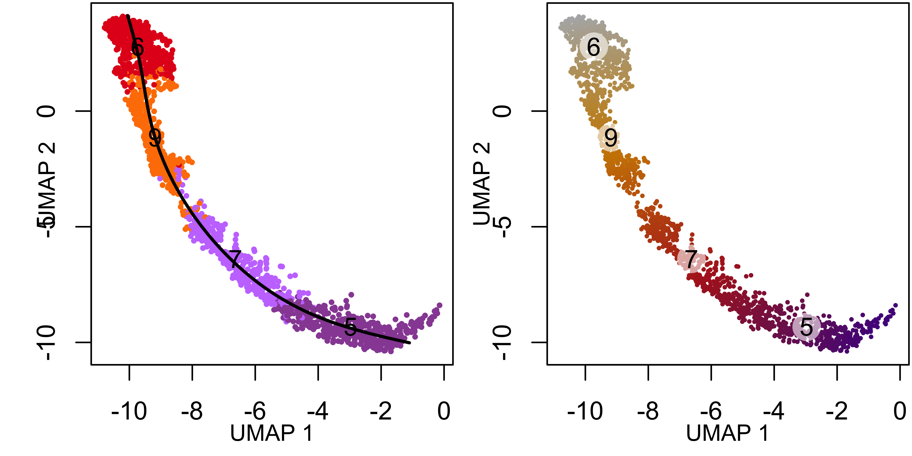

Spatial trajectory
================
4/13/23

### Load data and libraries

``` r
##################
# LOAD LIBRARIES #
##################
library(tidyverse)
library(Seurat)
library(SeuratObject)
library(tidyseurat)
library(cowplot)
library(patchwork)
library(openxlsx)
library(slingshot)

source("../bin/spatial_visualization.R")
source("../bin/plotting_functions.R")

#########
# PATHS #
#########
input_dir <- "../results/04_deconvolution_st_data/"
result_dir <- "../results/08_spatial_dist/"
if( isFALSE(dir.exists(result_dir)) ) { dir.create(result_dir,recursive = TRUE) }

#############
# LOAD DATA #
#############
# DEGs_table <- read_csv(paste0(input_dir,"subset_100/DGEs_condition_wilcox_epi_100.csv")) %>% filter(groups == "DMPA")
DEGs_table_cond <- read_csv(paste0("../results/06_DGE_condition_st_data/","DGEs_condition_wilcox.csv"))
DEGs_table_clus <- read_csv(paste0("../results/05_DGE_clusters_st_data/","DGEs_clusters_wilcox.csv"))

DATA <- readRDS(paste0(input_dir,"seuratObj_deconvolution_scdc.RDS"))
```

### Calculate spatial distance based on gene expression

``` r
DATA <- RunUMAP(DATA,
                n.components = 3L,
                dims = 1:50, 
                n.neighbors = 10,
                min.dist = .1,
                spread = 1,
                repulsion.strength = 1,
                negative.sample.rate = 10,
                n.epochs = 100,
                reduction = "harmony",
                reduction.name = "umap3Dharmony"
                )

ord1 <- c("Sup_1","Sup_2","Basal_2","Basal_1")
epi_clus <- "^5$|^6$|^7|^9"

DATA_epi <- filter(DATA, grepl("epi", DATA$sp_annot) & grepl(epi_clus, DATA$Clusters))
df <- data.frame(DATA_epi@reductions$umap3Dharmony@cell.embeddings, variable = factor(DATA_epi$Clusters, levels = ord1))
colnames(df)[1:3] <- c("UMAP_1", "UMAP_2", "UMAP_3")
```

``` r
# Define lineage ends
ENDS <- c("5")

set.seed(1)
lineages <- as.SlingshotDataSet(getLineages(
  data           = DATA_epi@reductions$umap3Dharmony@cell.embeddings,
  clusterLabels  = DATA_epi$Clusters,
  dist.method    = "mnn",      # It can be: "simple", "scaled.full", "scaled.diag", "slingshot" or "mnn"
  end.clus       = "5",        # You can also define the ENDS!
  start.clus     = "6"))       # define where to START the trajectories


# IF NEEDED, ONE CAN ALSO MANULALLY EDIT THE LINEAGES, FOR EXAMPLE:
# sel <- sapply( lineages@lineages, function(x){rev(x)[1]} ) %in% ENDS
# lineages@lineages <- lineages@lineages[ sel ]
# names(lineages@lineages) <- paste0("Lineage",1:length(lineages@lineages))
# lineages


# Change the reduction to our "fixed" UMAP2d (FOR VISUALISATION ONLY)
lineages@reducedDim <- DATA_epi@reductions$umap_harmony@cell.embeddings

pal <- c((scales::hue_pal())(8), RColorBrewer::brewer.pal(9, "Set1"), RColorBrewer::brewer.pal(8,"Set2"))
set.seed(1)
pal <- rep(sample(pal, length(pal)), 200)

# Calculate cluster centroids (for plotting the labels later)
mm <- Matrix::sparse.model.matrix(~0 + factor(DATA_epi$Clusters))
colnames(mm) <- levels(factor(DATA_epi$Clusters))
centroids2d <- as.matrix(t(t(DATA_epi@reductions$umap_harmony@cell.embeddings) %*% mm)/Matrix::colSums(mm))

# plot(DATA_epi@reductions$umap_harmony@cell.embeddings, col = pal[DATA_epi$Clusters],  cex=.5,pch = 16)
# lines(lineages, lwd = 1, col = 'black', cex=2 )
# text(centroids2d, labels = rownames(centroids2d),cex=0.8,font=2,col = "white")
```

``` r
# Define curves
curves <- as.SlingshotDataSet(getCurves(data = lineages, thresh = 0.1, stretch = 0.1,
    allow.breaks = F, approx_points = 300))

curves
```

    class: SlingshotDataSet 

     Samples Dimensions
        1854          2

    lineages: 1 
    Lineage1: 6  9  7  5  

    curves: 1 
    Curve1: Length: 18.042  Samples: 1854

``` r
pseudotime <- slingPseudotime(curves, na = FALSE)
cellWeights <- slingCurveWeights(curves)

x <- rowMeans(pseudotime)
x <- x/max(x)
o <- order(x)

pseudotime <- pseudotime %>% as_tibble(rownames = "barcode") %>% dplyr::rename(spatial_dist="Lineage1")
```

``` r
# dev.new(width=6, height=3, noRStudioGD = TRUE)
col <- c("#E41A1C","#FF7F00","#C77CFF","#984EA3")
# Plot curves on UMAP coloured by clusters
par(mfrow = c(1,2), mar = c(3,3,0.1,0.1))
plot(DATA_epi@reductions$umap_harmony@cell.embeddings, 
     col = col[DATA_epi$layers], pch = 16, cex = .5,  xlab = "", ylab = "",)
lines(curves, lwd = 2, col = "black")
text(centroids2d, labels = rownames(centroids2d), cex = 1, font = 1)
title(ylab="UMAP 2", mgp=c(1,0,0), cex.lab=.9)
title(xlab="UMAP 1", line=1.7, cex.lab=.9)

plot(DATA_epi@reductions$umap_harmony@cell.embeddings[o, ], 
     pch = 16,  xlab = "", ylab = "", # main = paste0("pseudotime"), axes = F 
     cex = 0.4, col = colorRampPalette(c("grey70", "orange3", "firebrick", "purple4"))(99)[x[o] * 98 + 1])
points(centroids2d, cex = 2.5, pch = 16, col = "#FFFFFF99")
title(ylab="UMAP 2", line=1.7, cex.lab=.9)
title(xlab="UMAP 1", line=1.7, cex.lab=.9)
text(centroids2d, labels = rownames(centroids2d), cex = 1, font = 1)
```




## Save seurat object

``` r
DATA <- DATA %>%
  left_join(., pseudotime, by=c(".cell"="barcode")) %>%
  select(c(1:6), spatial_dist, everything())

saveRDS(DATA, paste0(result_dir,"seuratObj_spatial_dist.RDS"))
# DATA <- readRDS(paste0(result_dir,"seuratObj_spatial_dist.RDS"))

DATA_epi <- DATA %>%
  filter(., grepl("epi", DATA$sp_annot))
saveRDS(DATA_epi, paste0(result_dir,"seuratObj_epi_only.RDS"))
```

### Plot spatial distance on tissue

``` r
####################
# SPATIAL DISTANCE #
####################
# dev.new(width=10, height=7, noRStudioGD = TRUE)
col <- c("grey70", "orange3", "firebrick", "purple4")

DATA %>%
  #filter(orig.ident == "P097" | orig.ident == "P118") %>%
plot_st_feat.fun(.,
                 geneid = "spatial_dist",
                 zoom = "zoom",
                 col = col,
                 alpha = .9,
                 ncol = 2, 
                 scale = FALSE,
                 #annot_col = "#dbd9d9",
                 annot_line = .1,
                 img_alpha = 0,
                 point_size = 1)
```


``` r
DATA %>%
  filter(., grepl("epi", DATA$sp_annot) & grepl(epi_clus, DATA$Clusters)) %>%
  tidyseurat::ggplot(aes(groups, nCount_RNA, fill = groups)) +
    geom_boxplot(outlier.shape = NA) +
    geom_jitter(width = 0.1) +
    my_theme
```

``` r
##  [1] "PKP1"    "SPRR2D"  "SPRR2A"  "SPRR2B"  "SPRR2E"  "SPRR2G"  "CSTA"   
##  [8] "SAMD9"   "GPRC5A"  "KRT6C"   "KRT6A"   "OLFM4"   "KRT13"   "KRT19"  
## [15] "KRT14"   "CD177"   "KRTDAP"  "DMKN"    "CEACAM1" "TGM3"
```

``` r
###########################
# CONDITION DEGs TO PLOT #
###########################
sig_nest <- DEGs_table_cond %>%
  mutate(Direction = ifelse(avg_log2FC > 0, "UP", "DOWN")) %>%
  filter(p_val_adj < 0.05) %>%
  {. ->> sig_table } %>%
  group_by(layers, Direction) %>%
  top_n(15, abs(avg_log2FC)) %>% 
  #top_n(-30, p_val) %>% 
  nest() %>% mutate(n = map_dbl(data, nrow)) %>%
  arrange(layers, Direction)

sig_nest_epi <- sig_nest %>% ungroup() %>% filter(grepl("_", .$layers))
sig_genes_epi <- unnest(sig_nest_epi, c(layers, Direction, data))

#feat <- c("SAMD9", "GPRC5A", "TGM3", "KRT19", "PKP1")
feat_cond <- unique(sig_genes_epi$gene)

###########################
# CLUSTER DEGs TO PLOT #
###########################
sig_nest <- DEGs_table_clus %>%
  mutate(Direction = ifelse(avg_log2FC > 0, "UP", "DOWN")) %>%
  filter(p_val_adj < 0.05) %>%
  {. ->> sig_table } %>%
  group_by(layers, Direction) %>%
  top_n(15, abs(avg_log2FC)) %>% 
  #top_n(-30, p_val) %>% 
  nest() %>% mutate(n = map_dbl(data, nrow)) %>%
  arrange(layers, Direction)

sig_nest_epi <- sig_nest %>% ungroup() %>% filter(grepl("_", .$layers))
sig_genes_epi <- unnest(sig_nest_epi, c(layers, Direction, data))

#feat <- c("SAMD9", "GPRC5A", "TGM3", "KRT19", "PKP1")
feat_clus <- unique(sig_genes_epi$gene)

############
# OVERLAP #
############
int <- intersect(feat_cond, feat_clus)
```

### Plot dotplot and tissue

``` r
#########################
# DOTPLOT PER EPI LAYER #
#########################
layer_dotplot.fun <- function(DATA, feat, facet = TRUE, x_max=NULL){
  rects <- DATA %>%
    group_by(layers) %>%
    summarise(., ystart=min(spatial_dist, na.rm=T), yend=max(spatial_dist, na.rm=T),
              Q1=quantile(spatial_dist, probs = 0.009, na.rm=T),
              Q3=quantile(spatial_dist, probs = 0.90, na.rm=T)) %>%
    filter(!(is.infinite(.$ystart))) %>%
    mutate(Q1 = ifelse(.$Q1 == min(.$Q1), 0,.$Q1)) %>%
    mutate(Q3 = ifelse(.$Q3 == max(.$Q3), max(.$yend),.$Q3)) %>%
    mutate(Q3 = ifelse(.$layers == "Basal_2", .$Q3+.3,.$Q3)) %>%
    arrange(ystart) %>% ungroup()
  
  DAT <- DATA %>%
    filter(., grepl("epi", DATA$sp_annot) & grepl(epi_clus, DATA$Clusters)) %>%
    mutate(., FetchData(., vars = c(feat)) ) %>%
    select(groups, layers, all_of(c(feat)), spatial_dist)

  if(facet == TRUE){facets <- facet_wrap(~groups, ncol = 2) }else{facets <- NULL}
  
  dot <- ggplot() +
    #ggtitle(feature) +
    geom_rect(data = rects, alpha = 0.1, show.legend=FALSE,
              aes(xmin = -Inf, xmax = Inf, ymin = Q1, ymax = Q3, fill = layers)) +
    geom_jitter(data = DAT, aes(x=.data[[feat]], y=spatial_dist, col=layers), 
                width = 0.1, alpha = 0.7, size=.3) + #
    scale_fill_manual(values = col) + 
    scale_colour_manual(values = col) +
    guides(fill = guide_legend(override.aes = list(size=2), keyheight = .7, keywidth = .7)) +
    scale_y_reverse(expand = c(0, 0)) +
    #scale_x_continuous(expand = c(0, 0)) +
    {if(!(is.null(x_max))){xlim(-.5, x_max)}} +
    facets +
    my_theme
  return(dot)
}

col <- c("#E41A1C","#FF7F00","#C77CFF","#984EA3")
dot <- map(feat_cond, ~layer_dotplot.fun(DATA, .x))


#########################
# EXPRESION ON TISSUE #
#########################
# col <- RColorBrewer::brewer.pal(9,"PuRd")
# col <-  c("grey95", RColorBrewer::brewer.pal(9,"Reds"))
# col <- c("grey100","grey95", "mistyrose", "red", "dark red", "#870808", "black")
# col <- RColorBrewer::brewer.pal(9,"Purples")
col <- c("#EFEDF5", "#DADAEB", "#BCBDDC", "#9E9AC8", "#807DBA", "#6A51A3", "#54278F", "#3F007D") # Purples

DAT <- DATA %>%
    mutate(., FetchData(., vars = c(feat_cond)) ) #%>%
    # mutate(across(c(feat_cond), ~case_when(sp_annot == "SubMuc" ~ as.double(NA), 
    #                              TRUE ~ .x)))
    
p <- map(feat_cond, 
        ~plot_st_feat.fun( DAT,
                           geneid = .x,
                           zoom = "zoom",
                           col = col,
                           alpha = .9,
                           ncol = 2, 
                           #annot_col = "#dbd9d9",
                           annot_line = .1,
                           img_alpha = 0,
                           point_size = .75)) #.35


#################
# COMBINE PLOTS #
#################
# dev.new(width=9, height=6, noRStudioGD = TRUE) 
empty_plot <- replicate(length(p), list(plot_spacer()))
l <- list(empty_plot, dot,  empty_plot, p)
c <- pmap(l, ~((..1 /..2 / ..3) + plot_layout(heights = c(1,4,1)) | ..4 ) + plot_layout(guides = 'collect', widths = c(.5,1)))
c[[1]]
```


``` r
#############################
# CONDITION DOTPLOT AS PDF #
#############################
# dev.new(width=(1.05*10)+1, height=2.5, noRStudioGD = TRUE)  
pdf("./Figures/08/condition_dotplots.pdf",  width = (1.05*10)+1, height = 2.5*ceiling(length(feat_cond)/5))
wrap_plots(dot, ncol = 5, nrow = ceiling(length(feat_cond)/5)) + plot_layout(guides = 'collect')
dev.off()

#################################
# CONDITION TISSUE PLOTS AS PDF #
#################################
# dev.new(width=4, height=6, noRStudioGD = TRUE) 
# p[[1]]
ggsave("./Figures/08/tissue.pdf", gridExtra::marrangeGrob(grobs = p, nrow=1, ncol=1), width = 4, height = 6)

#############################
# CONDITION COMBINED AS PDF #
#############################
pdf("./Figures/08/combined.pdf",  width = 6.75, height = 6)
c
dev.off()
```

``` r
# dev.new(width=2, height=2.5, noRStudioGD = TRUE) 
# dev.new(width=(1.2*5)+1, height=2.5*ceiling(length(dot_fig)/5), noRStudioGD = TRUE) 
col <- c("#E41A1C","#FF7F00","#C77CFF","#984EA3")

for_fig2 <- c( "TGM1", "KRT14", "SPRR2E", "CRCT1",  "SPRR2D", "KRT78", "CSTA", "SPINK7", "CNFN", "MUC21", "MIR205HG", "CEACAM7", "PKM", "LCN2")
dot_fig <- map(for_fig2, ~layer_dotplot.fun(DATA, .x, facet = FALSE)) # , x_max = 6

wrap_plots(dot_fig, ncol = 5, nrow = ceiling(length(dot_fig)/5)) + plot_layout(guides = 'collect')
```


``` r
# ggsave("./Figures/08/dots_across_layers_clus.pdf", gridExtra::marrangeGrob(grobs = dot, ncol=1, nrow = 1), width = 5, height = 3)

#######################
# CLUS EXPRESION ON TISSUE #
#######################
col <- c("#EFEDF5", "#DADAEB", "#BCBDDC", "#9E9AC8", "#807DBA", "#6A51A3", "#54278F", "#3F007D") # Purples

DAT <- DATA %>%
    mutate(., FetchData(., vars = c(for_fig2)) )
    # mutate(across(c(feat), ~case_when(sp_annot == "SubMuc" ~ as.double(NA), 
    #                              TRUE ~ .x)))
    
p <- map(for_fig2, 
        ~plot_st_feat.fun( DAT,
                           geneid = .x,
                           zoom = "zoom",
                           col = col,
                           alpha = .9,
                           ncol = 2, 
                           #annot_col = "#dbd9d9",
                           annot_line = .1,
                           img_alpha = 0,
                           point_size = .7)) #.35

# dev.new(width=4, height=6, noRStudioGD = TRUE) 
# p[[1]]
# plot_grid( dot, p, ncol = 1, rel_heights = c(1,.7), rel_widths = c(1,.5))
```

``` r
#################################
# CLUSTERS TISSUE PLOTS AS PDF #
#################################
ggsave("./Figures/08/for_figure2_tissue.pdf", gridExtra::marrangeGrob(grobs = p, nrow=1, ncol=1), width = 4, height = 6)


###########################
# CLUSTERS DOTPLOT AS PDF #
############################
col <- c("#E41A1C","#FF7F00","#C77CFF","#984EA3")
feat <- unique(c(int, feat_clus))
dot <- map(feat, ~layer_dotplot.fun(DATA, .x, facet = FALSE)) # , x_max = 6

pdf("./Figures/08/clus_dotplots.pdf",  width = (1.2*5)+1, height = 2.5*ceiling(length(feat)/5))
wrap_plots(dot, ncol = 5, nrow = ceiling(length(feat)/5)) + plot_layout(guides = 'collect')
dev.off()
```

``` r
######################
# PUBLICATION FIGURE #
######################
feat <- c("SAMD9", "GPRC5A", "TGM3", "KRT19", "PKP1")
col <- c("#EFEDF5", "#DADAEB", "#BCBDDC", "#9E9AC8", "#807DBA", "#6A51A3", "#54278F", "#3F007D") # Purples

DAT <- DATA %>%
    filter(orig.ident == "P097" | orig.ident == "P118") %>%
    mutate(., FetchData(., vars = c(feat)) )
    # mutate(across(c(feat), ~case_when(sp_annot == "SubMuc" ~ as.double(NA), 
    #                              TRUE ~ .x)))

p <- map(feat, 
        ~plot_st_feat.fun( DAT,
                           geneid = .x,
                           zoom = "zoom",
                           col = col,
                           alpha = .9,
                           ncol = 2, 
                           #annot_col = "#dbd9d9",
                           annot_line = .1,
                           img_alpha = 0,
                           point_size = .75)) 
# dev.new(width=5, height=4, noRStudioGD = TRUE) 
comb <- list(dot, p) %>%
  pmap(., ~(..1/..2) + plot_layout(heights = c(1,.7), guides = "collect"))
comb[[4]]
```
