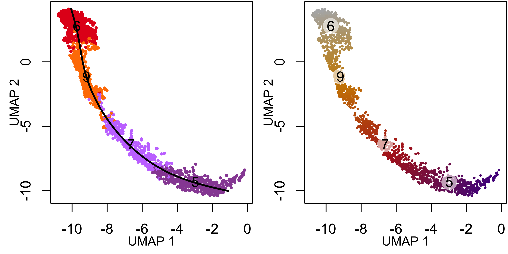
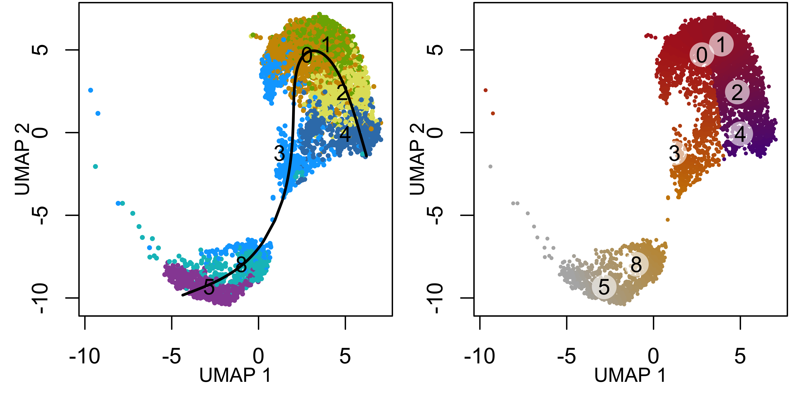
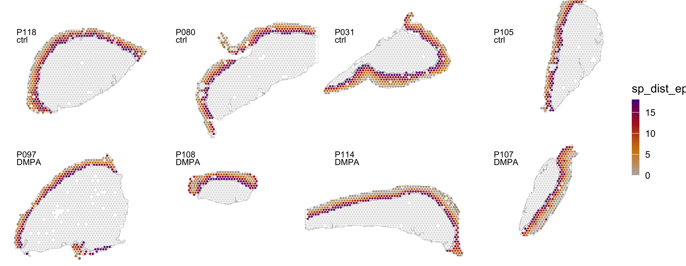
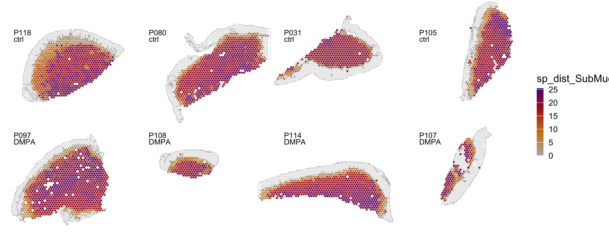
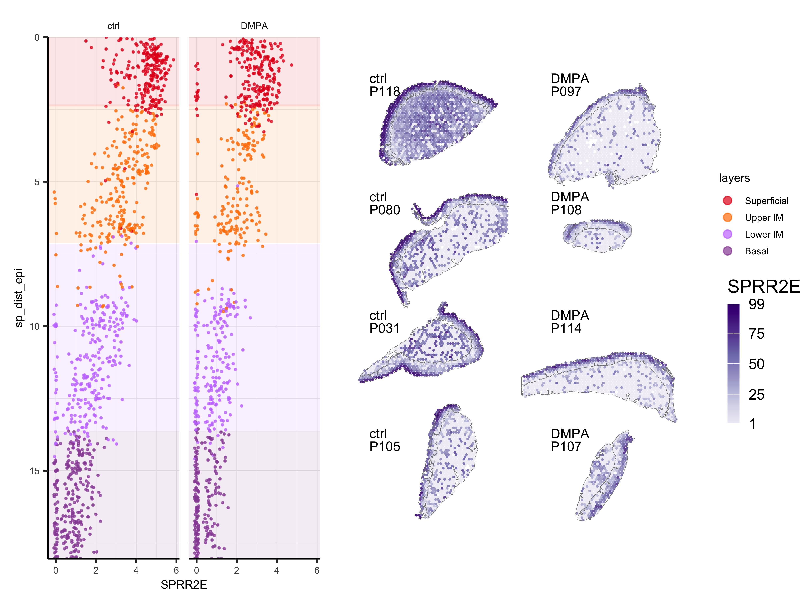
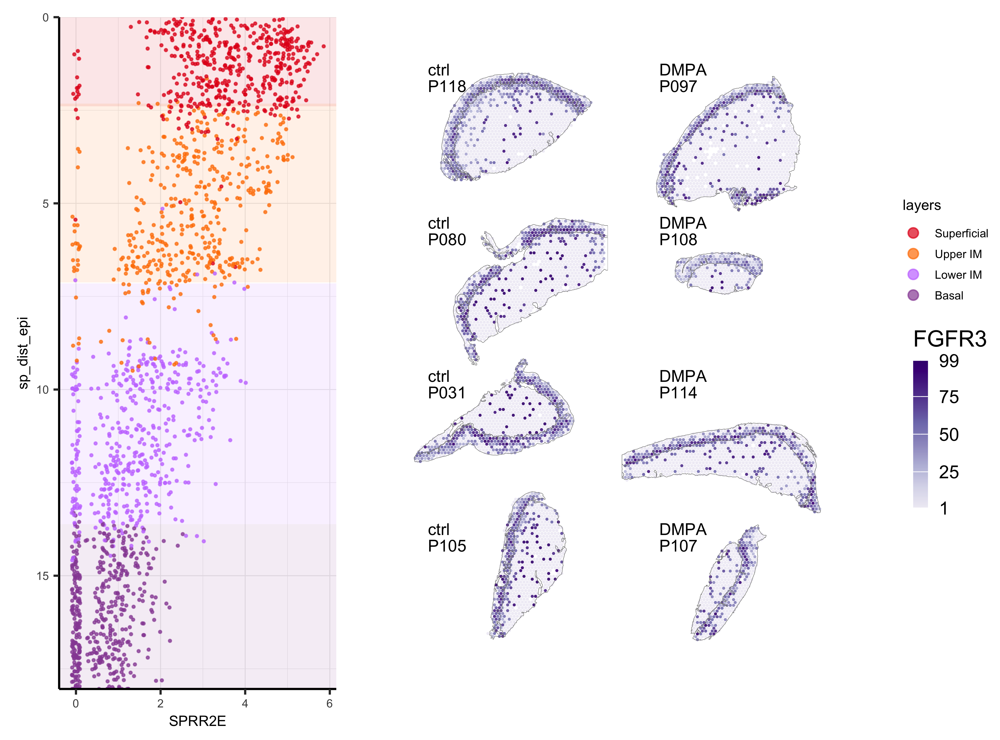

Spatial trajectory
================
11/18/24

### Load data and libraries

``` r
##################
# LOAD LIBRARIES #
##################
library(tidyverse)
library(Seurat)
library(SeuratObject)
library(tidyseurat)
library(cowplot)
library(patchwork)
library(openxlsx)
library(slingshot)

source("../bin/spatial_visualization.R")
source("../bin/plotting_functions.R")

#########
# PATHS #
#########
input_dir <- "../results/04_deconvolution_st_data/"
result_dir <- "../results/08_spatial_dist/"
if( isFALSE(dir.exists(result_dir)) ) { dir.create(result_dir,recursive = TRUE) }

#############
# LOAD DATA #
#############
# DEGs_table <- read_csv(paste0(input_dir,"subset_100/DGEs_condition_wilcox_epi_100.csv")) %>% filter(groups == "DMPA")
DEGs_table_cond <- read_csv(paste0("../results/06_DGE_condition_st_data/","DGEs_condition_wilcox.csv"))
DEGs_table_clus <- read_csv(paste0("../results/05_DGE_clusters_st_data/","DGEs_clusters_wilcox.csv"))

DATA <- readRDS(paste0(input_dir,"seuratObj_deconvolution_scdc.RDS"))

#################
# COLOUR PALLET #
#################
col_epi <- c("#E41A1C","#FF7F00","#C77CFF","#984EA3")
col_submuc <- c("#CD9600","#7CAE00","#e0e067","#00A9FF","#377EB8","#984EA3",NA, NA,"#00BFC4", NA,"#FFFF33")
col_trajectory <- c("grey70", "orange3", "firebrick", "purple4")

col_feat <- c("#EFEDF5", "#DADAEB", "#BCBDDC", "#9E9AC8", "#807DBA", "#6A51A3", "#54278F", "#3F007D") # Purples
ord <-  c("Superficial","Upper IM","Lower IM","Basal", "8","3","4","0","2","1")
ID <- c("P107", "P108", "P114", "P097","P118", "P105", "P080", "P031")
```

### Calculate spatial distance based on gene expression

``` r
DATA <- RunUMAP(DATA,
                n.components = 3L,
                dims = 1:50, 
                n.neighbors = 10,
                min.dist = .1,
                spread = 1,
                repulsion.strength = 1,
                negative.sample.rate = 10,
                n.epochs = 100,
                reduction = "harmony",
                reduction.name = "umap3Dharmony"
                )
```

``` r
pseudodist.fun <- function(DATA, start_clus, end_clus, Lineage="Lineage1"){
  # Define lineage ends
  ENDS <- c(end_clus)
  
  set.seed(1)
  lineages <- as.SlingshotDataSet(getLineages(
    data           = DATA@reductions$umap3Dharmony@cell.embeddings,
    clusterLabels  = DATA$Clusters,
    dist.method    = "mnn",       # It can be: "simple", "scaled.full", "scaled.diag", "slingshot" or "mnn"
    end.clus       = end_clus,    # You can also define the ENDS!
    start.clus     = start_clus)) # define where to START the trajectories
  
  
  # IF NEEDED, ONE CAN ALSO MANULALLY EDIT THE LINEAGES, FOR EXAMPLE:
  # sel <- sapply( lineages@lineages, function(x){rev(x)[1]} ) %in% ENDS
  # lineages@lineages <- lineages@lineages[ sel ]
  # names(lineages@lineages) <- paste0("Lineage",1:length(lineages@lineages))
  # lineages
  
  
  # Change the reduction to our "fixed" UMAP2d (FOR VISUALISATION ONLY)
  lineages@reducedDim <- DATA@reductions$umap_harmony@cell.embeddings
  
  # Calculate cluster centroids (for plotting the labels later)
  mm <- Matrix::sparse.model.matrix(~0 + factor(DATA$Clusters))
  colnames(mm) <- levels(factor(DATA$Clusters))
  centroids2d <- as.matrix(t(t(DATA@reductions$umap_harmony@cell.embeddings) %*% mm)/Matrix::colSums(mm))
  
  # plot
  # pal <- c((scales::hue_pal())(8), RColorBrewer::brewer.pal(9, "Set1"), RColorBrewer::brewer.pal(8,"Set2"))
  # set.seed(1)
  # pal <- rep(sample(pal, length(pal)), 200)
  # plot(DATA@reductions$umap_harmony@cell.embeddings, col = pal[DATA$Clusters],  cex=.5,pch = 16)
  # lines(lineages, lwd = 1, col = 'black', cex=2 )
  # text(centroids2d, labels = rownames(centroids2d),cex=0.8,font=2,col = "white")
  
  # Define curves
  curves <- as.SlingshotDataSet(getCurves(data = lineages, thresh = 0.1, stretch = 0.1,
      allow.breaks = F, approx_points = 300))

  print(curves)
  assign(paste0("line_", DATA$sp_annot[1]), curves@curves[[Lineage]][["s"]], envir = .GlobalEnv)
  
  pseudotime <- slingPseudotime(curves, na = FALSE)
  cellWeights <- slingCurveWeights(curves)
  
  x <- rowMeans(pseudotime)
  x <- x/max(x)
  
  name = paste0("sp_dist_", DATA$sp_annot[1])
  pseudotime <- pseudotime %>% 
    as_tibble(rownames = "barcode") %>% 
    dplyr::rename(!!name:=all_of(Lineage)) %>%
    select(-contains("Lineage")) %>%
    mutate(col = x) %>%
    arrange(desc(col))
    
  return(pseudotime)
}
```

``` r
epi_clus <- "^5$|^6$|^7|^9"
sub_clus <- "^5$|^8$|^4|^3|^2|^1$|^0$"

DATA_epi <- filter(DATA, grepl("epi", DATA$sp_annot) & grepl(epi_clus, DATA$Clusters) )
DATA_SubMuc <- filter(DATA, grepl("SubMuc", DATA$sp_annot) | DATA$Clusters == "5")
DATA_SubMuc <- filter(DATA, grepl(sub_clus, DATA$Clusters)| grepl("SubMuc", DATA$sp_annot) & DATA$sp_annot == "10" )

epi <- pseudodist.fun(DATA_epi, start_clus="6", end_clus="5")
```

    class: SlingshotDataSet 

     Samples Dimensions
        1854          2

    lineages: 1 
    Lineage1: 6  9  7  5  

    curves: 1 
    Curve1: Length: 18.042  Samples: 1854

``` r
submuc <- pseudodist.fun(DATA_SubMuc, start_clus="5", end_clus="4")
```

    class: SlingshotDataSet 

     Samples Dimensions
        5110          2

    lineages: 1 
    Lineage1: 5  8  3  0  1  2  4  

    curves: 1 
    Curve1: Length: 25.418  Samples: 5110

``` r
spatial_dist <- DATA %>%
  select(barcode=".cell" ) %>%
  left_join(., epi[,-3], by="barcode") %>%
  left_join(., submuc[,-3], by="barcode")
```

``` r
line <- line_epi
centroids2d <- DATA_epi %>%
    group_by(Clusters) %>%
    select(Clusters, matches("umapharmony_\\d", perl=T)) %>% 
    summarize_all(mean) %>% 
    column_to_rownames(var = "Clusters")

# dev.new(width=6, height=3, noRStudioGD = TRUE)
# Plot curves on UMAP coloured by clusters
par(mfrow = c(1,2), mar = c(3,3,0.1,0.1))
plot(DATA_epi@reductions$umap_harmony@cell.embeddings, 
     col = col_epi[DATA_epi$layers], pch = 16, cex = .5,  xlab = "", ylab = "",)
lines(line, lwd = 2, col = "black")
text(centroids2d, labels = rownames(centroids2d), cex = 1, font = 1)
title(ylab="UMAP 2", line=1.7, cex.lab=.9)
title(xlab="UMAP 1", line=1.7, cex.lab=.9)

plot(DATA_epi@reductions$umap_harmony@cell.embeddings[epi$barcode, ], 
     pch = 16,  xlab = "", ylab = "", # main = paste0("pseudotime"), axes = F 
     cex = 0.4, col = colorRampPalette(col_trajectory)(99)[epi$col * 98 + 1])
points(centroids2d, cex = 2.5, pch = 16, col = "#FFFFFF99")
title(ylab="UMAP 2", line=1.7, cex.lab=.9)
title(xlab="UMAP 1", line=1.7, cex.lab=.9)
text(centroids2d, labels = rownames(centroids2d), cex = 1, font = 1)
```



``` r
line <- line_SubMuc
centroids2d <- DATA_SubMuc %>%
    group_by(Clusters) %>%
    select(Clusters, matches("umapharmony_\\d", perl=T)) %>% 
    summarize_all(mean) %>% 
    column_to_rownames(var = "Clusters")

# dev.new(width=6, height=3, noRStudioGD = TRUE)
# Plot curves on UMAP coloured by clusters
par(mfrow = c(1,2), mar = c(3,3,0.1,0.1))
plot(DATA_SubMuc@reductions$umap_harmony@cell.embeddings, 
     col = col_submuc[DATA_SubMuc$Clusters], pch = 16, cex = .5,  xlab = "", ylab = "",)
lines(line, lwd = 2, col = "black")
text(centroids2d, labels = rownames(centroids2d), cex = 1, font = 1)
title(ylab="UMAP 2", line=1.7, cex.lab=.9)
title(xlab="UMAP 1", line=1.7, cex.lab=.9)

plot(DATA_SubMuc@reductions$umap_harmony@cell.embeddings[submuc$barcode, ], 
     pch = 16,  xlab = "", ylab = "", # main = paste0("pseudotime"), axes = F 
     cex = 0.4, col = colorRampPalette(col_trajectory)(99)[submuc$col * 98 + 1])
points(centroids2d, cex = 2.5, pch = 16, col = "#FFFFFF99")
title(ylab="UMAP 2", line=1.7, cex.lab=.9)
title(xlab="UMAP 1", line=1.7, cex.lab=.9)
text(centroids2d, labels = rownames(centroids2d), cex = 1, font = 1)
```



## Save seurat object

``` r
DATA <- DATA %>%
  select(-contains("sp_dist")) %>%
  left_join(., spatial_dist, by=c(".cell"="barcode")) %>%
  select(c(1:7), contains("sp_dist"), everything())

saveRDS(DATA, paste0(result_dir,"seuratObj_spatial_dist.RDS"))
# DATA <- readRDS(paste0(result_dir,"seuratObj_spatial_dist.RDS"))
```

### Plot spatial distance on tissue

``` r
####################
# SPATIAL DISTANCE #
####################
# dev.new(width=9, height=3.5, noRStudioGD = TRUE)
DATA %>%
  plot_st_feat.fun(.,
                   geneid = "sp_dist_epi",
                   zoom = "zoom",
                   col = col_trajectory,
                   alpha = 1,
                   ncol = 4, 
                   scale = FALSE,
                   annot_line = .1,
                   img_alpha = 0,
                   point_size = 1)
```



``` r
DATA %>%
  mutate(sp_dist_SubMuc = case_match(
    Clusters, "5" ~ NA, .default = sp_dist_SubMuc)) %>%
  plot_st_feat.fun(.,
                   geneid = "sp_dist_SubMuc",
                   zoom = "zoom",
                   col = col_trajectory,
                   alpha = 1,
                   ncol = 4, 
                   scale = FALSE,
                   annot_line = .1,
                   img_alpha = 0,
                   point_size = 1)
```



``` r
###########################
# CONDITION DEGs TO PLOT #
###########################
(sig_nest <- DEGs_table_cond %>%
  mutate(Direction = ifelse(avg_log2FC > 0, "UP", "DOWN")) %>%
  filter(p_val_adj < 0.05) %>%
  nest(., .by = c("layers", "Direction")) %>% 
  mutate(n = map_dbl(data, nrow)) %>%
  arrange(match(layers, ord), Direction))
```

    # A tibble: 20 × 4
       layers      Direction data                   n
       <chr>       <chr>     <list>             <dbl>
     1 Superficial DOWN      <tibble [12 × 13]>    12
     2 Superficial UP        <tibble [7 × 13]>      7
     3 Upper IM    DOWN      <tibble [6 × 13]>      6
     4 Upper IM    UP        <tibble [11 × 13]>    11
     5 Lower IM    DOWN      <tibble [8 × 13]>      8
     6 Lower IM    UP        <tibble [16 × 13]>    16
     7 Basal       DOWN      <tibble [5 × 13]>      5
     8 Basal       UP        <tibble [11 × 13]>    11
     9 8           DOWN      <tibble [28 × 13]>    28
    10 8           UP        <tibble [26 × 13]>    26
    11 3           DOWN      <tibble [12 × 13]>    12
    12 3           UP        <tibble [15 × 13]>    15
    13 4           DOWN      <tibble [10 × 13]>    10
    14 4           UP        <tibble [7 × 13]>      7
    15 0           DOWN      <tibble [8 × 13]>      8
    16 0           UP        <tibble [12 × 13]>    12
    17 2           DOWN      <tibble [12 × 13]>    12
    18 2           UP        <tibble [57 × 13]>    57
    19 1           DOWN      <tibble [3 × 13]>      3
    20 1           UP        <tibble [13 × 13]>    13

``` r
# all unique significant epi genes:
cond_epi_DEGs <- sig_nest %>% filter(!(grepl("\\d", .$layers))) %>% unnest(cols = c(data)) %>% pull(., "gene") %>% unique()
# all unique significant SubMuc genes:
cond_SubMuc_DEGs <- sig_nest %>% filter((grepl("\\d", .$layers))) %>% unnest(cols = c(data)) %>% pull(., "gene") %>% unique()

feat_cond <- c(cond_epi_DEGs, cond_SubMuc_DEGs)

###########################
# CLUSTER DEGs TO PLOT #
###########################
(sig_nest <- DEGs_table_clus %>%
  mutate(Direction = ifelse(avg_log2FC > 0, "UP", "DOWN")) %>%
  filter(p_val_adj < 0.05) %>%
  group_by(Clusters, Direction) %>%
  top_n(15, abs(avg_log2FC)) %>% 
  nest() %>% mutate(n = map_dbl(data, nrow)) %>%
  arrange(match(Clusters, ord), Direction) %>%
  ungroup())
```

    # A tibble: 22 × 4
       Clusters    Direction data                   n
       <chr>       <chr>     <list>             <dbl>
     1 Superficial DOWN      <tibble [15 × 10]>    15
     2 Superficial UP        <tibble [15 × 10]>    15
     3 Upper IM    DOWN      <tibble [15 × 10]>    15
     4 Upper IM    UP        <tibble [15 × 10]>    15
     5 Lower IM    DOWN      <tibble [15 × 10]>    15
     6 Lower IM    UP        <tibble [15 × 10]>    15
     7 Basal       DOWN      <tibble [15 × 10]>    15
     8 Basal       UP        <tibble [15 × 10]>    15
     9 8           DOWN      <tibble [15 × 10]>    15
    10 8           UP        <tibble [15 × 10]>    15
    # ℹ 12 more rows

``` r
# all unique significant epi genes:
clus_epi_DEGs <- sig_nest %>% filter(!(grepl("\\d", .$Clusters))) %>% unnest(cols = c(data)) %>% pull(., "gene") %>% unique()
# all unique significant SubMuc genes:
clus_SubMuc_DEGs <- sig_nest %>% filter((grepl("\\d", .$Clusters))) %>% unnest(cols = c(data)) %>% pull(., "gene") %>% unique()

feat_clus <- c(clus_epi_DEGs, clus_SubMuc_DEGs)

############
# OVERLAP #
############
int <- intersect(feat_cond, feat_clus)
int
```

     [1] "SPRR2E"    "SPRR2A"    "SPRR2D"    "KRT78"     "KRTDAP"    "SPRR1B"   
     [7] "S100A7"    "IGHA1"     "JCHAIN"    "CSTA"      "IL1RN"     "IGHG1"    
    [13] "IGHA2"     "KRT6A"     "PKP1"      "CRCT1"     "KRT14"     "LUM"      
    [19] "KRT5"      "MT1X"      "CTSK"      "FLG"       "SPINK5"    "NEAT1"    
    [25] "SERPINB3"  "KRT4"      "AQP3"      "TMPRSS11B" "REV3L"     "LGALS7"   
    [31] "IGFBP5"    "MEG3"      "S100A9"    "SLC18A2"   "RPS27A"    "SFRP4"    
    [37] "TMSB4X"    "CCN5"      "ATP5F1E"  

``` r
# select first gene only to run the script through fast:
cond_epi_DEGs <- cond_epi_DEGs[1]
cond_SubMuc_DEGs <- cond_SubMuc_DEGs[1]
clus_epi_DEGs <- clus_epi_DEGs[1]
clus_SubMuc_DEGs <- clus_SubMuc_DEGs[1]
```

### Plot condition diff gene expression as dotplot and on tissue

``` r
##############################
# COND DOTPLOT PER EPI LAYER #
##############################
layer_dotplot.fun <- function(DATA, feat, spatial_dist, facet = TRUE, x_max=NULL, morf="epi", clus="^5$|^6$|^7|^9"){
  DAT <- DATA %>%
    filter(., grepl(morf, .$sp_annot)) %>%
    filter(., grepl(clus, .$Clusters)) %>%
    mutate(., FetchData(., vars = c(feat)) ) %>%
    select(orig.ident, groups, layers, all_of(c(feat)), {{spatial_dist}})
  
  if(morf=="epi"){probs <- c(0.009, 0.9)}else{probs <- c(0.1, 0.9)}
  
    rects <- DAT %>%
    group_by(layers) %>%
    summarise(., ystart=min({{spatial_dist}}, na.rm=T), yend=max({{spatial_dist}}, na.rm=T),
              Q1=quantile({{spatial_dist}}, probs = probs[1], na.rm=T),
              Q3=quantile({{spatial_dist}}, probs = probs[2], na.rm=T)) %>%
    filter(!(is.infinite(.$ystart))) %>%
    mutate(Q1 = ifelse(.$Q1 == min(.$Q1), 0,.$Q1)) %>%
    mutate(Q3 = ifelse(.$Q3 == max(.$Q3), max(.$yend),.$Q3)) %>%
    mutate(Q3 = ifelse(.$layers == "Lower IM", .$Q3+.3,.$Q3)) %>%
    arrange(ystart) %>% ungroup()

  if(facet == TRUE){facets <- facet_wrap(~groups, ncol = 2) }else{facets <- NULL}
  
  dot <- ggplot() +
    #ggtitle(feature) +
    geom_rect(data = rects, alpha = 0.1, show.legend=FALSE,
              aes(xmin = -Inf, xmax = Inf, ymin = Q1, ymax = Q3, fill = layers)) +
    geom_jitter(data = DAT, aes(x=.data[[feat]], y={{spatial_dist}}, col=layers), 
                width = 0.1, alpha = 0.7, size=.3) + #
    scale_fill_manual(values = col) + 
    scale_colour_manual(values = col) +
    # geom_smooth(data = filter(DAT, .data[[feat]] != 0), n=1000, aes(y={{spatial_dist}}, x=.data[[feat]], col=orig.ident)) + 
    guides(fill = guide_legend(override.aes = list(size=2), keyheight = .7, keywidth = .7)) +
    scale_y_reverse(expand = c(0, 0)) +
    #scale_x_continuous(expand = c(0, 0)) +
    {if(!(is.null(x_max))){xlim(-.5, x_max)}} +
    facets +
    my_theme +
    theme(plot.margin = unit(c(.2,0,0,.2), "lines"),
          #legend.box.margin=margin(0,0,0,0),
          legend.margin=margin(0,0,0,-5),
          panel.border = element_blank(),
          axis.line = element_line(),
          panel.grid.major = element_line(linewidth = 0.2),
          panel.grid.minor = element_line(linewidth = 0.1))
  return(dot)
}

col <- c("#E41A1C","#FF7F00","#C77CFF","#984EA3")
dot_epi <- map(cond_epi_DEGs, ~layer_dotplot.fun(DATA, .x, sp_dist_epi))
col <- c("#984EA3","#00BFC4","#00A9FF","#377EB8","#CD9600","#e0e067","#7CAE00","#FFFF33")
dot_sub <- map(cond_epi_DEGs, ~layer_dotplot.fun(DATA, .x, sp_dist_SubMuc, morf="SubMuc", clus=sub_clus))

############################
# COND EXPRESION ON TISSUE #
############################
# col <- RColorBrewer::brewer.pal(9,"PuRd")
# col <-  c("grey95", RColorBrewer::brewer.pal(9,"Reds"))
# col <- c("grey100","grey95", "mistyrose", "red", "dark red", "#870808", "black")
# col <- RColorBrewer::brewer.pal(9,"Purples")
col <- c("#EFEDF5", "#DADAEB", "#BCBDDC", "#9E9AC8", "#807DBA", "#6A51A3", "#54278F", "#3F007D") # Purples

# cond_epi_DEGs <- c("SAMD9", "GPRC5A", "TGM3", "KRT19", "PKP1")
tissue_epi <- map(cond_epi_DEGs, 
        ~plot_st_feat.fun( DATA,
                           geneid = .x,
                           zoom = "zoom",
                           col = col,
                           alpha = .9,
                           ncol = 2, 
                           save_space = F,
                           annot_line = .1,
                           img_alpha = 0,
                           point_size = .75)) 

tissue_sub <- map(cond_SubMuc_DEGs, 
        ~plot_st_feat.fun( DATA,
                           geneid = .x,
                           zoom = "zoom",
                           col = col,
                           alpha = .9,
                           ncol = 2, 
                           annot_line = .1,
                           img_alpha = 0,
                           point_size = .75)) 

# dev.new(width=6.75, height=5, noRStudioGD = TRUE)
wrap_plots(dot_epi[[1]],tissue_epi[[1]], ncol = 2, widths = c(.7, 1)) + plot_layout(guides = 'collect', axis_titles = "collect" )
```



``` r
#############################
# CONDITION DOTPLOT AS PDF #
#############################
# dev.new(width=(1.05*10)+1, height=2.5, noRStudioGD = TRUE)  
dot_epi <- wrap_plots(dot_epi, ncol = 5 ) + plot_layout(guides = 'collect', axis_titles = "collect")
ggsave("./Figures/08/cond_tissue_top_DEGs_epi.pdf", dot_epi, width = (1.4*5)+1, height = 2.5*ceiling(length(cond_epi_DEGs)/5), limitsize = FALSE )

dot_sub <- wrap_plots(dot_sub, ncol = 5 ) + plot_layout(guides = 'collect', axis_titles = "collect")
ggsave("./Figures/08/cond_tissue_top_DEGs_sub.pdf", dot_sub, width = (1.4*5)+1, height = 2.5*ceiling(length(cond_SubMuc_DEGs)/5), limitsize = FALSE )

# pdf("./Figures/08/condition_dotplot_DEGs.pdf",  width = (1.05*10)+1, height = 2.5*ceiling(length(feat_cond)/5))
# wrap_plots(dot, ncol = 5, nrow = ceiling(length(feat_cond)/5)) + plot_layout(guides = 'collect')
# dev.off()

#################################
# CONDITION TISSUE PLOTS AS PDF #
#################################
# dev.new(width=4, height=6, noRStudioGD = TRUE) 
# p[[1]]
ggsave("./Figures/08/condition_tissue_DEGs_epi.pdf", gridExtra::marrangeGrob(grobs = tissue_epi, nrow=1, ncol=1, top=NULL), width = 9, height = 3.5)
ggsave("./Figures/08/condition_tissue_DEGs_SubMuc.pdf", gridExtra::marrangeGrob(grobs = tissue_sub, nrow=1, ncol=1, top=NULL), width = 9, height = 3.5)
```

### Plot cluster diff. gene expression as dotplot and on tissue

``` r
# dev.new(width=2, height=2.5, noRStudioGD = TRUE) 
# dev.new(width=(1.2*5)+1, height=2.5*ceiling(length(dot_fig)/5), noRStudioGD = TRUE) 
##############################
# CLUS DOTPLOT PER EPI LAYER #
##############################
col <- c("#E41A1C","#FF7F00","#C77CFF","#984EA3")
dot_epi <- map(cond_epi_DEGs, ~layer_dotplot.fun(DATA, .x, sp_dist_epi, facet = F))
col <- c("#984EA3","#00BFC4","#00A9FF","#377EB8","#CD9600","#e0e067","#7CAE00","#FFFF33")
dot_sub <- map(cond_epi_DEGs, ~layer_dotplot.fun(DATA, .x, sp_dist_SubMuc, morf="SubMuc", clus=sub_clus, facet = F))

############################
# CLUS EXPRESION ON TISSUE #
############################
tissue_epi <- map(clus_epi_DEGs[1], 
        ~plot_st_feat.fun( DATA,
                           geneid = .x,
                           zoom = "zoom",
                           col = col_feat,
                           alpha = .9,
                           ncol = 4, 
                           annot_line = .1,
                           img_alpha = 0,
                           point_size = .7))

tissue_sub <- map(clus_SubMuc_DEGs[1], 
        ~plot_st_feat.fun( DATA,
                           geneid = .x,
                           zoom = "zoom",
                           col = col_feat,
                           alpha = .9,
                           ncol = 4, 
                           annot_line = .1,
                           img_alpha = 0,
                           point_size = .7))

# dev.new(width=6.75, height=5, noRStudioGD = TRUE)
wrap_plots(dot_epi[[1]],tissue_epi[[1]], ncol = 2, widths = c(.5, 1)) + plot_layout(guides = 'collect', axis_titles = "collect" )
```



``` r
###########################
# CLUSTERS DOTPLOT AS PDF #
############################
dot_epi <- wrap_plots(dot_epi, ncol = 5) + plot_layout(guides = 'collect', axis_titles = "collect")
dot_sub <- wrap_plots(dot_sub, ncol = 5) + plot_layout(guides = 'collect', axis_titles = "collect")
ggsave("./Figures/08/clus_tissue_top_DEGs_epi.pdf", dot_epi, width = (1.2*5)+1, height = 2.5*ceiling(length(dot_epi)/5), limitsize = FALSE )
ggsave("./Figures/08/cond_tissue_top_DEGs_sub.pdf", dot_sub, width = (1.2*5)+1, height = 2.5*ceiling(length(cond_SubMuc_DEGs)/5), limitsize = FALSE )

# pdf("./Figures/08/cluster_dotplot_top_DEGs.pdf",  width = (1.2*5)+1, height = 2.5*ceiling(length(feat_clus)/5))
# wrap_plots(dot_fig, ncol = 5, nrow = ceiling(length(feat_clus)/5)) + plot_layout(guides = 'collect')
# dev.off()
#################################
# CLUSTERS TISSUE PLOTS AS PDF #
#################################
ggsave("./Figures/08/clus_tissue_top_DEGs.pdf", gridExtra::marrangeGrob(grobs = tissue_epi, nrow=1, ncol=1, top=NULL), width = 9, height = 3.5)
ggsave("./Figures/08/clus_tissue_top_DEGs.pdf", gridExtra::marrangeGrob(grobs = tissue_sub, nrow=1, ncol=1, top=NULL), width = 9, height = 3.5)
```
